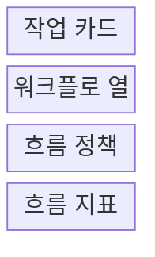
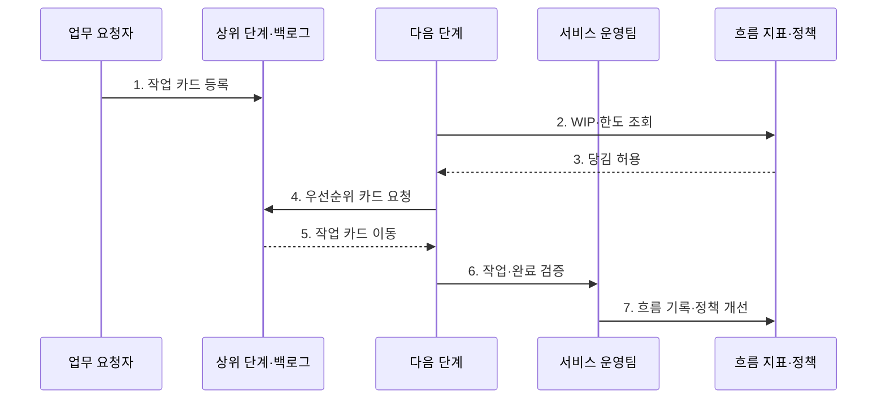

---
sidebar:
  order: 35
  label: "035. 칸반 (Kanban)"
  badge:
    text: "미출제 · 50%"
    variant: note
title: "칸반 (Kanban)"
date: "2026-07-25T00:35:00+09:00"
tags:
  - "notes-software"
weight: 35
extra:
  question_no: "035"
  source_status: "미출제"
  source_history: ""
  priority: 50
  priority_note: "칸반은 흐름 제한·리드타임 개선 기법"
---

## 미리 알고가기

- **칸반(Kanban)**: 작업 흐름을 시각화하고 당김으로 관리하는 방법
- **작업 카드(Work Item)**: 업무의 가치와 우선순위, 현재 처리 상태를 보드에 표현하는 단위
- **워크플로(Workflow)**: 요청부터 완료까지 작업이 거치는 단계
- **진행 중 작업(Work in Progress, WIP)**: 착수했지만 아직 완료하지 않은 작업
- **진행 중 작업 한도(Work in Progress Limit, WIP Limit)**: 공정 단계별로 동시에 진행할 수 있는 작업 수의 상한
- **당김 시스템(Pull System)**: 다음 단계에 여유가 생길 때 작업을 가져오는 방식
- **리드타임(Lead Time)**: 요청 접수부터 완료까지의 시간
- **사이클타임(Cycle Time)**: 작업 착수부터 완료까지의 시간
- **처리량(Throughput)**: 단위 기간에 완료한 작업 수
- **시간 상자(Timebox)**: 시작·종료 시간을 고정한 작업 기간으로서 칸반은 고정 시간 상자 없이 실제 수요를 연속 처리한다.
- **체류시간(Flow Time in State)**: 작업 카드가 한 워크플로 단계에 머문 시간으로서 오래 정체된 병목을 찾는 지표
- **차단 상태(Blocked State)**: 외부 의존성이나 문제로 작업 진행이 멈춘 상태이며 카드에 표시해 우선 해결 대상을 드러냄
- **작업 노화(Work Item Aging)**: 아직 완료되지 않은 작업이 접수·착수 후 경과한 시간으로서 납기 위험과 병목을 조기에 확인하는 지표
- **스크럼(Scrum)**: 고정 길이 스프린트 목표와 제품 증분으로 작업을 관리해 칸반의 연속 흐름 방식과 비교되는 애자일 프레임워크
- **고객 지원팀·플랫폼 팀(Customer Support·Platform Team)**: 지원팀은 불규칙 요청을 WIP 한도로 당기고 플랫폼 팀은 차단 표시와 작업 노화로 병목을 찾는 적용 조직
- **서비스 수준 기대(Service Level Expectation, SLE)**: 특정 작업 유형이 정한 시간 안에 완료될 것으로 기대하는 확률 기반 목표
- **협업 집중(Swarming)**: 새 작업 착수보다 막히거나 오래된 작업의 완료를 위해 여러 사람이 함께 해결하는 방식

## Ⅰ. 개요

- 정의/개념: **흐름 시각화·WIP 한도·당김**으로 작업을 제어하는 방식
- 배경/필요성: 과다 착수에 따른 **대기·병목·납기 변동** 감소

### 쉽게 이해하기 (학습용)

- 다음 공정에 자리가 날 때만 새 일을 가져와 밀린 작업이 더 늘지 않게 한다.

## Ⅱ. 특징

- **완료 우선**으로 대기·병목 중심 개선
- **연속 흐름**으로 실제 서비스 수요 처리
- **점진적 진화**로 기존 역할·절차 개선

### 쉽게 이해하기 (학습용)

- 보드는 정체된 단계를 보여 주고 한도와 당김 규칙은 새 일의 과다 착수를 제한한다.

## Ⅲ. 구조 및 구성요소

| 구성요소 | 책임 |
|:---|:---|
| 작업 카드 | 가치·우선순위·차단 상태 표현 |
| 워크플로 열 | 실제 단계·현재 위치 시각화 |
| 흐름 정책 | WIP·당김·완료·긴급 규칙 정의 |
| 흐름 지표 | 리드타임·처리량·체류시간 측정 |

### 쉽게 이해하기 (학습용)

- 작업표, 진행 칸, 이동 규칙, 흐름 계기판으로 구성된다.

## Ⅳ. 흐름도

**동작 원리**

- **1. 작업 카드 등록**: 가치·우선순위·완료 조건 기록
- **2. WIP·한도 조회**: 다음 단계의 현재 수용량 확인
- **3. 당김 허용**: 한도 아래일 때 새 작업 승인
- **4. 우선순위 카드 요청**: 상위 목록에서 작업 선택
- **5. 작업 카드 이동**: 선택 작업을 다음 단계로 전달
- **6. 작업·완료 검증**: 수행 결과와 완료 조건 확인
- **7. 흐름 기록·정책 개선**: 체류·차단으로 규칙 조정

### 쉽게 이해하기 (학습용)

- 다음 칸이 비어야 카드를 옮기고 오래 머문 칸의 한도와 규칙을 고친다.

## Ⅴ. 종류 및 비교

| 비교 항목 | 칸반 | 스크럼 |
|:---|:---|:---|
| 적용 기준 | 불규칙 유입·서비스 흐름 | 제품 증분·시간 상자 목표 |
| 핵심 특징 | WIP 제한·당김·연속 흐름 | 스프린트·목표·제품 증분 |
| 한계 | 우선순위 변동·병목 고착 | 스프린트 과부하·행사 형식화 |

> 요약: 칸반은 WIP·연속 흐름, 스크럼은 시간 상자 중심

### 쉽게 이해하기 (학습용)

- 칸반은 단계 수용량을, 스크럼은 정한 기간의 목표를 지킨다.

## Ⅵ. 실무 고려사항 및 대책

| 고려사항 | 대책 | 효과 |
|:---|:---|:---|
| 근거 없이 낮거나 높은 WIP 한도 고정 | 처리량·사이클타임·대기 분포를 보며 작은 폭으로 실험 | 실제 수용량에 맞는 한도 |
| 긴급 통로 남용으로 일반 작업 장기 대기 | 긴급 조건·동시 수·승인자·사후 검토 명시 | 우선순위 우회 통제 |
| 차단·노화 카드가 보여도 새 작업만 착수 | 작업 노화·SLE 경고와 협업 집중 규칙 적용 | 오래된 작업의 완료 촉진 |
| 단계별 생산성만 높여 전체 리드타임 악화 | 요청부터 완료까지 하나의 흐름 지표로 개선 | 부분 최적화 방지 |

### 적용 사례

- 긴급 처리 통로의 동시 수 제한과 **WIP 여유 기반 요청 당김**

### 쉽게 이해하기 (학습용)

- 지원팀은 긴급 요청 통로를 제한해 일반 작업이 모두 밀리지 않게 한다

## Ⅶ. 결론

- **유입 변동·병목**으로 WIP 한도와 당김을 결정

### 쉽게 이해하기 (학습용)

- 완료 건수만 늘리기보다 동시에 벌인 일과 오래 기다린 일을 줄여야 한다.
