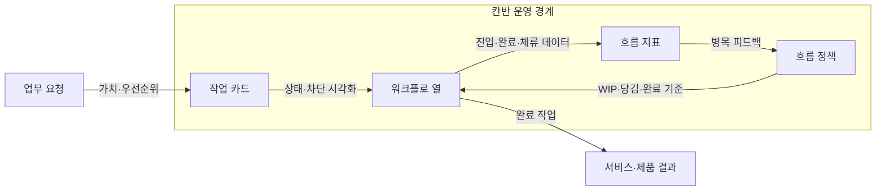
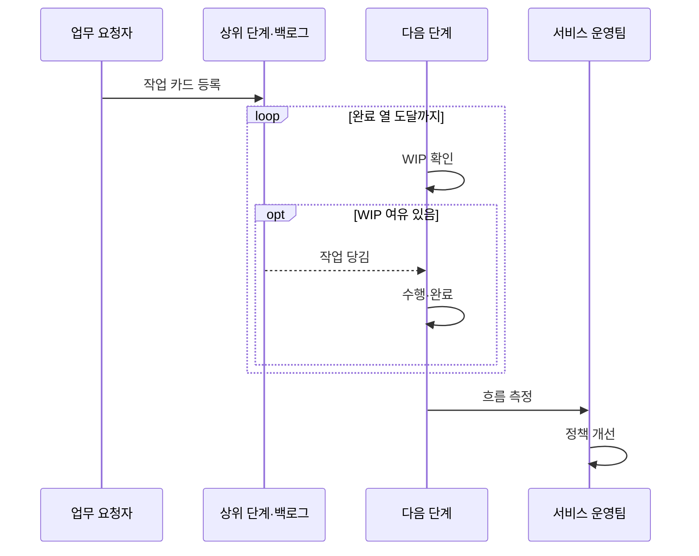

---
sidebar:
  order: 35
  label: "035. 칸반 (Kanban)"
  badge:
    text: "미출제 · 50%"
    variant: note
title: "칸반 (Kanban)"
date: "2026-07-25T00:35:00+09:00"
tags:
  - "notes-software"
weight: 35
extra:
  question_no: "035"
  source_status: "미출제"
  source_history: ""
  priority: 50
  priority_note: "칸반은 흐름 제한·리드타임 개선 기법"
---

## 미리 알고가기

- **칸반(Kanban)**: 작업 흐름을 시각화하고 당김으로 관리하는 방법
- **작업 카드(Work Item)**: 업무의 가치와 우선순위, 현재 처리 상태를 보드에 표현하는 단위
- **워크플로(Workflow)**: 요청부터 완료까지 작업이 거치는 단계
- **진행 중 작업(Work in Progress, WIP)**: ‘더블유아이피’로 읽고 Work in Progress의 머리글자를 딴 표기이며 착수했지만 아직 완료하지 않은 작업
- **진행 중 작업 한도(Work in Progress Limit, WIP Limit)**: ‘더블유아이피 리밋’으로 읽고 WIP에 상한을 뜻하는 Limit을 붙인 표기이며 단계별 동시 진행 작업 수의 상한
- **당김 시스템(Pull System)**: 다음 단계에 여유가 생길 때 작업을 가져오는 방식
- **리드타임(Lead Time)**: 요청 접수부터 완료까지 걸린 시간
- **사이클타임(Cycle Time)**: 작업 착수부터 완료까지 걸린 시간
- **처리량(Throughput)**: 단위 기간에 완료한 작업 수
- **시간 상자(Timebox)**: 시작·종료 시간을 고정한 작업 기간으로서 칸반은 고정 시간 상자 없이 실제 수요를 연속 처리함
- **체류시간(Flow Time in State)**: 작업 카드가 한 워크플로 단계에 머문 시간으로서 오래 정체된 병목을 찾는 지표
- **차단 상태(Blocked State)**: 외부 의존성이나 문제로 작업 진행이 멈춘 상태이며 카드에 표시해 우선 해결 대상을 드러냄
- **작업 노화(Work Item Aging)**: 아직 완료되지 않은 작업이 접수·착수 후 경과한 시간으로서 납기 위험과 병목을 조기에 확인하는 지표
- **스크럼(Scrum)**: 고정 길이 스프린트 목표와 제품 증분으로 작업을 관리해 칸반의 연속 흐름 방식과 비교되는 애자일 프레임워크
- **고객 지원팀·플랫폼 팀(Customer Support·Platform Team)**: 지원팀은 불규칙 요청을 WIP 한도로 당기고 플랫폼 팀은 차단 표시와 작업 노화로 병목을 찾는 적용 조직

## Ⅰ. 개요

- 정의/개념: 흐름·WIP 한도·당김으로 작업을 제어
- **배경/필요성**: 과다 착수로 인한 대기·병목·납기 변동 감소 필요

### 쉽게 이해하기 (학습용)

- 다음 공정에 자리가 날 때만 새 일을 가져와 밀린 작업이 더 늘지 않게 한다

## Ⅱ. 특징

- 착수보다 완료를 우선해 대기·병목 중심으로 개선한다.
- 시간 상자 없이 실제 서비스 수요를 연속 처리한다.
- 기존 역할·업무 절차에서 점진적으로 진화한다.

### 쉽게 이해하기 (학습용)

- 보드는 정체된 단계를 보여 주고 한도와 당김 규칙은 새 일의 과다 착수를 제한한다

## Ⅲ. 아키텍처 및 구성요소

| 설계 요소 | 설명 |
|:---|:---|
| 작업 카드 | 가치·우선순위·담당·차단 상태 표현 |
| 워크플로 열 | 실제 작업 단계와 카드의 현재 위치 시각화 |
| 흐름 정책 | WIP 한도·당김·완료·긴급 처리 규칙 |
| 흐름 지표 | 리드타임·사이클타임·처리량·체류 측정 |

> 요약: 카드·열로 흐름을 보이고 정책·지표로 제어

### 쉽게 이해하기 (학습용)

- 카드 위치는 현재 상태를, 한도는 수용량을, 지표는 오래 막힌 곳을 보여 준다

## Ⅳ. 원리 및 절차 흐름도

| 절차 | 설명 |
|:---|:---|
| 작업 카드 등록 | 가치·우선순위·완료 조건을 카드로 정의 |
| WIP 확인 | 현재 WIP와 단계별 한도를 비교 |
| 작업 당김 | 한도 미만이면 카드를 다음 단계로 이동 |
| 수행·완료 | 작업 처리 후 명시적 완료 조건 검증 |
| 흐름 측정 | 진입·완료·차단 시각과 처리량 기록 |
| 정책 개선 | 체류·병목 지표로 한도·당김 규칙 조정 |

> 요약: 다음 단계가 여유만큼 당기고 흐름 지표로 정책 개선

### 쉽게 이해하기 (학습용)

- 다음 칸이 비어야 카드를 옮기고 오래 머문 칸의 한도와 규칙을 고친다

## Ⅴ. 종류 및 비교

| 판단 기준 | 칸반 | 스크럼 |
|:---|:---|:---|
| 핵심 특징 | WIP 제한·당김·연속 흐름 | 스프린트·목표·제품 증분 |
| 적용 기준 | 불규칙 유입·서비스 흐름 | 제품 증분·시간 상자 목표 |
| 주요 위험 | 우선순위 변동·병목 고착 | 스프린트 과부하·행사 형식화 |

> 요약: 칸반은 WIP·연속 흐름, 스크럼은 시간 상자 중심

### 쉽게 이해하기 (학습용)

- 칸반은 단계 수용량을, 스크럼은 정한 기간의 목표를 지킨다.

## Ⅵ. 실무 사례

1. 고객 지원팀은 긴급 처리 규칙·WIP 한도로 요청 당김

### 쉽게 이해하기 (학습용)

- 지원팀은 긴급 요청 통로를 제한해 일반 작업이 모두 밀리지 않게 한다

## Ⅶ. 결론

- 유입 변동·병목·납기 목표로 WIP 한도·당김 규칙 선택

### 쉽게 이해하기 (학습용)

- 완료 건수만 늘리기보다 동시에 벌인 일과 오래 기다린 일을 줄여야 한다
