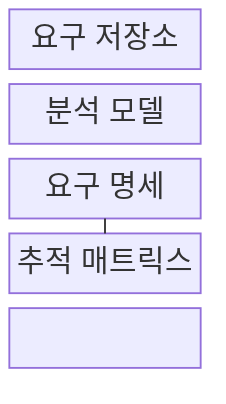
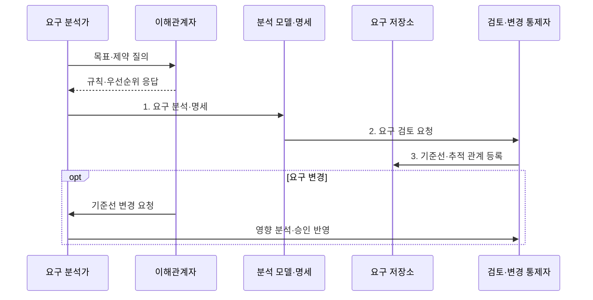

---
sidebar:
  order: 36
  label: "036. 요구사항 분석·명세 (Requirements Analysis)"
  badge:
    text: "미출제 · 50%"
    variant: note
title: "요구사항 분석·명세 (Requirements Analysis)"
date: "2026-07-30T23:27:52+09:00"
tags:
  - "notes-software"
weight: 36
extra:
  question_no: "036"
  source_status: "미출"
  source_history: ""
  priority: 50
  priority_note: "요구사항 도출·검증·추적은 상위 관리 주제"
---

## 미리 알고가기

- **요구사항(Requirement)**: 시스템이 제공해야 할 기능과 충족해야 할 품질·제약을 표현한 필요
- **요구공학(Requirements Engineering)**: 요구를 도출·분석·명세·검증하고 변경을 관리하는 공학 활동
- **이해관계자(Stakeholder)**: 요구에 영향을 주거나 결과의 영향을 받는 주체
- **기능 요구사항**: 시스템이 사용자나 다른 시스템에 제공해야 할 기능과 행동
- **비기능 요구사항**: 시스템 기능이 충족해야 할 성능·보안·가용성 등의 품질과 제약
- **수용 기준(Acceptance Criteria)**: 요구 충족을 판정하는 검증 조건
- **요구 기준선(Requirements Baseline)**: 승인되어 변경 통제를 받는 요구 집합
- **추적성(Traceability)**: 각 요구를 출처와 설계·구현·시험 산출물까지 연결해 변경 영향을 찾는 성질
- **요구 저장소(Requirements Repository)**: 요구 식별자·출처·우선순위·상태·승인 이력을 한곳에 보관해 변경 통제를 지원하는 저장소
- **분석 모델(Analysis Model)**: 행위자·기능·데이터·제약의 관계를 도식화해 요구의 누락·충돌·경계를 검토하는 모델
- **추적 매트릭스(Traceability Matrix)**: 요구 행과 설계·구현·시험 산출물 열의 대응을 기록해 변경 영향과 검증 누락을 찾는 표
- **행위자(Actor)**: 시스템 밖에서 기능을 요청하거나 결과를 받는 사용자·외부 시스템 역할
- **요구 식별자(Requirement Identifier)**: 각 요구를 고유하게 참조해 기준선·추적 관계·변경 이력을 연결하는 이름
- **요구 도출(Requirements Elicitation)**: 인터뷰·관찰·자료 분석 등으로 이해관계자의 목표·문제·제약을 찾아 수집하는 활동
- **실현 가능성(Feasibility)**: 요구를 기술·비용·일정·법규 제약 안에서 구현하고 운영할 수 있는지 나타내는 성질
- **변경 통제(Change Control)**: 기준선 요구의 영향·비용·승인 여부를 검토하고 승인된 변경만 기준선과 추적 관계에 반영하는 절차
- **규제 요구(Regulatory Requirement)**: 법령·표준·감독 규칙이 시스템에 요구하는 조건으로서 설계와 시험 항목까지 추적해야 하는 요구
- **품질 지표(Quality Measure)**: 성능·가용성·보안 같은 비기능 요구의 충족 여부를 수치로 확인하는 측정 기준
- **결정 권한자(Decision Owner)**: 상충하는 요구의 우선순위와 수용 여부를 최종 결정할 책임자

> **키워드:** 요구사항 분석·명세 (Requirements Analysis)

## Ⅰ. 개요

- 정의/개념: 목표·제약을 검증 가능한 요구로 만드는 **요구공학 활동**
- 배경/필요성: 모호한 요구로 **구현 범위·검증 기준** 불일치

### 쉽게 이해하기 (학습용)

- 무엇을 만들지 묻고 다른 말을 합의한 뒤 확인 가능한 약속으로 적는다.

## Ⅱ. 특징

- **완전성·일관성 검토**로 누락·충돌 발견
- **수용 기준 명시**로 객관적 검증 지원
- **양방향 추적성**으로 변경 영향 연결

### 쉽게 이해하기 (학습용)

- 초기에 애매한 말을 찾지 못하면 설계와 시험을 다시 고쳐야 한다.

## Ⅲ. 구조 및 구성요소

| 구성요소 | 책임 |
|:---|:---|
| 요구 저장소 | **식별자·출처·우선순위** 보관 |
| 분석 모델 | **행위자·기능·데이터·제약** 표현 |
| 요구 명세 | 기능·비기능 요구와 **수용 기준** 기록 |
| 추적 매트릭스 | 요구와 **후속 산출물** 연결 |

### 쉽게 이해하기 (학습용)

- 요청 보관함, 관계 모형, 공식 약속, 연결표로 구성된다.

## Ⅳ. 흐름도

**동작 원리**

- **1. 요구 분석·명세**: 누락·충돌·실현 가능성 정제
- **2. 요구 검토 요청**: 수용 기준·검증 가능성 확인
- **3. 기준선·추적 관계 등록**: 승인 요구와 산출물 연결

### 쉽게 이해하기 (학습용)

- 요청을 모아 충돌을 풀고 합격 조건을 붙인 뒤 바뀔 곳까지 찾는다.

## Ⅴ. 종류 및 비교

| 요구공학 활동 | 요구사항 분석 | 요구사항 명세 |
|:---|:---|:---|
| 적용 기준 | **모호성·실현 가능성** 확인 | 합의 요구의 **기준선** 확정 |
| 핵심 특징 | **요구 도출·모델링**·충돌 조정 | **수용 기준·추적 관계** 기록 |
| 한계 | 이해관계자·**예외 요구** 누락 | 모호한 문장·**추적 단절** |

> 요약: 분석은 요구를 정제하고 명세는 합의 결과를 기준선화

### 쉽게 이해하기 (학습용)

- 분석은 말을 정리하고 명세는 합의한 내용을 공식 약속으로 남긴다.

## Ⅵ. 실무 고려사항 및 대책

| 고려사항 | 대책 | 효과 |
|:---|:---|:---|
| 구현 방법을 요구로 고정해 대안 차단 | **사용자 목표·제약**과 해결 방법 분리 | 더 나은 **설계 대안** 확보 |
| 비기능 요구를 형용사로만 작성 | **품질 지표·목표값·측정법** 명시 | 객관적 **검증** 가능 |
| 상충 요구가 미해결 상태로 누적 | **결정 권한자·우선순위 기준** 기록 | **범위·책임** 명확화 |
| **규제 요구**와 코드·시험의 추적 불일치 | **요구 식별자**를 작업·시험 기록에 연결 | 최신 **추적성** 유지 |

### 쉽게 이해하기 (학습용)

- 금융 시스템은 규제 요구가 설계와 시험까지 빠짐없이 이어지는지 본다.

## Ⅶ. 결론

- 모호성은 **분석**, 합의 결과는 **명세**, 변경 영향은 추적성으로 통제

### 쉽게 이해하기 (학습용)

- 요구가 애매하거나 변경 영향이 크면 분석과 명세를 더 구체화한다.
