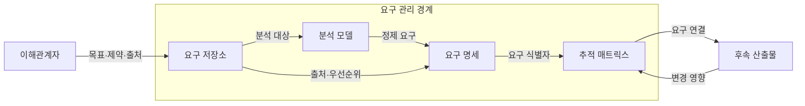
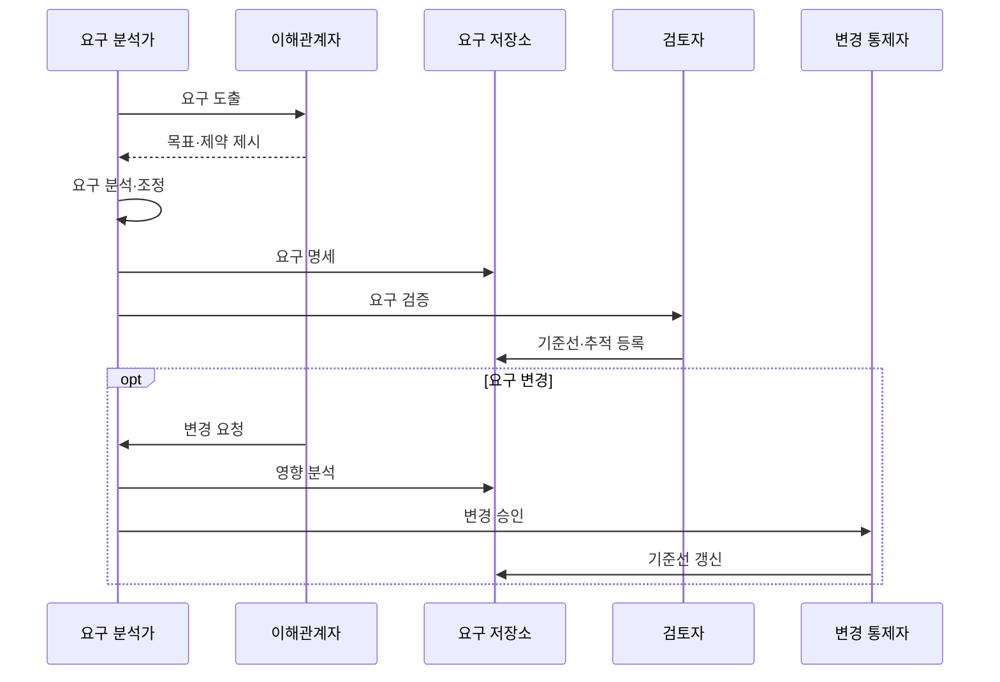

---
sidebar:
  order: 36
  label: "036. 요구사항 분석·명세 (Requirements Analysis)"
  badge:
    text: "미출제 · 50%"
    variant: note
title: "요구사항 분석·명세 (Requirements Analysis)"
date: "2026-07-25T00:35:00+09:00"
tags:
  - "notes-software"
weight: 36
extra:
  question_no: "036"
  source_status: "미출제"
  source_history: ""
  priority: 50
  priority_note: "요구사항 도출·검증·추적은 상위 관리 주제"
---

## 미리 알고가기

- **요구사항(Requirement)**: 시스템이 제공해야 할 기능과 충족해야 할 품질·제약을 표현한 필요
- **이해관계자(Stakeholder)**: 요구에 영향을 주거나 결과의 영향을 받는 주체
- **기능 요구사항**: 시스템이 사용자나 다른 시스템에 제공해야 할 기능과 행동
- **비기능 요구사항**: 시스템 기능이 충족해야 할 성능·보안·가용성 등의 품질과 제약
- **수용 기준(Acceptance Criteria)**: 요구 충족을 판정하는 검증 조건
- **요구 기준선(Requirements Baseline)**: 승인되어 변경 통제를 받는 요구 집합
- **추적성(Traceability)**: 각 요구를 출처와 설계·구현·시험 산출물까지 연결해 변경 영향을 찾는 성질
- **요구 저장소(Requirements Repository)**: 요구 식별자·출처·우선순위·상태·승인 이력을 한곳에 보관해 변경 통제를 지원하는 저장소
- **분석 모델(Analysis Model)**: 행위자·기능·데이터·제약의 관계를 도식화해 요구의 누락·충돌·경계를 검토하는 모델
- **추적 매트릭스(Traceability Matrix)**: 요구 행과 설계·구현·시험 산출물 열의 대응을 기록해 변경 영향과 검증 누락을 찾는 표
- **행위자(Actor)**: 시스템 밖에서 기능을 요청하거나 결과를 받는 사용자·외부 시스템 역할
- **요구 식별자(Requirement Identifier)**: 각 요구를 고유하게 참조해 기준선·추적 관계·변경 이력을 연결하는 이름
- **요구 도출(Requirements Elicitation)**: 인터뷰·관찰·자료 분석 등으로 이해관계자의 목표·문제·제약을 찾아 수집하는 활동
- **실현 가능성(Feasibility)**: 요구를 기술·비용·일정·법규 제약 안에서 구현하고 운영할 수 있는지 나타내는 성질
- **변경 통제(Change Control)**: 기준선 요구의 영향·비용·승인 여부를 검토하고 승인된 변경만 기준선과 추적 관계에 반영하는 절차
- **규제 요구(Regulatory Requirement)**: 법령·표준·감독 규칙이 시스템에 요구하는 조건으로서 설계와 시험 항목까지 추적해야 하는 요구

## Ⅰ. 개요

- 정의/개념: 목표·제약을 분석해 검증 가능한 요구로 명세
- **배경/필요성**: 모호한 요구가 기준을 어긋나게 해 명세 필요

### 쉽게 이해하기 (학습용)

- 무엇을 만들지 묻고 다른 말을 합의한 뒤 확인 가능한 약속으로 적는다

## Ⅱ. 특징

- 모호성·누락·충돌·실현 가능성 검증한다.
- 요구별 출처·우선순위·수용 기준 유지한다.
- 기준선 변경이 후속 산출물에 연쇄 영향을 준다.

### 쉽게 이해하기 (학습용)

- 초기에 애매한 말을 찾지 못하면 설계와 시험을 다시 고쳐야 한다

## Ⅲ. 아키텍처 및 구성요소

| 설계 요소 | 설명 |
|:---|:---|
| 요구 저장소 | 식별자·출처·우선순위·상태 보관 |
| 분석 모델 | 행위자·기능·데이터·제약 관계 표현 |
| 요구 명세 | 기능·비기능 요구와 수용 기준 기록 |
| 추적 매트릭스 | 요구와 설계·구현·검증 산출물 연결 |

> 요약: 분석 모델·명세·추적 관계로 요구 변경 영향 관리

### 쉽게 이해하기 (학습용)

- 요구 장부와 분석 그림, 합격 조건, 연결표가 한 요구를 함께 설명한다

## Ⅳ. 원리 및 절차 흐름도

| 절차 | 설명 |
|:---|:---|
| 요구 도출 | 이해관계자의 목표·문제·제약 수집 |
| 목표·제약 제시 | 업무 규칙과 품질 제약 전달 |
| 요구 분석·조정 | 누락·충돌·실현 가능성 조정 |
| 요구 명세 | 기능·비기능 요구와 수용 기준 기록 |
| 요구 검증 | 명확성·완전성·검증 가능성 확인 |
| 기준선·추적 등록 | 승인 요구와 후속 산출물 연결 |
| 변경 요청 | 이해관계자가 요구 기준선 변경 요청 |
| 영향 분석 | 추적 관계로 변경 범위·비용 식별 |
| 변경 승인 | 영향 범위와 변경안 승인 여부 판정 |
| 기준선 갱신 | 승인 요구와 추적 관계 갱신 |

> 요약: 요구 합의·명세·검토 후 추적 관계로 변경 영향 관리

### 쉽게 이해하기 (학습용)

- 요청을 모아 충돌을 풀고 합격 조건을 붙인 뒤 바뀔 곳까지 찾는다

## Ⅴ. 종류 및 비교

| 판단 기준 | 요구사항 분석 | 요구사항 명세 |
|:---|:---|:---|
| 핵심 특징 | 요구 도출·모델링·충돌 조정 | 수용 기준·추적 관계 기록 |
| 적용 기준 | 모호성·실현 가능성 확인 | 합의 요구의 기준선 확정 |
| 주요 위험 | 이해관계자·예외 요구 누락 | 모호한 문장·추적 단절 |

> 요약: 분석은 요구를 정제하고 명세는 합의 결과를 기준선화

### 쉽게 이해하기 (학습용)

- 분석은 말을 정리하고 명세는 합의한 내용을 공식 약속으로 남긴다

## Ⅵ. 실무 사례

1. 금융 시스템은 규제 요구를 설계·시험 항목까지 추적
2. 플랫폼 기능은 수용 기준으로 정상·오류 조건 명세

### 쉽게 이해하기 (학습용)

- 금융 시스템은 규제 요구가 설계와 시험까지 빠짐없이 이어지는지 본다
- 플랫폼은 정상 결과와 오류 상황을 합격 조건으로 먼저 적는다

## Ⅶ. 결론

- 요구 모호성·변경 영향으로 분석 깊이·명세 수준 결정

### 쉽게 이해하기 (학습용)

- 요구가 애매하거나 변경 영향이 크면 분석과 명세를 더 구체화한다
