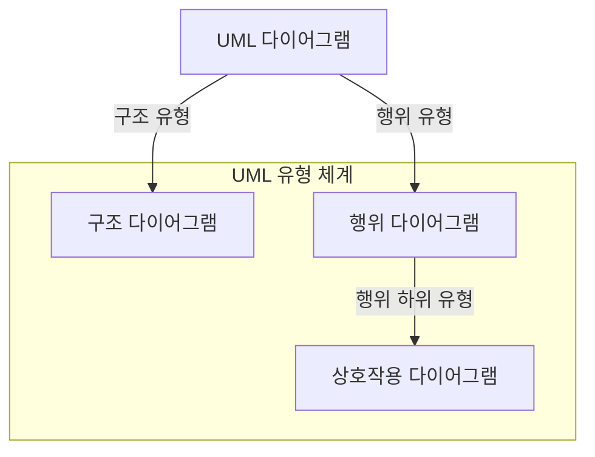
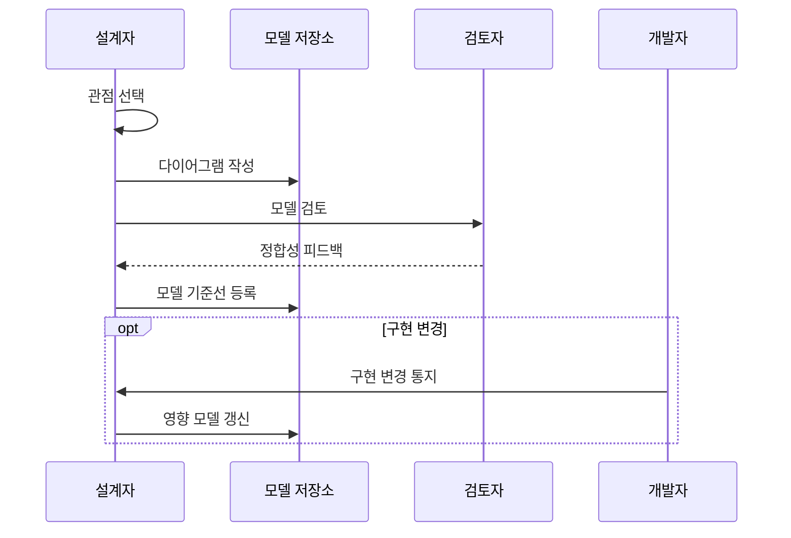

---
sidebar:
  order: 37
  label: "037. UML 다이어그램 유형 (UML Diagrams)"
  badge:
    text: "미출제 · 50%"
    variant: note
title: "UML 다이어그램 유형 (UML Diagrams)"
date: "2026-07-25T00:35:00+09:00"
tags:
  - "notes-software"
weight: 37
extra:
  question_no: "037"
  source_status: "미출제"
  source_history: ""
  priority: 50
  priority_note: "UML은 구조·행위 모델 선택의 기본 표기"
---

## 미리 알고가기

- **통합 모델링 언어(Unified Modeling Language, UML)**: 시스템의 구조·행위·상호작용을 표준 기호로 표현하는 모델링 언어
- **구조 다이어그램(Structure Diagram)**: 시스템의 정적 요소와 요소 간 관계, 실행 배치를 표현하는 UML 다이어그램
- **행위 다이어그램(Behavior Diagram)**: 시스템의 동작과 상태 변화, 처리 흐름을 표현하는 UML 다이어그램
- **상호작용 다이어그램(Interaction Diagram)**: 객체 간 메시지 교환을 표현하는 행위 유형
- **모델 불일치(Model Drift)**: 모델과 실제 구현이 어긋난 상태
- **클래스·컴포넌트·배치 다이어그램(Class·Component·Deployment Diagram)**: 클래스는 타입과 관계, 컴포넌트는 소프트웨어 모듈 의존성, 배치는 실행 노드와 산출물 배치를 표현하는 구조 다이어그램
- **유스 케이스·액티비티·상태 머신 다이어그램(Use Case·Activity·State Machine Diagram)**: 유스 케이스는 행위자 목표, 액티비티는 처리 흐름, 상태 머신은 사건에 따른 상태 전이를 표현하는 행위 다이어그램
- **시퀀스·커뮤니케이션·타이밍 다이어그램(Sequence·Communication·Timing Diagram)**: 시퀀스는 시간순 메시지, 커뮤니케이션은 객체 연결과 메시지, 타이밍은 시간축의 상태 변화를 표현하는 상호작용 다이어그램
- **모델 저장소(Model Repository)**: 다이어그램과 버전·승인 상태를 보관해 설계자·검토자·개발자가 같은 기준 모델을 공유하는 저장소
- **모델 기준선(Model Baseline)**: 검토·승인되어 변경 통제의 기준이 된 UML 모델 집합
- **정합성(Consistency)**: 서로 다른 다이어그램의 요소·관계·시나리오와 실제 구현이 모순 없이 대응하는 성질
- **실행 노드(Execution Node)**: 배치 다이어그램에서 소프트웨어 산출물이 실행되는 서버·장치·가상 환경

## Ⅰ. 개요

- 정의/개념: 구조·행위·상호작용을 표준 기호로 표현
- **배경/필요성**: 관점별 해석 차이가 오해를 낳아 표준 모델 필요

### 쉽게 이해하기 (학습용)

- 건물 배치도와 이동 동선도가 다르듯 구조와 움직임을 다른 그림으로 본다

## Ⅱ. 특징

- 다중 관점을 하나의 표준 기호 체계로 통합한다.
- 개발 방법론과 독립된 범용 모델링 언어이다.
- 갱신 책임이 없으면 모델이 구현과 일치하지 않는다.

### 쉽게 이해하기 (학습용)

- 그림을 많이 그리기보다 질문에 필요한 그림을 고르고 구현과 함께 고친다

## Ⅲ. 아키텍처 및 구성요소

| 설계 요소 | 설명 |
|:---|:---|
| 구조 다이어그램 | 클래스·컴포넌트·배치 등 정적 관계 표현 |
| 행위 다이어그램 | 유스 케이스·액티비티·상태 머신 등 표현 |
| 상호작용 다이어그램 | 시퀀스·커뮤니케이션·타이밍 등 표현 |

> 요약: 구조는 정적 관계, 행위는 동작, 상호작용은 메시지 표현

### 쉽게 이해하기 (학습용)

- 구조 그림은 관계를, 행위 그림은 움직임을, 상호작용 그림은 메시지를 보여 준다

## Ⅳ. 원리 및 절차 흐름도

| 절차 | 설명 |
|:---|:---|
| 관점 선택 | 질문을 구조·행위·상호작용으로 분류 |
| 다이어그램 작성 | 관점에 맞는 최소 유형으로 모델링 |
| 모델 검토 | 표기·관계·시나리오 일관성 검토 |
| 정합성 피드백 | 모델 결함과 수정 지점 전달 |
| 모델 기준선 등록 | 승인 모델을 변경 통제 대상으로 등록 |
| 구현 변경 통지 | 개발자가 관련 구현 변경 통지 |
| 영향 모델 갱신 | 변경 구현과 관련 다이어그램 동기화 |

> 요약: 설계 질문에 맞는 유형을 선택하고 구현 변경과 동기화

### 쉽게 이해하기 (학습용)

- 알고 싶은 것을 정해 맞는 그림을 고르고 구현이 바뀌면 함께 고친다

## Ⅴ. 종류 및 비교

| 판단 기준 | 구조 다이어그램 | 행위 다이어그램 |
|:---|:---|:---|
| 핵심 특징 | 정적 요소·관계·배치 | 동적 행위·상태·메시지 |
| 적용 기준 | 소유·의존·배치 질문 | 시나리오·상태·메시지 질문 |
| 주요 위험 | 동작·시간 관계 누락 | 정적 소유·배치 관계 누락 |

> 요약: 구조는 정적 관계, 행위는 시간에 따른 변화 표현

### 쉽게 이해하기 (학습용)

- 구조 그림은 연결을, 행위 그림은 언제 어떻게 움직이는지를 보여 준다

## Ⅵ. 실무 사례

1. 배포 구조는 컴포넌트·배치도로 의존·노드 배치 검토

### 쉽게 이해하기 (학습용)

- 배포 구조에서는 부품 사이 의존 관계와 실행 노드 배치를 그림으로 확인한다

## Ⅶ. 결론

- 정적 관계·상태 변화·메시지 질문에 맞춰 UML 유형 선택

### 쉽게 이해하기 (학습용)

- 구조·움직임·대화 중 질문에 맞는 그림을 선택해 설계를 공유한다
