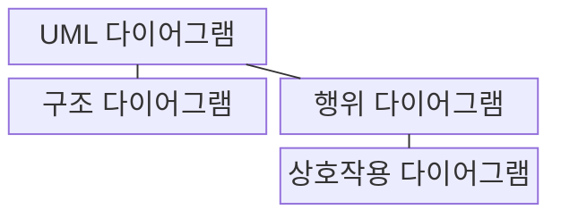
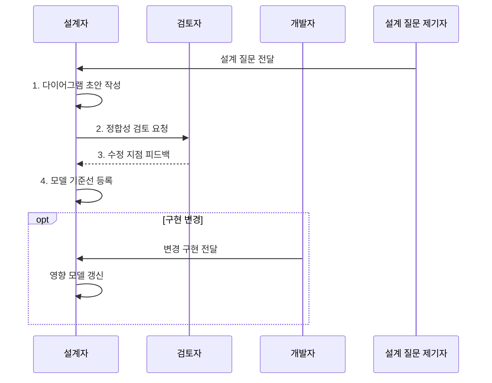

---
sidebar:
  order: 37
  label: "037. UML 다이어그램 유형 (UML Diagrams)"
  badge:
    text: "미출제 • 50%"
    variant: note
title: "UML 다이어그램 유형 (UML Diagrams)"
date: "2026-08-04T10:47:00+09:00"
tags:
  - "notes-software"
weight: 37
extra:
  question_no: "037"
  source_status: "미출"
  source_history: ""
  priority: 50
  priority_note: "UML은 구조•행위 모델 선택의 기본 표기"
---

## Ⅰ. 개요

핵심 용어

- **통합 모델링 언어(Unified Modeling Language, UML)**: 시스템의 구조•행위•상호작용을 표준 기호로 표현하는 모델링 언어다.
- **표준 기호**: 모델 요소와 관계를 여러 이해관계자가 같은 의미로 읽도록 정한 표기다.

- 정의/개념: 구조•행위•상호작용을 표준 기호로 나타내는 **모델링 언어**
- 배경/필요성: 비표준 표현으로 **구조•행위 해석** 과 설계 합의 불일치

#### 한줄 요약

- 건물 배치도와 이동 동선도가 다르듯 구조와 움직임을 다른 그림으로 본다.

## Ⅱ. 특징

핵심 용어

- **다중 관점 통합**: 한 시스템을 구조•행위•상호작용 관점으로 나눠 서로 연결해 설명하는 방식이다.
- **모델 기준선(Model Baseline)**: 검토•승인되어 변경 통제 기준이 된 UML 모델 집합이다.
- **정합성(Consistency)**: 여러 다이어그램의 요소•관계•시나리오와 구현이 모순 없이 대응하는 성질이다.
- **방법론 독립성(Methodology Independence)**: 폭포수•애자일 같은 개발 방법과 무관하게 같은 표기 체계를 적용할 수 있는 성질이다.

- **다중 관점 통합** 으로 구조•행위 표현
- **방법론 독립성** 으로 개발 방식과 무관하게 적용
- **모델 기준선** 으로 구현 변경과 정합성 유지

#### 한줄 요약

- 그림을 많이 그리기보다 질문에 필요한 그림을 고르고 구현과 함께 고친다.

## Ⅲ. 구조 및 구성요소

핵심 용어

- **구조 다이어그램(Structure Diagram)**: 시스템의 정적 요소•관계와 실행 배치를 표현하는 UML 유형이다.
- **행위 다이어그램(Behavior Diagram)**: 시스템의 동작•상태 변화•처리 흐름을 표현하는 UML 유형이다.
- **상호작용 다이어그램(Interaction Diagram)**: 객체 간 메시지 교환을 표현하는 행위 다이어그램 유형이다.

| 구성요소 | 책임 |
|:---|:---|
| UML 다이어그램 | 시스템 관점을 **표준 기호** 로 표현 |
| 구조 다이어그램 | **정적 요소•관계•배치** 표현 |
| 행위 다이어그램 | **동작•상태 변화•처리 흐름** 표현 |
| 상호작용 다이어그램 | 객체 간 **메시지 교환** 표현 |

#### 한줄 요약

- 전체 그림을 구조와 행위로 나누고 행위 안에서 대화를 따로 본다.

## Ⅳ. 흐름도

핵심 용어

- **모델 저장소(Model Repository)**: 다이어그램과 버전•승인 상태를 보관해 기준 모델을 공유하는 저장소다.
- **모델 소유자(Model Owner)**: 다이어그램의 정확성•검토•구현 변경 반영을 책임지는 주체다.
- **상세 수준**: 설계 질문에 답하도록 다이어그램에 포함할 요소와 관계의 구체성 정도다.
- **영향 모델 갱신**: 구현 변경이 관계•배치•시나리오에 미치는 범위를 찾아 관련 다이어그램을 함께 수정하는 활동이다.

**동작 원리**

- **1. 다이어그램 초안 작성**: 최소 유형•상세 수준 선택
- **2. 정합성 검토 요청**: 표기•관계•시나리오 점검
- **3. 수정 지점 피드백**: 관점 간 모순 전달
- **4. 모델 기준선 등록**: 버전•소유자와 승인 모델 보존

#### 한줄 요약

- 알고 싶은 것을 정해 맞는 그림을 고르고 구현이 바뀌면 함께 고친다.

## Ⅴ. 종류 및 비교

핵심 용어

- **실행 노드(Execution Node)**: 배치 다이어그램에서 소프트웨어 산출물이 실행되는 서버•장치•가상 환경이다.
- **상태(State)**: 행위 다이어그램이 표현하는 시간에 따른 대상 조건이다.
- **메시지(Message)**: 상호작용 다이어그램이 표현하는 객체 간 전달이다.

| UML 표현 관점 | 구조 다이어그램 | 행위 다이어그램 |
|:---|:---|:---|
| 적용 기준 | **소유•의존•배치** 질문 | **시나리오•상태•메시지** 질문 |
| 핵심 특징 | 컴포넌트 의존과 **실행 노드 배치** | 동적 행위와 **상태•메시지** |
| 한계 | **동작•시간 관계** 누락 | **정적 소유•배치 관계** 누락 |

> 요약: 구조는 정적 관계, 행위는 시간에 따른 변화 표현

#### 한줄 요약

- 구조 그림은 연결을, 행위 그림은 언제 어떻게 움직이는지를 보여 준다.

## Ⅵ. 실무 고려사항 및 대책

핵심 용어

- **모델링 규약(Modeling Convention)**: 이름•색•관계•상세 수준을 팀이 일관되게 사용하는 작성 규칙이다.
- **모델 불일치(Model Drift)**: UML 모델과 실제 구현이 변경 과정에서 서로 어긋난 상태다.
- **공통 식별자**: 여러 다이어그램과 구현 요소의 동일 대상을 연결하는 고유 이름이다.
- **모델 템플릿(Model Template)**: 다이어그램 유형별 필수 요소•표기•상세 수준을 같은 형식으로 시작하게 하는 양식이다.
- **코드 변경 연결**: 구현 변경 기록과 영향을 받는 모델 요소를 식별자로 이어 갱신 누락을 찾는 관계다.

| 문제 | 대책 | 효과 |
|:---|:---|:---|
| 모든 관점을 한 그림에 넣어 가독성 저하 | 질문별 최소 **다이어그램•상세 수준** 분리 | 목적이 분명한 **모델** 확보 |
| 팀마다 기호•이름•색의 의미가 다름 | 공통 **모델링 규약•템플릿** 적용 | **해석 일관성** 확보 |
| 구현 변경 뒤 모델이 갱신되지 않음 | **모델 소유자•코드 변경 연결** 명시 | **모델 불일치** 감소 |
| 다이어그램 간 요소 이름•관계 모순 | **공통 식별자•모델 저장소** 로 정합성 검토 | **관점 간 연결** 유지 |

#### 한줄 요약

- 배포 구조에서는 부품 사이 의존 관계와 실행 노드 배치를 그림으로 확인한다.

## Ⅶ. 결론

핵심 용어

- **소유 관계(Ownership)**: 구조 다이어그램으로 표현할 정적 책임 관계다.
- **배치 관계(Deployment)**: 구조 다이어그램으로 표현할 실행 위치 관계다.
- **상태 변화(State Transition)**: 행위 다이어그램으로 표현할 대상 조건 변화다.
- **처리 흐름(Control Flow)**: 행위 다이어그램으로 표현할 동작 순서다.

- 소유•배치는 **구조 다이어그램**, 상태•흐름은 행위, 메시지 교환은 **상호작용 다이어그램** 선택

#### 한줄 요약

- 구조•움직임•대화 중 질문에 맞는 그림을 선택해 설계를 공유한다.
