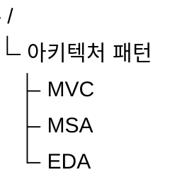
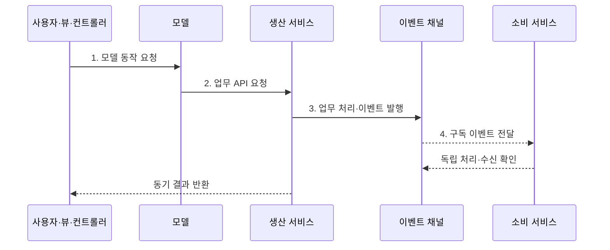

---
sidebar:
  order: 38
  label: "038. 소프트웨어 아키텍처 패턴: MVC·MSA·이벤트드리븐 (Architecture Patterns)"
  badge:
    text: "기출 · 30%"
    variant: note
title: "소프트웨어 아키텍처 패턴: MVC·MSA·이벤트드리븐 (Architecture Patterns)"
date: "2026-08-02T12:00:00+09:00"
tags:
  - "notes-software"
weight: 38
extra:
  question_no: "038"
  source_status: "기출"
  source_history: "120회"
  priority: 30
  priority_note: "120회 기출 후 저빈도, 패턴 범위·절충 비교"
---

## Ⅰ. 개요

핵심 용어

- **아키텍처 패턴(Architecture Pattern)**: 반복되는 설계 문제에 검증된 구성요소·책임·관계 구조를 재사용하는 해법이다.
- **변경 전파**: 한 구성요소의 수정이 의존 관계를 따라 다른 구성요소의 변경까지 요구하는 현상이다.

- 정의/개념: 반복 문제의 구성요소·책임·관계를 재사용하는 **설계 해법**
- 배경/필요성: 화면·업무·상태를 한 구조에 결합하면 **변경 전파** 확대

### 쉽게 이해하기 (학습용)

- 나눌 대상에 따라 방 배치와 점포 구획 같은 설계도를 적용한다.

## Ⅱ. 특징

핵심 용어

- **책임 경계**: 변경 이유와 소유 책임이 같은 기능·데이터를 하나로 묶는 설계 경계다.
- **결합도(Coupling)**: 한 구성요소의 변경이 다른 요소에 미치는 의존 정도다.
- **이벤트 주도 아키텍처(Event-Driven Architecture, EDA)**: 이벤트 발행·구독으로 생산자와 소비자를 분리하는 아키텍처다.

- **책임 경계 분리**로 변경 전파 범위 국소화
- **경계 간 계약**이 패턴 조합의 결합도 결정
- **EDA 비동기 상태 전파**가 분산 복잡도 증가

### 쉽게 이해하기 (학습용)

- 한 건물도 방의 역할과 소유권 및 알림 방식을 따로 나눈다.

## Ⅲ. 구조 및 구성요소

핵심 용어

- **모델-뷰-컨트롤러(Model-View-Controller, MVC)**: 화면·입력 제어·업무 상태의 책임을 분리하는 패턴이다.
- **마이크로서비스 아키텍처(Microservice Architecture, MSA)**: 업무별 서비스가 데이터와 배포 경계를 독립적으로 소유하는 아키텍처다.
- **캡슐화(Encapsulation)**: 상태와 업무 규칙을 경계 안에 숨기고 정해진 동작만 외부에 제공하는 원칙이다.

| 구성요소 | 책임 |
|:---|:---|
| MVC | 표현·입력과 **업무 상태 캡슐화** |
| MSA | **업무·데이터·배포 경계** 분리 |
| EDA | 이벤트 **생산자·소비자** 분리 |

### 쉽게 이해하기 (학습용)

- 화면 책임, 업무 점포, 비동기 알림을 서로 다른 패턴으로 나눈다.

## Ⅳ. 흐름도

핵심 용어

- **응용 프로그래밍 인터페이스(Application Programming Interface, API)**: 서비스가 요청과 응답을 교환하기 위한 규약이다.
- **로컬 트랜잭션(Local Transaction)**: 한 서비스가 소유한 데이터 변경을 모두 반영하거나 모두 취소하는 처리 단위다.
- **이벤트 채널·라우팅·구독(Event Channel·Routing·Subscription)**: 이벤트 전달 경로와 소비자 선택·등록 관계다.

**동작 원리**

- **1. 모델 동작 요청**: MVC가 사용자 입력 해석
- **2. 업무 API 요청**: 모델이 생산 서비스 호출
- **3. 업무 처리·이벤트 발행**: 로컬 트랜잭션 완료
- **4. 구독 이벤트 전달**: 계약·구독에 맞춰 라우팅

### 쉽게 이해하기 (학습용)

- 화면 요청을 점포가 처리하면 방송 채널이 다른 점포에 알린다.

## Ⅴ. 종류 및 비교

핵심 용어

- **최종 일관성(Eventual Consistency)**: 비동기 갱신이 모두 전달되면 분산 상태가 같은 값으로 수렴하는 성질이다.
- **생산자·소비자**: 이벤트를 발행하는 구성요소와 계약에 맞는 이벤트를 받아 처리하는 구성요소다.

| 아키텍처 패턴 | MVC | MSA | EDA |
|:---|:---|:---|:---|
| 적용 기준 | 화면 변경 **국소화** | 독립 **배포·확장** | 다수 소비자의 **비동기 처리** |
| 핵심 특징 | 표현·입력·**상태 분리** | 업무·데이터·**배포 분리** | 생산자·**소비자 분리** |
| 한계 | 컨트롤러 **비대화** | 분산 데이터·**관측 비용** | 중복·순서·**최종 일관성** |

> 요약: 화면·업무·이벤트 결합을 각각 분리

### 쉽게 이해하기 (학습용)

- 화면은 MVC, 독립 업무는 MSA, 비동기는 EDA를 쓴다.

## Ⅵ. 실무 고려사항 및 대책

핵심 용어

- **아키텍처 결정 기록(Architecture Decision Record, ADR)**: 설계 대안·선택 이유·절충을 짧게 남기는 문서다.
- **소비자 계약 시험(Consumer Contract Test)**: API·이벤트 제공자가 소비자의 기대 필드와 동작을 깨뜨리지 않는지 검증하는 시험이다.
- **트랜잭셔널 아웃박스(Transactional Outbox)**: 업무 데이터와 발행 이벤트를 한 로컬 트랜잭션에 저장한 뒤 전달하는 방식이다.
- **멱등성(Idempotency)**: 같은 이벤트나 요청을 여러 번 처리해도 최종 결과가 한 번 처리한 것과 같은 성질이다.
- **분산 추적(Distributed Tracing)**: 여러 서비스와 이벤트를 거친 요청 경로와 지연을 공통 식별자로 연결해 기록하는 방식이다.

| 문제 | 대책 | 효과 |
|:---|:---|:---|
| 품질 요구와 무관한 패턴 선택 | **변경 축·배포 시나리오** 비교 후 ADR 기록 | **선택 근거·절충** 명확화 |
| 업무 경계가 불명확한데 MSA로 과도하게 분할 | **모듈 경계** 검증 후 독립 배포 시 분리 | **분산 복잡도** 억제 |
| 필드 변경으로 기존 이벤트 소비자 장애 | **버전 호환·소비자 계약 시험** 적용 | **이벤트 계약** 안정성 확보 |
| 저장 성공 후 이벤트 발행 실패·중복 전달 | **트랜잭셔널 아웃박스·멱등성** 적용 | 데이터·이벤트 **정합성** 향상 |
| 동기·비동기 경로 혼재로 원인 추적 곤란 | 공통 식별자와 **분산 추적·관측성** 연결 | 전체 **요청 흐름** 관측 |

### 쉽게 이해하기 (학습용)

- 주문 화면·결제·배송 알림은 서로 다른 경계에서 함께 움직인다.

## Ⅶ. 결론

핵심 용어

- **화면 책임**: 표현·사용자 입력·업무 상태를 MVC로 분리해야 하는 설계 관심사다.
- **독립 배포**: 한 서비스 변경을 다른 서비스와 함께 배포하지 않고 출시할 수 있는 성질이다.

- 화면 책임은 **MVC**, 독립 배포는 **MSA**, 비동기 전파는 EDA 선택

### 쉽게 이해하기 (학습용)

- 바뀌는 대상에 맞는 설계도를 선택해 조합한다.
