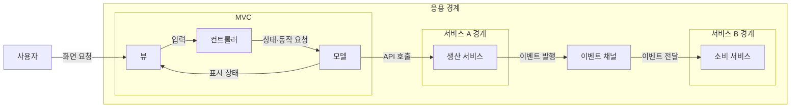
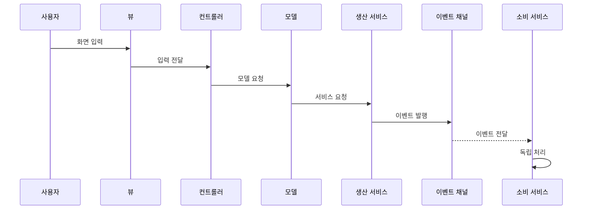

---
sidebar:
  order: 38
  label: "038. 소프트웨어 아키텍처 패턴 — MVC·MSA·이벤트드리븐 (Architecture Patterns)"
  badge:
    text: "기출 · 30%"
    variant: note
title: "소프트웨어 아키텍처 패턴 — MVC·MSA·이벤트드리븐 (Architecture Patterns)"
date: "2026-07-27T23:59:59+09:00"
tags:
  - "notes-software"
weight: 38
extra:
  question_no: "038"
  source_status: "기출"
  source_history: "120회"
  priority: 30
  priority_note: "120회 기출 후 저빈도, 패턴 범위·절충 비교"
---

## 미리 알고가기

- **아키텍처 패턴(Architecture Pattern)**: 반복되는 설계 문제에 검증된 책임·관계 구조를 재사용하는 해법
- **모델-뷰-컨트롤러(Model-View-Controller, MVC)**: ‘엠브이시’로 읽고 Model-View-Controller의 머리글자를 딴 표기이며 화면·입력 제어·업무 상태 책임을 분리
- **마이크로서비스 아키텍처(Microservice Architecture, MSA)**: ‘엠에스에이’로 읽고 Microservice Architecture의 머리글자를 딴 표기이며 업무별 서비스가 데이터·배포 경계를 소유
- **이벤트 주도 아키텍처(Event-Driven Architecture, EDA)**: ‘이디에이’로 읽고 Event-Driven Architecture의 머리글자를 딴 표기이며 이벤트로 생산자와 소비자를 분리
- **응용 프로그래밍 인터페이스(Application Programming Interface, API)**: ‘에이피아이’로 읽고 Application Programming Interface의 머리글자를 딴 표기이며 서비스가 요청·응답을 주고받는 규칙
- **이벤트 계약(Event Contract)**: 생산자와 소비자가 공유하는 이벤트 이름과 필드, 버전 호환 규칙
- **최종 일관성(Eventual Consistency)**: 비동기 갱신이 모두 전달되면 분산된 상태가 같은 값으로 수렴하는 성질
- **결합도(Coupling)**: 한 구성요소의 변경이 다른 요소에 미치는 의존 정도로서 패턴 경계와 계약이 변경 전파 범위를 좌우함
- **동기·비동기 통신(Synchronous·Asynchronous Communication)**: 동기는 응답을 기다린 뒤 계속 실행하고 비동기는 이벤트를 발행한 뒤 소비자의 완료를 기다리지 않아 생산자와 소비자를 분리함
- **캡슐화(Encapsulation)**: 모델이 상태와 업무 규칙을 경계 안에 숨기고 정해진 동작만 외부에 제공하는 설계 원칙
- **이벤트 채널·라우팅·구독(Event Channel·Routing·Subscription)**: 채널은 이벤트 전달 경로이고 라우팅은 계약에 맞는 소비자를 찾으며 구독은 소비 서비스가 받을 이벤트를 등록하는 관계
- **로컬 트랜잭션(Local Transaction)**: 한 서비스가 소유한 데이터 변경을 전부 반영하거나 전부 취소하는 원자적 처리 단위
- **관측성(Observability)**: 로그·메트릭·추적으로 분산 서비스 내부 상태와 요청 흐름을 외부 출력에서 추론하는 능력
- **모듈 경계(Module Boundary)**: 단일 배포 응용 안에서 코드와 데이터 책임을 나눠 변경 영향을 제한하는 내부 경계

## Ⅰ. 개요

- 정의/개념: 반복 설계의 **구성요소·책임·관계**를 재사용하는 구조
- 기존 한계: 무경계 구조는 **화면·업무·상태 변경의 전파 범위** 확대

### 쉽게 이해하기 (학습용)

- 나눌 대상에 따라 방 배치와 점포 구획 같은 설계도를 적용한다

## Ⅱ. 특징

- **책임 경계 분리**로 변경 전파 범위 국소화
- **경계 간 계약**이 패턴 조합의 결합도 결정
- **독립 배포·비동기 상태 전파**가 분산 복잡도 증가

### 쉽게 이해하기 (학습용)

- 한 건물도 방의 역할과 소유권 및 알림 방식을 따로 나눈다

## Ⅲ. 아키텍처 및 구성요소

| 설계 요소 | 설명 |
|:---|:---|
| 뷰 | 화면을 표시하고 사용자 입력을 수신 |
| 컨트롤러 | 입력을 해석해 모델 동작을 요청 |
| 모델 | 상태와 업무 규칙을 캡슐화 |
| 생산 서비스 | 업무·데이터 경계를 소유하고 이벤트 발행 |
| 이벤트 채널 | 이벤트를 라우팅해 구독 소비자에게 전달 |
| 소비 서비스 | 이벤트를 구독해 독립 업무 처리 |

> 요약: MVC·MSA·EDA는 화면·서비스·이벤트 경계를 분리

### 쉽게 이해하기 (학습용)

- 방의 담당자와 점포의 울타리 및 방송 채널이 뼈대를 이룬다

## Ⅳ. 원리 및 절차 흐름도

| 절차 | 설명 |
|:---|:---|
| 화면 입력 | 사용자가 뷰에 요청 입력 |
| 입력 전달 | 뷰가 입력을 컨트롤러에 전달 |
| 모델 요청 | 컨트롤러가 모델 동작 선택 |
| 서비스 요청 | 모델이 생산 서비스에 동기 요청 |
| 이벤트 발행 | 생산 서비스가 처리 결과 이벤트 발행 |
| 이벤트 전달 | 이벤트 채널이 구독 서비스로 전달 |
| 독립 처리 | 소비 서비스가 자체 트랜잭션으로 처리 |

> 요약: 화면 요청은 서비스 처리 뒤 이벤트로 소비자에 전달

### 쉽게 이해하기 (학습용)

- 화면 요청을 점포가 처리하면 방송 채널이 다른 점포에 알린다

## Ⅴ. 종류 및 비교

| 아키텍처 패턴 | MVC | MSA | EDA |
|:---|:---|:---|:---|
| 적용 기준 | 화면 변경 **국소화** | 독립 **배포·확장** | 다수 소비자의 **비동기 처리** |
| 핵심 특징 | 표현·입력·**상태 분리** | 업무·데이터·**배포 분리** | 생산자·**소비자 분리** |
| 한계 | 컨트롤러 **비대화** | 분산 데이터·**관측 비용** | 중복·순서·**최종 일관성** |

> 요약: 화면·업무·이벤트 결합을 각각 분리

### 쉽게 이해하기 (학습용)

- 화면은 MVC, 독립 업무는 MSA, 비동기는 EDA를 쓴다

## Ⅵ. 실무 사례

1. 주문 화면은 **MVC**, 주문·결제는 **MSA**, 배송 통지는 EDA
2. 단일 배포 업무 화면은 **MVC·모듈 경계**로 구성

### 쉽게 이해하기 (학습용)

- 주문 화면·결제·배송 알림은 서로 다른 경계에서 함께 움직인다
- 한 번에 배포하는 업무 화면은 서비스 대신 내부 모듈만 나눈다

## Ⅶ. 결론

- **화면·배포·상태 전파 변경 축**에 따라 패턴 선택·조합

### 쉽게 이해하기 (학습용)

- 바뀌는 대상에 맞는 설계도를 선택해 조합한다
