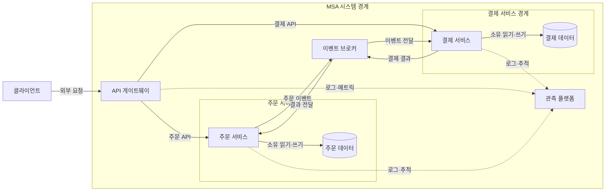
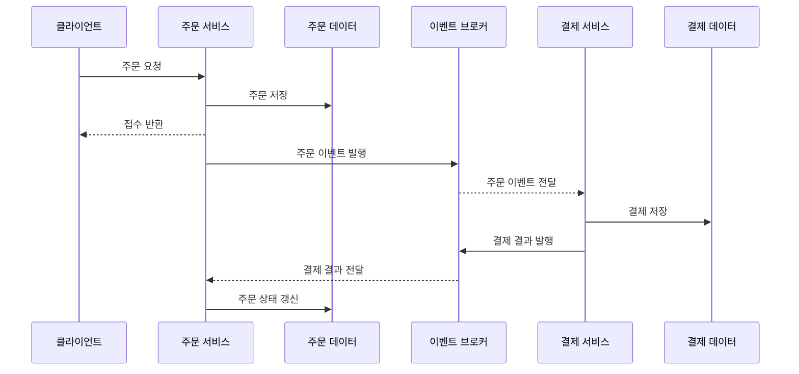

---
sidebar:
  order: 39
  label: "039. 마이크로서비스 아키텍처 MSA (Microservice Architecture)"
  badge:
    text: "기출 · 70%"
    variant: note
title: "마이크로서비스 아키텍처 MSA (Microservice Architecture)"
date: "2026-07-27T23:59:59+09:00"
tags:
  - "notes-software"
weight: 39
extra:
  question_no: "039"
  source_status: "기출"
  source_history: "120회, 123회, 135회"
  priority: 70
  priority_note: "120·123·135회 반복, MSA 설계 핵심"
---

## 미리 알고가기

- **마이크로서비스 아키텍처(Microservice Architecture, MSA)**: ‘엠에스에이’로 읽고 Microservice Architecture의 머리글자를 딴 표기이며 업무별 서비스가 데이터와 배포 경계를 소유
- **모듈러 모놀리스(Modular Monolith)**: 하나의 애플리케이션으로 배포하면서 내부 업무를 모듈 경계로 분리한 구조
- **서비스 경계(Service Boundary)**: 하나의 업무와 데이터, 담당 팀의 책임을 함께 묶는 서비스 단위
- **데이터 소유권(Data Ownership)**: 특정 데이터를 변경할 권한과 책임을 하나의 서비스에만 부여하는 원칙
- **응용 프로그래밍 인터페이스 게이트웨이(Application Programming Interface Gateway, API Gateway)**: ‘에이피아이 게이트웨이’로 읽고 API에 진입점을 뜻하는 Gateway를 붙인 표기이며 외부 요청 라우팅·공통 정책 적용
- **이벤트 브로커(Event Broker)**: 비동기 이벤트를 라우팅하는 중개자
- **최종 일관성(Eventual Consistency)**: 비동기 처리 후 상태가 수렴하는 성질
- **분산 모놀리스(Distributed Monolith)**: 서비스를 나눴지만 서로 강하게 결합돼 함께 변경하고 배포해야 하는 구조
- **로컬 트랜잭션(Local Transaction)**: 한 서비스가 소유한 데이터 변경을 하나의 원자적 작업으로 처리하는 트랜잭션
- **클라이언트(Client)**: 외부 API 계약으로 게이트웨이나 서비스에 요청하고 응답을 받는 사용자 응용
- **버전된 계약(Versioned Contract)**: API·이벤트 형식에 버전을 부여해 생산자와 소비자가 서로 다른 변경 시점에도 호환되게 하는 규칙
- **타임아웃·장애 격리(Timeout·Fault Isolation)**: 타임아웃은 정한 시간 뒤 원격 호출 대기를 끝내고 장애 격리는 실패 서비스의 영향이 다른 서비스로 연쇄 전파되지 않게 제한함
- **부분 장애(Partial Failure)**: 분산 시스템의 일부 서비스·네트워크만 실패하고 나머지는 계속 동작하는 상태
- **공유 쓰기·동기 호출(Shared Write·Synchronous Call)**: 공유 쓰기는 여러 서비스가 같은 데이터 저장소를 직접 갱신하고 동기 호출은 응답까지 기다려 서비스의 변경·장애·배포 결합을 키울 수 있음
- **관측 플랫폼(Observability Platform)**: 로그·메트릭·분산 추적의 상관 식별자를 모아 서비스별 상태와 요청 경로를 분석하는 운영 도구
- **로그·메트릭·분산 추적(Log·Metric·Distributed Trace)**: 로그는 사건 기록, 메트릭은 수치 시계열, 분산 추적은 서비스 간 요청 구간을 연결해 부분 장애를 진단함
- **원격 통신(Remote Communication)**: 다른 프로세스나 장비의 서비스에 네트워크로 요청·이벤트를 전달해 지연과 부분 장애가 발생할 수 있는 통신
- **운영 자동화(Operations Automation)**: 서비스별 빌드·배포·확장·관측·복구를 자동화해 독립 배포의 운영 비용을 줄이는 역량

## Ⅰ. 개요

- **정의/개념**: 업무별 독립 서비스가 **소유 데이터·계약으로 협업**하는 구조
- **기존 한계**: 단일 배포는 **업무별 변경·확장·장애 범위**를 결합

### 쉽게 이해하기 (학습용)

- 주문·조리·배달 팀이 각자 장부를 맡고 주문서로 협업한다

## Ⅱ. 특징

- **업무·데이터·배포 책임**을 서비스 경계로 정렬
- **버전된 API·이벤트 계약**으로 내부 구현 은닉
- **부분 장애 전제**로 타임아웃·격리·복구 설계

### 쉽게 이해하기 (학습용)

- 팀을 나눠도 같은 장부를 함께 고치면 독립할 수 없다

## Ⅲ. 아키텍처 및 구성요소

| 설계 요소 | 설명 |
|:---|:---|
| API 게이트웨이 | 외부 요청 라우팅과 공통 정책 적용 |
| 주문 서비스 | 주문 업무와 배포 경계 소유 |
| 주문 데이터 | 주문 서비스만 변경 권한 보유 |
| 결제 서비스 | 결제 업무와 배포 경계 소유 |
| 결제 데이터 | 결제 서비스만 변경 권한 보유 |
| 이벤트 브로커 | 서비스 간 비동기 이벤트 라우팅 |
| 관측 플랫폼 | 로그·메트릭·요청 추적 상관 분석 |

> 요약: 서비스는 업무·데이터를 소유하고 API·이벤트로 연결

### 쉽게 이해하기 (학습용)

- 팀은 업무와 데이터를 맡고 공통 계약과 관측 정보로 협업한다

## Ⅳ. 원리 및 절차 흐름도

| 절차 | 설명 |
|:---|:---|
| 주문 요청 | 클라이언트가 주문 서비스에 요청 |
| 주문 저장 | 주문 서비스가 로컬 트랜잭션으로 저장 |
| 접수 반환 | 주문 서비스가 접수 결과를 즉시 반환 |
| 주문 이벤트 발행 | 주문 서비스가 주문 이벤트를 브로커에 발행 |
| 주문 이벤트 전달 | 브로커가 결제 서비스에 이벤트 전달 |
| 결제 저장 | 결제 서비스가 로컬 트랜잭션으로 결과 저장 |
| 결제 결과 발행 | 결제 서비스가 처리 결과 이벤트 발행 |
| 결제 결과 전달 | 브로커가 주문 서비스에 결과 전달 |
| 주문 상태 갱신 | 주문 서비스가 결제 결과로 상태 갱신 |

> 요약: 각 서비스는 로컬 저장 후 이벤트로 상태를 수렴

### 쉽게 이해하기 (학습용)

- 주문 장부를 적고 알리면 결제 팀이 처리 결과를 돌려준다

## Ⅴ. 종류 및 비교

| 서비스 구조 | 마이크로서비스 | 모듈러 모놀리스 |
|:---|:---|:---|
| 적용 기준 | 독립 변화·**운영 자동화 역량** | 유사한 변경 주기·**단순 운영** |
| 핵심 특징 | 독립 배포·**소유 데이터·원격 통신** | 단일 배포·**모듈 경계·내부 호출** |
| 한계 | 분산 일관성·**부분 장애** | 전체 배포·**확장 결합** |

> 요약: 독립 배포 이익과 분산 운영 비용으로 구조 선택

### 쉽게 이해하기 (학습용)

- 한 번에 배포하면 모듈, 따로 배포해야 하면 서비스를 쓴다

## Ⅵ. 실무 사례

1. 주문 플랫폼은 **소유 데이터별 서비스**로 업무 분리
2. 소규모 사내 시스템은 **모듈 경계·단일 배포** 유지

### 쉽게 이해하기 (학습용)

- 상품·주문·결제는 각자 장부와 배포 일정을 가진다
- 작은 사내 시스템은 모듈만 나눠 한 번에 배포한다

## Ⅶ. 결론

- **독립 배포 이익**이 분산 운영 비용보다 큰 업무만 분리

### 쉽게 이해하기 (학습용)

- 따로 배포할 이익이 통신·운영 비용보다 큰 업무만 서비스로 나눈다
