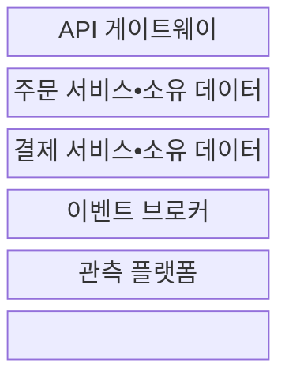
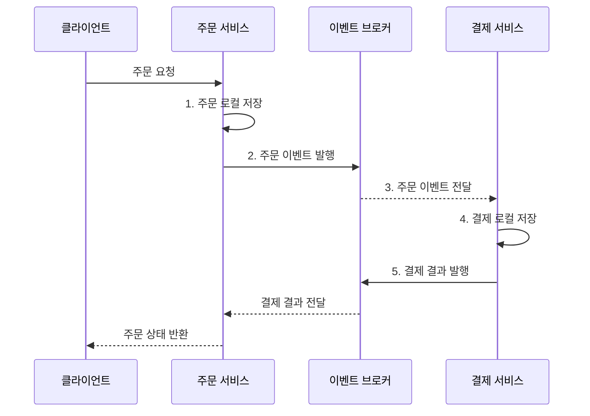

---
sidebar:
  order: 39
  label: "039. 마이크로서비스 아키텍처 MSA (Microservice Architecture)"
  badge:
    text: "기출 • 70%"
    variant: note
title: "마이크로서비스 아키텍처 MSA (Microservice Architecture)"
date: "2026-08-03T08:48:47+09:00"
tags:
  - "notes-software"
weight: 39
extra:
  question_no: "039"
  source_status: "기출"
  source_history: "120회, 123회, 135회"
  priority: 70
  priority_note: "120•123•135회 반복, MSA 설계 핵심"
---

## Ⅰ. 개요

핵심 용어

- **마이크로서비스 아키텍처(Microservice Architecture, MSA)**: 업무별 서비스가 데이터와 배포 경계를 독립적으로 소유하는 분산 아키텍처다.
- **장애 격리(Fault Isolation)**: 실패한 서비스의 영향이 다른 서비스로 연쇄 전파되지 않도록 제한하는 성질이다.

- 정의/개념: 업무별 서비스가 데이터•배포를 소유하는 **분산 아키텍처**
- 배경/필요성: 단일 배포 구조로는 **업무별 변경•확장•장애 격리** 곤란

#### 한줄 요약

- 주문•조리•배달 팀이 각자 장부를 맡고 주문서로 협업한다.

## Ⅱ. 특징

핵심 용어

- **서비스 경계(Service Boundary)**: 하나의 업무•데이터와 담당 팀의 책임을 함께 묶는 서비스 단위다.
- **버전된 계약(Versioned Contract)**: API•이벤트에 버전을 부여해 생산자와 소비자의 변경 시점이 달라도 호환되게 하는 규칙이다.
- **부분 장애(Partial Failure)**: 분산 시스템의 일부 서비스나 네트워크만 실패하고 나머지는 계속 동작하는 상태다.
- **타임아웃•격리•복구(Timeout•Isolation•Recovery)**: 원격 대기시간을 제한하고 실패 자원 범위를 분리한 뒤 재시도•대체•재시작으로 기능을 회복하는 설계다.

- **업무•데이터•배포 책임** 을 서비스 경계로 정렬
- **버전된 API•이벤트 계약** 으로 내부 구현 은닉
- **부분 장애 전제** 로 타임아웃•격리•복구 설계

#### 한줄 요약

- 팀을 나눠도 같은 장부를 함께 고치면 독립할 수 없다.

## Ⅲ. 구조 및 구성요소

핵심 용어

- **응용 프로그래밍 인터페이스 게이트웨이(Application Programming Interface Gateway, API Gateway)**: 외부 요청을 내부 서비스로 라우팅하고 공통 정책을 적용하는 진입점이다.
- **데이터 소유권(Data Ownership)**: 특정 데이터를 변경할 권한과 책임을 하나의 서비스에만 부여하는 원칙이다.
- **이벤트 브로커(Event Broker)**: 생산자가 발행한 비동기 이벤트를 구독 서비스로 라우팅하는 중개자다.
- **관측 플랫폼(Observability Platform)**: 로그•메트릭•분산 추적을 연결해 서비스 상태와 요청 경로를 분석하는 도구다.

| 구성요소 | 책임 |
|:---|:---|
| API 게이트웨이 | 외부 요청 **라우팅•공통 정책** 적용 |
| 주문 서비스•소유 데이터 | 주문 **업무•데이터•배포 경계** 소유 |
| 결제 서비스•소유 데이터 | 결제 **업무•데이터•배포 경계** 소유 |
| 이벤트 브로커 | 서비스 간 **비동기 이벤트** 라우팅 |
| 관측 플랫폼 | **로그•메트릭•분산 추적** 연결 |

#### 한줄 요약

- 공동 입구, 독립 점포와 장부, 알림 중개소, 관제소로 구성된다.

## Ⅳ. 흐름도

핵심 용어

- **로컬 트랜잭션(Local Transaction)**: 한 서비스가 소유한 데이터 변경을 모두 반영하거나 모두 취소하는 처리 단위다.
- **클라이언트(Client)**: 외부 API 계약으로 서비스에 요청하고 응답을 받는 사용자 응용이다.
- **비동기 이벤트**: 발행자가 소비자의 처리 완료를 기다리지 않고 브로커로 전달하는 상태 변화 메시지다.

**동작 원리**

- **1. 주문 로컬 저장**: 주문 서비스의 소유 데이터에 반영
- **2. 주문 이벤트 발행**: 버전된 계약으로 브로커 전송
- **3. 주문 이벤트 전달**: 구독 결제 서비스로 라우팅
- **4. 결제 로컬 저장**: 결제 서비스의 소유 데이터에 반영
- **5. 결제 결과 발행**: 비동기 결과를 브로커로 전송

#### 한줄 요약

- 주문 장부를 적고 알리면 결제 팀이 처리 결과를 돌려준다.

## Ⅴ. 종류 및 비교

핵심 용어

- **모듈러 모놀리스(Modular Monolith)**: 하나의 애플리케이션으로 배포하면서 내부 업무를 모듈 경계로 분리한 구조다.
- **원격 통신(Remote Communication)**: 다른 프로세스나 장비의 서비스에 네트워크로 요청•이벤트를 전달하는 통신이다.
- **운영 자동화(Operations Automation)**: 서비스별 빌드•배포•확장•관측•복구를 자동화해 독립 배포 비용을 줄이는 역량이다.
- **분산 일관성(Distributed Consistency)**: 여러 서비스가 각자 소유한 데이터의 변경을 메시지와 보상 절차로 정해진 관계에 수렴시키는 성질이다.
- **확장 결합(Scaling Coupling)**: 일부 기능만 부하가 늘어도 전체 애플리케이션을 함께 확장해야 하는 제약이다.

| 서비스 구조 | 마이크로서비스 | 모듈러 모놀리스 |
|:---|:---|:---|
| 적용 기준 | 독립 변화•**운영 자동화 역량** | 유사한 변경 주기•**단순 운영** |
| 핵심 특징 | 독립 배포•**소유 데이터•원격 통신** | 단일 배포•**모듈 경계•내부 호출** |
| 한계 | 분산 일관성•**부분 장애** | 전체 배포•**확장 결합** |

> 요약: 독립 배포 이익과 분산 운영 비용으로 구조 선택

#### 한줄 요약

- 한 번에 배포하면 모듈, 따로 배포해야 하면 서비스를 쓴다.

## Ⅵ. 실무 고려사항 및 대책

핵심 용어

- **분산 모놀리스(Distributed Monolith)**: 서비스를 나눴지만 강하게 결합돼 함께 변경•배포해야 하는 구조다.
- **트랜잭셔널 아웃박스(Transactional Outbox)**: 업무 데이터와 이벤트를 한 로컬 트랜잭션에 저장한 뒤 브로커로 전달하는 방식이다.
- **멱등성(Idempotency)**: 같은 이벤트나 요청을 여러 번 처리해도 최종 결과가 한 번 처리한 것과 같은 성질이다.
- **회로 차단기(Circuit Breaker)**: 원격 호출 실패가 기준을 넘으면 호출을 잠시 중단해 장애 전파를 막는 제어다.
- **서비스 수준 목표(Service Level Objective, SLO)**: 응답 시간•가용성 등 서비스 품질에 대해 달성하기로 정한 측정 목표다.
- **타임아웃(Timeout)**: 원격 응답을 기다릴 최대 시간을 정하고 초과하면 실패로 전환하는 제어다.
- **로그•메트릭•분산 추적**: 사건 기록, 수치 시계열, 서비스 간 요청 경로를 연결해 분산 시스템의 상태와 실패 원인을 관측하는 신호다.

| 문제 | 대책 | 효과 |
|:---|:---|:---|
| 기술 계층만 따라 서비스를 세분화 | **업무 규칙•데이터•팀 책임** 으로 경계 검증 | **분산 모놀리스** 방지 |
| 여러 서비스가 같은 저장소를 직접 갱신 | **데이터 소유권** 단일화와 API•이벤트 협업 | **독립 변경•배포** 확보 |
| 저장 성공 후 이벤트 발행 실패•중복 | **트랜잭셔널 아웃박스•멱등성** 적용 | 데이터•이벤트 **정합성** 향상 |
| 동기 호출 연쇄로 지연•장애 전파 | **타임아웃•회로 차단기** 와 비동기 전환 | **부분 장애** 영향 제한 |
| 서비스 수 증가와 운영 자동화 부족 | **SLO•로그•메트릭•분산 추적** 제공 | **운영 복잡도** 통제 |

#### 한줄 요약

- 상품•주문•결제는 각자 장부와 배포 일정을 가진다.

## Ⅶ. 결론

핵심 용어

- **독립 배포 이익**: 한 업무의 변경•확장•복구를 다른 서비스 배포와 분리해 얻는 효과다.
- **분산 비용**: 원격 통신•부분 장애•데이터 일관성•관측 자동화에 추가로 드는 비용이다.

- 독립 배포 이익이 분산 비용보다 크면 **MSA**, 아니면 **모듈러 모놀리스** 선택

#### 한줄 요약

- 따로 배포할 이익이 통신•운영 비용보다 큰 업무만 서비스로 나눈다.
