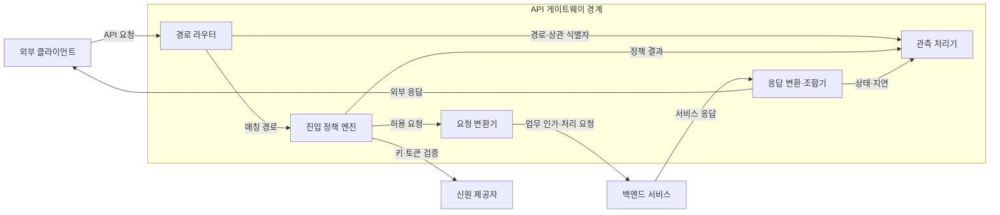
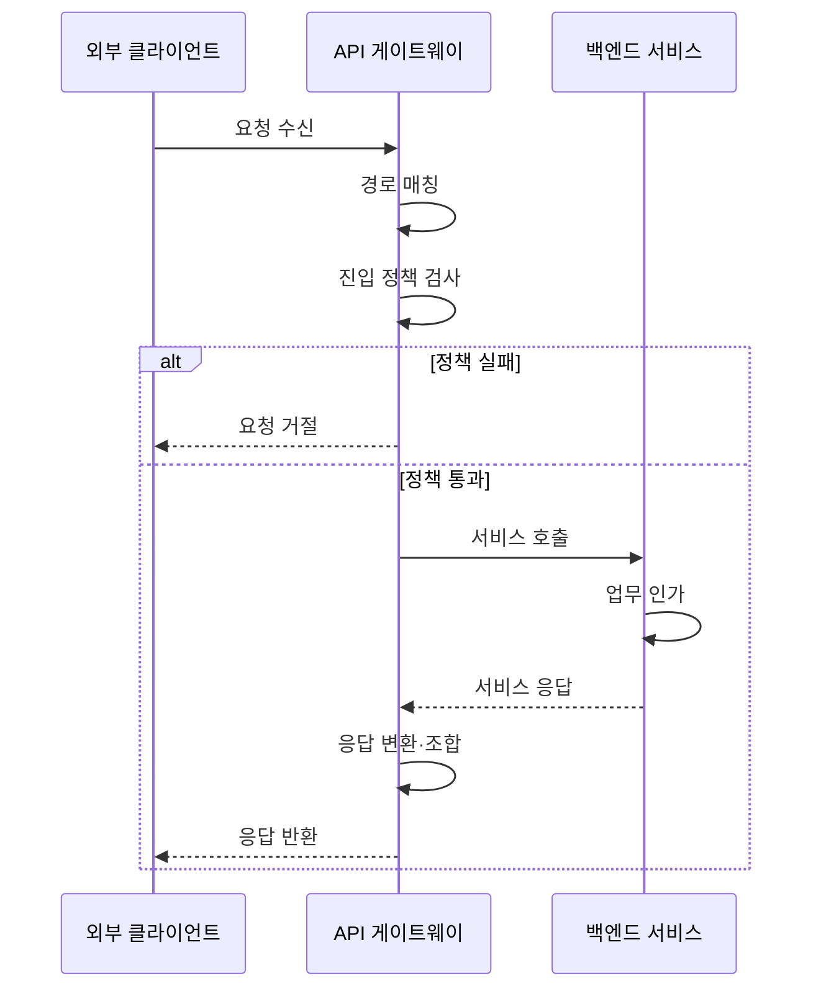

---
sidebar:
  order: 40
  label: "040. API 게이트웨이 (API Gateway)"
  badge:
    text: "기출 · 50%"
    variant: note
title: "API 게이트웨이 (API Gateway)"
date: "2026-07-27T23:59:59+09:00"
tags:
  - "notes-software"
weight: 40
extra:
  question_no: "040"
  source_status: "기출"
  source_history: "120회"
  priority: 50
  priority_note: "120회 기출, API 진입점·정책 집중 구조"
---

## 미리 알고가기

- **응용 프로그래밍 인터페이스(Application Programming Interface, API)**: ‘에이피아이’로 읽고 Application Programming Interface의 머리글자를 딴 표기이며 기능 호출 규칙과 데이터 계약
- **API 게이트웨이(API Gateway)**: ‘에이피아이 게이트웨이’로 읽고 API에 진입점을 뜻하는 Gateway를 붙인 표기이며 외부 요청을 내부 서비스로 전달하고 공통 정책 적용
- **역방향 프록시(Reverse Proxy)**: 서버를 대신해 요청을 받아 내부로 중계하는 프록시
- **7계층 라우팅(Layer 7 Routing, L7 Routing)**: ‘레이어 세븐·엘 세븐 라우팅’으로 읽고 네트워크 계층 번호 7을 L 뒤에 붙이는 관례 표기이며 응용 계층의 호스트·경로·메서드로 목적 서비스를 선택함
- **인증(Authentication)**: 요청 주체의 신원을 확인하는 절차
- **인가(Authorization)**: 인증된 주체가 특정 자원에 요청한 동작을 수행할 권한이 있는지 판정하는 절차
- **요청률 제한(Rate Limiting)**: 시간 단위별 허용 요청 수를 제한하는 정책
- **응답 조합(Response Aggregation)**: 여러 내부 서비스의 처리 결과를 클라이언트용 하나의 응답으로 결합하는 기능
- **프런트엔드 전용 백엔드(Backend for Frontend, BFF)**: ‘비에프에프’로 읽고 Backend for Frontend의 핵심 머리글자를 딴 표기이며 클라이언트 유형별 전용 백엔드 진입 계층
- **호스트·경로·메서드(Host·Path·Method)**: 호스트는 요청 대상 도메인, 경로는 API 자원 위치, 메서드는 조회·생성 같은 동작 유형으로서 라우팅 규칙의 입력
- **헤더·상태·본문(Header·Status·Body)**: 헤더는 요청·응답 부가정보, 상태는 처리 결과 코드, 본문은 실제 데이터로서 게이트웨이가 외부·내부 계약 사이에서 변환함
- **신원 제공자(Identity Provider, IdP)**: ‘아이디피’로 읽고 Identity의 Id와 Provider의 P를 결합한 표기이며 신원을 인증하고 검증 가능한 토큰을 발급
- **키·토큰(Key·Token)**: 키는 제휴 클라이언트를 식별하는 비밀값이고 토큰은 인증된 주체와 권한 정보를 담아 요청마다 검증하는 자격 증명
- **접근 출처·전송 보안(Request Origin·Transport Security)**: 접근 출처는 요청이 온 사이트·네트워크이고 전송 보안은 암호화 채널로 요청의 도청·변조를 방지하는 정책
- **상관 식별자(Correlation Identifier)**: 하나의 외부 요청이 여러 서비스 호출로 이어질 때 로그·메트릭·추적을 같은 요청으로 연결하는 고유 값
- **프로토콜 변환(Protocol Translation)**: 외부와 내부 서비스가 사용하는 통신 규약·메시지 형식의 차이를 게이트웨이가 바꾸는 기능
- **추가 홉(Additional Hop)**: 요청이 목적 서비스로 가기 전에 게이트웨이 중계를 한 번 더 거치는 경로로서 지연과 공통 장애 지점을 추가함
- **병목·공통 장애 지점(Bottleneck·Common Failure Point)**: 병목은 처리 용량이 전체 요청량을 제한하는 지점이고 공통 장애 지점은 하나의 실패가 모든 외부 요청에 영향을 주는 구성요소

## Ⅰ. 개요

- 정의/개념: 외부 API의 **공통 진입·정책 집행·서비스 중계** 계층
- 기존 한계: 서비스 직접 노출은 **정책 중복·내부 주소 결합** 유발

### 쉽게 이해하기 (학습용)

- 안내 데스크가 신원과 방문량을 확인하고 알맞은 내부 창구로 연결한다

## Ⅱ. 특징

- **외부 계약·내부 라우팅 분리**로 서비스 주소 은닉
- **인증·요청률 제한·관측** 정책의 공통 집행
- **프로토콜 변환·응답 조합**으로 클라이언트 호출 단순화
- 자원별 업무 인가는 백엔드 서비스에 유지한다.

### 쉽게 이해하기 (학습용)

- 입구 규칙과 안내는 게이트웨이가 맡고 실제 업무 권한은 각 창구가 판단한다

## Ⅲ. 아키텍처 및 구성요소

| 설계 요소 | 설명 |
|:---|:---|
| 경로 라우터 | 호스트·경로·메서드로 목적 서비스 결정 |
| 진입 정책 엔진 | 인증·요청률·접근 출처 등 공통 정책 적용 |
| 요청 변환기 | 헤더·프로토콜·버전 형식을 내부 계약에 맞춤 |
| 응답 변환·조합기 | 단일·복수 서비스 결과를 외부 계약으로 변환 |
| 관측 처리기 | 상관 식별자·로그·지표·추적으로 요청 관측 |

> 요약: 외부 계약·진입 정책과 백엔드 업무 책임을 분리

### 쉽게 이해하기 (학습용)

- 입구는 경로와 공통 규칙을 적용하고 각 창구의 답을 외부 형식으로 돌려준다

## Ⅳ. 원리 및 절차 흐름도

| 절차 | 설명 |
|:---|:---|
| 요청 수신 | 외부 요청을 수신하고 상관 식별자를 부여·전파 |
| 경로 매칭 | 호스트·경로·메서드로 라우팅 규칙 선택 |
| 진입 정책 검사 | 인증·요청률·출처·전송 보안 정책 확인 |
| 요청 거절 | 정책 실패 시 백엔드 호출 없이 오류 반환 |
| 서비스 호출 | 허용 요청을 목적 백엔드로 변환·중계 |
| 업무 인가 | 서비스가 자원·행위별 권한을 최종 판정 |
| 서비스 응답 | 백엔드 처리 결과를 게이트웨이에 반환 |
| 응답 변환·조합 | 필요 시 여러 결과를 외부 계약으로 변환 |
| 응답 반환 | 상태·헤더·본문을 클라이언트에 반환 |

> 요약: 진입 정책을 통과한 요청만 서비스 처리 후 반환

### 쉽게 이해하기 (학습용)

- 입구 검사를 통과하면 창구가 업무 권한을 판단하고 결과를 되돌려 준다

## Ⅴ. 종류 및 비교

| 외부 API 연결 | API 게이트웨이 | 직접 호출 |
|:---|:---|:---|
| 적용 기준 | 다수 서비스·**반복 정책·응답 조합** | 소수 서비스·**단순 클라이언트** |
| 핵심 특징 | 단일 외부 계약·**공통 정책 집행** | 서비스별 계약·**주소 직접 호출** |
| 한계 | 추가 홉·병목·**공통 장애점** | 정책 중복·**클라이언트 결합** |

> 요약: 정책 중복 감소 효과와 추가 홉·장애 집중을 비교

### 쉽게 이해하기 (학습용)

- 창구가 적으면 직접 찾고 창구·규칙이 많으면 공통 안내 데스크를 둔다

## Ⅵ. 실무 사례

1. 제휴 API는 **키 인증·요청률 제한**을 게이트웨이에 적용

### 쉽게 이해하기 (학습용)

- 제휴 요청은 입구 제한을 거치고 자원별 권한은 서비스가 다시 확인한다

## Ⅶ. 결론

- **반복 정책·응답 조합 이익**이 추가 홉 비용보다 크면 도입

### 쉽게 이해하기 (학습용)

- 공통 입구의 이득이 지연과 장애 집중보다 클 때 게이트웨이를 둔다
