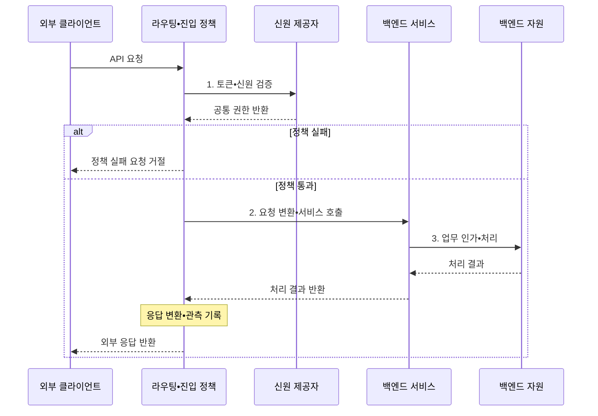

---
sidebar:
  order: 40
  label: "040. API 게이트웨이 (API Gateway)"
  badge:
    text: "기출 • 50%"
    variant: note
title: "API 게이트웨이 (API Gateway)"
date: "2026-08-05T00:00:00+09:00"
tags:
  - "notes-software"
weight: 40
extra:
  question_no: "040"
  source_status: "기출"
  source_history: "120회"
  priority: 50
  priority_note: "120회 기출, API 진입점•정책 집중 구조"
---

## Ⅰ. 개요

<details>
<summary>핵심 용어</summary>

- **응용 프로그래밍 인터페이스(Application Programming Interface, API)**: 소프트웨어 기능을 호출하기 위한 요청•응답 규칙과 데이터 계약이다.
- **API 게이트웨이(API Gateway)**: 외부 요청을 내부 서비스로 전달하고 공통 정책을 적용하는 진입점이다.
- **역방향 프록시(Reverse Proxy)**: 서버를 대신해 외부 요청을 받아 내부 서비스로 중계하는 프록시다.

</details>

- 정의/개념: 외부 API를 중계하고 정책을 집행하는 **역방향 프록시 계층**
- 배경/필요성: 서비스 직접 노출로 **정책 중복•내부 주소 결합** 증가

#### 한줄 요약

- 안내 데스크가 신원과 방문량을 확인하고 알맞은 내부 창구로 연결한다.

## Ⅱ. 특징

<details>
<summary>핵심 용어</summary>

- **인증(Authentication)**: 요청 주체의 신원을 확인하는 절차다.
- **요청률 제한(Rate Limiting)**: 시간 단위별 허용 요청 수를 제한하는 정책이다.
- **응답 조합(Response Aggregation)**: 여러 내부 서비스 결과를 클라이언트용 하나의 응답으로 결합하는 기능이다.
- **업무 인가(Authorization)**: 인증된 주체가 특정 자원에 요청한 동작을 수행할 권한이 있는지 서비스가 판정하는 절차다.
- **외부 계약(External Contract)**: 클라이언트에 공개한 API 규칙이다.
- **내부 라우팅(Internal Routing)**: 외부 요청을 실제 서비스 주소로 전달하는 결정이다.
- **관측(Observability Collection)**: 요청의 로그•지표•추적 정보를 공통 진입점에서 수집해 상태와 실패 원인을 분석하게 하는 처리다.

</details>

- **외부 계약•내부 라우팅 분리** 로 서비스 주소 은닉
- **인증•요청률 제한•관측** 정책의 공통 집행
- **변환•응답 조합** 으로 호출 단순화, 업무 인가는 서비스 유지

#### 한줄 요약

- 입구 규칙과 안내는 게이트웨이가 맡고 실제 업무 권한은 각 창구가 판단한다.

## Ⅲ. 구조 및 구성요소

<details>
<summary>핵심 용어</summary>

- **7계층 라우팅(Layer 7 Routing, L7 Routing)**: 호스트•경로•HTTP 메서드로 목적 서비스를 선택하는 방식이다.
- **프로토콜 변환(Protocol Translation)**: 외부와 내부 서비스의 통신 규약•메시지 형식 차이를 바꾸는 기능이다.
- **상관 식별자(Correlation Identifier)**: 하나의 외부 요청에서 이어진 로그•지표•추적을 연결하는 고유 값이다.
- **출처 정책(Origin Policy)**: 요청이 허용된 도메인•네트워크•클라이언트에서 왔는지 검사하는 진입 규칙이다.
- **내부 계약(Internal Contract)**: 게이트웨이와 서비스 사이의 요청 규칙이다.

</details>

```text
[경로 라우터] ----- [진입 정책 엔진] ----- [요청 변환기] ----- [응답 변환•조합기] ----- [관측 처리기]
```

선의 의미: 선은 라우팅, 진입 정책, 내부 요청 변환, 외부 응답 조합과 공통 관측 기능이 결합되는 인접 구성요소의 정적 게이트웨이 경계를 뜻한다.

| 구성요소 | 책임 |
|:---|:---|
| 경로 라우터 | 호스트•경로•메서드로 **L7 라우팅** |
| 진입 정책 엔진 | **인증•요청률•출처 정책** 적용 |
| 요청 변환기 | 외부 요청을 **내부 계약** 으로 변환 |
| 응답 변환•조합기 | 서비스 결과를 **외부 계약** 으로 변환 |
| 관측 처리기 | **로그•지표•추적** 연결 |

#### 한줄 요약

- 안내, 입구 검사, 요청 번역, 응답 조립, 기록 담당으로 구성된다.

## Ⅳ. 흐름도

<details>
<summary>핵심 용어</summary>

- **신원 제공자(Identity Provider, IdP)**: 사용자를 인증하고 검증 가능한 인증 토큰을 발급하는 시스템이다.
- **토큰(Token)**: 인증된 주체와 권한 정보를 담아 요청마다 검증하는 자격 증명이다.
- **토큰 서명(Token Signature)**: 토큰 변조 여부를 확인하는 검증값이다.
- **유효기간(Expiration)**: 토큰을 사용할 수 있는 시간 범위다.
- **발급자(Issuer)**: 토큰을 만든 신원 제공자를 나타내는 식별값이다.

</details>



**동작 원리**

- **1. 토큰•신원 검증**: 서명•유효기간•발급자 검사
- **2. 요청 변환•서비스 호출**: 목적지 계약에 맞춰 라우팅
- **3. 업무 인가•처리**: 서비스가 자원별 권한 판정

#### 한줄 요약

- 입구 검사를 통과하면 창구가 업무 권한을 판단하고 결과를 되돌려 준다.

## Ⅴ. 종류 및 비교

<details>
<summary>핵심 용어</summary>

- **추가 홉(Additional Hop)**: 목적 서비스 앞에서 게이트웨이 중계를 한 번 더 거치는 요청 경로다.
- **병목(Bottleneck)**: 전체 요청의 처리 용량을 제한하는 지점이다.
- **공통 장애 지점(Common Failure Point)**: 하나의 실패로 모든 외부 요청에 영향을 주는 지점이다.
- **클라이언트 결합**: 클라이언트가 각 서비스 주소•계약•정책 변화에 직접 의존하는 상태다.

</details>

| 외부 API 연결 | API 게이트웨이 | 직접 호출 |
|:---|:---|:---|
| 적용 기준 | 다수 서비스•**반복 정책•응답 조합** | 소수 서비스•**단순 클라이언트** |
| 핵심 특징 | 단일 외부 계약•**공통 정책 집행** | 서비스별 계약•**주소 직접 호출** |
| 한계 | 추가 홉•병목•**공통 장애점** | 정책 중복•**클라이언트 결합** |

> 요약: 정책 중복 감소 효과와 추가 홉•장애 집중을 비교

#### 한줄 요약

- 창구가 적으면 직접 찾고 창구•규칙이 많으면 공통 안내 데스크를 둔다.

## Ⅵ. 실무 고려사항 및 대책

<details>
<summary>핵심 용어</summary>

- **상태 점검(Health Check)**: 게이트웨이 인스턴스가 요청을 정상 처리할 수 있는지 주기적으로 확인하는 검사다.
- **회로 차단기(Circuit Breaker)**: 백엔드 실패가 기준을 넘으면 호출을 잠시 중단해 장애 전파를 막는 제어다.
- **격벽(Bulkhead)**: 백엔드•요청별 연결•스레드•큐를 분리해 한쪽 포화가 전체로 번지지 않게 하는 방식이다.
- **상호 전송 계층 보안(Mutual Transport Layer Security, mTLS)**: 통신 양쪽이 인증서를 검증해 서비스 신원과 암호화 채널을 함께 확인하는 방식이다.
- **자동 확장(Auto Scaling)**: 요청량과 자원 사용량에 따라 게이트웨이 인스턴스 수를 자동으로 늘리거나 줄이는 기능이다.
- **선언형 정책(Declarative Policy)**: 진입 규칙을 코드와 분리된 명세로 정의하는 방식이다.
- **중앙 버전 관리(Central Version Control)**: 승인된 정책 버전을 한곳에서 배포하고 추적하는 방식이다.
- **타임아웃(Timeout)**: 백엔드 응답을 기다릴 최대 시간을 정하고 초과하면 실패로 전환하는 제어다.
- **신뢰 헤더(Trusted Header)**: 게이트웨이가 검증된 신원 정보로 새로 만들고 백엔드가 지정된 경로에서만 신뢰하는 요청 헤더다.

</details>

| 문제 | 대책 | 효과 |
|:---|:---|:---|
| 게이트웨이 장애•용량 부족으로 API 중단 | 다중 인스턴스•**상태 점검•자동 확장** 적용 | **공통 장애점•병목** 완화 |
| 정책 코드 중복으로 규칙•버전 불일치 | **선언형 정책•중앙 버전 관리** 적용 | 일관된 **진입 통제** |
| 게이트웨이에 업무 규칙이 누적 | 공통 정책만 두고 **업무 인가** 는 서비스 수행 | **업무 책임** 분리 |
| 백엔드 지연으로 응답 조합 전체 지연 | **타임아웃•회로 차단기•격벽** 적용 | **연쇄 지연** 제한 |
| 전달 헤더 신뢰로 신원 위조 가능 | 서명 토큰•**mTLS•신뢰 헤더** 재생성 | 종단 간 **신원 신뢰** 확보 |

#### 한줄 요약

- 제휴 요청은 입구 제한을 거치고 자원별 권한은 서비스가 다시 확인한다.

## Ⅶ. 결론

<details>
<summary>핵심 용어</summary>

- **반복 정책 이익**: 여러 서비스의 인증•제한•관측 규칙을 한 진입점에서 공통 집행해 줄이는 중복 비용이다.
- **직접 호출**: 클라이언트가 게이트웨이 중계 없이 서비스 주소와 계약으로 바로 요청하는 방식이다.

</details>

- 반복 정책 이익이 추가 홉 비용보다 크면 **API 게이트웨이**, 아니면 **직접 호출** 선택

#### 한줄 요약

- 공통 입구의 이득이 지연과 장애 집중보다 클 때 게이트웨이를 둔다.
