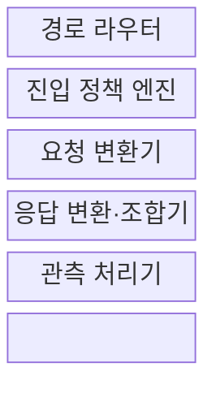
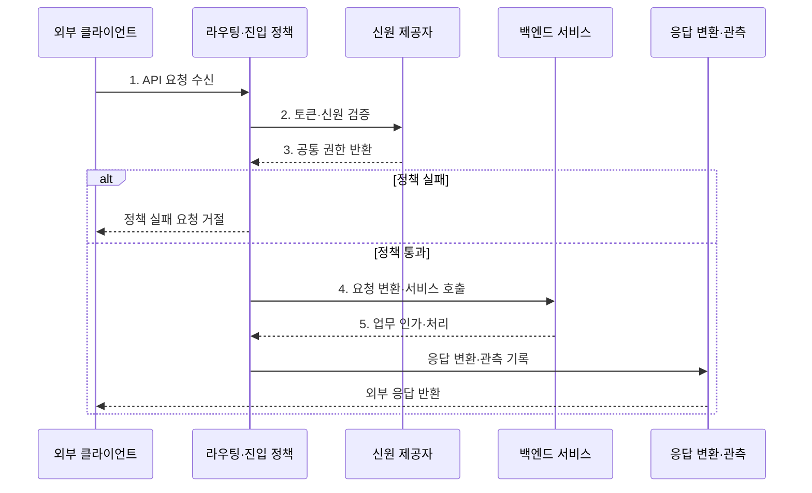

---
sidebar:
  order: 40
  label: "040. API 게이트웨이 (API Gateway)"
  badge:
    text: "기출 · 50%"
    variant: note
title: "API 게이트웨이 (API Gateway)"
date: "2026-07-30T18:00:00+09:00"
tags:
  - "notes-software"
weight: 40
extra:
  question_no: "040"
  source_status: "기출"
  source_history: "120회"
  priority: 50
  priority_note: "120회 기출, API 진입점·정책 집중 구조"
---

## 미리 알고가기

- **응용 프로그래밍 인터페이스(Application Programming Interface, API)**: 소프트웨어 기능을 호출하기 위한 요청·응답 규칙과 데이터 계약
- **API 게이트웨이(API Gateway)**: 외부 요청을 내부 서비스로 전달하고 인증·제한 등 공통 정책을 적용하는 진입점
- **역방향 프록시(Reverse Proxy)**: 서버를 대신해 요청을 받아 내부로 중계하는 프록시
- **7계층 라우팅(Layer 7 Routing, L7 Routing)**: 호스트·경로·HTTP 메서드 등 응용 계층 정보를 기준으로 목적 서비스를 선택하는 방식
- **인증(Authentication)**: 요청 주체의 신원을 확인하는 절차
- **인가(Authorization)**: 인증된 주체가 특정 자원에 요청한 동작을 수행할 권한이 있는지 판정하는 절차
- **요청률 제한(Rate Limiting)**: 시간 단위별 허용 요청 수를 제한하는 정책
- **응답 조합(Response Aggregation)**: 여러 내부 서비스의 처리 결과를 클라이언트용 하나의 응답으로 결합하는 기능
- **프런트엔드 전용 백엔드(Backend for Frontend, BFF)**: 웹·모바일 등 클라이언트 유형별 요구에 맞춘 전용 백엔드 계층
- **호스트·경로·메서드(Host·Path·Method)**: 호스트는 요청 대상 도메인, 경로는 API 자원 위치, 메서드는 조회·생성 같은 동작 유형으로서 라우팅 규칙의 입력
- **헤더·상태·본문(Header·Status·Body)**: 헤더는 요청·응답 부가정보, 상태는 처리 결과 코드, 본문은 실제 데이터로서 게이트웨이가 외부·내부 계약 사이에서 변환한다.
- **신원 제공자(Identity Provider, IdP)**: 사용자의 신원을 인증하고 검증 가능한 인증 토큰을 발급하는 시스템
- **키·토큰(Key·Token)**: 키는 제휴 클라이언트를 식별하는 비밀값이고 토큰은 인증된 주체와 권한 정보를 담아 요청마다 검증하는 자격 증명
- **접근 출처·전송 보안(Request Origin·Transport Security)**: 접근 출처는 요청이 온 사이트·네트워크이고 전송 보안은 암호화 채널로 요청의 도청·변조를 방지하는 정책
- **상관 식별자(Correlation Identifier)**: 하나의 외부 요청이 여러 서비스 호출로 이어질 때 로그·메트릭·추적을 같은 요청으로 연결하는 고유 값
- **프로토콜 변환(Protocol Translation)**: 외부와 내부 서비스가 사용하는 통신 규약·메시지 형식의 차이를 게이트웨이가 바꾸는 기능
- **추가 홉(Additional Hop)**: 요청이 목적 서비스로 가기 전에 게이트웨이 중계를 한 번 더 거치는 경로로서 지연과 공통 장애 지점을 추가한다.
- **병목·공통 장애 지점(Bottleneck·Common Failure Point)**: 병목은 처리 용량이 전체 요청량을 제한하는 지점이고 공통 장애 지점은 하나의 실패가 모든 외부 요청에 영향을 주는 구성요소
- **상태 점검(Health Check)**: 인스턴스가 요청을 정상 처리할 수 있는지 주기적으로 확인하는 검사
- **회로 차단기(Circuit Breaker)**: 백엔드 호출 실패가 기준을 넘으면 호출을 잠시 중단해 장애 전파를 막는 제어
- **격벽(Bulkhead)**: 백엔드·요청 종류별 연결·스레드·큐를 분리해 한쪽 포화가 전체로 번지지 않게 하는 방식
- **상호 전송 계층 보안(Mutual Transport Layer Security, mTLS)**: 통신 양쪽이 인증서를 검증해 서비스 신원과 암호화 채널을 함께 확인하는 방식

## Ⅰ. 개요

- 정의/개념: 외부 API의 **진입·정책·중계 계층**
- 배경/필요성: 서비스 직접 노출의 **정책 중복·주소 결합** 축소

### 쉽게 이해하기 (학습용)

- 안내 데스크가 신원과 방문량을 확인하고 알맞은 내부 창구로 연결한다.

## Ⅱ. 특징

- **외부 계약·내부 라우팅 분리**로 서비스 주소 은닉
- **인증·요청률 제한·관측** 정책의 공통 집행
- **변환·응답 조합**으로 호출 단순화, 업무 인가는 서비스 유지

### 쉽게 이해하기 (학습용)

- 입구 규칙과 안내는 게이트웨이가 맡고 실제 업무 권한은 각 창구가 판단한다.

## Ⅲ. 구조 및 구성요소

| 구성요소 | 책임 |
|:---|:---|
| 경로 라우터 | 호스트·경로·메서드로 목적지 결정 |
| 진입 정책 엔진 | 인증·요청률·출처 정책 적용 |
| 요청 변환기 | 외부 요청을 내부 계약으로 변환 |
| 응답 변환·조합기 | 서비스 결과를 외부 계약으로 변환 |
| 관측 처리기 | 로그·지표·추적 연결 |

### 쉽게 이해하기 (학습용)

- 안내, 입구 검사, 요청 번역, 응답 조립, 기록 담당으로 구성된다.

## Ⅳ. 흐름도

**동작 원리**

- **1. API 요청 수신**: 키·토큰·상관 식별자 확인
- **2. 토큰·신원 검증**: 서명·유효기간·발급자 검사
- **3. 공통 권한 반환**: 검증 신원·권한 정보 전달
- **4. 요청 변환·서비스 호출**: 목적지 계약에 맞춰 라우팅
- **5. 업무 인가·처리**: 서비스가 자원별 권한 판정

### 쉽게 이해하기 (학습용)

- 입구 검사를 통과하면 창구가 업무 권한을 판단하고 결과를 되돌려 준다.

## Ⅴ. 종류 및 비교

| 외부 API 연결 | API 게이트웨이 | 직접 호출 |
|:---|:---|:---|
| 적용 기준 | 다수 서비스·**반복 정책·응답 조합** | 소수 서비스·**단순 클라이언트** |
| 핵심 특징 | 단일 외부 계약·**공통 정책 집행** | 서비스별 계약·**주소 직접 호출** |
| 한계 | 추가 홉·병목·**공통 장애점** | 정책 중복·**클라이언트 결합** |

> 요약: 정책 중복 감소 효과와 추가 홉·장애 집중을 비교

### 쉽게 이해하기 (학습용)

- 창구가 적으면 직접 찾고 창구·규칙이 많으면 공통 안내 데스크를 둔다.

## Ⅵ. 실무 고려사항 및 대책

| 고려사항 | 대책 | 효과 |
|:---|:---|:---|
| 단일 게이트웨이 장애·용량 부족으로 전체 API 중단 | 다중 인스턴스·상태 점검·자동 확장·영역 분리 | 공통 장애점·병목 완화 |
| 정책이 코드마다 중복돼 규칙·버전 불일치 | 선언형 정책·중앙 버전 관리·정책 자동 시험 | 일관된 진입 통제 |
| 게이트웨이에 업무 규칙이 쌓여 서비스 경계 침해 | 게이트웨이는 공통 정책·변환만, 자원별 인가는 서비스가 수행 | 업무 책임 분리 |
| 응답 조합의 한 백엔드 지연이 전체 요청 지연 | 백엔드별 타임아웃·회로 차단기·격벽·부분 응답 기준 | 연쇄 지연 제한 |
| 내부 서비스가 전달 헤더만 믿어 신원 위조 가능 | 서명 토큰 검증·mTLS·신뢰 헤더 재생성 | 종단 간 신원 신뢰 확보 |

### 적용 사례

- 제휴 API는 게이트웨이에서 키 인증과 요청률 제한을 적용하고 자원별 최종 인가는 백엔드 서비스가 수행

### 쉽게 이해하기 (학습용)

- 제휴 요청은 입구 제한을 거치고 자원별 권한은 서비스가 다시 확인한다

## Ⅶ. 결론

- **공통 정책 이익과 추가 홉 비용**을 기준으로 게이트웨이 배치

### 쉽게 이해하기 (학습용)

- 공통 입구의 이득이 지연과 장애 집중보다 클 때 게이트웨이를 둔다.
