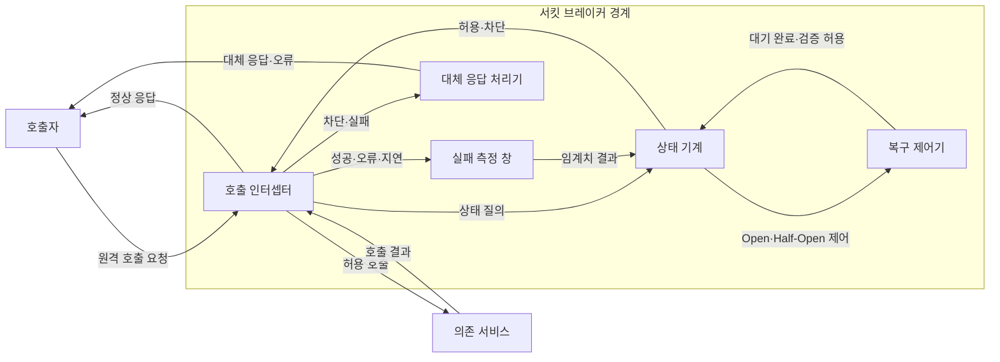
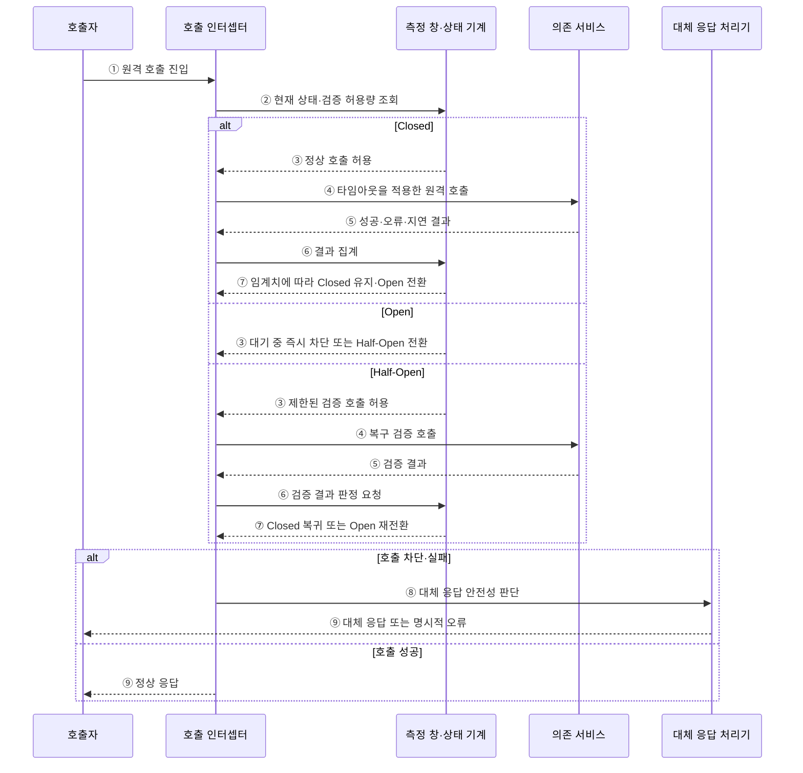

---
sidebar:
  order: 41
  label: "041. 서킷 브레이커 패턴 (Circuit Breaker Pattern)"
  badge:
    text: "미출제 · 50%"
    variant: note
title: "서킷 브레이커 패턴 (Circuit Breaker Pattern)"
date: "2026-07-25T00:35:00+09:00"
tags:
  - "notes-software"
weight: 41
extra:
  question_no: "041"
  source_status: "미출제"
  source_history: ""
  priority: 50
  priority_note: "서킷 브레이커는 연쇄 장애 차단 핵심"
---

## 미리 알고가기

- **서킷 브레이커(Circuit Breaker)**: 원격 호출의 연속 실패를 감지해 호출을 차단하고 시험 호출로 복구를 확인하는 장애 격리 패턴
- **닫힘·열림·반열림 상태(Closed·Open·Half-Open State)**: 각각 정상 호출 허용·호출 즉시 차단·제한된 검증 호출을 수행하는 회로 차단기 상태
- **실패 측정 창(Failure Window)**: 최근 호출의 오류·지연 비율을 계산하는 표본 구간
- **차단 임계치(Trip Threshold)**: Closed에서 Open으로 전환하는 실패 기준
- **열림 대기 시간(Open Duration)**: Open 상태를 유지한 뒤 검증을 시작하는 시간
- **타임아웃(Timeout)**: 개별 호출의 최대 대기 시간을 제한하는 정책
- **재시도(Retry)**: 일시 오류가 난 호출을 제한 횟수·간격으로 재수행
- **멱등성(Idempotency)**: 반복 실행해도 최종 상태가 한 번 실행과 같은 성질
- **대체 응답(Fallback)**: 원격 결과 대신 허용된 캐시·기본값·오류를 반환
- **호출 인터셉터(Call Interceptor)**: 호출자와 의존 서비스 사이에서 원격 요청을 가로채 현재 차단 상태에 따라 전달하거나 즉시 실패시키는 구성요소
- **상태 기계(State Machine)**: 호출 결과·대기 시간·검증 결과라는 사건에 따라 Closed·Open·Half-Open 상태를 전환하는 모델
- **실패율·지연율(Failure·Slow-call Rate)**: 측정 창의 전체 호출 중 오류·타임아웃 비율과 지연 기준을 넘긴 호출 비율로서 차단 임계치를 판정함
- **최소 표본(Minimum Sample Size)**: 실패율을 계산하기 전에 측정 창에 모여야 하는 최소 호출 수로서 적은 요청의 우연한 실패에 과민 차단되는 것을 줄임
- **백오프·지터(Backoff·Jitter)**: 백오프는 재시도 간격을 점차 늘리고 지터는 무작위 편차를 더해 여러 호출자의 동시 재시도를 분산함
- **재시도 폭풍(Retry Storm)**: 다수 호출자가 장애 서비스에 반복 재시도해 복구 자원과 네트워크를 다시 고갈시키는 현상
- **지연 예산(Latency Budget)**: 전체 요청이 허용하는 최대 응답시간으로서 타임아웃과 재시도의 횟수·간격 합이 넘지 않아야 하는 한도
- **멱등키(Idempotency Key)**: 같은 업무 요청의 재전송을 식별해 결제 같은 부작용을 한 번만 반영하도록 하는 고유 값
- **낡은 캐시(Stale Cache)**: 원본 서비스의 최신 변경이 아직 반영되지 않은 캐시 값으로서 대체 응답에 사용할 수 있는 업무 범위를 명시해야 함

## Ⅰ. 개요

- 정의/개념: 원격 실패를 차단하고 제한 호출로 복구 확인
- **배경/필요성**: 장애 호출이 자원을 고갈시켜 빠른 차단 필요

### 쉽게 이해하기 (학습용)

- 고장 신호가 쌓이면 통로를 닫고 시간이 지난 뒤 소수만 보내 복구를 확인한다.

## Ⅱ. 특징

- Open 차단이 의존 서비스의 복구 여력 보호한다.
- 타임아웃·재시도·차단기는 대기·일시 오류·지속 장애 분담한다.
- 과민 임계치는 정상 차단, 둔감 임계치는 장애 부하 지속한다.

### 쉽게 이해하기 (학습용)

- 호출 기록으로 문을 닫고 대기 뒤 시험 호출의 성공 여부로 다시 연다.

## Ⅲ. 아키텍처

**도표안 A — 구조도**

**도표안 B — sequenceDiagram**

| 설계 요소 | 설명 |
|:---|:---|
| 호출 인터셉터 | 상태에 따라 원격 호출 허용·즉시 실패 |
| 실패 측정 창 | 최소 표본·실패율·지연율을 구간별 집계 |
| 상태 기계 | Closed·Open·Half-Open 전환 관리 |
| 복구 제어기 | 열림 대기 시간·검증 호출 허용량 제어 |
| 대체 응답 처리기 | 허용된 캐시·기본값 또는 명시적 오류 반환 |

**동작 원리**

- ① 호출자가 원격 요청을 서킷 브레이커에 전달
- ② 현재 상태와 Half-Open 검증 호출의 남은 허용량 조회
- ③ Closed는 정상 호출, Open은 차단·대기 판정, Half-Open은 제한 검증 허용
- ④ 허용된 상태에서 타임아웃을 적용해 의존 서비스 호출
- ⑤ 의존 서비스의 성공·오류·타임아웃·지연 결과 수신
- ⑥ Closed는 측정 창에 결과를 집계하고 Half-Open은 복구 기준 판정
- ⑦ 실패 임계치·열림 대기·검증 결과에 따라 다음 상태 결정
- ⑧ 차단·실패 시 낡은 캐시·기본값·명시 오류의 업무 안전성 판단
- ⑨ 호출자에 정상·대체 응답 또는 명시적 오류 반환

### 쉽게 이해하기 (학습용)

- 고장이 쌓이면 문을 닫고 기다린 뒤 시험 호출 결과로 다시 열지 정한다.

## Ⅳ. 종류 및 비교

| 판단 기준 | 서킷 브레이커 | 재시도 |
|:---|:---|:---|
| 핵심 특징 | 임계치 후 차단·제한 검증 | 백오프·지터로 호출 재수행 |
| 적용 기준 | 반복 장애가 자원을 소모할 때 | 시간 안에 회복 가능한 일시 오류 |
| 주요 위험 | 과민 차단·늦은 복구·낡은 대체값 | 재시도 폭풍·지연 예산 초과 |

> 요약: 일시 오류는 제한 재시도, 지속 장애는 빠른 차단 중심

### 쉽게 이해하기 (학습용)

- 잠깐 끊기면 제한해 다시 걸고 계속 불통이면 멈춘 뒤 시험 호출한다.

## Ⅴ. 실무 고려사항 및 대책

| 운영 위험 | 대응 | 기대 효과 |
|:---|:---|:---|
| 적은 표본의 우연한 실패로 과민 차단 | 최소 표본·실패 측정 창·트래픽별 임계치 설정 | 불필요한 Open 전환 감소 |
| Half-Open 검증 호출이 한꺼번에 몰려 복구 방해 | 검증 동시 수 제한·점진 허용·실패 시 즉시 재차단 | 안전한 복구 탐색 |
| 재시도와 차단기 설정이 독립돼 지연 예산 초과 | 전체 지연 예산 안에서 타임아웃·횟수·백오프·지터 통합 | 재시도 폭풍·장기 대기 방지 |
| 대체 응답이 최신값처럼 사용돼 잘못된 업무 처리 | 대체값 허용 업무·최대 노후도·표시·감사 기준 명시 | 낡은 데이터 오용 방지 |
| 상태를 모든 의존 호출에 하나로 묶어 장애 범위 확대 | 의존 서비스·호출 유형·지역별 차단기 분리 | 정상 경로의 오차단 방지 |

### 적용 사례

- 결제 연동은 재시도 요청에 같은 멱등키를 쓰고 회로가 열리면 성공처럼 숨기지 않고 명시적 오류를 반환한다.

### 쉽게 이해하기 (학습용)

- 결제는 차단 오류를 숨기지 않고 재호출이 필요하면 같은 멱등키를 사용한다

## Ⅵ. 결론

- 실패율·복구 대기시간·검증 호출량·대체 응답 안전성을 기준으로 차단 정책을 설정한다.

### 쉽게 이해하기 (학습용)

- 호출을 계속할 비용이 클 때 문을 닫고 안전한 방식으로 복구를 확인한다.
