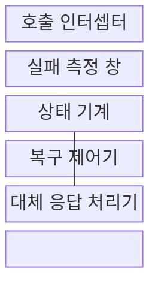
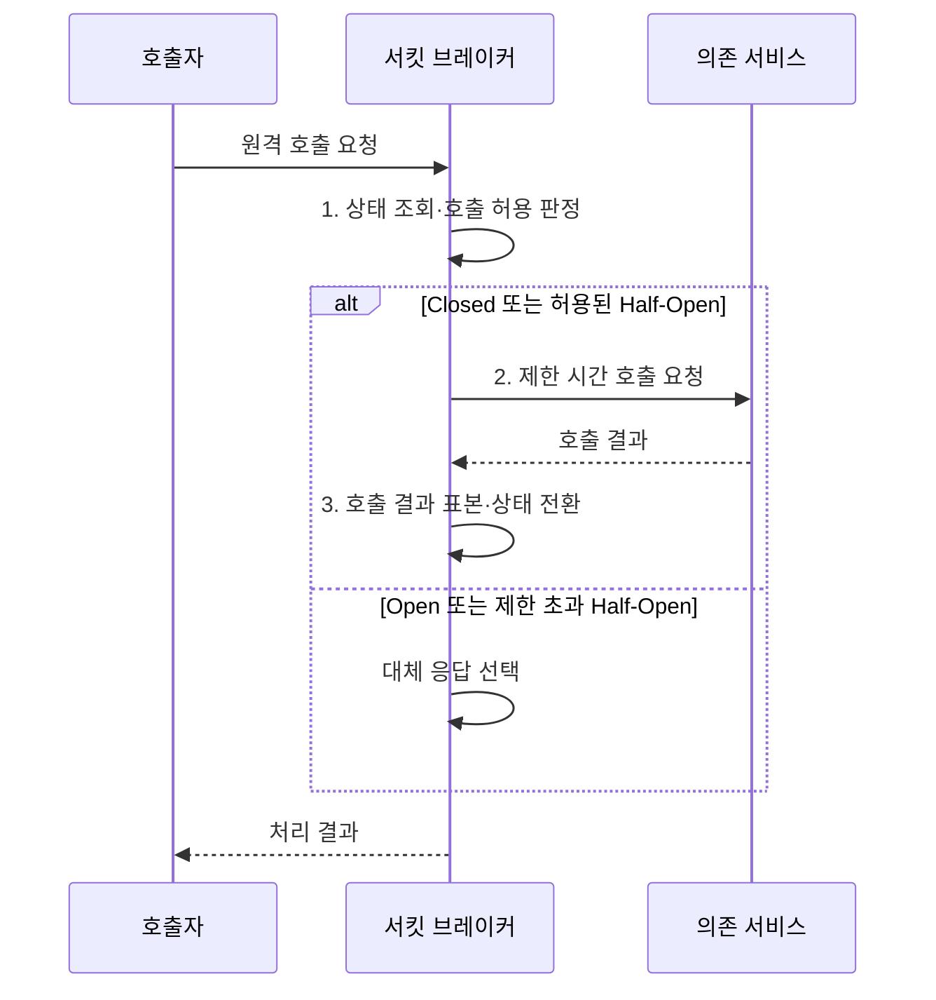

---
sidebar:
  order: 41
  label: "041. 서킷 브레이커 패턴 (Circuit Breaker Pattern)"
  badge:
    text: "미출 · 50%"
    variant: note
title: "서킷 브레이커 패턴 (Circuit Breaker Pattern)"
date: "2026-08-02T12:00:00+09:00"
tags:
  - "notes-software"
weight: 41
extra:
  question_no: "041"
  source_status: "미출"
  source_history: ""
  priority: 50
  priority_note: "서킷 브레이커는 연쇄 장애 차단 핵심"
---

## Ⅰ. 개요

핵심 용어

- **서킷 브레이커(Circuit Breaker)**: 원격 호출의 연속 실패를 감지해 호출을 차단하고 시험 호출로 복구를 확인하는 장애 격리 패턴이다.
- **장애 격리**: 실패한 의존 서비스가 호출자의 스레드·연결 풀까지 고갈시키지 않도록 영향 범위를 제한하는 방식이다.

- 정의/개념: **서킷 브레이커**는 원격 호출 실패가 임계치를 넘으면 후속 호출을 차단하고 제한된 시험 호출로 복구를 판정하는 **장애 격리 패턴**
- 배경/필요성: 장애 서비스 반복 호출로 **스레드·연결 풀 고갈**

#### 한줄 요약

- 고장 신호가 쌓이면 통로를 닫고 시간이 지난 뒤 소수만 보내 복구를 확인한다.

## Ⅱ. 특징

핵심 용어

- **열림 상태(Open State)**: 실패 임계치 초과 뒤 원격 호출을 즉시 차단하는 상태다.
- **닫힘 상태(Closed State)**: 원격 호출을 정상 전달하면서 결과를 실패 측정 창에 누적하는 상태다.
- **반열림 상태(Half-Open State)**: 제한된 시험 호출만 허용해 의존 서비스의 복구 여부를 판정하는 상태다.
- **실패 측정 창(Failure Window)**: 최근 호출의 오류·지연 비율을 계산하는 표본 구간이다.

- **Open 상태**에서 호출을 차단해 의존 서비스 복구 여력 보호
- **Half-Open 상태**에서 제한된 시험 호출로 복구 판정
- **실패 측정 창·임계치**로 차단 민감도 조정

#### 한줄 요약

- 호출 기록으로 문을 닫고 대기 뒤 시험 호출의 성공 여부로 다시 연다.

## Ⅲ. 구조 및 구성요소

핵심 용어

- **호출 인터셉터(Call Interceptor)**: 원격 요청을 가로채 차단 상태에 따라 전달하거나 즉시 실패시키는 구성요소다.
- **상태 기계(State Machine)**: 호출 결과·대기 시간·시험 결과에 따라 닫힘·열림·반열림 상태를 전환하는 모델이다.
- **대체 응답(Fallback)**: 원격 결과 대신 업무가 허용한 캐시·기본값·명시 오류를 반환하는 처리다.

| 구성요소 | 책임 |
|:---|:---|
| 호출 인터셉터 | **차단 상태**에 따라 호출 전달·즉시 실패 |
| 실패 측정 창 | **최소 표본**의 실패율·지연율 집계 |
| 상태 기계 | **Closed·Open·Half-Open** 상태 전환 |
| 복구 제어기 | **열림 대기 시간·시험 호출량** 제어 |
| 대체 응답 처리기 | **캐시·기본값·명시 오류** 반환 |

#### 한줄 요약

- 문지기, 실패 기록표, 상태판, 시험 담당, 대체 응답 담당으로 구성된다.

## Ⅳ. 흐름도

핵심 용어

- **타임아웃(Timeout)**: 개별 원격 호출의 최대 대기 시간을 제한하는 정책이다.
- **호출 결과 표본**: 성공·오류·지연 여부를 측정 창에 추가해 상태 전환 판단에 쓰는 기록이다.

**동작 원리**

1. **상태 조회·호출 허용 판정**: 차단 상태와 남은 시험 호출량으로 전달·즉시 실패 경로 결정
2. **제한 시간 호출 요청**: 허용 요청에 타임아웃 적용
3. **호출 결과 표본·상태 전환**: 성공·오류·지연을 집계해 차단 상태 변경

#### 한줄 요약

- 고장이 쌓이면 문을 닫고 기다린 뒤 시험 호출 결과로 다시 열지 정한다.

## Ⅴ. 종류 및 비교

핵심 용어

- **재시도(Retry)**: 회복 가능한 일시 오류가 난 호출을 제한된 횟수와 간격으로 다시 수행하는 방식이다.
- **백오프·지터(Backoff·Jitter)**: 재시도 간격을 늘리고 무작위 편차를 더해 동시 재시도를 분산하는 방식이다.
- **지연 예산(Latency Budget)**: 전체 요청이 허용하는 최대 응답 시간으로 타임아웃과 재시도의 합이 넘지 않아야 하는 한도다.

| 장애 대응 방식 | 서킷 브레이커 | 재시도 |
|:---|:---|:---|
| 적용 기준 | 반복 장애가 **호출 자원**을 소모할 때 | **지연 예산** 안에 회복 가능한 일시 오류 |
| 핵심 특징 | **차단 임계치** 이후 호출 차단·제한 검증 | **백오프·지터**를 적용한 호출 재수행 |
| 한계 | **과민 차단·복구 지연·낡은 대체값** | **재시도 폭풍·지연 예산 초과** |

> 요약: **일시 오류**는 제한 재시도, **지속 장애**는 호출 차단

#### 한줄 요약

- 잠깐 끊기면 제한해 다시 걸고 계속 불통이면 멈춘 뒤 시험 호출한다.

## Ⅵ. 실무 고려사항 및 대책

핵심 용어

- **최소 표본(Minimum Sample Size)**: 실패율을 계산하기 전에 측정 창에 모여야 하는 최소 호출 수다.
- **재시도 폭풍(Retry Storm)**: 다수 호출자가 장애 서비스에 반복 재시도해 복구 자원과 네트워크를 다시 고갈시키는 현상이다.
- **낡은 캐시(Stale Cache)**: 원본 서비스의 최신 변경이 아직 반영되지 않은 캐시 값이다.
- **멱등키(Idempotency Key)**: 같은 업무 요청의 재전송을 식별해 부작용을 한 번만 반영하게 하는 고유 값이다.
- **검증 동시 수·점진 허용**: 반열림 상태에서 동시에 보낼 시험 호출 수를 제한하고 성공에 따라 허용량을 단계적으로 늘리는 복구 제어다.
- **최대 노후도(Maximum Staleness)**: 업무가 대체 응답의 오래된 값을 허용할 수 있는 최대 시간 차이다.
- **오차단(False Trip)**: 실제 지속 장애가 아닌데도 측정 오차나 공유 범위 때문에 정상 호출 경로를 차단한 상태다.

| 문제 | 대책 | 효과 |
|:---|:---|:---|
| 적은 표본의 우연한 실패로 과민 차단 | **최소 표본·실패 측정 창**별 임계치 설정 | 불필요한 **Open 전환** 감소 |
| Half-Open 호출 집중으로 의존 서비스 복구 방해 | **검증 동시 수 제한·점진 허용** | 안전한 **복구 탐색** |
| 재시도와 차단기 설정 분리로 지연 예산 초과 | **타임아웃·백오프·지터** 통합 설정 | **재시도 폭풍·장기 대기** 방지 |
| 대체 응답을 최신값으로 오인해 잘못된 업무 처리 | **허용 업무·최대 노후도** 명시 | **낡은 캐시 오용** 방지 |
| 모든 의존 호출의 상태 공유로 장애 범위 확대 | **서비스·호출 유형·지역별 차단기** 분리 | 정상 경로 **오차단** 방지 |
| 결제 재시도가 같은 요청을 중복 반영 | **멱등키**로 동일 업무 요청 식별 | **중복 결제** 방지 |

#### 한줄 요약

- 고장 난 창구별로 문을 나누고 시험 인원을 제한하듯, 호출별 차단기와 복구량을 따로 조정한다.

## Ⅶ. 결론

핵심 용어

- **일시 오류**: 짧은 시간 뒤 재호출하면 지연 예산 안에서 회복될 가능성이 큰 실패다.
- **지속 장애**: 반복 호출이 자원 고갈을 키우므로 차단 뒤 시험 호출로 복구를 확인해야 하는 실패다.

- **일시 오류**는 백오프 재시도, **지속 장애**는 서킷 브레이커 선택

#### 한줄 요약

- 잠깐 끊기면 간격을 두고 다시 호출하고, 장애가 이어지면 문을 닫은 뒤 시험 호출로 복구를 확인한다.
