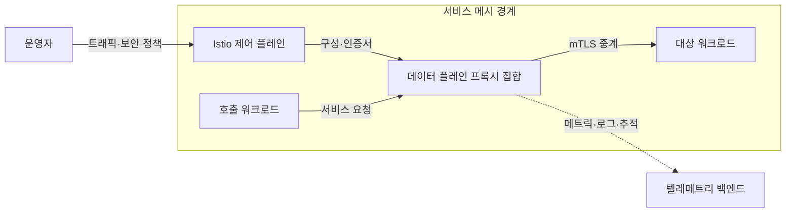
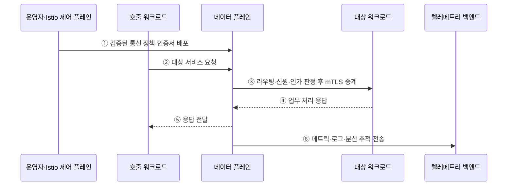

---
sidebar:
  order: 42
  label: "042. 서비스 메시 — Istio·Envoy (Service Mesh)"
  badge:
    text: "기출 · 70%"
    variant: note
title: "서비스 메시 — Istio·Envoy (Service Mesh)"
date: "2026-07-27T23:59:59+09:00"
tags:
  - "notes-software"
weight: 42
extra:
  question_no: "042"
  source_status: "기출"
  source_history: "123회, 138회"
  priority: 70
  priority_note: "123·138회 반복, 메시 기반 통신 제어"
---

## 미리 알고가기

- **서비스 메시(Service Mesh)**: 서비스 코드 밖의 프록시 계층에서 서비스 간 통신 정책을 일관되게 실행하는 인프라
- **제어 플레인(Control Plane)**: 통신 정책을 검증해 프록시 구성과 인증서로 배포하는 관리 영역
- **데이터 플레인(Data Plane)**: 요청 경로의 프록시가 라우팅·보안·관측 정책을 실행하는 영역
- **이스티오(Istio)**: 서비스 메시의 제어 플레인과 트래픽·보안 정책 관리 기능을 제공하는 오픈소스 플랫폼
- **엔보이(Envoy)**: 라우팅·보안·관측 정책을 요청 경로에서 실행하는 응용 계층 프록시
- **워크로드(Workload)**: 메시 정책이 적용되는 서비스 실행 단위
- **사이드카 모드(Sidecar Mode)**: 워크로드마다 전용 프록시 배치
- **앰비언트 모드(Ambient Mode)**: 노드별 4계층 ztunnel과 선택적 네임스페이스별 7계층 웨이포인트를 공유하는 배치 방식
- **웨이포인트 프록시(Waypoint Proxy)**: 공유 응용 계층 정책을 실행하는 프록시
- **상호 전송 계층 보안(Mutual Transport Layer Security, mTLS)**: 통신 양쪽의 신원을 인증하고 전송 데이터를 암호화하는 보안 프로토콜
- **인증(Authentication)·인가(Authorization)**: 호출 서비스의 신원을 확인하고 대상 서비스에 접근할 권한을 판정하는 절차
- **서비스 탐색(Service Discovery)**: 대상 서비스 주소·엔드포인트 조회
- **텔레메트리(Telemetry)**: 프록시가 통신 상태를 관측하도록 생성하는 메트릭·로그·분산 추적 정보
- **노드 프록시(Node Proxy)**: 앰비언트 모드에서 같은 노드의 여러 워크로드가 공유하며 전송 계층 연결과 mTLS를 처리하는 프록시
- **제로 트러스트 터널(zero-trust tunnel, ztunnel)**: 앰비언트 모드에서 노드별로 배치되어 4계층 라우팅·신원·mTLS를 처리하는 프록시
- **인증서(Certificate)**: 공개키와 서비스 신원을 서명해 묶은 전자 문서로서 제어 플레인이 배포하고 프록시가 mTLS 상호 인증에 사용함
- **엔드포인트(Endpoint)**: 서비스 요청을 받을 수 있는 실제 워크로드의 네트워크 주소와 포트
- **응용 계층(Application Layer)**: 요청 경로·메서드·서비스 신원 같은 응용 프로토콜 정보를 해석해 웨이포인트가 세밀한 정책을 적용하는 계층
- **텔레메트리 백엔드(Telemetry Backend)**: 프록시가 보낸 메트릭·로그·분산 추적을 저장·검색·시각화하는 관측 시스템
- **트래픽 가중치(Traffic Weight)**: 전체 요청 중 각 서비스 버전으로 보낼 비율을 정하는 값으로서 신버전 배포 범위를 단계적으로 조절함
- **구성 배포 지연(Configuration Propagation Delay)**: 제어 플레인의 정책 변경이 모든 데이터 플레인 프록시에 반영될 때까지 걸리는 시간
- **카디널리티(Cardinality)**: 메트릭 라벨 조합으로 생성되는 서로 다른 시계열의 개수
- **카나리아 적용(Canary Rollout)**: 정책이나 버전을 일부 워크로드·트래픽에 먼저 적용해 이상 여부를 확인한 뒤 확대하는 방식

## Ⅰ. 개요

- 정의/개념: 서비스 간 통신을 **프록시·제어 플레인으로 통제**하는 계층
- 기존 한계: 서비스별 통신 정책 구현은 **코드 중복·정책 불일치** 유발

### 쉽게 이해하기 (학습용)

- 배달마다 같은 검문 규칙을 쓰도록 공통 안내소가 통신을 맡는다.

## Ⅱ. 특징

- **서비스 코드·통신 정책 분리**로 정책 일관성 확보
- **제어 플레인**은 정책 배포, 데이터 플레인은 요청 집행
- **프록시 홉·제어 플레인**이 지연·자원·운영 비용 증가

### 쉽게 이해하기 (학습용)

- 규칙은 한곳에서 관리하기 쉽지만 모든 요청이 프록시를 지나 비용이 든다.

## Ⅲ. 아키텍처

**도표안 A — 구조도**

**도표안 B — sequenceDiagram**

| 설계 요소 | 설명 |
|:---|:---|
| Istio 제어 플레인 | 정책을 프록시 구성·인증서로 배포 |
| 호출 워크로드 | 프록시를 통해 대상 서비스 요청 |
| 데이터 플레인 프록시 집합 | Envoy·ztunnel 등이 통신 정책 실행 |
| 대상 워크로드 | 허용된 요청의 업무 로직 처리 |

**동작 원리**

- ① 운영 정책을 검증한 제어 플레인이 프록시 구성과 인증서 배포
- ② 호출 워크로드의 서비스 요청을 데이터 플레인이 가로채 수신
- ③ 프록시가 라우팅·서비스 신원·인가를 판정하고 mTLS로 대상에 중계
- ④ 대상 워크로드가 업무 로직을 처리해 프록시에 응답
- ⑤ 데이터 플레인이 호출 워크로드에 응답 전달
- ⑥ 프록시가 메트릭·로그·분산 추적을 관측 시스템으로 전송

### 쉽게 이해하기 (학습용)

- 규칙을 받은 안내원이 길과 신원을 확인하고 결과 기록을 보낸다.

## Ⅳ. 종류 및 비교

| 서비스 메시 배치 | 사이드카 모드 | 앰비언트 모드 |
|:---|:---|:---|
| 적용 기준 | 워크로드별 **세밀한 정책** | 사이드카 **운영 비용 절감** |
| 핵심 특징 | 워크로드별 **전용 프록시** | 노드 프록시·**웨이포인트 공유** |
| 한계 | 프록시 수만큼 **자원 증가** | 공유 프록시 **장애 범위 확대** |

> 요약: 정책 세분성과 공유 프록시 비용으로 배치 방식 선택

### 쉽게 이해하기 (학습용)

- 전용 안내원을 둘지 여러 서비스가 안내원을 공유할지 비용과 규칙 범위로 정한다.

## Ⅴ. 실무 고려사항 및 대책

| 운영 위험 | 대응 | 기대 효과 |
|:---|:---|:---|
| 잘못된 정책이 전체 서비스 통신을 차단 | 사전 검증·일부 워크로드 카나리아 적용·즉시 복원본 유지 | 정책 장애 범위 축소 |
| 제어 플레인 장애·구성 배포 지연을 미관측 | 프록시의 마지막 정상 구성 유지·배포 지연·버전 불일치 감시 | 관리 장애 중 데이터 경로 지속 |
| 프록시 홉으로 지연·CPU·메모리 증가 | 실제 트래픽 벤치마크로 사이드카·앰비언트·L7 적용 범위 선택 | 필요한 정책만 비용 지불 |
| 인증서 만료·시간 오차로 mTLS 통신 실패 | 자동 순환·만료 사전 경보·시각 동기화·비상 교체 절차 | 서비스 신원 연속성 확보 |
| 고카디널리티 텔레메트리로 저장 비용 폭증 | 라벨 허용 목록·샘플링·보존기간·비용 한도 적용 | 관측 비용 통제 |

### 적용 사례

- 결제 서비스는 mTLS로 호출 서비스 신원을 확인하고 허가된 서비스의 요청만 전달한다.

### 쉽게 이해하기 (학습용)

- 결제 통신은 양쪽 신원을 확인하고 허가된 서비스 요청만 전달한다

## Ⅵ. 결론

- 서비스 간 통신 보안과 관측을 일관되게 적용하려면 **정책 중복 비용·프록시 자원·운영 복잡도**를 검토하고 공통 통신 정책의 편익이 큰 환경에 서비스 메시를 도입한다.

### 쉽게 이해하기 (학습용)

- 여러 서비스가 같은 통신 규칙을 반복하면 프록시 비용과 비교해 메시를 둔다.
