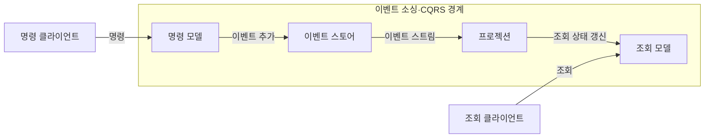
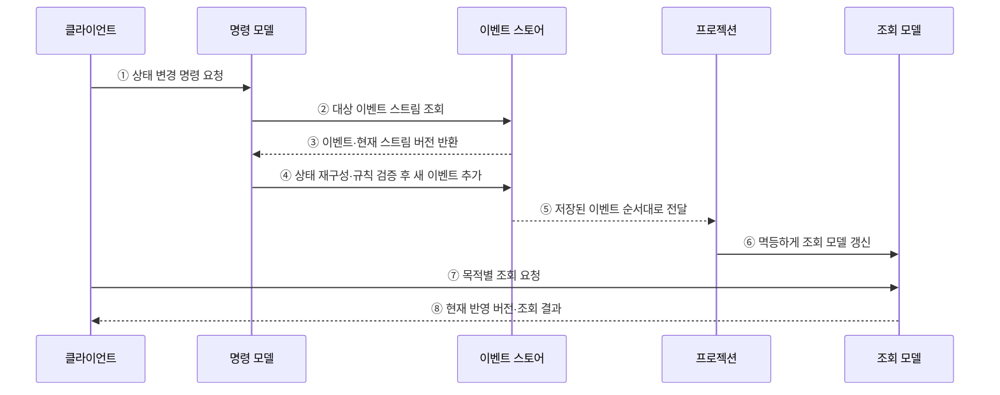

---
sidebar:
  order: 43
  label: "043. 이벤트 소싱·CQRS (Event Sourcing CQRS)"
  badge:
    text: "미출제 · 50%"
    variant: note
title: "이벤트 소싱·CQRS (Event Sourcing CQRS)"
date: "2026-07-25T00:35:00+09:00"
tags:
  - "notes-software"
weight: 43
extra:
  question_no: "043"
  source_status: "미출제"
  source_history: ""
  priority: 50
  priority_note: "이벤트 소싱·CQRS는 상태 분리 설계 가치"
---

## 미리 알고가기

- **이벤트 소싱(Event Sourcing)**: 현재값 대신 상태 변경 이벤트를 추가 전용 원본으로 저장해 상태를 재구성하는 방식
- **명령·조회 책임 분리(Command Query Responsibility Segregation, CQRS)**: 상태를 변경하는 명령 모델과 데이터를 읽는 조회 모델의 책임을 분리하는 패턴
- **이벤트(Event)**: 이미 발생한 상태 변화를 업무 의미와 함께 기록한 사실
- **이벤트 스토어(Event Store)**: 이벤트 원본과 스트림 버전을 발생 순서대로 보관하는 저장소
- **명령(Command)**: 업무 상태를 바꾸려는 의도를 담은 요청
- **조회(Query)**: 업무 상태를 바꾸지 않고 데이터를 읽는 요청
- **프로젝션(Projection)**: 이벤트를 순서대로 반영해 조회 모델을 만드는 처리
- **결과적 일관성(Eventual Consistency)**: 비동기 반영 지연 후 여러 모델의 상태가 일치하는 성질
- **스냅샷(Snapshot)**: 이벤트 전체를 다시 읽지 않도록 특정 시점의 계산 상태를 저장한 복사본
- **생성·조회·수정·삭제(Create, Read, Update, Delete, CRUD)**: 데이터의 현재 상태를 생성·조회·수정·삭제하는 기본 처리 방식
- **추가 전용(Append-only)**: 기존 이벤트를 덮어쓰지 않고 스트림 끝에 새 이벤트만 더해 변경 이력을 원본으로 보존하는 저장 방식
- **원본(Source of Truth)**: 업무 상태를 다시 계산할 때 최종 기준이 되는 신뢰 데이터로서 이벤트 소싱에서는 순서가 있는 이벤트 스트림이 해당함
- **스트림 버전·예상 버전(Stream·Expected Version)**: 스트림 버전은 저장된 이벤트 개수·순서를 나타내고 예상 버전은 명령이 읽은 버전으로서 둘이 같을 때만 새 이벤트를 추가해 동시 변경 충돌을 막음
- **낙관적 동시성 제어(Optimistic Concurrency Control)**: 충돌이 드물다고 보고 잠금 없이 처리하다 저장 시 버전을 비교해 겹친 변경을 거절하는 방식
- **식별자(Identifier)**: 같은 업무 객체의 명령·이벤트·스트림을 묶어 조회하도록 부여하는 고유 값
- **멱등 중복 처리(Idempotent Duplicate Handling)**: 같은 이벤트가 재전달돼도 프로젝션 결과를 한 번 반영한 상태와 같게 유지하는 처리
- **감사 이력(Audit Trail)**: 누가 언제 어떤 상태 변화를 만들었는지 추적할 수 있도록 보존한 사건 기록
- **거래 원장(Transaction Ledger)**: 입출금 이벤트를 추가 전용으로 기록해 특정 시점의 잔액과 변경 경위를 재생할 수 있는 회계 기록
- **이벤트 스키마 진화(Event Schema Evolution)**: 과거 이벤트를 보존하면서 새 필드·의미를 호환되게 추가·변환하는 관리
- **프로젝션 지연(Projection Lag)**: 이벤트가 저장된 시점부터 조회 모델에 반영될 때까지의 시간 차
- **재구축(Rebuild)**: 이벤트 원본을 처음부터 다시 재생해 조회 모델을 새로 만드는 작업

## Ⅰ. 개요

- 정의/개념: 변경 이벤트를 저장하고 명령·조회를 분리
- **배경/필요성**: 현재값 저장은 이력 재생을 막아 모델 분리 필요

### 쉽게 이해하기 (학습용)

- 최종 잔액만 고치지 않고 모든 거래를 원장에 적으며, 기록 창구와 조회 창구를 따로 운영한다.

## Ⅱ. 특징

- 추가 전용 이벤트가 상태 이력의 원본이다.
- 명령·조회 모델을 독립 배포·확장한다.
- 조회 반영 지연·이벤트 버전 관리 비용 발생한다.

### 쉽게 이해하기 (학습용)

- 모든 변경 내역을 남기고 읽기 화면을 따로 만들 수 있지만 두 상태가 잠시 다르고 기록 형식도 계속 관리해야 한다.

## Ⅲ. 아키텍처

**도표안 A — 구조도**

**도표안 B — sequenceDiagram**

| 설계 요소 | 설명 |
|:---|:---|
| 명령 모델 | 업무 규칙을 검증해 새 이벤트 생성 |
| 이벤트 스토어 | 이벤트와 스트림 버전을 순서대로 보관 |
| 프로젝션 | 이벤트를 반영해 조회 상태 생성 |
| 조회 모델 | 조회 목적별 데이터를 저장·응답 |

**동작 원리**

- ① 클라이언트가 상태 변경 의도와 입력값 전달
- ② 명령 모델이 대상 식별자의 이벤트 스트림 조회
- ③ 저장된 이벤트와 현재 스트림 버전 반환
- ④ 스냅샷·이벤트로 상태를 복원해 규칙을 검증하고 예상 버전이 같으면 새 이벤트 추가
- ⑤ 이벤트 스토어가 미반영 이벤트를 저장 순서대로 프로젝션에 전달
- ⑥ 프로젝션이 중복을 안전하게 처리하며 조회 모델 갱신
- ⑦ 클라이언트가 목적별 조회 조건 전달
- ⑧ 조회 모델이 현재 반영 버전과 결과 반환

### 쉽게 이해하기 (학습용)

- 원장의 기존 거래로 잔액을 계산해 새 거래를 기록한 뒤 조회용 잔액판을 따로 갱신한다.

## Ⅳ. 종류 및 비교

| 판단 기준 | 이벤트 소싱·CQRS | CRUD 단일 모델 |
|:---|:---|:---|
| 핵심 특징 | 이벤트 원본·명령·조회 모델 분리 | 현재 상태 원본·단일 모델 |
| 적용 기준 | 이력 재생·독립 확장이 핵심 | 단순 현재 상태·즉시 일관성 |
| 주요 위험 | 이벤트 버전·재생·중복 처리 | 모델 결합·별도 감사 이력 |

> 요약: 이력·독립 확장 이익과 비동기 복잡도 비교

### 쉽게 이해하기 (학습용)

- 과거 상태를 되살리고 읽기·쓰기를 따로 키워야 하면 이벤트 원장과 조회 화면을 분리한다.

## Ⅴ. 실무 고려사항 및 대책

| 운영 위험 | 대응 | 기대 효과 |
|:---|:---|:---|
| 과거 이벤트 형식을 새 코드가 읽지 못함 | 이벤트 불변 원칙·버전 호환 변환·재생 시험 | 이벤트 스키마 진화 안전성 |
| 프로젝션 오류·코드 변경 후 조회 모델 불일치 | 이벤트 원본에서 반복 가능한 재구축·결과 대조 | 파생 상태 복구 가능 |
| 이벤트 중복·순서 역전으로 조회값 오염 | 이벤트 식별자·스트림 순서·멱등 중복 처리 | 정확한 프로젝션 상태 |
| 프로젝션 지연을 즉시 일관된 값으로 오인 | 반영 버전·지연 지표 표시와 업무별 대기·보상 기준 | 사용자·업무 혼선 감소 |
| 긴 스트림 재생이 명령 지연 증가 | 검증된 스냅샷 주기·스냅샷 이후 이벤트 재생 | 상태 복원 비용 제한 |

### 적용 사례

- 거래 원장은 입출금 이벤트를 추가 전용으로 저장해 감사 이력과 과거 시점의 잔액을 재구성한다.

### 쉽게 이해하기 (학습용)

- 거래 원장은 입출금 내역을 지우지 않아 과거 어느 시점의 잔액도 다시 계산한다

## Ⅵ. 결론

- 이력 재생·감사·읽기·쓰기 독립 확장의 이익이 지연·버전 관리 비용보다 클 때 적용한다.

### 쉽게 이해하기 (학습용)

- 과거 상태 복원과 읽기·쓰기 분리 이익이 동기화 비용보다 큰 업무에 사용한다.
