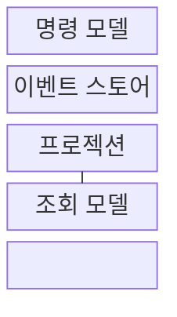
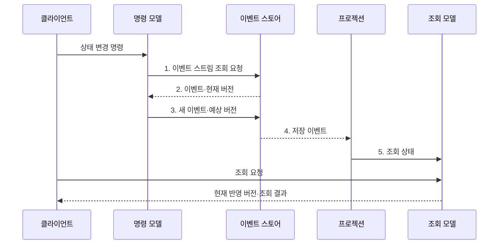

---
sidebar:
  order: 43
  label: "043. 이벤트 소싱·CQRS (Event Sourcing CQRS)"
  badge:
    text: "미출 · 50%"
    variant: note
title: "이벤트 소싱·CQRS (Event Sourcing CQRS)"
date: "2026-08-02T12:00:00+09:00"
tags:
  - "notes-software"
weight: 43
extra:
  question_no: "043"
  source_status: "미출"
  source_history: ""
  priority: 50
  priority_note: "이벤트 소싱·CQRS는 상태 분리 설계 가치"
---

## Ⅰ. 개요

핵심 용어

- **이벤트 소싱(Event Sourcing)**: 현재값 대신 상태 변경 이벤트를 추가 전용 원본으로 저장해 상태를 재구성하는 방식이다.
- **명령·조회 책임 분리(Command Query Responsibility Segregation, CQRS)**: 상태 변경 명령 모델과 읽기 조회 모델의 책임을 분리하는 패턴이다.

- 정의/개념: **이벤트 소싱과 CQRS**는 각각 상태 변경 이력을 원본으로 저장하고 변경•조회 모델의 책임을 분리하며 함께 사용할 수 있는 **아키텍처 패턴**
- 배경/필요성: 현재값만 덮어써 저장하면 **과거 상태 재구성•변경 원인 추적이 어려움**

#### 한줄 요약

- 최종 잔액만 고치지 않고 모든 거래를 원장에 적으며, 기록 창구와 조회 창구를 따로 운영한다.

## Ⅱ. 특징

핵심 용어

- **추가 전용(Append-only)**: 기존 이벤트를 덮어쓰지 않고 스트림 끝에 새 이벤트만 더하는 저장 방식이다.
- **프로젝션(Projection)**: 저장된 이벤트를 순서대로 반영해 목적별 조회 모델을 만드는 처리다.
- **결과적 일관성(Eventual Consistency)**: 비동기 반영 지연 뒤 명령 상태와 조회 모델의 상태가 일치하는 성질이다.

- **추가 전용 이벤트**를 상태 이력 원본으로 사용
- **명령·조회 모델 분리**로 독립 확장
- **프로젝션 갱신·결과적 일관성**으로 목적별 조회 상태 생성

#### 한줄 요약

- 모든 변경 내역을 남기고 읽기 화면을 따로 만들 수 있지만 두 상태가 잠시 다르고 기록 형식도 계속 관리해야 한다.

## Ⅲ. 구조 및 구성요소

핵심 용어

- **명령(Command)**: 업무 상태를 바꾸려는 의도를 담은 요청이다.
- **이벤트 스토어(Event Store)**: 이벤트 원본과 스트림 버전을 발생 순서대로 보관하는 저장소다.
- **조회(Query)**: 업무 상태를 바꾸지 않고 목적별 데이터를 읽는 요청이다.

| 구성요소 | 책임 |
|:---|:---|
| 명령 모델 | **업무 규칙·예상 버전** 검증 후 새 이벤트 생성 |
| 이벤트 스토어 | **이벤트·스트림 버전** 순서 보관 |
| 프로젝션 | 저장 이벤트를 **조회 상태**로 변환 |
| 조회 모델 | 목적별 **조회 데이터** 응답 |

#### 한줄 요약

- 기록 판단자, 원장, 조회판 갱신자, 조회판으로 구성된다.

## Ⅳ. 흐름도

핵심 용어

- **스트림 버전·예상 버전(Stream·Expected Version)**: 저장된 이벤트 순서와 명령이 읽은 버전을 비교해 동시 변경 충돌을 막는 값이다.
- **식별자(Identifier)**: 같은 업무 객체의 명령·이벤트·스트림을 묶어 조회하는 고유 값이다.
- **낙관적 동시성 제어(Optimistic Concurrency Control)**: 저장 시 버전을 비교해 겹친 변경을 거절하는 방식이다.

**동작 원리**

1. **이벤트 스트림 조회 요청**: 식별자별 이력으로 현재 상태 복원
2. **이벤트·현재 버전**: 저장 이력과 동시성 기준 제공
3. **새 이벤트·예상 버전**: 업무 규칙과 버전 일치 시 추가
4. **저장 이벤트**: 확정된 상태 변화를 프로젝션에 전달
5. **조회 상태**: 목적별 읽기 모델에 순서대로 반영

#### 한줄 요약

- 원장의 기존 거래로 잔액을 계산해 새 거래를 기록한 뒤 조회용 잔액판을 따로 갱신한다.

## Ⅴ. 종류 및 비교

핵심 용어

- **생성·조회·수정·삭제(Create, Read, Update, Delete, CRUD)**: 데이터의 현재 상태를 직접 생성·조회·수정·삭제하는 기본 처리 방식이다.
- **감사 이력(Audit Trail)**: 누가 언제 어떤 상태 변화를 만들었는지 추적하도록 보존한 사건 기록이다.

| 상태 저장 방식 | 이벤트 소싱·CQRS | CRUD 단일 모델 |
|:---|:---|:---|
| 적용 기준 | **이력 재생·독립 확장**이 핵심 | 단순 현재 상태·**즉시 일관성** |
| 핵심 특징 | **이벤트 원본·명령·조회 모델** 분리 | **현재 상태 원본·단일 모델** |
| 한계 | **이벤트 버전·재생·중복 처리** 비용 | **모델 결합·별도 감사 이력** |

> 요약: **이력·독립 확장** 이익과 **비동기 복잡도** 비교

#### 한줄 요약

- 과거 상태를 되살리고 읽기·쓰기를 따로 키워야 하면 이벤트 원장과 조회 화면을 분리한다.

## Ⅵ. 실무 고려사항 및 대책

핵심 용어

- **이벤트 스키마 진화(Event Schema Evolution)**: 과거 이벤트를 보존하면서 새 필드·의미를 호환되게 추가·변환하는 관리다.
- **재구축(Rebuild)**: 이벤트 원본을 처음부터 재생해 조회 모델을 새로 만드는 작업이다.
- **멱등 중복 처리(Idempotent Duplicate Handling)**: 같은 이벤트가 재전달돼도 프로젝션 결과를 한 번 반영한 상태와 같게 유지하는 처리다.
- **프로젝션 지연(Projection Lag)**: 이벤트 저장부터 조회 모델 반영까지의 시간 차다.
- **스냅샷(Snapshot)**: 전체 이벤트를 다시 읽지 않도록 특정 시점의 계산 상태를 저장한 복사본이다.

| 문제 | 대책 | 효과 |
|:---|:---|:---|
| 과거 이벤트 형식을 새 코드가 읽지 못함 | **이벤트 불변·호환 변환·재생 시험** | **이벤트 스키마 진화** 안전성 |
| 프로젝션 오류·코드 변경 후 조회 모델 불일치 | 이벤트 원본의 반복 가능한 **재구축·결과 대조** | **파생 상태 복구** 가능 |
| 이벤트 중복·순서 역전으로 조회값 오염 | **이벤트 식별자·스트림 순서·멱등 처리** | 정확한 **프로젝션 상태** |
| 프로젝션 지연을 즉시 일관된 값으로 오인 | **반영 버전·프로젝션 지연** 표시 | 사용자·업무 **일관성 오인** 감소 |
| 긴 스트림 재생으로 명령 지연 증가 | 검증된 **스냅샷** 이후 이벤트만 재생 | **상태 복원 비용** 제한 |
| 동시 명령이 같은 스트림 버전에 이벤트 추가 | **예상 버전·낙관적 동시성 제어** | **중복 상태 변경** 거절 |

#### 한줄 요약

- 원본 장부는 지우지 않고 번호순으로 보존하며, 조회판이 틀리면 장부를 다시 넘겨 정확한 화면을 만든다.

## Ⅶ. 결론

핵심 용어

- **상태 복원**: 이벤트 원본을 순서대로 재생해 과거 또는 현재 업무 상태를 다시 계산하는 능력이다.
- **스키마 진화 비용**: 과거 이벤트를 새 코드가 계속 읽도록 호환 변환과 재생 시험을 유지하는 비용이다.

- 상태 복원·독립 확장 이익이 **스키마 진화 비용**보다 크면 **이벤트 소싱·CQRS** 적용

#### 한줄 요약

- 과거 장면을 되살리고 읽기 창구를 따로 키울 가치가 기록 형식 관리비보다 큰 업무에 사용한다.
