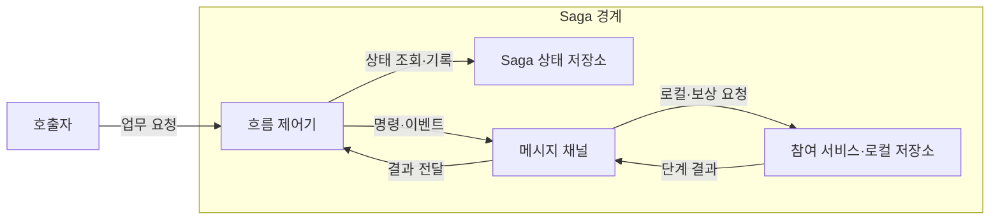
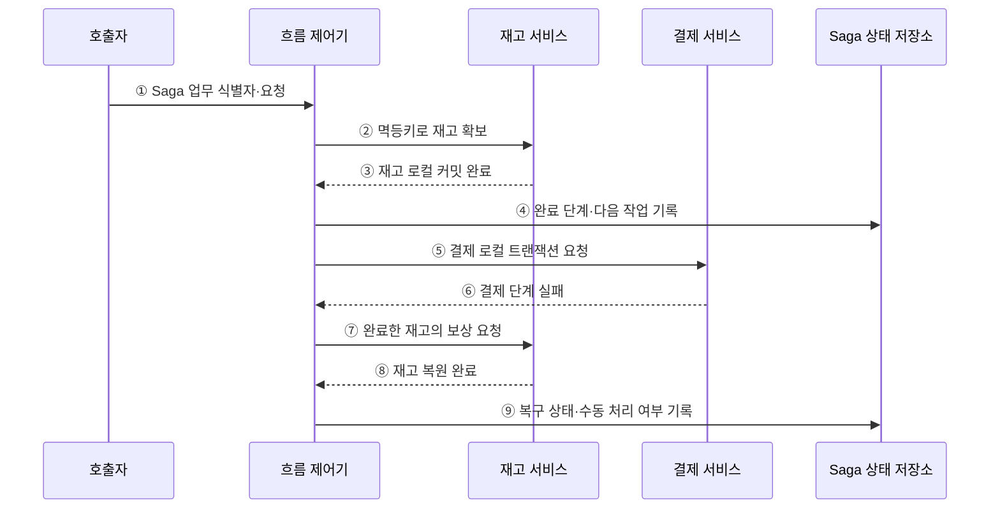

---
sidebar:
  order: 44
  label: "044. Saga 패턴 — 분산 트랜잭션 (Saga Pattern)"
  badge:
    text: "미출제 · 50%"
    variant: note
title: "Saga 패턴 — 분산 트랜잭션 (Saga Pattern)"
date: "2026-07-25T00:35:00+09:00"
tags:
  - "notes-software"
weight: 44
extra:
  question_no: "044"
  source_status: "미출제"
  source_history: ""
  priority: 50
  priority_note: "Saga는 분산 보상 트랜잭션 설계 핵심"
---

## 미리 알고가기

- **사가 패턴(Saga Pattern)**: 여러 서비스의 로컬 트랜잭션을 순차 실행하고 실패 시 완료된 작업을 보상해 업무 일관성을 회복하는 패턴
- **로컬 트랜잭션(Local Transaction)**: 한 서비스가 소유한 저장소 안에서만 원자적으로 커밋하는 작업
- **보상 트랜잭션(Compensating Transaction)**: 과거 커밋을 지우는 롤백이 아니라 반대 업무를 새로 커밋해 효과를 상쇄하는 처리
- **2단계 커밋(Two-Phase Commit, 2PC)**: 준비 단계에서 참여자의 동의를 모은 뒤 중앙 조정자가 전체 커밋 또는 중단을 결정하는 분산 트랜잭션 방식
- **오케스트레이션(Orchestration)**: 중앙 조정자가 다음 작업과 실패 시 보상 순서를 명령하는 Saga 제어 방식
- **코레오그래피(Choreography)**: 각 서비스가 앞 단계 이벤트에 반응해 다음 작업이나 보상을 실행하는 Saga 제어 방식
- **멱등성(Idempotency)**: 같은 메시지를 반복 처리해도 한 번 처리한 것과 같은 업무 상태를 유지하는 성질
- **수동 복구(Manual Recovery)**: 자동 보상으로 해결하지 못한 상태를 담당자가 확인해 업무 규칙에 맞게 정정하는 절차
- **전역 원자 커밋(Global Atomic Commit)**: 여러 서비스의 변경을 모두 커밋하거나 모두 중단해 중간 결과가 보이지 않게 하는 분산 트랜잭션 성질
- **전역 잠금(Global Lock)**: 여러 참여자의 자원을 커밋 결정까지 함께 묶어 두어 동시 처리와 가용성을 낮출 수 있는 잠금
- **메시지 채널·재전송(Message Channel·Redelivery)**: 메시지 채널은 서비스 간 명령·이벤트를 전달하고 재전송은 응답 누락 시 같은 메시지를 다시 보내므로 멱등 처리가 필요함
- **흐름 제어기(Workflow Controller)**: 단계 결과와 Saga 상태를 읽어 다음 로컬 작업이나 역순 보상을 선택하는 오케스트레이션 구성요소
- **멱등키(Idempotency Key)**: 같은 로컬·보상 요청의 재전송을 식별해 재고·결제 효과가 한 번만 반영되게 하는 고유 값
- **재고·결제 서비스(Inventory·Payment Service)**: 재고 서비스는 수량 확보·복원을, 결제 서비스는 금액 승인·취소를 각자 로컬 트랜잭션으로 처리하는 참여 서비스
- **서버·볼륨(Server·Volume)**: 서버는 계산 인스턴스이고 볼륨은 영구 저장 공간으로서 설정 실패 시 이미 만든 자원을 보상 단계에서 삭제함
- **트랜잭셔널 아웃박스(Transactional Outbox)**: 로컬 업무 변경과 보낼 메시지를 같은 트랜잭션에 저장한 뒤 별도 전달기가 메시지 채널로 전송하는 방식
- **대사(Reconciliation)**: 여러 서비스의 상태를 주기적으로 비교해 누락·불일치·미완료 보상을 찾아 정정하는 절차

## Ⅰ. 개요

- 정의/개념: 로컬 트랜잭션을 연결하고 실패 시 완료 작업을 보상
- **배경/필요성**: 독립 저장소는 원자 커밋이 어려워 보상 필요

### 쉽게 이해하기 (학습용)

- 항공과 숙박을 따로 예약하다 중간에 실패하면 이미 확정한 예약부터 반대 순서로 취소한다.

## Ⅱ. 특징

- 서비스별 로컬 커밋으로 전역 잠금 회피한다.
- 완료 전 중간 상태가 외부에 노출한다.
- 보상은 롤백이 아닌 반대 업무의 새 커밋한다.
- 메시지 중복·보상 실패에 복구 설계 필요하다.

### 쉽게 이해하기 (학습용)

- 진행 중인 상태가 보일 수 있고 취소 메시지가 반복돼도 한 번 취소한 결과와 같아야 한다.

## Ⅲ. 아키텍처

**도표안 A — 구조도**

**도표안 B — sequenceDiagram**

| 설계 요소 | 설명 |
|:---|:---|
| 흐름 제어기 | 단계 결과로 다음 작업·보상 선택 |
| Saga 상태 저장소 | 완료 단계·실패 원인·보상 상태 기록 |
| 메시지 채널 | 명령·이벤트 전달과 재전송 |
| 참여 서비스·로컬 저장소 | 멱등 로컬·보상 트랜잭션 커밋 |

**동작 원리**

- ① 업무 식별자와 초기 Saga 상태 생성
- ② 멱등키를 포함해 재고 확보 요청
- ③ 재고 서비스가 로컬 트랜잭션을 커밋하고 성공 반환
- ④ 완료 단계와 다음 실행 단계를 상태 저장소에 기록
- ⑤ 결제 서비스에 로컬 트랜잭션 요청
- ⑥ 결제 실패 원인과 상태 수신
- ⑦ 이미 완료한 재고 효과를 상쇄하는 보상 요청
- ⑧ 재고 서비스가 멱등하게 수량을 복원하고 결과 반환
- ⑨ 보상 결과와 수동 복구 필요 여부 기록

### 쉽게 이해하기 (학습용)

- 결제가 실패하면 먼저 잡아 둔 재고를 되돌리고 자동 복구도 실패하면 담당자에게 넘긴다.

## Ⅳ. 종류 및 비교

| 판단 기준 | 오케스트레이션 | 코레오그래피 |
|:---|:---|:---|
| 핵심 특징 | 중앙 조정자가 명령·상태 관리 | 서비스가 이벤트에 반응 |
| 적용 기준 | 분기·보상 규칙이 많을 때 | 짧은 선형 이벤트 흐름 |
| 주요 위험 | 조정자 장애·의존 집중 | 순환 의존·흐름 추적 난도 |

> 요약: 복잡하면 중앙 조정, 단순하면 연쇄 사용

### 쉽게 이해하기 (학습용)

- 복잡하면 총괄자가 지시하고 짧은 일은 각 담당자가 완료 신호를 받아 시작한다.

## Ⅴ. 실무 고려사항 및 대책

| 운영 위험 | 대응 | 기대 효과 |
|:---|:---|:---|
| 로컬 커밋 후 메시지 발행 실패 | 트랜잭셔널 아웃박스로 상태·메시지 원자적 저장 | 단계 누락 방지 |
| 명령·이벤트 재전송으로 중복 결제·보상 | 업무 식별자·멱등키·처리 이력 저장 | 중복 부작용 방지 |
| 보상 자체가 실패해 중간 상태 장기 지속 | 재시도 상한·대사·수동 복구 큐·담당자 경보 | 미완료 Saga 회수 |
| 진행 중 중간 상태를 완료 상태로 오인 | 명시적 진행 상태·조회 표시·후속 작업 제한 | 업무 일관성 오해 방지 |
| 코레오그래피 이벤트가 순환 의존으로 확장 | 전체 흐름 지도·소유자·복잡도 임계 시 오케스트레이션 전환 | 제어 흐름 추적성 확보 |

### 적용 사례

- 주문 결제가 실패하면 확보한 재고를 복원하고 주문을 취소하며 자동 보상 실패는 수동 복구 큐로 보낸다.

### 쉽게 이해하기 (학습용)

- 주문 결제가 실패하면 먼저 확보한 재고 수량을 되돌리고 주문을 취소한다

## Ⅵ. 결론

- 보상 가능한 단계만 Saga로 묶고 멱등 처리·대사·수동 복구 경계를 설정한다.

### 쉽게 이해하기 (학습용)

- 끝난 일을 반대 작업으로 취소할 수 있는 단계만 묶고 자동 취소 실패는 담당자가 복구한다.
