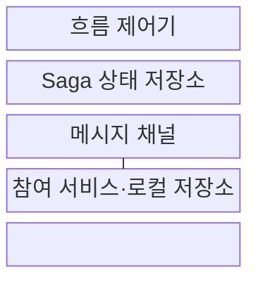
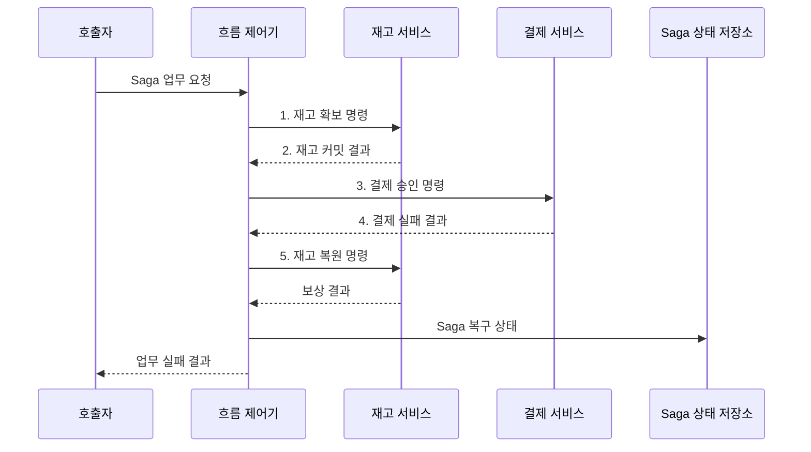

---
sidebar:
  order: 44
  label: "044. Saga 패턴: 분산 트랜잭션 (Saga Pattern)"
  badge:
    text: "미출 · 50%"
    variant: note
title: "Saga 패턴: 분산 트랜잭션 (Saga Pattern)"
date: "2026-08-02T12:00:00+09:00"
tags:
  - "notes-software"
weight: 44
extra:
  question_no: "044"
  source_status: "미출"
  source_history: ""
  priority: 50
  priority_note: "Saga는 분산 보상 트랜잭션 설계 핵심"
---

## Ⅰ. 개요

핵심 용어

- **사가 패턴(Saga Pattern)**: 여러 서비스의 로컬 트랜잭션을 순차 실행하고 실패 시 완료 작업을 보상하는 분산 트랜잭션 패턴이다.
- **2단계 커밋(Two-Phase Commit, 2PC)**: 참여자의 준비 동의를 모은 뒤 중앙 조정자가 전체 커밋 또는 중단을 결정하는 방식이다.
- **전역 잠금(Global Lock)**: 여러 참여자의 자원을 커밋 결정까지 함께 묶어 두는 잠금이다.

- 정의/개념: **사가 패턴**은 여러 서비스의 로컬 트랜잭션을 순차 실행하고 중간 실패 시 완료된 작업의 효과를 보상하는 **분산 트랜잭션 패턴**
- 배경/필요성: **2PC 전역 잠금**으로 독립 서비스의 가용성·자율성 제약

### 쉽게 이해하기 (학습용)

- 항공과 숙박을 따로 예약하다 중간에 실패하면 이미 확정한 예약부터 반대 순서로 취소한다.

## Ⅱ. 특징

핵심 용어

- **로컬 트랜잭션(Local Transaction)**: 한 서비스가 소유한 저장소 안에서만 원자적으로 커밋하는 작업이다.
- **보상 트랜잭션(Compensating Transaction)**: 과거 커밋을 지우지 않고 반대 업무를 새로 커밋해 효과를 상쇄하는 처리다.
- **중간 상태**: Saga의 일부 로컬 작업만 커밋되어 다른 서비스에 진행 결과가 노출된 상태다.

- **로컬 커밋 연결**로 전역 잠금 회피
- **보상 트랜잭션**으로 완료 단계의 효과를 역순 상쇄
- **중간 상태 노출**을 허용하며 업무 일관성 회복

### 쉽게 이해하기 (학습용)

- 진행 중인 상태가 보일 수 있고 취소 메시지가 반복돼도 한 번 취소한 결과와 같아야 한다.

## Ⅲ. 구조 및 구성요소

핵심 용어

- **흐름 제어기(Workflow Controller)**: 단계 결과와 Saga 상태를 읽어 다음 작업이나 역순 보상을 선택하는 구성요소다.
- **메시지 채널·재전송(Message Channel·Redelivery)**: 서비스 간 명령·이벤트를 전달하고 응답 누락 시 같은 메시지를 다시 보내는 수단이다.

| 구성요소 | 책임 |
|:---|:---|
| 흐름 제어기 | **다음 작업·역순 보상** 선택 |
| Saga 상태 저장소 | **완료·실패·보상 상태** 기록 |
| 메시지 채널 | **명령·이벤트 전달·재전송** |
| 참여 서비스·로컬 저장소 | **로컬·보상 트랜잭션** 커밋 |

### 쉽게 이해하기 (학습용)

- 진행 책임자, 상태표, 연락망, 각 업무 담당자로 구성된다.

## Ⅳ. 흐름도

핵심 용어

- **멱등키(Idempotency Key)**: 같은 로컬·보상 요청의 재전송을 식별해 업무 효과를 한 번만 반영하게 하는 고유 값이다.
- **재고·결제 서비스(Inventory·Payment Service)**: 수량 확보·복원과 금액 승인·취소를 각자 로컬 트랜잭션으로 처리하는 참여 서비스다.

**동작 원리**

1. **재고 확보 명령**: 멱등키로 첫 로컬 작업 요청
2. **재고 커밋 결과**: 완료 단계를 기록하고 다음 작업 선택
3. **결제 승인 명령**: 결제 서비스의 로컬 트랜잭션 요청
4. **결제 실패 결과**: 실패 단계와 역순 보상 범위 확정
5. **재고 복원 명령**: 완료된 재고 효과를 새 커밋으로 상쇄

### 쉽게 이해하기 (학습용)

- 결제가 실패하면 먼저 잡아 둔 재고를 되돌리고 자동 복구도 실패하면 담당자에게 넘긴다.

## Ⅴ. 종류 및 비교

핵심 용어

- **오케스트레이션(Orchestration)**: 중앙 조정자가 다음 작업과 실패 시 보상 순서를 명령하는 Saga 제어 방식이다.
- **코레오그래피(Choreography)**: 각 서비스가 앞 단계 이벤트에 반응해 다음 작업이나 보상을 실행하는 Saga 제어 방식이다.
- **순환 의존**: 서비스 이벤트가 서로를 다시 호출해 제어 흐름이 고리처럼 얽히는 관계다.

| Saga 제어 방식 | 오케스트레이션 | 코레오그래피 |
|:---|:---|:---|
| 적용 기준 | **분기·보상 규칙**이 많을 때 | 짧은 **선형 이벤트 흐름** |
| 핵심 특징 | **중앙 조정자**가 명령·상태 관리 | 서비스가 **이벤트**에 반응 |
| 한계 | **조정자 장애·의존 집중** | **순환 의존·흐름 추적 난도** |

> 요약: 복잡한 보상은 **중앙 조정**, 단순 흐름은 **이벤트 연쇄**

### 쉽게 이해하기 (학습용)

- 복잡하면 총괄자가 지시하고 짧은 일은 각 담당자가 완료 신호를 받아 시작한다.

## Ⅵ. 실무 고려사항 및 대책

핵심 용어

- **트랜잭셔널 아웃박스(Transactional Outbox)**: 로컬 업무 변경과 보낼 메시지를 한 트랜잭션에 저장한 뒤 전달하는 방식이다.
- **멱등성(Idempotency)**: 같은 메시지를 반복 처리해도 한 번 처리한 것과 같은 업무 상태를 유지하는 성질이다.
- **대사(Reconciliation)**: 여러 서비스 상태를 비교해 누락·불일치·미완료 보상을 찾아 정정하는 절차다.
- **수동 복구(Manual Recovery)**: 자동 보상으로 풀지 못한 상태를 담당자가 업무 규칙에 맞게 정정하는 절차다.

| 문제 | 대책 | 효과 |
|:---|:---|:---|
| 로컬 커밋 후 메시지 발행 실패 | **트랜잭셔널 아웃박스**로 상태·메시지 원자 저장 | **단계 누락** 방지 |
| 명령·이벤트 재전송으로 중복 결제·보상 | **업무 식별자·멱등키·처리 이력** 저장 | **중복 부작용** 방지 |
| 보상 실패로 중간 상태가 장기간 지속 | **재시도 상한·대사·수동 복구 큐** | **미완료 Saga** 회수 |
| 진행 중 중간 상태를 완료 상태로 오인 | **진행 상태 표시·후속 작업 제한** | **업무 일관성 오인** 방지 |
| 코레오그래피 이벤트가 순환 의존으로 확장 | 복잡도 임계 시 **오케스트레이션 전환** | **제어 흐름 추적성** 확보 |

### 쉽게 이해하기 (학습용)

- 주문 결제가 실패하면 먼저 확보한 재고 수량을 되돌리고 주문을 취소한다

## Ⅶ. 결론

핵심 용어

- **보상 가능성**: 이미 커밋한 업무 효과를 반대 업무로 안전하게 상쇄할 수 있는 성질이다.
- **Saga 적용 조건**: 보상 트랜잭션을 정의할 수 있고 진행 중 중간 상태를 업무가 허용하는 조건이다.

- **보상 트랜잭션**이 가능하고 중간 상태를 허용하는 업무에만 **Saga** 적용

### 쉽게 이해하기 (학습용)

- 끝난 일을 반대 작업으로 취소할 수 있는 단계만 묶고 자동 취소 실패는 담당자가 복구한다.
