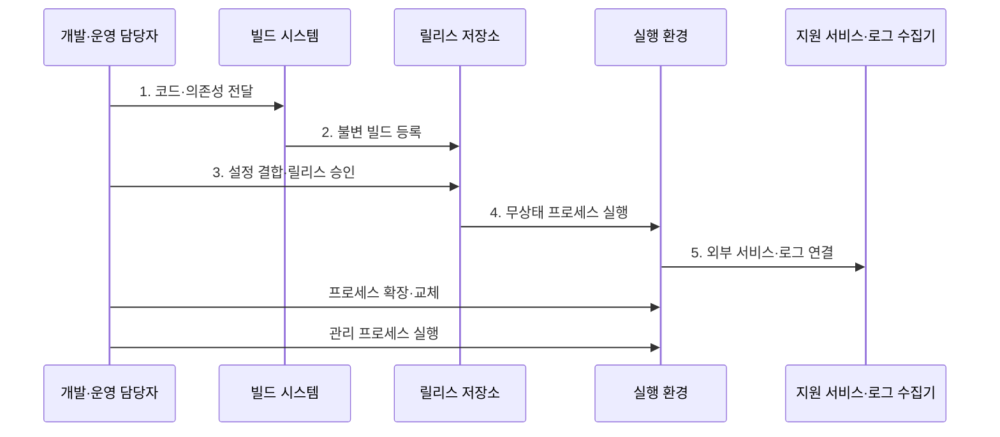

---
sidebar:
  order: 45
  label: "045. 12 팩터 앱 (12 Factor App)"
  badge:
    text: "기출 · 50%"
    variant: note
title: "12 팩터 앱 (12 Factor App)"
date: "2026-07-30T18:00:00+09:00"
tags:
  - "notes-software"
weight: 45
extra:
  question_no: "045"
  source_status: "기출"
  source_history: "123회"
  priority: 50
  priority_note: "123회 기출, 클라우드 앱 운영 원칙"
---

## 미리 알고가기

- **열두 팩터 앱(12 Factor App)**: 클라우드 애플리케이션의 반복 배포·수평 확장·인스턴스 교체를 위한 열두 가지 설계 원칙
- **코드베이스(Codebase)**: 버전 관리되는 하나의 원본에서 여러 환경의 배포를 만드는 기반
- **의존성(Dependencies)**: 실행에 필요한 라이브러리를 명시적으로 선언하고 격리한 목록
- **설정(Config)**: 자격 증명·주소처럼 배포 환경마다 달라 코드 밖에서 주입하는 값
- **지원 서비스(Backing Services)**: 데이터베이스·메시지 큐·캐시처럼 연결 자원으로 취급하는 외부 서비스
- **빌드·릴리스·실행(Build, Release, Run)**: 코드를 실행 묶음으로 만들고 설정을 결합해 프로세스로 시작하는 분리 단계
- **무상태 프로세스(Stateless Processes)**: 프로세스끼리 상태를 공유하지 않고 영구 데이터는 지원 서비스에 보관하는 실행 단위
- **포트 바인딩(Port Binding)**: 별도 웹 서버 주입 없이 애플리케이션이 포트를 열어 서비스를 공개하는 방식
- **동시성(Concurrency)**: 작업 유형별 프로세스 수를 늘려 여러 작업을 동시에 처리하는 수평 확장 방식
- **폐기 용이성(Disposability)**: 빠르게 시작하고 정상 종료해 프로세스를 안전하게 교체하는 성질
- **개발·운영 환경 동등성(Development/Production Parity, Dev/Prod Parity)**: 개발·스테이징·운영 환경의 배포 간격·담당자·지원 서비스 차이를 최소화하는 원칙
- **로그 스트림(Log Stream)**: 로그를 파일로 관리하지 않고 표준 출력의 이벤트 흐름으로 내보내는 방식
- **관리 프로세스(Admin Processes)**: 데이터 이관 같은 일회성 작업을 같은 코드·설정 환경에서 실행하는 프로세스
- **응용 프로그래밍 인터페이스(Application Programming Interface, API)**: 서비스 기능을 호출하기 위한 요청·응답 규칙과 데이터 계약
- **버전 관리(Version Control)**: 코드 변경 이력과 버전을 저장해 하나의 코드베이스에서 여러 환경의 배포를 재현하게 하는 관리
- **스테이징 환경(Staging Environment)**: 운영 배포 전에 실제 운영과 유사한 설정·지원 서비스로 릴리스를 검증하는 환경
- **수평 확장(Horizontal Scaling)**: 같은 프로세스 인스턴스 수를 늘려 요청을 병렬 처리하는 확장 방식
- **불변 빌드(Immutable Build)**: 생성 뒤 내용이 바뀌지 않는 실행 묶음으로서 같은 산출물을 환경별 설정과 결합해 승격한다.
- **표준 출력(Standard Output)**: 프로세스의 기본 출력 스트림으로서 로그를 로컬 파일이 아닌 외부 수집기에 전달하는 경로
- **세션 외부화(Session Externalization)**: 로그인·사용자 상태를 프로세스 메모리 밖의 공유 지원 서비스에 저장해 어느 복제 프로세스도 요청을 처리하게 하는 방식
- **컨테이너 이미지·승격(Container Image·Promotion)**: 이미지는 코드와 의존성을 담은 불변 실행 묶음이고 승격은 검증한 같은 이미지를 상위 환경에 배포하는 과정
- **자격 증명(Credential)**: 데이터베이스 비밀번호·API 키처럼 지원 서비스 접근 권한을 증명하며 코드가 아니라 환경 설정으로 주입해야 하는 비밀값
- **정상 종료(Graceful Shutdown)**: 새 요청 수신을 멈추고 진행 중인 작업을 마친 뒤 자원을 해제해 프로세스를 안전하게 교체하는 종료 방식

## Ⅰ. 개요

- 정의/개념: 클라우드 앱의 **배포·확장·교체 가능성**을 위한 12개 원칙
- 배경/필요성: 서버별 설정·상태 결합의 **이동·확장 제한** 해소

### 쉽게 이해하기 (학습용)

- 같은 조리법으로 지점을 늘리려면 지점 설정과 재료 창고를 조리대 밖에서 따로 관리해야 한다

## Ⅱ. 특징

- **코드·의존성 명시**로 빌드 재현
- **무상태 프로세스**로 수평 확장·교체
- **환경 차이 축소**로 같은 릴리스 승격

### 쉽게 이해하기 (학습용)

- 서버 안에 고유한 설정과 데이터를 남기지 않아 같은 실행 묶음을 어디서든 복제하고 교체한다

## Ⅲ. 구조 및 구성요소

| 구성요소 | 책임 |
|:---|:---|
| 코드베이스·의존성 | 버전 원본·실행 라이브러리 명시 |
| 설정·지원 서비스 | 환경값 주입·영구 상태 외부화 |
| 빌드·릴리스·실행 | 불변 산출물·설정·실행 분리 |
| 프로세스·동시성 | 무상태 단위 복제로 수평 확장 |
| 폐기·로그·관리 작업 | 교체·출력·일회성 작업 통제 |

### 쉽게 이해하기 (학습용)

- 조리법, 지점 설정, 포장 단계, 복제 조리대, 운영 규칙으로 구성된다.

## Ⅳ. 흐름도

**동작 원리**

- **1. 코드·의존성 전달**: 하나의 버전 원본 사용
- **2. 불변 빌드 등록**: 실행 묶음을 버전별 보관
- **3. 설정 결합·릴리스 승인**: 환경값만 별도 주입
- **4. 무상태 프로세스 실행**: 로컬 상태 없이 시작
- **5. 외부 서비스·로그 연결**: 영구 상태·출력 외부화

### 쉽게 이해하기 (학습용)

- 한 번 만든 포장에 지점별 주소표만 붙여 실행하므로 같은 포장을 늘리거나 새 포장으로 바꿀 수 있다

## Ⅴ. 종류 및 비교

| 애플리케이션 운영 구조 | 12 팩터 앱 | 서버 결합형 앱 |
|:---|:---|:---|
| 적용 기준 | 반복 배포·**환경 이동·수평 확장** | 고정 서버·**드문 배포** |
| 핵심 특징 | 상태 외부화·**불변 빌드·설정 주입** | 서버 상태·**설정·설치 결합** |
| 한계 | 외부 자원 의존·**상태 이전** | 서버 편차·**교체·확장 복잡도** |

> 요약: 반복 배포·수평 확장 필요성으로 운영 구조 선택

### 쉽게 이해하기 (학습용)

- 자주 복제하고 바꿀 서버는 짐을 외부에 두고, 고정 서버는 서버 안의 설정과 상태를 유지할 수 있다

## Ⅵ. 실무 고려사항 및 대책

| 고려사항 | 대책 | 효과 |
|:---|:---|:---|
| 비밀값을 코드·이미지·로그에 포함 | 설정 외부 주입·비밀 저장소·노출 검사·순환 | 자격 증명 유출 방지 |
| 프로세스 로컬 세션·파일로 수평 확장 실패 | 세션·영구 데이터를 지원 서비스로 외부화 | 어느 인스턴스나 요청 처리 |
| 환경마다 다른 빌드를 다시 생성 | 검증한 불변 빌드를 설정만 바꿔 승격 | 배포 재현성 확보 |
| 종료 신호 즉시 강제 종료로 요청·메시지 유실 | 준비 상태 해제·새 요청 차단·진행 작업 완료·시간 제한 | 안전한 프로세스 교체 |
| 관리 작업이 운영 코드·설정과 다름 | 같은 릴리스·자격 증명·감사 기록으로 일회성 실행 | 이관 결과 일관성 |

### 적용 사례

- 로그인 세션의 외부 저장으로 **동일 프로세스 복제·요청 분산**

### 쉽게 이해하기 (학습용)

- 컨테이너가 로그인 상태를 품지 않으면 같은 프로세스를 여러 개 띄워 요청을 나눌 수 있다

## Ⅶ. 결론

- **로컬 상태·환경 설정**을 외부화해 12 팩터 앱으로 설계

### 쉽게 이해하기 (학습용)

- 서버를 자주 바꾸거나 늘리려면 서버마다 남은 데이터와 설정부터 외부로 옮긴다
