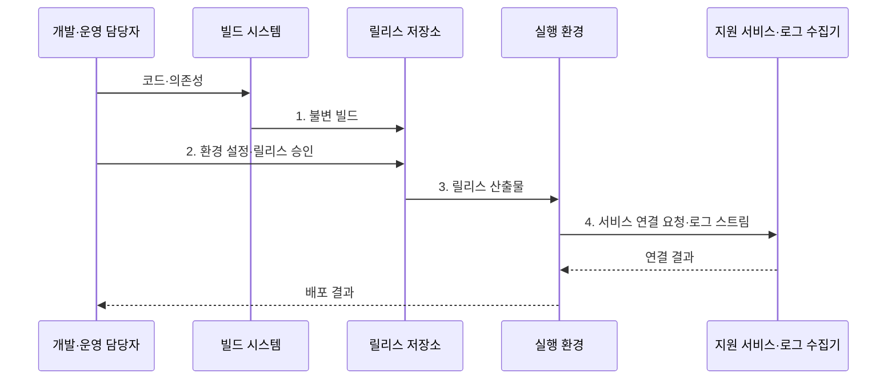

---
sidebar:
  order: 45
  label: "045. 12 팩터 앱 (12 Factor App)"
  badge:
    text: "기출 · 50%"
    variant: note
title: "12 팩터 앱 (12 Factor App)"
date: "2026-08-02T12:00:00+09:00"
tags:
  - "notes-software"
weight: 45
extra:
  question_no: "045"
  source_status: "기출"
  source_history: "123회"
  priority: 50
  priority_note: "123회 기출, 클라우드 앱 운영 원칙"
---

## Ⅰ. 개요

핵심 용어

- **열두 팩터 앱(12 Factor App)**: 클라우드 애플리케이션의 반복 배포·수평 확장·인스턴스 교체를 위한 열두 가지 설계 원칙이다.
- **수평 확장(Horizontal Scaling)**: 같은 프로세스 인스턴스 수를 늘려 요청을 병렬 처리하는 확장 방식이다.

- 정의/개념: **열두 팩터 앱**은 클라우드 애플리케이션을 반복 배포•수평 확장•교체하기 위한 **열두 가지 운영 설계 원칙**
- 배경/필요성: 서버별 설정·상태 결합으로 **재배포·수평 확장 제약**

### 쉽게 이해하기 (학습용)

- 같은 조리법으로 지점을 늘리려면 지점 설정과 재료 창고를 조리대 밖에서 따로 관리해야 한다

## Ⅱ. 특징

핵심 용어

- **코드베이스(Codebase)**: 버전 관리되는 하나의 원본에서 여러 환경의 배포를 만드는 기반이다.
- **의존성(Dependencies)**: 실행에 필요한 라이브러리를 명시적으로 선언하고 격리한 목록이다.
- **무상태 프로세스(Stateless Processes)**: 영구 데이터를 외부 지원 서비스에 보관해 서로 상태를 공유하지 않는 실행 단위다.
- **개발·운영 환경 동등성(Development/Production Parity, Dev/Prod Parity)**: 개발·스테이징·운영 환경의 차이를 최소화하는 원칙이다.

- **코드·의존성 명시**로 빌드 재현
- **무상태 프로세스**로 수평 확장·교체
- **환경 차이 축소**로 같은 릴리스 승격

### 쉽게 이해하기 (학습용)

- 서버 안에 고유한 설정과 데이터를 남기지 않아 같은 실행 묶음을 어디서든 복제하고 교체한다

## Ⅲ. 구조 및 구성요소

핵심 용어

- **설정(Config)**: 자격 증명·주소처럼 배포 환경마다 달라 코드 밖에서 주입하는 값이다.
- **지원 서비스(Backing Services)**: 데이터베이스·메시지 큐·캐시처럼 연결 자원으로 취급하는 외부 서비스다.
- **빌드·릴리스·실행(Build, Release, Run)**: 코드 산출물 생성·설정 결합·프로세스 시작을 분리한 단계다.
- **포트 바인딩(Port Binding)**: 애플리케이션이 직접 포트를 열어 서비스를 공개하는 방식이다.

| 구성요소 | 책임 |
|:---|:---|
| 코드베이스·의존성 | **버전 관리 코드베이스·의존성** 명시 |
| 설정·지원 서비스 | **환경 설정 주입·영구 상태 외부화** |
| 빌드·릴리스·실행 | **불변 빌드·설정·실행** 단계 분리 |
| 프로세스·동시성 | **무상태·포트 바인딩** 단위의 수평 확장 |
| 폐기·로그·관리 작업 | **정상 종료·로그 스트림**과 일회성 작업 통제 |

### 쉽게 이해하기 (학습용)

- 조리법, 지점 설정, 포장 단계, 복제 조리대, 운영 규칙으로 구성된다.

## Ⅳ. 흐름도

핵심 용어

- **불변 빌드(Immutable Build)**: 생성 뒤 내용을 바꾸지 않고 같은 산출물을 환경별 설정과 결합해 승격하는 실행 묶음이다.
- **로그 스트림(Log Stream)**: 로그를 로컬 파일로 관리하지 않고 표준 출력의 이벤트 흐름으로 내보내는 방식이다.
- **승격(Promotion)**: 검증한 동일 빌드를 설정만 바꿔 상위 환경에 배포하는 과정이다.

**동작 원리**

1. **불변 빌드**: 코드와 의존성을 변경 불가능한 산출물로 보관
2. **환경 설정·릴리스 승인**: 같은 빌드에 배포별 설정만 결합
3. **릴리스 산출물**: 무상태 프로세스로 실행 환경에 승격
4. **서비스 연결 요청·로그 스트림**: 영구 상태와 출력을 외부화

### 쉽게 이해하기 (학습용)

- 한 번 만든 포장에 지점별 주소표만 붙여 실행하므로 같은 포장을 늘리거나 새 포장으로 바꿀 수 있다

## Ⅴ. 종류 및 비교

핵심 용어

- **서버 결합형 앱**: 설정·설치·실행 상태를 특정 서버에 보존해 교체와 확장이 어려운 운영 구조다.
- **상태 외부화**: 세션과 영구 데이터를 프로세스 밖의 공유 지원 서비스에 저장하는 방식이다.

| 애플리케이션 운영 구조 | 12 팩터 앱 | 서버 결합형 앱 |
|:---|:---|:---|
| 적용 기준 | 반복 배포·**환경 이동·수평 확장** | 고정 서버·**드문 배포** |
| 핵심 특징 | 상태 외부화·**불변 빌드·설정 주입** | 서버 상태·**설정·설치 결합** |
| 한계 | 외부 자원 의존·**상태 이전** | 서버 편차·**교체·확장 복잡도** |

> 요약: **반복 배포·수평 확장** 필요성으로 운영 구조 선택

### 쉽게 이해하기 (학습용)

- 자주 복제하고 바꿀 서버는 짐을 외부에 두고, 고정 서버는 서버 안의 설정과 상태를 유지할 수 있다

## Ⅵ. 실무 고려사항 및 대책

핵심 용어

- **자격 증명(Credential)**: 데이터베이스 비밀번호·API 키처럼 지원 서비스 접근 권한을 증명하는 비밀값이다.
- **세션 외부화(Session Externalization)**: 사용자 상태를 공유 지원 서비스에 저장해 어느 복제 프로세스도 요청을 처리하게 하는 방식이다.
- **정상 종료(Graceful Shutdown)**: 새 요청을 막고 진행 작업을 마친 뒤 자원을 해제해 프로세스를 안전하게 교체하는 방식이다.
- **관리 프로세스(Admin Processes)**: 데이터 이관 같은 일회성 작업을 같은 코드·설정 환경에서 실행하는 프로세스다.

| 문제 | 대책 | 효과 |
|:---|:---|:---|
| 비밀값을 코드·이미지·로그에 포함 | **설정 외부 주입·비밀 저장소·노출 검사** | **자격 증명 유출** 방지 |
| 프로세스 로컬 세션·파일로 수평 확장 실패 | **세션·영구 데이터**를 지원 서비스로 외부화 | 모든 **인스턴스의 요청 처리** 허용 |
| 환경마다 다른 빌드를 다시 생성 | 검증한 **불변 빌드**를 설정만 바꿔 승격 | **배포 재현성** 확보 |
| 종료 신호로 즉시 종료해 요청·메시지 유실 | **새 요청 차단·진행 작업 완료·시간 제한** | 안전한 **프로세스 교체** |
| 관리 작업이 운영 코드·설정과 다름 | 같은 **릴리스·자격 증명**으로 일회성 작업 실행 | **이관 결과 일관성** 확보 |

### 쉽게 이해하기 (학습용)

- 컨테이너가 로그인 상태를 품지 않으면 같은 프로세스를 여러 개 띄워 요청을 나눌 수 있다

## Ⅶ. 결론

핵심 용어

- **설정 외부화**: 배포마다 달라지는 설정을 코드와 빌드 밖에서 주입하는 원칙이다.
- **반복 배포**: 동일한 코드와 불변 빌드를 여러 환경과 인스턴스에 재현 가능하게 배포하는 능력이다.

- **반복 배포·수평 확장**이 필요하면 상태·설정을 외부화한 **12 팩터 앱** 선택

### 쉽게 이해하기 (학습용)

- 서버를 자주 바꾸거나 늘리려면 서버마다 남은 데이터와 설정부터 외부로 옮긴다
