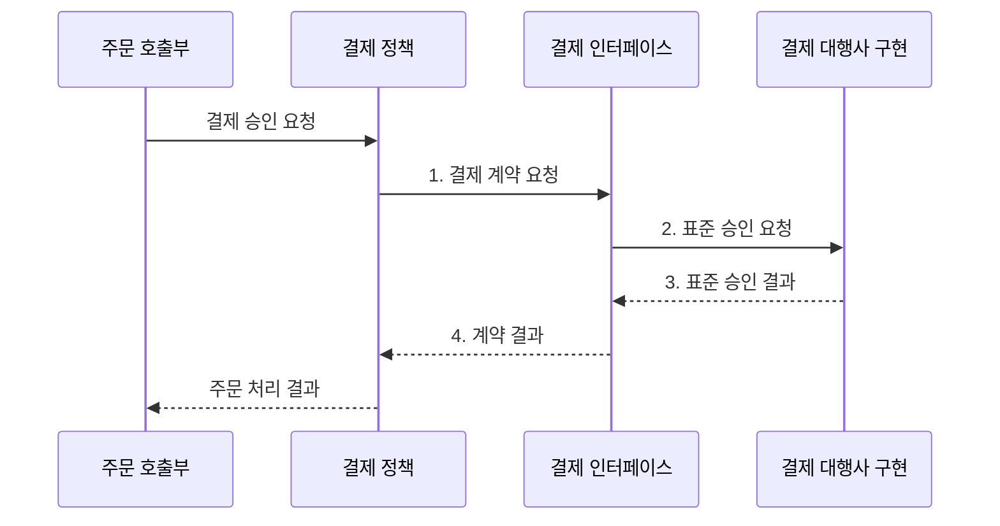

---
sidebar:
  order: 46
  label: "046. SOLID 원칙 (SOLID Principles)"
  badge:
    text: "기출 • 70%"
    variant: note
title: "SOLID 원칙 (SOLID Principles)"
date: "2026-08-05T01:01:42+09:00"
tags:
  - "notes-software"
weight: 46
extra:
  question_no: "046"
  source_status: "기출"
  source_history: "128회, 132회"
  priority: 70
  priority_note: "128•132회 반복, 객체 설계 책임 원칙"
---

## Ⅰ. 개요

<details>
<summary>핵심 용어</summary>

- **솔리드 원칙(SOLID Principles)**: 객체의 책임•확장•치환•인터페이스•의존 방향을 통제하는 다섯 객체지향 설계 원칙이다.
- **책임 경계**: 같은 변경 주체와 이유에 따라 함께 바뀌는 코드를 하나의 모듈로 묶는 범위다.

</details>

- 정의/개념: **SOLID** 는 객체의 책임•확장•치환•인터페이스•의존 방향을 통제해 변경 영향을 줄이는 **다섯 가지 객체지향 설계 원칙**
- 배경/필요성: 구체 구현 결합•다중 책임으로 **변경 범위•기존 기능 오류 확대**

#### 한줄 요약

- 부품의 역할과 연결 규격을 나눠 자주 바뀌는 부품을 교체해도 주변 부품은 그대로 두는 규칙이다.

## Ⅱ. 특징

<details>
<summary>핵심 용어</summary>

- **변경 이유**: 모듈을 수정하도록 요구하는 업무 주체와 목적이다.
- **치환 가능성**: 하위 구현을 상위 계약 자리에 넣어도 호출자의 기대 동작이 유지되는 성질이다.
- **추상화(Abstraction)**: 구현 세부를 숨기고 상위 정책이 요구하는 기능 계약만 표현하는 경계다.

</details>

- **변경 이유 분리** 로 클래스 책임 경계 명확화
- **계약•치환 가능성** 으로 구현 교체 시 호출부 보호
- **추상화 의존** 으로 고수준 정책과 저수준 구현 분리

#### 한줄 요약

- 자주 바뀌는 연결부만 규격으로 분리해야 하며 모든 코드에 추상화를 넣으면 오히려 따라가기 어렵다.

## Ⅲ. 구조 및 구성요소

<details>
<summary>핵심 용어</summary>

- **단일 책임 원칙(Single Responsibility Principle, SRP)**: 하나의 변경 주체와 이유에 관한 책임을 한 모듈에 모으는 원칙이다.
- **개방•폐쇄 원칙(Open-Closed Principle, OCP)**: 기존 코드를 수정하지 않고 새 구현을 추가해 동작을 확장하는 원칙이다.
- **리스코프 치환 원칙(Liskov Substitution Principle, LSP)**: 하위 타입이 상위 타입 계약을 지켜 안전하게 대체되게 하는 원칙이다.
- **인터페이스 분리 원칙(Interface Segregation Principle, ISP)**: 호출자가 쓰지 않는 기능에 의존하지 않게 인터페이스를 나누는 원칙이다.
- **의존 역전 원칙(Dependency Inversion Principle, DIP)**: 상위 정책과 하위 구현이 모두 정책이 소유한 추상화에 의존하게 하는 원칙이다.

</details>

```text
+------------------------------ SOLID 원칙 ------------------------------+
|                                                                        |
|        [SRP]        [OCP]        [LSP]        [ISP]        [DIP]       |
|                                                                        |
+------------------------------------------------------------------------+
```

선의 의미: 바깥 경계선은 SRP•OCP•LSP•ISP•DIP가 SOLID를 구성하는 동등한 다섯 설계 원칙임을 뜻한다.

| 구성요소 | 책임 |
|:---|:---|
| SRP | 같은 변경 이유의 **단일 책임** 응집 |
| OCP | 기존 분기 수정 없이 **새 구현 추가** |
| LSP | 상위 타입의 **치환 계약** 보존 |
| ISP | 호출자별 **최소 인터페이스** 제공 |
| DIP | 상위 정책이 소유한 **추상화 의존** |

#### 한줄 요약

- 역할, 확장, 교체 규격, 작은 연결부, 의존 방향의 다섯 원칙이다.

## Ⅳ. 흐름도

<details>
<summary>핵심 용어</summary>

- **결제 대행사(Payment Provider)**: 결제 승인•취소를 제공하며 공통 인터페이스 뒤에서 교체되는 구현체다.
- **계약 결과**: 공급자별 형식을 숨기고 상위 정책이 정의한 입력•출력 규칙으로 반환하는 결과다.

</details>



**동작 원리**

1. **결제 계약 요청**: 상위 정책이 소유한 추상화 호출
2. **표준 승인 요청**: 설정된 대행사 구현에 공통 입력 전달
3. **표준 승인 결과**: 치환 계약에 맞춘 결과 반환
4. **계약 결과**: 공급자별 형식을 숨긴 정책 결과 확정

#### 한줄 요약

- 역할별 부품을 나누고 교체 부품이 지킬 최소 규격을 정책 쪽에서 정해 구현을 연결한다.

## Ⅴ. 종류 및 비교

<details>
<summary>핵심 용어</summary>

- **직접 결합**: 호출부가 추상화 없이 구체 구현의 이름과 동작에 바로 의존하는 구조다.
- **연쇄 수정**: 한 구현 변경이 의존하는 여러 호출부와 모듈의 동시 수정을 요구하는 현상이다.

</details>

| 객체 설계 구조 | SOLID 적용 | 직접 결합 |
|:---|:---|:---|
| 적용 기준 | 구현 교체•**변경 이유 반복** | 단순 책임•**고정 구현** |
| 핵심 특징 | 책임•계약•**정책 추상화** | 호출부의 **구체 구현 직접 의존** |
| 한계 | 추상화•인터페이스 **과잉** | 책임 혼합•**연쇄 수정** |

> 요약: **고정 구현** 은 직접 결합, **반복 변경 경계** 는 SOLID 적용

#### 한줄 요약

- 고정 부품은 직접 잇고 자주 바뀌는 부품은 규격 단자로 잇는다.

## Ⅵ. 실무 고려사항 및 대책

<details>
<summary>핵심 용어</summary>

- **과잉 설계(Overengineering)**: 실제 변경 가능성보다 많은 추상화•계층•확장 지점을 미리 만드는 설계다.
- **계약 시험(Contract Test)**: 여러 구현이 같은 입력•출력•오류•상태 규칙을 지키는지 공통 시험으로 검증하는 방식이다.
- **선행조건(Precondition)**: 호출 전에 충족해야 하는 계약 규칙이다.
- **후행조건(Postcondition)**: 호출 뒤에 보장해야 하는 계약 규칙이다.
- **불변식(Invariant)**: 객체 수명 동안 유지해야 하는 계약 규칙이다.
- **응집도(Cohesion)**: 서로 관련된 책임과 변경 이유가 한 모듈 안에 함께 모여 있는 정도다.
- **확장점(Extension Point)**: 기존 호출부를 바꾸지 않고 새 구현이나 동작을 연결하도록 마련한 계약 지점이다.
- **인터페이스 소유(Interface Ownership)**: 상위 업무 정책이 필요한 계약을 정의하는 원칙이다.
- **의존 방향(Dependency Direction)**: 구체 구현에서 상위 정책의 계약으로 향하는 관계다.

</details>

| 문제 | 대책 | 효과 |
|:---|:---|:---|
| 클래스 크기만 보고 SRP를 적용해 책임을 과도하게 분산 | **변경 주체•변경 이유** 로 책임 경계 결정 | **응집된 책임** 유지 |
| 미래 요구를 예상해 인터페이스•계층을 과도하게 생성 | 반복 변경과 두 번째 구현에서 **확장점 추출** | **과잉 설계** 방지 |
| 하위 구현이 예외•부작용•입력 범위를 달리해 LSP 위반 | **계약 시험** 으로 선행•후행조건•불변식 검증 | 안전한 **구현 치환** |
| 큰 공용 인터페이스가 호출자별 불필요한 의존 생성 | 실제 사용 기능 단위로 **인터페이스 분리** | **변경 전파 범위** 축소 |
| 추상화가 하위 구현 용어로 오염 | 상위 업무 정책이 **인터페이스 소유** | **의존 방향** 유지 |

#### 한줄 요약

- 결제 대행사가 바뀌어도 같은 결제 규격을 지키는 구현만 갈아 끼운다

## Ⅶ. 결론

<details>
<summary>핵심 용어</summary>

- **반복 변경 경계**: 여러 번 바뀌는 구현과 책임을 추상화로 분리할 가치가 있는 지점이다.
- **고정 구현**: 변경 가능성과 두 번째 구현이 없어 직접 결합이 더 단순한 코드다.

</details>

- **반복 변경 경계** 에는 SOLID, 단순 고정 구현에는 **직접 결합** 선택

#### 한줄 요약

- 자주 바뀌는 연결부만 규격으로 분리하고 고정된 단순 코드는 직접 연결한다.
