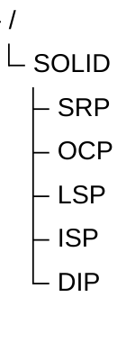
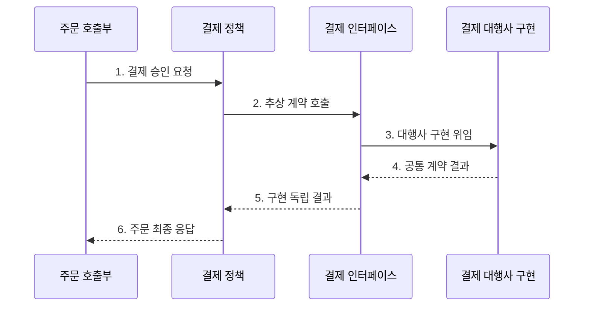

---
sidebar:
  order: 46
  label: "046. SOLID 원칙 (SOLID Principles)"
  badge:
    text: "기출 · 70%"
    variant: note
title: "SOLID 원칙 (SOLID Principles)"
date: "2026-07-27T23:59:59+09:00"
tags:
  - "notes-software"
weight: 46
extra:
  question_no: "046"
  source_status: "기출"
  source_history: "128회, 132회"
  priority: 70
  priority_note: "128·132회 반복, 객체 설계 책임 원칙"
---

## 미리 알고가기

- **솔리드 원칙(SOLID Principles)**: 객체의 책임·확장·치환·인터페이스·의존 방향을 통제하는 다섯 가지 객체지향 설계 원칙
- **단일 책임 원칙(Single Responsibility Principle, SRP)**: 하나의 변경 주체와 변경 이유에 관한 책임을 한 모듈에 모으는 원칙
- **개방·폐쇄 원칙(Open-Closed Principle, OCP)**: 기존 코드를 수정하지 않고 새 구현을 추가해 동작을 확장하는 원칙
- **리스코프 치환 원칙(Liskov Substitution Principle, LSP)**: 하위 타입이 상위 타입의 계약을 지켜 대체 가능하도록 하는 원칙
- **인터페이스 분리 원칙(Interface Segregation Principle, ISP)**: 클라이언트가 사용하지 않는 기능에 의존하지 않도록 인터페이스를 분리하는 원칙
- **의존 역전 원칙(Dependency Inversion Principle, DIP)**: 상위 정책과 하위 구현이 모두 추상화에 의존하도록 하는 원칙
- **결합도·응집도(Coupling and Cohesion)**: 모듈 사이 의존 정도와 한 모듈 내부 책임의 관련 정도
- **선행조건·후행조건·불변식(Precondition·Postcondition·Invariant)**: 선행조건은 호출 전 요구, 후행조건은 호출 후 보장, 불변식은 객체 수명 동안 유지할 규칙으로서 하위 타입이 강화·약화해 상위 계약을 깨면 LSP를 위반한다.
- **상위·하위 타입(Supertype·Subtype)**: 상위 타입은 공통 계약을 정의하고 하위 타입은 이를 확장해도 호출자가 같은 계약으로 안전하게 대체할 수 있어야 한다.
- **추상화(Abstraction)**: 구체 구현의 세부를 숨기고 상위 정책이 필요한 기능 계약만 표현해 의존 방향을 정책 쪽으로 뒤집는 경계
- **모듈·호출부(Module·Caller)**: 모듈은 관련 책임을 묶은 코드 단위이고 호출부는 그 기능을 사용하므로 구체 구현에 직접 의존하면 변경이 연쇄 전파됨
- **분기문(Conditional Branch)**: 조건에 따라 구현을 선택하는 코드로서 새 구현마다 기존 분기를 수정해야 하면 OCP 적용 후보가 됨
- **결제 대행사(Payment Provider)**: 실제 결제 승인·취소 기능을 제공하며 공통 결제 인터페이스 뒤의 교체 가능한 DIP 구현체
- **계약 시험(Contract Test)**: 여러 구현이 같은 입력·출력·오류·상태 규칙을 지키는지 공통 시험으로 검증하는 방식
- **과잉 설계(Overengineering)**: 실제 변경 가능성보다 많은 추상화·계층·확장 지점을 미리 만들어 이해·수정 비용을 높이는 설계

## Ⅰ. 개요

- 정의/개념: 객체 설계의 **책임·계약·의존 방향**을 통제하는 5원칙
- 배경/필요성: 구체 구현·다중 책임의 **변경 전파** 축소

### 쉽게 이해하기 (학습용)

- 부품의 역할과 연결 규격을 나눠 자주 바뀌는 부품을 교체해도 주변 부품은 그대로 두는 규칙이다.

## Ⅱ. 특징

- **변경 이유 분리**로 클래스 책임 경계 명확화
- **계약·대체 가능성**으로 구현 교체 시 호출부 보호
- **추상화 의존**으로 고수준 정책과 저수준 구현 분리

### 쉽게 이해하기 (학습용)

- 자주 바뀌는 연결부만 규격으로 분리해야 하며 모든 코드에 추상화를 넣으면 오히려 따라가기 어렵다.

## Ⅲ. 구조 및 구성요소

| 구성요소 | 책임 |
|:---|:---|
| SRP | 같은 변경 이유의 책임 응집 |
| OCP | 기존 수정 없이 구현 확장 |
| LSP | 상위 타입의 치환 계약 보존 |
| ISP | 호출자별 최소 인터페이스 제공 |
| DIP | 상위 정책이 소유한 추상화 의존 |

### 쉽게 이해하기 (학습용)

- 역할, 확장, 교체 규격, 작은 연결부, 의존 방향의 다섯 원칙이다.

## Ⅳ. 흐름도

**동작 원리**

- **1. 결제 승인 요청**: 호출부가 상위 정책 실행
- **2. 추상 계약 호출**: 정책 소유 인터페이스 사용
- **3. 대행사 구현 위임**: 설정된 구현 선택
- **4. 공통 계약 결과**: 치환 규칙을 지켜 반환
- **5. 구현 독립 결과**: 공급자 세부 형식 은닉
- **6. 주문 최종 응답**: 업무 성공·실패 결정

### 쉽게 이해하기 (학습용)

- 역할별 부품을 나누고 교체 부품이 지킬 최소 규격을 정책 쪽에서 정해 구현을 연결한다.

## Ⅴ. 종류 및 비교

| 객체 설계 구조 | SOLID 적용 | 직접 결합 |
|:---|:---|:---|
| 적용 기준 | 구현 교체·**변경 이유 반복** | 단순 책임·**고정 구현** |
| 핵심 특징 | 책임·계약·**정책 추상화** | 호출부의 **구체 구현 직접 의존** |
| 한계 | 추상화·인터페이스 **과잉** | 책임 혼합·**연쇄 수정** |

> 요약: 고정 구현은 직접 결합, 반복 변경 경계는 원칙 적용

### 쉽게 이해하기 (학습용)

- 고정 부품은 직접 잇고 자주 바뀌는 부품은 규격 단자로 잇는다.

## Ⅵ. 실무 고려사항 및 대책

| 고려사항 | 대책 | 효과 |
|:---|:---|:---|
| 클래스 크기만 보고 SRP를 적용해 책임을 지나치게 분산 | 변경 주체·변경 이유·함께 바뀌는 코드로 경계 결정 | 응집된 책임 유지 |
| 모든 미래 요구를 예상해 인터페이스·계층 과잉 생성 | 반복된 실제 변경과 두 번째 구현이 생길 때 확장점 추출 | 과잉 설계 방지 |
| 하위 구현이 예외·부작용·입력 범위를 달리해 LSP 위반 | 공통 계약 시험으로 선행·후행조건·불변식 검증 | 안전한 구현 치환 |
| 큰 공용 인터페이스가 사용자별 불필요한 의존 생성 | 호출부가 실제 사용하는 기능 단위로 계약 분리 | 변경 전파 범위 축소 |
| 추상화가 하위 구현 용어로 오염 | 상위 업무 정책의 언어와 요구로 인터페이스 소유 | 의존 방향 유지 |

### 적용 사례

- 결제 서비스는 업무 정책이 소유한 결제 인터페이스 뒤에 대행사별 구현을 두어 공급자가 바뀌어도 주문 코드를 유지

### 쉽게 이해하기 (학습용)

- 결제 대행사가 바뀌어도 같은 결제 규격을 지키는 구현만 갈아 끼운다

## Ⅶ. 결론

- **반복 변경·추상화 비용**을 보고 SOLID를 선택 적용

### 쉽게 이해하기 (학습용)

- 자주 바뀌는 연결부만 규격으로 분리하고 고정된 단순 코드는 직접 연결한다.
