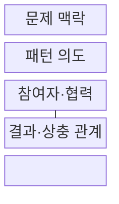
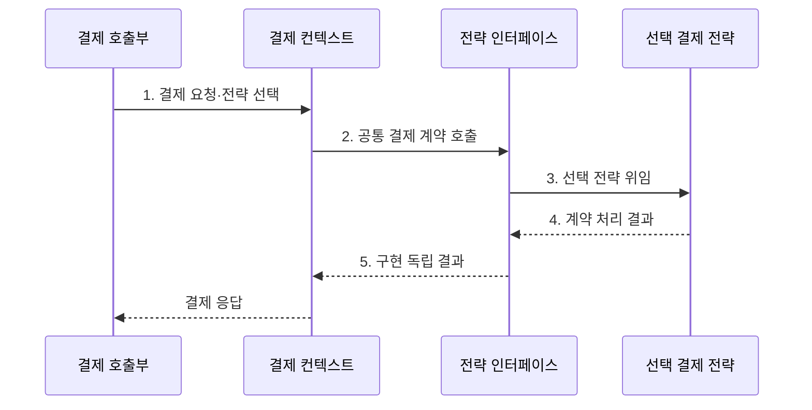

---
sidebar:
  order: 47
  label: "047. 디자인 패턴: GoF 23종 (Design Patterns GoF)"
  badge:
    text: "미출제 · 50%"
    variant: note
title: "디자인 패턴: GoF 23종 (Design Patterns GoF)"
date: "2026-07-30T18:00:00+09:00"
tags:
  - "notes-software"
weight: 47
extra:
  question_no: "047"
  source_status: "미출제"
  source_history: ""
  priority: 50
  priority_note: "GoF 패턴은 생성·구조·행위 선택 정본"
---

## 미리 알고가기

- **4인방(Gang of Four, GoF)**: 객체지향 디자인 패턴 23개를 체계화한 네 명의 저자
- **4인방 디자인 패턴(Gang of Four Design Patterns, GoF Patterns)**: 반복되는 객체 설계 문제의 역할·협력을 생성·구조·행위로 분류한 23개 설계 지침
- **패턴 의도(Intent)**: 패턴이 해결하려는 설계 문제와 보호할 변동 지점
- **적용 조건(Applicability)**: 패턴의 역할 분리가 현재 문제를 실제로 단순하게 만드는 상황과 제약
- **참여자·협력(Participants and Collaboration)**: 패턴을 이루는 객체의 책임과 객체 사이의 호출 관계
- **결과·상충 관계(Consequences and Trade-offs)**: 변경 분리 효과와 함께 추가되는 추상화·간접 호출 비용
- **추상 팩토리·빌더·팩토리 메서드(Abstract Factory·Builder·Factory Method)**: 추상 팩토리는 관련 객체군 생성 계약, 빌더는 복합 객체 조립 단계, 팩토리 메서드는 하위 타입이 생성할 객체를 정하는 메서드로 생성 책임을 분리한다.
- **프로토타입·싱글턴(Prototype·Singleton)**: 프로토타입은 기존 객체 복제로 새 객체를 만들고 싱글턴은 한 인스턴스와 전역 접근점을 제공하는 생성 패턴
- **어댑터·브리지·컴포지트·데코레이터(Adapter·Bridge·Composite·Decorator)**: 어댑터는 계약 변환, 브리지는 추상과 구현 분리, 컴포지트는 부분·전체의 동일 처리, 데코레이터는 감싼 객체에 기능을 동적으로 추가하는 구조 패턴
- **퍼사드·플라이웨이트·프록시(Facade·Flyweight·Proxy)**: 퍼사드는 단순 통합 창구, 플라이웨이트는 공유 상태로 객체 비용 절감, 프록시는 실제 객체 접근을 대신 제어하는 구조 패턴
- **책임 연쇄·커맨드·인터프리터·이터레이터(Chain of Responsibility·Command·Interpreter·Iterator)**: 책임 연쇄는 처리자 연결, 커맨드는 요청 객체화, 인터프리터는 문법 해석, 이터레이터는 내부 구조를 숨긴 순회 기능을 제공하는 행위 패턴
- **미디에이터·메멘토·옵서버·상태(Mediator·Memento·Observer·State)**: 미디에이터는 객체 간 협력 중재, 메멘토는 내부 상태 복원, 옵서버는 상태 변화 통지, 상태는 내부 상태별 행위 변경을 제공하는 행위 패턴
- **전략·템플릿 메서드·비지터(Strategy·Template Method·Visitor)**: 전략은 알고리즘 교체, 템플릿 메서드는 절차 뼈대와 일부 단계 확장, 비지터는 객체 구조와 새 연산을 분리하는 행위 패턴
- **패턴 중독(Patternitis)**: 실제 반복 문제 없이 패턴을 과도하게 적용해 객체·계층·간접 호출만 늘어난 상태
- **아키텍처 결정 기록(Architecture Decision Record, ADR)**: 설계 문제·대안·선택 이유·상충 관계를 짧게 보존하는 문서

## Ⅰ. 개요

- 정의/개념: 객체 역할·협력을 정리한 23개 패턴
- 배경/필요성: 반복 변경으로 얽힌 생성·조합·협력 책임 분리

### 쉽게 이해하기 (학습용)

- 완성 코드를 베끼는 대신 자주 생기는 설계 문제의 역할 분담과 연결 방식을 재사용한다.

## Ⅱ. 특징

- **문제 맥락·의도**로 적용 조건 명세
- **객체 역할·협력**으로 관계 구조 재사용
- **결과·상충 관계**로 변경 이익과 비용 비교

### 쉽게 이해하기 (학습용)

- 같은 설계 문제가 반복될 때 역할 분담을 빌리며 문제가 없는데 패턴을 씌우면 부품만 늘어난다.

## Ⅲ. 구조 및 구성요소

| 구성요소 | 책임 |
|:---|:---|
| 문제 맥락 | 반복 변경·책임 충돌 상황 설명 |
| 패턴 의도 | 보호할 변동 지점·목표 정의 |
| 참여자·협력 | 객체별 책임·호출 관계 명시 |
| 결과·상충 관계 | 변경 이익·추상화 비용 비교 |

### 쉽게 이해하기 (학습용)

- 문제, 해결 목표, 역할 분담, 얻는 것과 비용으로 패턴을 설명한다.

## Ⅳ. 흐름도

**동작 원리**

- **1. 결제 요청·전략 선택**: 호출부가 조건 전달
- **2. 공통 결제 계약 호출**: 컨텍스트가 추상화 사용
- **3. 선택 전략 위임**: 해당 알고리즘 구현 실행
- **4. 계약 처리 결과**: 전략이 공통 형식 반환
- **5. 구현 독립 결과**: 구체 세부를 숨겨 전달

### 쉽게 이해하기 (학습용)

- 결제 방식이 달라져도 호출부는 같은 규격을 사용하고 선택된 전략 객체만 바뀐다.

## Ⅴ. 종류 및 비교

| 비교 항목 | 생성 패턴 | 구조 패턴 | 행위 패턴 |
|:---|:---|:---|:---|
| 적용 기준 | 생성 시점·구현체 변경 | 연결·표현·기능 추가 변경 | 알고리즘·상태·통지 흐름 변경 |
| 핵심 특징 | 객체 생성 책임 분리 | 객체 조합·인터페이스 분리 | 객체 협력·책임 분리 |
| 한계 | 생성 구조 과잉 | 래퍼·간접 계층 증가 | 협력 흐름 추적 난도 |

> 요약: 생성·연결·책임 협력으로 후보를 찾음

- 생성: 추상 팩토리·빌더·팩토리 메서드
- 생성: 프로토타입·싱글턴
- 구조: 어댑터·브리지·컴포지트·데코레이터
- 구조: 퍼사드·플라이웨이트·프록시
- 행위: 책임 연쇄·커맨드·인터프리터·이터레이터
- 행위: 미디에이터·메멘토·옵서버·상태
- 행위: 전략·템플릿 메서드·비지터

### 쉽게 이해하기 (학습용)

- 만드는 법, 부품을 잇는 법, 객체가 일을 주고받는 법 중 어디가 바뀌는지에 따라 범주를 선택한다.

## Ⅵ. 실무 고려사항 및 대책

| 고려사항 | 대책 | 효과 |
|:---|:---|:---|
| 패턴 이름부터 정하고 문제를 끼워 맞춤 | 반복 변경·결함·책임 충돌을 먼저 기술 | 문제 중심 패턴 선택 |
| 단일 구현인데 미래 가능성만으로 추상화 | 두 번째 구현·반복 변경이 확인될 때 역할 분리 | 패턴 중독 방지 |
| 이름은 같은 패턴이나 참여자 책임이 불명확 | 의도·적용 조건·참여자·협력을 ADR로 기록 | 팀 공통 이해 확보 |
| 패턴 적용 후 객체·호출 경로만 증가 | 변경 시 수정 파일 수·시험 범위·성능 비용 비교 | 실제 변경성 개선 검증 |
| 여러 패턴을 중첩해 실행 흐름 추적 곤란 | 핵심 변동 지점당 최소 패턴·관측 가능한 경계 유지 | 디버깅 복잡도 통제 |

### 적용 사례

- 결제 수단은 전략 패턴으로 공통 호출 계약과 카드·계좌·간편결제 알고리즘을 분리

### 쉽게 이해하기 (학습용)

- 결제 방식은 같은 호출 규격을 지키는 전략 객체만 갈아 끼운다

## Ⅶ. 결론

- **반복 변경·추상화 비용**을 비교해 최소 패턴만 적용

### 쉽게 이해하기 (학습용)

- 반복 문제를 더 작은 역할 구조로 풀 수 있을 때만 패턴을 쓰고 아니면 직접 설계를 유지한다.
