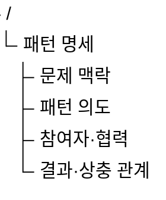
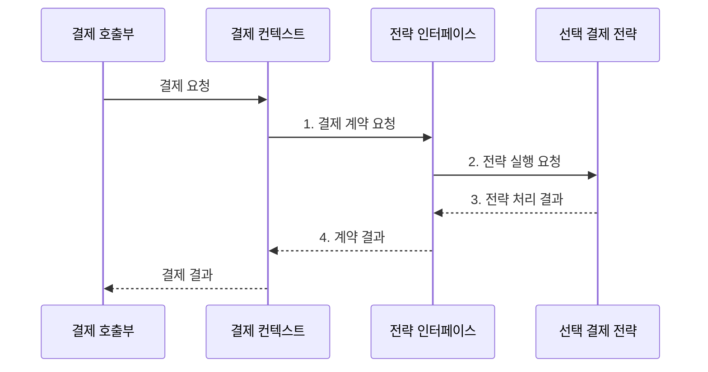

---
sidebar:
  order: 47
  label: "047. 디자인 패턴: GoF 23종 (Design Patterns GoF)"
  badge:
    text: "미출 · 50%"
    variant: note
title: "디자인 패턴: GoF 23종 (Design Patterns GoF)"
date: "2026-08-02T12:00:00+09:00"
tags:
  - "notes-software"
weight: 47
extra:
  question_no: "047"
  source_status: "미출"
  source_history: ""
  priority: 50
  priority_note: "GoF 패턴은 생성·구조·행위 선택 정본"
---

## Ⅰ. 개요

핵심 용어

- **4인방 디자인 패턴(Gang of Four Design Patterns, GoF Patterns)**: 반복 객체 설계 문제의 역할·협력을 생성·구조·행위로 분류한 23개 설계 지침이다.
- **4인방(Gang of Four, GoF)**: 객체지향 디자인 패턴 23개를 체계화한 네 명의 저자다.

- 정의/개념: **GoF 디자인 패턴**은 반복되는 객체 설계 문제의 역할과 협력 구조를 생성•구조•행위 범주로 정리한 **23개 객체지향 설계 패턴**
- 배경/필요성: 생성·조합·협력 책임이 얽혀 **반복 변경 범위 확대**

#### 한줄 요약

- 완성 코드를 베끼는 대신 자주 생기는 설계 문제의 역할 분담과 연결 방식을 재사용한다.

## Ⅱ. 특징

핵심 용어

- **패턴 의도(Intent)**: 패턴이 해결하려는 설계 문제와 보호할 변동 지점이다.
- **적용 조건(Applicability)**: 패턴의 역할 분리가 현재 문제를 실제로 단순하게 만드는 상황과 제약이다.
- **참여자·협력(Participants and Collaboration)**: 패턴을 이루는 객체의 책임과 호출 관계다.
- **결과·상충 관계(Consequences and Trade-offs)**: 변경 분리 효과와 추가되는 추상화·간접 호출 비용이다.

- **문제 맥락·의도**로 적용 조건 명세
- **객체 역할·협력**으로 관계 구조 재사용
- **결과·상충 관계**로 변경 이익과 비용 비교

#### 한줄 요약

- 같은 설계 문제가 반복될 때 역할 분담을 빌리며 문제가 없는데 패턴을 씌우면 부품만 늘어난다.

## Ⅲ. 구조 및 구성요소

핵심 용어

- **문제 맥락**: 반복되는 변경과 책임 충돌이 실제로 발생하는 설계 상황이다.
- **변동 지점**: 구현 교체나 요구 변경이 반복되어 패턴이 보호해야 하는 코드 경계다.

| 구성요소 | 책임 |
|:---|:---|
| 문제 맥락 | **반복 변경·책임 충돌** 상황 설명 |
| 패턴 의도 | 보호할 **변동 지점·목표** 정의 |
| 참여자·협력 | **객체별 책임·호출 관계** 명시 |
| 결과·상충 관계 | **변경 이익·추상화 비용** 비교 |

#### 한줄 요약

- 문제, 해결 목표, 역할 분담, 얻는 것과 비용으로 패턴을 설명한다.

## Ⅳ. 흐름도

핵심 용어

- **전략 패턴(Strategy Pattern)**: 알고리즘을 공통 인터페이스 뒤의 교체 가능한 객체로 분리하는 행위 패턴이다.
- **컨텍스트(Context)**: 선택된 전략을 보유하고 호출자 대신 공통 계약으로 알고리즘을 실행하는 객체다.

**동작 원리**

1. **결제 계약 요청**: 컨텍스트가 선택 조건으로 공통 계약 호출
2. **전략 실행 요청**: 선택된 결제 알고리즘에 입력 전달
3. **전략 처리 결과**: 전략이 공통 계약 형식으로 반환
4. **계약 결과**: 구체 구현 세부를 숨긴 결과 확정

#### 한줄 요약

- 결제 방식이 달라져도 호출부는 같은 규격을 사용하고 선택된 전략 객체만 바뀐다.

## Ⅴ. 종류 및 비교

핵심 용어

- **생성 패턴(Creational Pattern)**: 객체 생성 시점과 구현체 선택 책임을 분리하는 패턴 범주다.
- **구조 패턴(Structural Pattern)**: 객체 연결·인터페이스 변환·기능 추가 방식을 분리하는 패턴 범주다.
- **행위 패턴(Behavioral Pattern)**: 알고리즘·상태 전이·객체 협력 책임을 분리하는 패턴 범주다.

| 디자인 패턴 범주 | 생성 패턴 | 구조 패턴 | 행위 패턴 |
|:---|:---|:---|:---|
| 적용 기준 | **생성 시점·구현체** 변경 | **객체 연결·기능 추가** 변경 | **알고리즘·상태 전이** 변경 |
| 핵심 특징 | **객체 생성 책임** 분리 | **객체 조합·인터페이스** 분리 | **객체 협력·책임** 분리 |
| 한계 | **생성 구조 과잉** | **래퍼·간접 계층** 증가 | **협력 흐름 추적 난도** |

> 요약: **생성·연결** 변동과 협력 책임으로 패턴 범주 선택

- 생성: **추상 팩토리·빌더**·팩토리 메서드
- 생성: **프로토타입·싱글턴**
- 구조: **어댑터·브리지**·컴포지트·데코레이터
- 구조: **퍼사드·플라이웨이트**·프록시
- 행위: **책임 연쇄·커맨드**·인터프리터·이터레이터
- 행위: **미디에이터·메멘토**·옵서버·상태
- 행위: **전략·템플릿 메서드**·비지터

#### 한줄 요약

- 만드는 법, 부품을 잇는 법, 객체가 일을 주고받는 법 중 어디가 바뀌는지에 따라 범주를 선택한다.

## Ⅵ. 실무 고려사항 및 대책

핵심 용어

- **패턴 중독(Patternitis)**: 실제 반복 문제 없이 패턴을 과도하게 적용해 객체·계층·간접 호출만 늘어난 상태다.
- **아키텍처 결정 기록(Architecture Decision Record, ADR)**: 설계 문제·대안·선택 이유·상충 관계를 짧게 보존하는 문서다.
- **관측 경계**: 중첩된 패턴의 호출 흐름과 상태 변화를 로그·추적으로 확인할 수 있게 나눈 지점이다.

| 문제 | 대책 | 효과 |
|:---|:---|:---|
| 패턴 이름부터 정하고 문제를 끼워 맞춤 | **반복 변경·책임 충돌**을 먼저 기술 | **문제 중심 패턴 선택** |
| 단일 구현인데 미래 가능성만으로 추상화 | 두 번째 구현·반복 변경에서만 **역할 분리** | **패턴 중독** 방지 |
| 같은 패턴 이름이나 참여자 책임이 불명확 | 의도·적용 조건·협력을 **ADR**로 기록 | **팀 공통 이해** 확보 |
| 패턴 적용 후 객체·호출 경로만 증가 | 수정 파일 수·시험 범위·**성능 비용** 비교 | 실제 **변경성 개선** 검증 |
| 여러 패턴 중첩으로 실행 흐름 추적 곤란 | 변동 지점당 **최소 패턴·관측 경계** 유지 | **디버깅 복잡도** 통제 |

#### 한줄 요약

- 결제 방식은 같은 호출 규격을 지키는 전략 객체만 갈아 끼운다

## Ⅶ. 결론

핵심 용어

- **반복 변경 범위**: 같은 설계 문제 때문에 되풀이해 수정되는 객체와 호출 관계의 범위다.
- **추상화 비용**: 패턴 적용으로 늘어난 객체·계층·간접 호출을 이해하고 유지하는 비용이다.

- **반복 변경 범위** 감소 이익이 **추상화 비용**보다 클 때만 최소 GoF 패턴 적용

#### 한줄 요약

- 반복 문제를 더 작은 역할 구조로 풀 수 있을 때만 패턴을 쓰고 아니면 직접 설계를 유지한다.
