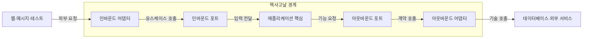
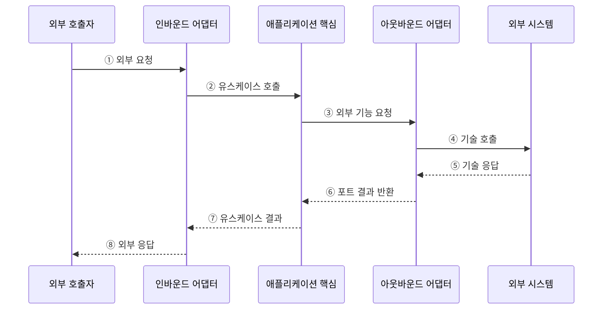

---
sidebar:
  order: 48
  label: "048. 헥사고날 아키텍처 — 포트·어댑터 (Hexagonal Architecture)"
  badge:
    text: "미출제 · 50%"
    variant: note
title: "헥사고날 아키텍처 — 포트·어댑터 (Hexagonal Architecture)"
date: "2026-07-25T00:35:00+09:00"
tags:
  - "notes-software"
weight: 48
extra:
  question_no: "048"
  source_status: "미출제"
  source_history: ""
  priority: 50
  priority_note: "포트·어댑터는 도메인 의존성 격리 핵심"
---

## 미리 알고가기

- **헥사고날 아키텍처(Hexagonal Architecture)**: 애플리케이션 핵심을 외부 기술과 포트·어댑터로 분리하는 구조
- **포트(Port)**: 애플리케이션이 제공하거나 요구하는 기능을 기술과 무관한 호출 계약으로 정의한 경계
- **어댑터(Adapter)**: 웹·데이터베이스·메시지 형식을 포트가 요구하는 호출과 데이터로 변환하는 기술별 구현
- **인바운드 측(Inbound Side)**: 사용자·테스트처럼 애플리케이션의 유스케이스 실행을 시작하는 구동 측
- **아웃바운드 측(Outbound Side)**: 애플리케이션이 저장소·외부 서비스 기능을 요청하는 피구동 측
- **테스트 대역(Test Double)**: 실제 데이터베이스·외부 서비스 대신 포트 계약을 구현해 핵심을 격리 검증하는 대체 구현
- **애플리케이션 핵심(Application Core)**: 외부 웹·데이터베이스·메시지 기술과 분리되어 유스케이스와 업무 규칙을 실행하는 내부 영역
- **유스케이스(Use Case)**: 외부 행위자가 목표를 달성하도록 애플리케이션이 제공하는 한 가지 업무 처리 흐름
- **인바운드 포트·어댑터(Inbound Port·Adapter)**: 인바운드 포트는 핵심이 제공하는 유스케이스 계약이고 어댑터는 웹·메시지·테스트 입력을 그 계약 호출로 변환함
- **아웃바운드 포트·어댑터(Outbound Port·Adapter)**: 아웃바운드 포트는 핵심이 요구하는 저장소·외부 서비스 계약이고 어댑터는 이를 특정 기술 호출로 구현함
- **매핑(Mapping)**: 외부 요청·응답의 데이터 형식과 핵심 포트의 업무 데이터 형식을 서로 변환하는 작업
- **계약 테스트(Contract Test)**: 포트의 요청·응답 규칙을 실제 어댑터와 대체 구현이 동일하게 지키는지 검증하는 테스트
- **오류 변환(Error Translation)**: 데이터베이스·외부 API의 기술 오류를 핵심이 이해하는 업무 오류로 바꾸는 처리
- **계층형 아키텍처(Layered Architecture)**: 표현·업무·데이터 계층이 위에서 아래 기술을 호출하는 구조로서 외부 연동이 고정된 단순 처리에 적합함
- **결제 업체(Payment Provider)**: 외부 결제 기술과 계약을 제공하며 업체별 아웃바운드 어댑터가 공통 결제 포트로 변환하는 시스템

## Ⅰ. 개요

- 정의/개념: 핵심을 포트로 외부 기술과 격리하고 어댑터로 연결
- **배경/필요성**: 외부 변경이 핵심에 전파돼 포트 격리 필요

### 쉽게 이해하기 (학습용)

- 본체는 공통 소켓 규격만 알고 웹·저장소별 연결 방식은 바깥 플러그가 맡는다.

## Ⅱ. 특징

- 포트는 유스케이스·외부 기능 목적을 표현한다.
- 어댑터가 기술 형식을 포트 계약으로 변환한다.
- 같은 포트의 테스트 대역으로 핵심 격리 검증한다.
- 고정 연동은 인터페이스·매핑 비용 증가한다.

### 쉽게 이해하기 (학습용)

- 본체가 무엇을 주고받을지만 정하면 플러그를 바꿔 외부 장치 없이도 본체를 시험할 수 있다.

## Ⅲ. 아키텍처 및 구성요소

**도표안 A — 구조도**

**도표안 B — sequenceDiagram**

| 설계 요소 | 설명 |
|:---|:---|
| 인바운드 어댑터 | 외부 입력을 유스케이스 호출로 변환 |
| 인바운드 포트 | 외부에 제공하는 유스케이스 계약 |
| 애플리케이션 핵심 | 외부 기술과 분리된 업무 규칙 |
| 아웃바운드 포트 | 핵심이 외부에 요구하는 기능 계약 |
| 아웃바운드 어댑터 | 포트를 기술별 호출로 구현 |

**동작 원리**

- ① 호출자가 웹·메시지·테스트 형식으로 요청한다.
- ② 인바운드 어댑터가 입력을 변환해 유스케이스를 호출한다.
- ③ 핵심이 업무 규칙을 실행하며 외부 기능을 요청한다.
- ④ 아웃바운드 어댑터가 포트 요청을 기술별 호출로 바꾼다.
- ⑤ 외부 시스템이 처리 결과를 기술 형식으로 반환한다.
- ⑥ 아웃바운드 어댑터가 기술 결과를 포트 결과로 변환한다.
- ⑦ 핵심이 유스케이스 결과를 인바운드 어댑터에 반환한다.
- ⑧ 인바운드 어댑터가 호출자 형식으로 응답한다.

> 요약: 핵심이 포트를 소유하고 어댑터가 외부 형식을 변환한다.

### 쉽게 이해하기 (학습용)

- 입구 플러그가 요청을 본체 규격으로 바꾸고 출구 플러그가 본체 요청을 외부 장치 형식으로 바꾼다.

## Ⅳ. 종류 및 비교

| 판단 기준 | 헥사고날 아키텍처 | 계층형 아키텍처 |
|:---|:---|:---|
| 핵심 특징 | 핵심이 포트를 소유하고 어댑터가 의존 | 상위 계층이 하위 기술을 호출 |
| 적용 기준 | 외부 기술 교체·격리 검증 반복 | 고정 연동·단순 처리 |
| 주요 위험 | 포트·어댑터·매핑 증가 | 하위 기술 변경의 상위 전파 |

> 요약: 외부가 고정되면 계층형, 교체가 잦으면 헥사고날

### 쉽게 이해하기 (학습용)

- 고정된 단순 제품은 층으로 쌓고 자주 바뀌면 공통 소켓을 둔다.

## Ⅴ. 실무 고려사항 및 대책

| 고려사항 | 문제점 | 대책 |
|:---|:---|:---|
| 기술 중심 포트 | 데이터베이스·업체 API 구조가 핵심에 노출 | 포트를 업무 용어로 정의하고 기술 매핑은 어댑터에 격리 |
| 과도한 분리 | 단순 기능까지 포트·어댑터가 늘어 복잡도 증가 | 외부 변경·격리 검증이 반복되는 경계에 선택 적용 |
| 매핑 오류 | 형식 변환 중 업무 의미가 손실 | 명시적 매핑과 계약 테스트로 의미 보존 검증 |
| 기술 오류 노출 | 외부 기술 변경이 핵심 오류 처리에 전파 | 어댑터에서 기술 오류를 업무 오류로 변환 |
| 대체 구현 편중 | 테스트 대역은 통과해도 실제 어댑터가 계약 위반 | 실제 어댑터의 계약·통합 테스트 병행 |

> 적용 사례: 결제 서비스는 결제 포트와 업체별 어댑터로 외부 결제 기술을 격리한다.

### 쉽게 이해하기 (학습용)

- 결제 업체가 바뀌어도 새 플러그만 결제 소켓에 연결하고 업무 규칙은 유지한다.

## Ⅵ. 결론

- 헥사고날 아키텍처는 포트로 업무 경계를 고정하고 어댑터로 외부 기술 변화를 흡수한다.
- 외부 기술 교체와 격리 검증이 반복되는 경계에 선택 적용한다.

### 쉽게 이해하기 (학습용)

- 외부 장치를 자주 바꾸거나 따로 시험해야 할 때만 공통 소켓을 둔다.
