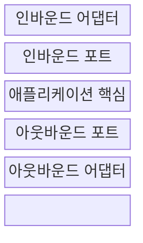
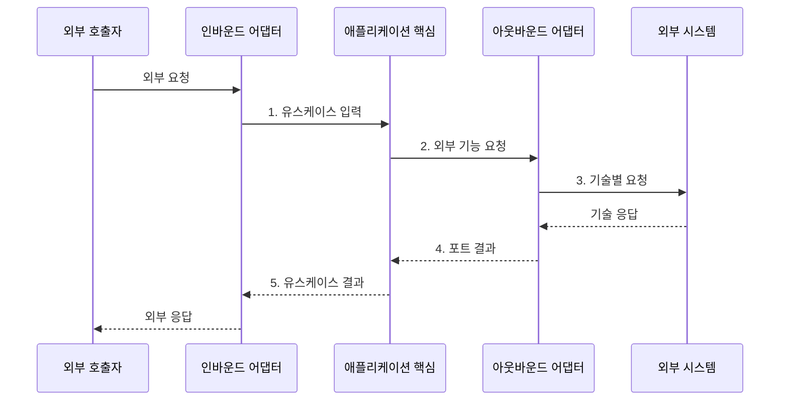

---
sidebar:
  order: 48
  label: "048. 헥사고날 아키텍처: 포트·어댑터 (Hexagonal Architecture)"
  badge:
    text: "미출 · 50%"
    variant: note
title: "헥사고날 아키텍처: 포트·어댑터 (Hexagonal Architecture)"
date: "2026-08-02T12:00:00+09:00"
tags:
  - "notes-software"
weight: 48
extra:
  question_no: "048"
  source_status: "미출"
  source_history: ""
  priority: 50
  priority_note: "포트·어댑터는 도메인 의존성 격리 핵심"
---

## Ⅰ. 개요

핵심 용어

- **헥사고날 아키텍처(Hexagonal Architecture)**: 애플리케이션 핵심을 포트로 격리하고 어댑터로 외부 기술과 연결하는 구조다.
- **포트(Port)**: 핵심이 제공하거나 요구하는 기능을 기술과 무관한 호출 계약으로 정의한 경계다.
- **어댑터(Adapter)**: 웹·데이터베이스·메시지 형식을 포트 호출과 업무 데이터로 변환하는 기술별 구현이다.

- 정의/개념: **헥사고날 아키텍처**는 애플리케이션 핵심이 소유한 포트로 외부 의존을 격리하고 어댑터로 기술별 연결을 구현하는 **소프트웨어 아키텍처**
- 배경/필요성: 핵심이 외부 기술에 직접 의존하면 기술 교체가 업무 코드로 전파되고 **격리 시험이 어려움**

#### 한줄 요약

- 본체는 공통 소켓 규격만 알고 웹·저장소별 연결 방식은 바깥 플러그가 맡는다.

## Ⅱ. 특징

핵심 용어

- **유스케이스(Use Case)**: 외부 행위자가 목표를 달성하도록 애플리케이션이 제공하는 한 가지 업무 처리 흐름이다.
- **테스트 대역(Test Double)**: 실제 외부 시스템 대신 포트 계약을 구현해 핵심을 격리 검증하는 대체 구현이다.
- **오류 변환(Error Translation)**: 외부 기술 오류를 핵심이 이해하는 업무 오류로 바꾸는 처리다.

- **업무 포트**로 유스케이스·외부 기능 계약 표현
- **기술 어댑터**로 외부 형식·오류 변환
- **테스트 대역**으로 핵심 업무 규칙 격리 검증

#### 한줄 요약

- 본체가 무엇을 주고받을지만 정하면 플러그를 바꿔 외부 장치 없이도 본체를 시험할 수 있다.

## Ⅲ. 구조 및 구성요소

핵심 용어

- **인바운드 포트·어댑터(Inbound Port·Adapter)**: 핵심이 제공하는 유스케이스 계약과 외부 입력을 그 계약 호출로 바꾸는 구현이다.
- **애플리케이션 핵심(Application Core)**: 외부 기술과 분리되어 유스케이스와 업무 규칙을 실행하는 내부 영역이다.
- **아웃바운드 포트·어댑터(Outbound Port·Adapter)**: 핵심이 요구하는 외부 기능 계약과 이를 특정 기술 호출로 구현하는 구성이다.

| 구성요소 | 책임 |
|:---|:---|
| 인바운드 어댑터 | 외부 입력을 **유스케이스 호출**로 변환 |
| 인바운드 포트 | 외부에 제공할 **유스케이스 계약** |
| 애플리케이션 핵심 | 외부 기술과 분리된 **업무 규칙** |
| 아웃바운드 포트 | 핵심이 요구하는 **외부 기능 계약** |
| 아웃바운드 어댑터 | 포트를 **기술별 호출**로 구현 |

#### 한줄 요약

- 입구 플러그, 입력 소켓, 본체, 출력 소켓, 출구 플러그로 구성된다.

## Ⅳ. 흐름도

핵심 용어

- **매핑(Mapping)**: 외부 요청·응답 형식과 포트의 업무 데이터 형식을 서로 변환하는 작업이다.
- **포트 결과**: 기술별 응답을 핵심의 업무 계약 형식으로 변환한 결과다.

**동작 원리**

1. **유스케이스 입력**: 인바운드 어댑터가 외부 형식을 업무 데이터로 변환
2. **외부 기능 요청**: 핵심이 업무 규칙에 따라 포트 호출
3. **기술별 요청**: 아웃바운드 어댑터가 외부 계약으로 변환
4. **포트 결과**: 기술 응답을 핵심의 업무 결과로 변환
5. **유스케이스 결과**: 핵심 처리 결과를 인바운드 경계에 반환

> 요약: **애플리케이션 핵심**이 포트를 소유하고 **어댑터**가 외부 형식 변환

#### 한줄 요약

- 입구 플러그가 요청을 본체 규격으로 바꾸고 출구 플러그가 본체 요청을 외부 장치 형식으로 바꾼다.

## Ⅴ. 종류 및 비교

핵심 용어

- **계층형 아키텍처(Layered Architecture)**: 표현·업무·데이터 계층이 위에서 아래의 하위 기술을 호출하는 구조다.
- **기술 교체**: 핵심 업무 코드를 바꾸지 않고 외부 데이터베이스·API 어댑터만 변경하는 능력이다.

| 애플리케이션 구조 | 헥사고날 아키텍처 | 계층형 아키텍처 |
|:---|:---|:---|
| 적용 기준 | **외부 기술 교체·격리 검증** 반복 | **고정 연동·단순 처리** |
| 핵심 특징 | 핵심이 **포트**를 소유하고 어댑터가 의존 | 상위 계층이 **하위 기술**을 호출 |
| 한계 | **포트·어댑터** 수 증가와 매핑 비용 | **하위 기술 변경**의 상위 전파 |

> 요약: **고정 외부 연동**은 계층형, **반복 교체**는 헥사고날

#### 한줄 요약

- 고정된 단순 제품은 층으로 쌓고 자주 바뀌면 공통 소켓을 둔다.

## Ⅵ. 실무 고려사항 및 대책

핵심 용어

- **업무 용어 포트**: 데이터베이스·API 제품명이 아니라 핵심이 필요한 업무 기능으로 이름 붙인 계약이다.
- **계약 테스트(Contract Test)**: 실제 어댑터와 대체 구현이 같은 포트 요청·응답 규칙을 지키는지 검증하는 시험이다.
- **통합 시험**: 실제 외부 기술과 어댑터를 연결해 매핑·통신·오류 처리를 검증하는 시험이다.

| 문제 | 대책 | 효과 |
|:---|:---|:---|
| 포트 이름이 데이터베이스·API 기술을 노출 | **업무 용어 포트·기술 매핑 격리** | 핵심의 **기술 독립성** 유지 |
| 모든 기능을 포트로 분리해 객체·매핑 급증 | 반복 변경·격리 시험 경계에만 **포트 적용** | **구조 복잡도** 제한 |
| 외부 형식과 업무 데이터의 매핑 누락 | **명시적 매핑·계약 테스트** | **업무 의미** 보존 |
| 외부 기술 오류가 핵심으로 직접 전파 | 어댑터의 **업무 오류 변환** | **오류 계약** 안정화 |
| 테스트 대역만 검증해 실제 어댑터 결함 누락 | 실제 어댑터의 **계약·통합 시험** | **운영 구현 결함** 검출 |

#### 한줄 요약

- 결제 업체가 바뀌어도 새 플러그만 결제 소켓에 연결하고 업무 규칙은 유지한다.

## Ⅶ. 결론

핵심 용어

- **격리 시험**: 외부 기술 없이 테스트 대역으로 애플리케이션 핵심만 빠르게 검증하는 시험이다.
- **고정 연동**: 외부 기술이 바뀌지 않아 별도 포트·어댑터 경계의 이익이 작은 연결이다.

- 외부 기술 교체·격리 시험이 반복되면 **포트·어댑터**, 고정 연동이면 **계층형** 선택

#### 한줄 요약

- 외부 장치를 자주 바꾸거나 따로 시험해야 할 때만 공통 소켓을 둔다.
