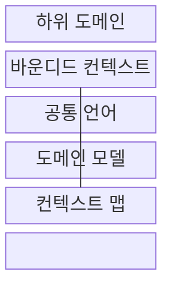
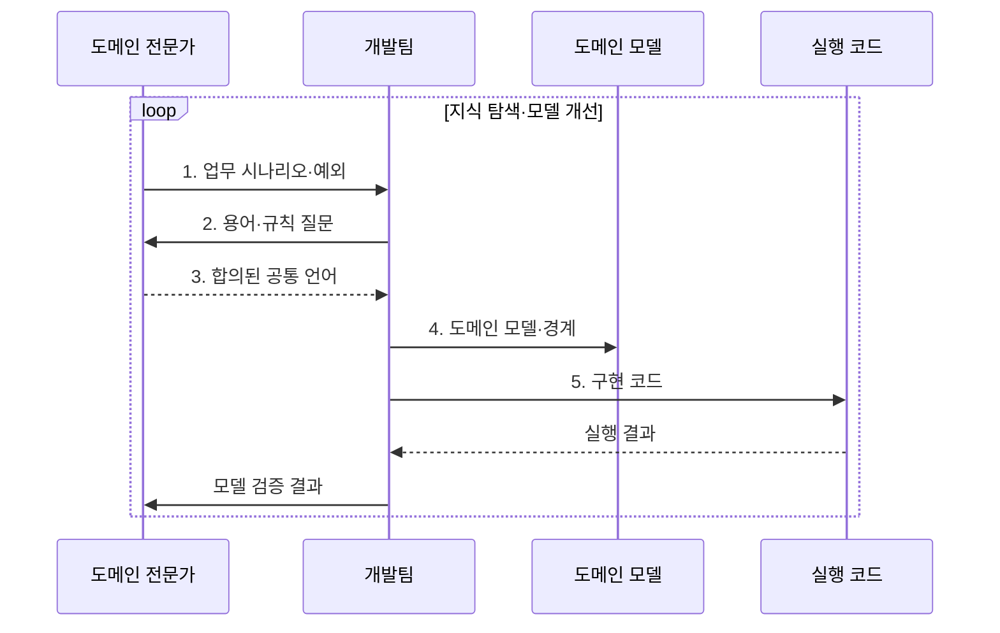

---
sidebar:
  order: 49
  label: "049. DDD 도메인 주도 설계 (Domain-Driven Design)"
  badge:
    text: "기출 · 70%"
    variant: note
title: "DDD 도메인 주도 설계 (Domain-Driven Design)"
date: "2026-08-02T12:00:00+09:00"
tags:
  - "notes-software"
weight: 49
extra:
  question_no: "049"
  source_status: "기출"
  source_history: "137회"
  priority: 70
  priority_note: "137회 기출, 도메인 모델·경계 설계"
---

## Ⅰ. 개요

핵심 용어

- **도메인 주도 설계(Domain-Driven Design, DDD)**: 도메인 전문가와 개발자가 업무 지식을 공통 언어·모델·코드로 발전시키는 설계 방법이다.
- **도메인 모델(Domain Model)**: 업무 개념·관계·규칙을 실행 가능한 구조로 표현한 모델이다.
- **공통 언어(Ubiquitous Language)**: 전문가와 개발자가 대화·모델·코드에서 같은 의미로 쓰는 업무 용어다.

- 정의/개념: **도메인 주도 설계(DDD)** 는 전문가와 개발자가 공통 언어와 도메인 모델로 업무 지식을 탐색해 코드에 연결하는 **소프트웨어 설계 방법**
- 배경/필요성: 팀별 용어·규칙 불일치로 **모델 충돌·변경 오류 증가**

#### 한줄 요약

- 현업과 개발자가 같은 업무 사전을 쓰며 규칙을 설계도와 코드에 같은 의미로 옮긴다.

## Ⅱ. 특징

핵심 용어

- **도메인 전문가(Domain Expert)**: 실제 업무의 용어·규칙·예외를 설명하고 모델 정확성을 검증하는 현업 전문가다.
- **전략적·전술적 설계(Strategic·Tactical Design)**: 모델 경계·관계를 정하고 경계 안의 업무 규칙을 코드로 구현하는 설계 층위다.
- **불변 조건(Invariant)**: 업무 상태가 변경 전후에도 반드시 참이어야 하는 규칙이다.

- **도메인 전문가·개발자 협업** 으로 공통 언어 형성
- **전략적 경계** 로 모델 의미·투자 우선순위 분리
- **전술적 모델** 로 업무 규칙·불변 조건 구현

#### 한줄 요약

- 중요한 업무 규칙은 현업과 함께 정교하게 모델링하고 단순한 주변 기능은 필요한 만큼만 설계한다.

## Ⅲ. 구조 및 구성요소

핵심 용어

- **하위 도메인(Subdomain)**: 업무 문제를 핵심·지원·일반 영역으로 나눈 단위다.
- **핵심·지원·일반 하위 도메인(Core·Supporting·Generic Subdomain)**: 차별 경쟁력을 만드는 업무, 핵심을 돕는 고유 업무, 범용 해법을 재사용할 수 있는 업무 영역이다.
- **바운디드 컨텍스트(Bounded Context)**: 한 도메인 모델과 공통 언어의 의미가 일관되는 경계다.
- **컨텍스트 맵(Context Map)**: 바운디드 컨텍스트 사이의 의존·협력·번역 관계를 나타낸 지도다.

| 구성요소 | 책임 |
|:---|:---|
| 하위 도메인 | **핵심·지원·일반** 문제 분류 |
| 바운디드 컨텍스트 | 모델·언어의 **의미 경계** 확정 |
| 공통 언어 | **업무 용어·코드 이름** 연결 |
| 도메인 모델 | **업무 개념·불변 조건** 표현 |
| 컨텍스트 맵 | 경계 간 **의존·통합 방식** 표현 |

#### 한줄 요약

- 업무 영역, 의미 경계, 공통 사전, 규칙 모형, 경계 지도로 구성된다.

## Ⅳ. 흐름도

핵심 용어

- **지식 탐색**: 실제 업무 시나리오와 예외를 질문하며 용어·규칙·경계를 발견하는 협업 과정이다.
- **업무 피드백**: 실행 결과를 도메인 전문가와 검토해 모델·언어·코드를 다시 정제하는 정보다.

**동작 원리**

1. **업무 시나리오·예외**: 도메인 사건과 판단 규칙 발견
2. **용어·규칙 질문**: 모호한 의미와 경계 후보 확인
3. **합의된 공통 언어**: 업무 용어와 제약을 한 의미로 확정
4. **도메인 모델·경계**: 새 지식으로 컨텍스트와 불변 조건 정제
5. **구현 코드**: 모델의 규칙과 계약을 실행 가능하게 반영

> 요약: **바운디드 컨텍스트** 안의 언어·모델·코드를 **업무 피드백** 으로 정제

#### 한줄 요약

- 현업과 개발자가 업무 사례를 묻고 답하며 사전·설계도·코드를 같은 의미로 계속 고친다.

## Ⅴ. 종류 및 비교

핵심 용어

- **핵심 하위 도메인(Core Subdomain)**: 조직의 경쟁력을 만드는 고유 업무로 모델링 투자를 집중하는 영역이다.
- **트랜잭션 스크립트(Transaction Script)**: 한 업무 요청의 처리 절차를 서비스 함수에 순서대로 작성하는 방식이다.
- **절차 결합**: 규칙이 늘수록 한 서비스 함수의 처리 순서와 조건이 서로 얽히는 상태다.
- **모델 유지 비용**: 공통 언어와 도메인 모델을 업무 변화에 맞춰 검증·수정하고 코드와 동기화하는 데 드는 비용이다.

| 업무 로직 설계 | DDD | 트랜잭션 스크립트 |
|:---|:---|:---|
| 적용 기준 | 예외·용어 변화 많은 **핵심 업무** | 단순 규칙·**드문 변경** |
| 핵심 특징 | 공통 언어·**도메인 모델·경계** | 서비스 함수의 **처리 순서 나열** |
| 한계 | 지식 탐색·**모델 유지 비용** | 규칙 증가 시 **절차 결합** |

> 요약: **단순 업무** 는 스크립트, **복잡한 핵심 업무** 는 DDD

#### 한줄 요약

- 단순 접수는 순서표로 풀고 예외 많은 심사는 업무 모델로 처리한다.

## Ⅵ. 실무 고려사항 및 대책

핵심 용어

- **통합 계약(Integration Contract)**: 서로 다른 바운디드 컨텍스트가 교환할 데이터·행위·오류 규칙이다.
- **모델 부패(Model Corruption)**: 다른 경계의 용어·규칙이 섞여 도메인 모델의 의미가 흐려지는 현상이다.
- **애그리게이트(Aggregate)**: 하나의 트랜잭션에서 일관성을 지켜야 하는 객체 묶음이다.
- **애그리게이트 루트(Aggregate Root)**: 애그리게이트 경계 안의 상태 변경과 불변 조건을 통제하는 진입 객체다.
- **번역 계층(Translation Layer)**: 외부 컨텍스트의 데이터·용어를 내부 모델의 의미와 계약으로 변환해 모델 부패를 막는 경계다.
- **전술 패턴(Tactical Pattern)**: 엔티티·값 객체·애그리게이트·도메인 서비스로 경계 안의 업무 규칙을 구현하는 설계 도구다.
- **잠금·충돌(Lock·Conflict)**: 일관성 경계가 커질 때 동시 변경을 직렬화하거나 같은 상태 갱신이 겹쳐 발생하는 처리 비용이다.

| 문제 | 대책 | 효과 |
|:---|:---|:---|
| 팀마다 같은 용어를 다른 의미로 사용 | 업무 능력·언어 차이로 **컨텍스트 분리** | **모델 의미 충돌** 방지 |
| 데이터 구조 중심 모델로 업무 행위 누락 | 전문가와 **행위·규칙 중심 모델** 검증 | **업무 개념** 보존 |
| 단순 지원 영역까지 전술 패턴 적용 | 핵심에 집중하고 단순 영역은 **스크립트 적용** | **설계 비용** 통제 |
| 경계 간 모델 객체를 직접 공유 | **통합 계약·번역 계층** 으로 의미 격리 | **모델 부패** 방지 |
| 애그리게이트가 여러 업무 일관성을 포괄 | **애그리게이트 루트** 가 단일 트랜잭션 불변 조건 통제 | **잠금·충돌** 감소 |

#### 한줄 요약

- 대출 심사는 현업과 합의한 용어·승인 규칙을 한 모델이 일관되게 지킨다.

## Ⅶ. 결론

핵심 용어

- **업무 복잡도·차별성**: 예외·규칙 변화의 정도와 그 업무가 조직 경쟁력에 기여하는 정도다.
- **설계 비용**: 지식 탐색과 도메인 모델·경계를 만들고 유지하는 데 드는 비용이다.

- **업무 복잡도·차별성** 이 크면 DDD, 단순 지원 업무는 **트랜잭션 스크립트** 선택

#### 한줄 요약

- 경쟁력을 만드는 복잡한 업무에는 모델링 노력을 집중하고 주변 기능은 단순하게 유지한다.
