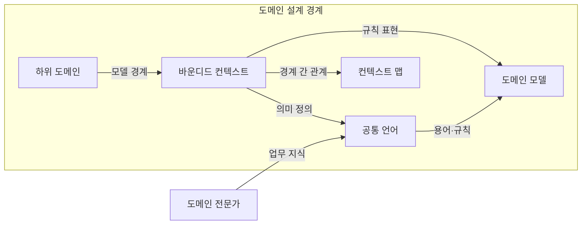
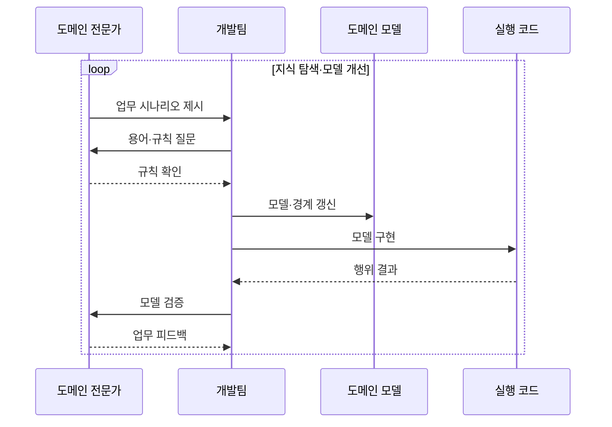

---
sidebar:
  order: 49
  label: "049. DDD 도메인 주도 설계 (Domain-Driven Design)"
  badge:
    text: "기출 · 70%"
    variant: note
title: "DDD 도메인 주도 설계 (Domain-Driven Design)"
date: "2026-07-25T00:35:00+09:00"
tags:
  - "notes-software"
weight: 49
extra:
  question_no: "049"
  source_status: "기출"
  source_history: "137회"
  priority: 70
  priority_note: "137회 기출, 도메인 모델·경계 설계"
---

## 미리 알고가기

- **도메인 주도 설계(Domain-Driven Design, DDD)**: ‘디디디’로 읽고 Domain-Driven Design의 머리글자를 딴 표기이며 전문가와 개발자가 업무 지식을 공통 언어·모델·코드로 발전
- **도메인 모델(Domain Model)**: 업무 개념·관계·규칙을 실행 가능한 구조로 표현한 모델
- **공통 언어(Ubiquitous Language)**: 전문가와 개발자가 대화·모델·코드에서 일관되게 쓰는 업무 용어
- **하위 도메인(Subdomain)**: 업무 문제를 핵심·지원·일반 영역으로 나눈 단위
- **바운디드 컨텍스트(Bounded Context)**: 한 도메인 모델과 공통 언어의 의미가 일관되는 경계
- **전략적·전술적 설계(Strategic·Tactical Design)**: 전략적 설계는 모델 경계·관계를 정하고 전술적 설계는 경계 안의 규칙을 코드로 구현
- **컨텍스트 맵(Context Map)**: 바운디드 컨텍스트 사이의 의존·협력·번역 관계를 나타낸 지도
- **트랜잭션 스크립트(Transaction Script)**: 한 업무 요청의 처리 절차를 서비스 함수에 순서대로 작성하는 방식
- **애그리게이트 루트(Aggregate Root)**: 애그리게이트 경계 안의 상태 변경과 불변 조건을 통제하는 진입 객체
- **도메인 전문가(Domain Expert)**: 실제 업무의 용어·규칙·예외를 설명하고 개발팀과 모델의 정확성을 반복 검증하는 현업 전문가
- **핵심·지원·일반 하위 도메인(Core·Supporting·Generic Subdomain)**: 핵심은 경쟁력을 만드는 고유 업무, 지원은 핵심을 돕는 맞춤 기능, 일반은 표준 제품으로 대체 가능한 기능으로서 모델링 투자 우선순위를 나눔
- **애그리게이트(Aggregate)**: 하나의 트랜잭션에서 일관성을 지켜야 하는 객체 묶음으로서 외부 변경은 애그리게이트 루트를 통해서만 수행함
- **불변 조건(Invariant)**: 업무 상태가 변경 전후에도 반드시 참이어야 하는 규칙으로서 애그리게이트 루트가 모든 변경에서 검증함
- **번역·협력 관계(Translation·Collaboration Relationship)**: 서로 다른 바운디드 컨텍스트가 각 모델 의미를 보존하며 계약을 변환하고 업무 결과를 교환하는 컨텍스트 맵 관계
- **대출 심사(Loan Underwriting)**: 예외와 승인 규칙이 많은 핵심 업무로서 공통 언어와 애그리게이트에 모델링 투자를 집중하는 사례
- **알림 기능(Notification Function)**: 규칙이 단순하고 변경이 드물어 서비스 함수의 처리 순서를 따르는 트랜잭션 스크립트로 구현할 수 있는 지원 기능

## Ⅰ. 개요

- **정의/개념**: 공통 언어로 업무 지식을 코드에 연결
- **배경/필요성**: 흩어진 규칙이 용어 충돌을 낳아 모델 경계 필요

### 쉽게 이해하기 (학습용)

- 현업과 개발자가 같은 업무 사전을 쓰며 규칙을 설계도와 코드에 같은 의미로 옮긴다

## Ⅱ. 특징

- 전문가·개발자의 지식 탐색으로 모델 반복 개선한다.
- 전략적 경계로 모델 의미·투자 우선순위 분리한다.
- 전술적 모델로 업무 규칙·불변 조건을 구현한다.
- 단순 영역은 모델 유지·학습 비용이 편익 초과한다.

### 쉽게 이해하기 (학습용)

- 중요한 업무 규칙은 현업과 함께 정교하게 모델링하고 단순한 주변 기능은 필요한 만큼만 설계한다

## Ⅲ. 아키텍처 및 구성요소

| 설계 요소 | 설명 |
|:---|:---|
| 하위 도메인 | 업무를 핵심·지원·일반 문제로 분류 |
| 바운디드 컨텍스트 | 모델·언어의 의미가 일관된 경계 |
| 공통 언어 | 업무 지식과 모델·코드 이름 연결 |
| 도메인 모델 | 경계 안의 개념·관계·규칙 표현 |
| 컨텍스트 맵 | 모델 경계의 의존·통합 방식 표현 |

> 요약: 경계 안은 공통 언어, 경계 사이는 컨텍스트 맵

### 쉽게 이해하기 (학습용)

- 업무를 의미가 통하는 구역별 모델로 나누고 구역 사이에는 번역·협력 규칙을 둔다

## Ⅳ. 원리 및 절차 흐름도

| 절차 | 설명 |
|:---|:---|
| 업무 시나리오 제시 | 실제 업무 사건·예외·규칙 설명 |
| 용어·규칙 질문 | 모호한 용어와 판단 조건 확인 |
| 규칙 확인 | 공통 언어와 업무 제약 합의 |
| 모델·경계 갱신 | 개념·규칙·컨텍스트 경계 정제 |
| 모델 구현 | 애그리게이트에 불변 조건 구현 |
| 행위 결과 | 실행 코드의 업무 동작 확인 |
| 모델 검증 | 모델이 실제 업무를 설명하는지 검토 |
| 업무 피드백 | 새 지식을 언어·모델·코드에 반영 |

> 요약: 업무 피드백으로 언어·모델·코드를 함께 정제

### 쉽게 이해하기 (학습용)

- 현업과 개발자가 업무 사례를 묻고 답하며 사전·설계도·코드를 같은 의미로 계속 고친다

## Ⅴ. 종류 및 비교

| 판단 기준 | DDD | 트랜잭션 스크립트 |
|:---|:---|:---|
| 핵심 특징 | 공통 언어·도메인 모델·경계 | 서비스 함수에 처리 순서 나열 |
| 적용 기준 | 예외·용어 변화가 많은 핵심 업무 | 단순 규칙·드문 변경 |
| 주요 위험 | 지식 탐색·모델 유지 비용 | 규칙 증가 시 절차 결합 |

> 요약: 단순 업무는 스크립트, 복잡한 핵심 업무는 DDD

### 쉽게 이해하기 (학습용)

- 단순 접수는 순서표로 풀고 예외 많은 심사는 업무 모델로 처리한다

## Ⅵ. 실무 사례

1. 대출 심사는 공통 언어·애그리게이트로 승인 규칙 통제
2. 알림 기능은 트랜잭션 스크립트로 단순 처리

### 쉽게 이해하기 (학습용)

- 대출 심사는 현업과 합의한 용어·승인 규칙을 한 모델이 일관되게 지킨다
- 알림처럼 규칙이 단순한 기능은 정교한 도메인 모델 없이 순서대로 처리한다

## Ⅶ. 결론

- 핵심·지원·일반 도메인 복잡도로 DDD 투자 범위 결정

### 쉽게 이해하기 (학습용)

- 경쟁력을 만드는 복잡한 업무에는 모델링 노력을 집중하고 주변 기능은 단순하게 유지한다
