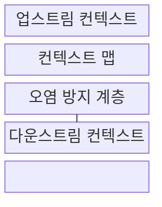
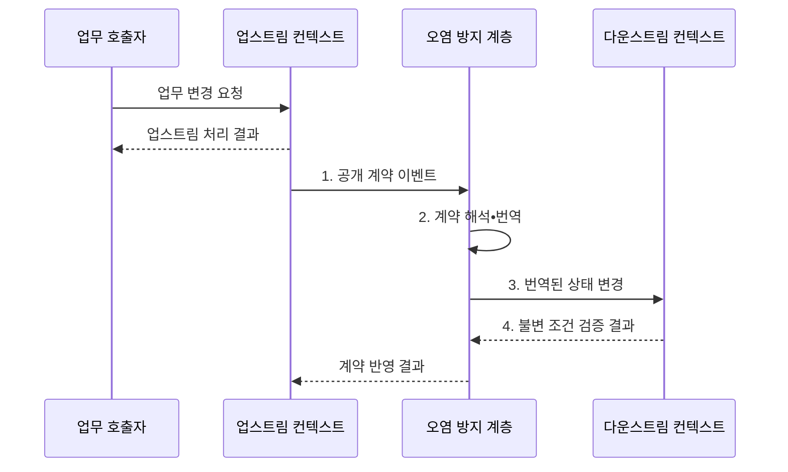

---
sidebar:
  order: 50
  label: "050. 바운디드 컨텍스트 (Bounded Context)"
  badge:
    text: "기출 • 50%"
    variant: note
title: "바운디드 컨텍스트 (Bounded Context)"
date: "2026-08-03T08:48:47+09:00"
tags:
  - "notes-software"
weight: 50
extra:
  question_no: "050"
  source_status: "기출"
  source_history: "137회"
  priority: 50
  priority_note: "137회 기출, 컨텍스트 경계•통합 관계"
---

## Ⅰ. 개요

핵심 용어

- **바운디드 컨텍스트(Bounded Context)**: 한 도메인 모델과 공통 언어의 의미가 일관되게 적용되는 명시적 경계다.
- **도메인 모델(Domain Model)**: 업무 개념•관계•규칙을 실행 가능한 구조로 표현한 모델이다.
- **공통 언어(Ubiquitous Language)**: 경계 안의 대화•모델•코드에서 같은 뜻으로 쓰는 업무 용어다.

- 정의/개념: **바운디드 컨텍스트** 는 하나의 도메인 모델과 공통 언어가 같은 의미로 일관되게 적용되는 **명시적 모델 경계**
- 배경/필요성: 전사 단일 모델이 여러 의미를 공유해 **업무 용어•규칙 충돌**

#### 한줄 요약

- 같은 상품도 전시팀에는 설명 대상이고 주문팀에는 가격•수량 대상이므로 뜻이 섞이지 않게 구역을 나눈다.

## Ⅱ. 특징

핵심 용어

- **경계 내부**: 하나의 공통 언어와 도메인 모델이 같은 의미로 적용되는 범위다.
- **컨텍스트 맵(Context Map)**: 바운디드 컨텍스트 사이의 의존•협력•번역 관계를 나타낸 지도다.
- **번역 계약**: 서로 다른 모델의 의미를 섞지 않고 데이터•행위를 변환하는 규칙이다.

- **경계 내부** 에서 공통 언어•모델 의미 일관성 유지
- **경계별 업무 목적** 에 따라 동일 용어를 독립 모델링
- **컨텍스트 맵•번역 계약** 으로 경계 간 의존 방향 명시

#### 한줄 요약

- 한 구역에서는 한 사전을 쓰고 다른 구역과 대화할 때 번역해 서로의 뜻이 섞이지 않게 한다.

## Ⅲ. 구조 및 구성요소

핵심 용어

- **업스트림•다운스트림(Upstream•Downstream)**: 모델 계약을 제공하는 경계와 그 계약을 소비하는 경계의 의존 관계다.
- **오염 방지 계층(Anti-Corruption Layer, ACL)**: 외부 모델과 용어가 내부 모델에 침투하지 않도록 변환하는 계층이다.
- **공개 계약(Published Contract)**: 업스트림이 외부 컨텍스트에 제공하는 API•이벤트의 의미•필드•버전 규칙이다.
- **불변 조건(Invariant)**: 다운스트림 모델이 상태 변경 전후에 반드시 유지해야 하는 업무 규칙이다.

| 구성요소 | 책임 |
|:---|:---|
| 업스트림 컨텍스트 | 자체 모델•**공개 계약** 소유 |
| 컨텍스트 맵 | 경계 간 **의존•협력 관계** 명시 |
| 오염 방지 계층 | 외부 계약을 **내부 공통 언어** 로 번역 |
| 다운스트림 컨텍스트 | 자체 모델•**불변 조건** 유지 |

#### 한줄 요약

- 정보를 제공하는 구역, 관계 지도, 번역소, 소비 구역으로 구성된다.

## Ⅳ. 흐름도

핵심 용어

- **계약 이벤트(Contract Event)**: 업스트림 상태 변경 사실을 공개 계약 형식으로 다운스트림에 전달하는 메시지다.
- **번역된 상태 변경**: 외부 계약의 의미를 다운스트림 공통 언어와 모델에 맞게 변환한 결과다.

**동작 원리**

1. **공개 계약 이벤트**: 업스트림 변경 사실을 공개 형식으로 발행
2. **계약 해석•번역**: 오염 방지 계층이 공개 계약을 다운스트림 언어로 해석
3. **번역된 상태 변경**: 외부 의미를 다운스트림 언어로 변환
4. **불변 조건 검증 결과**: 내부 규칙에 맞는 변경만 반영

> 요약: 경계별 모델은 독립 유지하고 **공개 계약•오염 방지 계층** 으로 연결

#### 한줄 요약

- 다른 부서의 변경 소식은 번역 담당자가 자기 부서 사전으로 바꾼 뒤 내부 규칙에 맞는지 확인한다.

## Ⅴ. 종류 및 비교

핵심 용어

- **단일 통합 모델**: 여러 업무가 하나의 공통 데이터•용어 구조를 공유하는 모델이다.
- **분산 일관성(Distributed Consistency)**: 서로 다른 컨텍스트 상태가 계약 전달과 비동기 반영을 거쳐 허용된 값으로 맞춰지는 성질이다.
- **연쇄 변경**: 공유 모델의 한 변경이 여러 업무 컨텍스트의 동시 수정을 요구하는 현상이다.

| 도메인 모델 경계 | 바운디드 컨텍스트 분리 | 단일 통합 모델 |
|:---|:---|:---|
| 적용 기준 | 용어•규칙•**변경 책임 상이** | 의미•**변경 주기 동일** |
| 핵심 특징 | 업무별 모델•**계약•번역 경계** | 여러 업무의 **공통 모델 공유** |
| 한계 | 번역•계약•**분산 일관성 비용** | 의미 충돌•**연쇄 변경** |

> 요약: **변경 책임** 이 같으면 통합하고 다르면 **컨텍스트 분리**

#### 한줄 요약

- 같은 사전이면 통합하고 용어 뜻과 책임이 다르면 경계를 나눈다.

## Ⅵ. 실무 고려사항 및 대책

핵심 용어

- **데이터 소유권(Data Ownership)**: 한 컨텍스트가 특정 데이터의 변경 권한과 책임을 단독으로 갖는 원칙이다.
- **모델 오염(Model Corruption)**: 외부 컨텍스트 용어•구조가 번역 없이 퍼져 내부 모델 의미가 흐려지는 현상이다.
- **스키마 버전(Schema Version)**: 계약 필드와 의미의 변경 단계를 구분해 소비자가 호환 여부를 판단하는 식별자다.
- **멱등성(Idempotency)**: 같은 계약 이벤트를 여러 번 처리해도 결과가 한 번 처리한 것과 같게 유지되는 성질이다.
- **스키마 결합(Schema Coupling)**: 여러 컨텍스트가 같은 데이터베이스 구조에 직접 의존해 한쪽 변경이 다른 쪽 수정을 강제하는 상태다.
- **명시적 번역(Explicit Translation)**: 외부 계약의 필드•용어•상태를 내부 공통 언어와 모델로 바꾸는 규칙을 경계에 분명히 구현하는 방식이다.
- **호환 규칙•계약 시험**: 계약 버전 변경이 기존 소비자의 필드•의미•동작 기대를 깨지 않는지 정한 규칙과 자동 검증이다.
- **대사•제한 재시도(Reconciliation•Bounded Retry)**: 컨텍스트 상태를 비교해 불일치를 바로잡고 전송 실패를 정한 횟수 안에서 다시 처리하는 복구 방식이다.

| 문제 | 대책 | 효과 |
|:---|:---|:---|
| 조직도만 기준으로 경계를 나눠 업무 의미가 중첩 | **용어 의미•변경 책임** 으로 경계 도출 | **업무 의미** 보존 |
| 컨텍스트가 데이터베이스를 공유해 스키마 결합 | **데이터 소유권•공개 계약** 기반 연동 | **독립 변경** 확보 |
| 외부 모델을 번역 없이 내부에서 직접 사용 | **오염 방지 계층** 에서 명시적 번역 | **모델 오염** 방지 |
| 공개 계약 변경으로 다운스트림 호환성 파괴 | 호환 규칙과 **스키마 버전•계약 시험** | **소비자 중단** 방지 |
| 계약 이벤트 중복•지연으로 경계 간 상태 불일치 | **멱등 처리•대사** 와 제한 재시도 | **분산 일관성** 복구 |

#### 한줄 요약

- 카탈로그는 상품 설명을, 주문은 가격•수량을 자기 모델로 관리하고 필요한 정보만 계약으로 전달한다.

## Ⅶ. 결론

핵심 용어

- **변경 책임**: 업무 규칙과 데이터 변경을 결정하고 결과를 소유하는 조직•모델의 책임이다.
- **컨텍스트 통합**: 용어 의미와 변경 주기가 같을 때 별도 경계의 번역 비용을 없애는 결정이다.

- **용어 의미•변경 책임** 이 다르면 컨텍스트 분리, 같으면 통합

#### 한줄 요약

- 용어 뜻과 변경 책임이 다르면 구역을 나누고 번역 비용이 더 크면 경계를 다시 조정한다.
