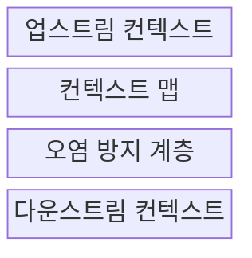
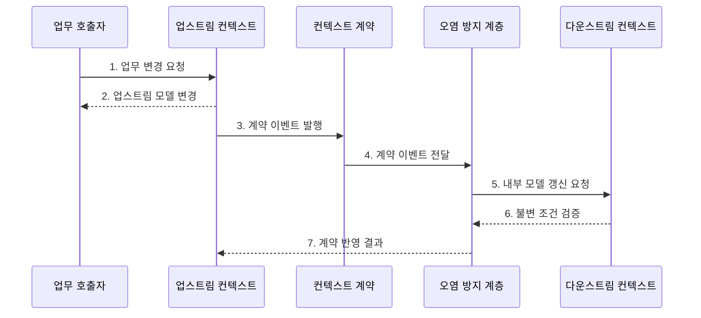

---
sidebar:
  order: 50
  label: "050. 바운디드 컨텍스트 (Bounded Context)"
  badge:
    text: "기출 · 50%"
    variant: note
title: "바운디드 컨텍스트 (Bounded Context)"
date: "2026-07-27T23:59:59+09:00"
tags:
  - "notes-software"
weight: 50
extra:
  question_no: "050"
  source_status: "기출"
  source_history: "137회"
  priority: 50
  priority_note: "137회 기출, 컨텍스트 경계·통합 관계"
---

## 미리 알고가기

- **바운디드 컨텍스트(Bounded Context)**: 한 도메인 모델과 공통 언어의 의미가 일관되게 적용되는 경계
- **도메인 모델(Domain Model)**: 업무 개념·관계·규칙을 실행 가능한 구조로 표현한 모델
- **공통 언어(Ubiquitous Language)**: 경계 안의 대화·모델·코드에서 같은 뜻으로 쓰는 업무 용어
- **컨텍스트 맵(Context Map)**: 바운디드 컨텍스트 사이의 의존·협력·번역 관계를 나타낸 지도
- **업스트림·다운스트림(Upstream and Downstream)**: 모델 계약을 제공하는 경계와 그 계약을 소비하는 경계의 의존 관계
- **오염 방지 계층(Anti-Corruption Layer, ACL)**: 외부 모델과 용어가 내부 도메인 모델에 침투하지 않도록 변환하는 계층
- **응용 프로그래밍 인터페이스(Application Programming Interface, API)**: 바운디드 컨텍스트 사이의 요청·응답 규칙과 데이터 계약
- **공개 계약(Published Contract)**: 업스트림이 외부 컨텍스트에 제공하는 API·이벤트의 의미·필드·버전 규칙
- **계약 이벤트(Contract Event)**: 업스트림의 상태 변경 사실을 공개 계약 형식으로 표현해 다운스트림에 전달하는 메시지
- **불변 조건(Invariant)**: 다운스트림 모델이 상태 변경 전후에 반드시 유지해야 하며 번역 결과를 반영하기 전에 검증하는 업무 규칙
- **모델 오염(Model Corruption)**: 외부 컨텍스트의 용어·구조가 번역 없이 내부 모델에 퍼져 자체 공통 언어와 규칙의 의미가 흐려지는 현상
- **분산 일관성(Distributed Consistency)**: 서로 다른 컨텍스트의 상태가 계약 전달과 비동기 반영을 거쳐 업무상 허용된 값으로 맞춰지는 성질
- **카탈로그·주문 모델(Catalog·Order Model)**: 카탈로그는 상품 설명·분류를, 주문은 가격·수량·구매 상태를 각자 다른 의미와 변경 책임으로 관리하는 모델
- **멱등성(Idempotency)**: 같은 계약 이벤트를 여러 번 처리해도 결과가 한 번 처리한 것과 같게 유지되는 성질
- **스키마 버전(Schema Version)**: 계약 필드와 의미의 변경 단계를 구분해 소비자가 호환 여부를 판단하게 하는 식별자

## Ⅰ. 개요

- 정의/개념: 도메인 모델·공통 언어의 **의미가 일관되는 명시적 경계**
- 배경/필요성: 전사 단일 모델의 **업무별 용어·규칙 충돌** 해소

### 쉽게 이해하기 (학습용)

- 같은 상품도 전시팀에는 설명 대상이고 주문팀에는 가격·수량 대상이므로 뜻이 섞이지 않게 구역을 나눈다.

## Ⅱ. 특징

- **경계 내부**에서 공통 언어·모델 의미 일관성 유지
- **경계별 업무 목적**에 따라 동일 용어를 독립 모델링
- **컨텍스트 맵·번역 계약**으로 경계 간 의존 방향 명시

### 쉽게 이해하기 (학습용)

- 한 구역에서는 한 사전을 쓰고 다른 구역과 대화할 때 번역해 서로의 뜻이 섞이지 않게 한다.

## Ⅲ. 구조 및 구성요소

| 구성요소 | 책임 |
|:---|:---|
| 업스트림 컨텍스트 | 자체 모델·공개 계약 소유 |
| 컨텍스트 맵 | 경계 간 의존·협력 관계 명시 |
| 오염 방지 계층 | 외부 계약을 내부 언어로 번역 |
| 다운스트림 컨텍스트 | 자체 모델·불변 조건 유지 |

### 쉽게 이해하기 (학습용)

- 정보를 제공하는 구역, 관계 지도, 번역소, 소비 구역으로 구성된다.

## Ⅳ. 흐름도

**동작 원리**

- **1. 업무 변경 요청**: 업스트림 언어로 상태 변경 전달
- **2. 업스트림 모델 변경**: 자체 규칙 적용
- **3. 계약 이벤트 발행**: 공개 형식으로 사실 전송
- **4. 계약 이벤트 전달**: 번역 계층에 계약 제공
- **5. 내부 모델 갱신 요청**: 외부 용어를 내부 언어로 변환
- **6. 불변 조건 검증**: 다운스트림 규칙 확인
- **7. 계약 반영 결과**: 번역·갱신 결과 반환

> 요약: 경계별 모델은 독립적으로 유지하고 공개 계약과 번역으로 연결한다.

### 쉽게 이해하기 (학습용)

- 다른 부서의 변경 소식은 번역 담당자가 자기 부서 사전으로 바꾼 뒤 내부 규칙에 맞는지 확인한다.

## Ⅴ. 종류 및 비교

| 도메인 모델 경계 | 바운디드 컨텍스트 분리 | 단일 통합 모델 |
|:---|:---|:---|
| 적용 기준 | 용어·규칙·**변경 책임 상이** | 의미·**변경 주기 동일** |
| 핵심 특징 | 업무별 모델·**계약·번역 경계** | 여러 업무의 **공통 모델 공유** |
| 한계 | 번역·계약·**분산 일관성 비용** | 의미 충돌·**연쇄 변경** |

> 요약: 변경 책임이 같으면 통합하고 다르면 분리

### 쉽게 이해하기 (학습용)

- 같은 사전이면 통합하고 용어 뜻과 책임이 다르면 경계를 나눈다.

## Ⅵ. 실무 고려사항 및 대책

| 고려사항 | 대책 | 효과 |
|:---|:---|:---|
| 조직 기준 분리 | 용어·규칙·변경 책임으로 경계 도출 | 업무 의미 보존 |
| 공유 데이터베이스 | 데이터 소유권·계약 기반 연동 | 독립 변경 확보 |
| 외부 모델 직접 사용 | 오염 방지 계층에서 명시적 번역 | 모델 오염 방지 |
| 계약 변경 | 호환 규칙·버전·계약 시험 운영 | 소비자 중단 방지 |
| 이벤트 중복·지연 | 멱등 처리·재시도·대사 적용 | 분산 상태 복구 |

> 적용 사례: 상품은 카탈로그와 주문의 가격 모델을 분리하고 공개 계약으로 연동한다.

### 쉽게 이해하기 (학습용)

- 카탈로그는 상품 설명을, 주문은 가격·수량을 자기 모델로 관리하고 필요한 정보만 계약으로 전달한다.

## Ⅶ. 결론

- **용어·규칙·변경 책임**이 다르면 컨텍스트를 분리한다.

### 쉽게 이해하기 (학습용)

- 용어 뜻과 변경 책임이 다르면 구역을 나누고 번역 비용이 더 크면 경계를 다시 조정한다.
