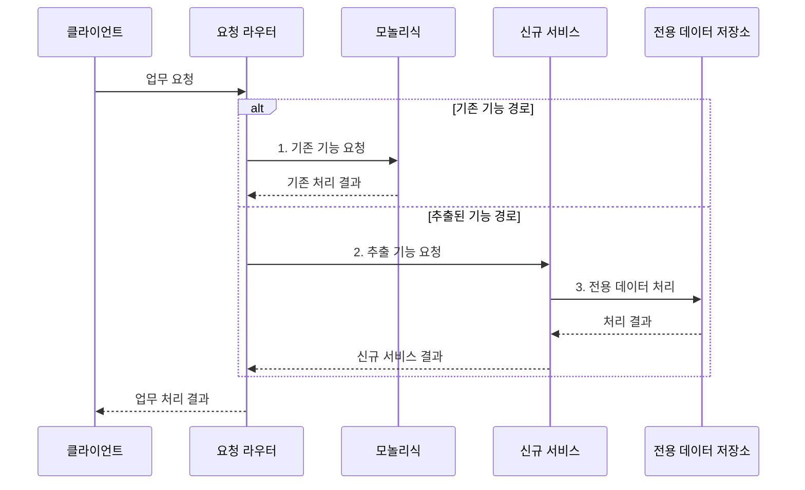

---
sidebar:
  order: 51
  label: "051. 모놀리식 vs 마이크로서비스 비교 (Monolith vs Microservice)"
  badge:
    text: "기출 • 70%"
    variant: note
title: "모놀리식 vs 마이크로서비스 비교 (Monolith vs Microservice)"
date: "2026-08-05T03:30:00+09:00"
tags:
  - "notes-software"
weight: 51
extra:
  question_no: "051"
  source_status: "기출"
  source_history: "135회"
  priority: 70
  priority_note: "135회 기출, 배포•결합도•운영 절충"
---

## Ⅰ. 개요

<details>
<summary>핵심 용어</summary>

- **모놀리식(Monolith)**: 여러 업무 기능을 하나의 애플리케이션과 배포 단위로 운영하는 구조이다.
- **마이크로서비스(Microservices)**: 업무 경계별 서비스를 독립적으로 배포하고 확장하는 구조이다.

</details>

- 정의/개념: 모놀리스는 여러 업무를 하나의 배포 단위로 묶고, 마이크로서비스는 업무 경계별 독립 서비스로 나눠 **변경•확장 독립성** 을 조절하는 아키텍처 선택
- 배경/필요성: 업무별 변경•확장 주기와 **분산 운영 비용** 에 따른 구조 선택

#### 한줄 요약

- 한 건물에서 모두 일할지 업무마다 독립 건물을 둘지 정하는 문제다.

## Ⅱ. 특징

<details>
<summary>핵심 용어</summary>

- **독립 배포(Independent Deployment)**: 다른 서비스의 출시 없이 특정 서비스만 변경해 운영에 반영하는 방식이다.
- **분산 일관성(Distributed Consistency)**: 여러 서비스의 상태 변경을 메시지와 보상 처리로 맞추는 방식이다.
- **내부 호출(Local Call)**: 같은 프로세스 안의 함수를 직접 실행하는 호출이다.
- **원격 호출(Remote Call)**: 네트워크로 다른 서비스에 보내는 호출이다.
- **단일 트랜잭션(Single Transaction)**: 하나의 저장소 경계에서 여러 변경을 모두 반영하거나 모두 취소하는 처리 단위이다.

</details>

- 모놀리식은 **내부 호출•단일 트랜잭션** 으로 운영 단순화
- 마이크로서비스는 **독립 배포•확장** 으로 장애 범위 격리
- **원격 호출•분산 일관성** 이 서비스 분리 비용 증가

#### 한줄 요약

- 한 건물은 함께 움직이기 쉽지만 여러 건물은 연락과 정산이 복잡해진다.

## Ⅲ. 구조 및 구성요소

<details>
<summary>핵심 용어</summary>

- **공용 데이터 저장소(Shared Data Store)**: 여러 모듈이 같은 스키마와 트랜잭션 경계를 공유하는 저장소이다.
- **전용 데이터 저장소(Dedicated Data Store)**: 한 서비스가 스키마와 변경 권한을 소유하는 저장소이다.
- **응용 프로그래밍 인터페이스(Application Programming Interface, API)**: 서비스가 기능과 데이터를 주고받기 위한 호출 계약이다.

</details>

```text
                       [요청 라우터]
                        /          \
          [단일 애플리케이션]      [독립 서비스]
                    |                    |
          [공용 데이터 저장소]      [전용 데이터 저장소]
```

선의 의미: 요청 라우터는 단일 애플리케이션과 독립 서비스에 연결되고, 단일 애플리케이션은 공용 데이터 저장소를 공유하는 반면 독립 서비스는 전용 데이터 저장소를 소유한다.

| 구성요소 | 책임 |
|:---|:---|
| 단일 애플리케이션 | 모든 업무의 **단일 배포 단위** |
| 공용 데이터 저장소 | 모듈의 **트랜잭션 경계** 공유 |
| 독립 서비스 | **업무별 배포•확장** 과 장애 격리 |
| 전용 데이터 저장소 | 서비스별 **스키마•변경 권한** 소유 |
| 요청 라우터 | 기존•신규 **처리 경로 선택** |

#### 한줄 요약

- 한 건물과 공용 장부, 독립 점포와 전용 장부, 안내소로 구성된다.

## Ⅳ. 흐름도

<details>
<summary>핵심 용어</summary>

- **스트랭글러 패턴(Strangler Fig Pattern)**: 기존 기능의 요청을 새 서비스로 점진 전환해 교체하는 방식이다.
- **트래픽 전환(Traffic Shift)**: 기존 구현으로 가던 요청 비율을 신규 서비스에 단계적으로 늘리는 절차이다.

</details>



**동작 원리**

1. **기존 기능 요청**: 미추출 기능을 단일 애플리케이션에서 처리
2. **추출 기능 요청**: 분리한 업무를 독립 서비스 경로로 전송
3. **전용 데이터 처리**: 서비스 소유 스키마 안에서 상태 변경

> 요약: **배포 단위•데이터 소유권** 을 함께 분리하고 요청을 점진 전환

#### 한줄 요약

- 독립할 업무를 새 건물로 옮긴 뒤 방문자를 조금씩 새 주소로 안내한다.

## Ⅴ. 종류 및 비교

<details>
<summary>핵심 용어</summary>

- **모듈러 모놀리스(Modular Monolith)**: 하나의 배포 단위 안에서 업무 모듈의 책임과 의존 경계를 분리한 구조이다.
- **바운디드 컨텍스트(Bounded Context)**: 하나의 업무 모델과 용어가 일관되게 적용되는 서비스 경계이다.
- **확장 결합(Scaling Coupling)**: 특정 기능만 부하가 늘어도 전체 애플리케이션을 함께 확장해야 하는 제약이다.

</details>

| 서비스 배포 구조 | 모놀리식 | 마이크로서비스 |
|:---|:---|:---|
| 적용 기준 | 변경•확장 주기 **유사** | 업무별 변경•확장 주기 **상이** |
| 핵심 특징 | **단일 배포•공용 데이터** 와 내부 호출 | **독립 배포•소유 데이터** 와 원격 호출 |
| 한계 | 전체 배포•**확장 결합** | 분산 일관성•**연쇄 장애** |

> 요약: **독립성 이익** 이 **분산 비용** 보다 클 때 서비스 분리

#### 한줄 요약

- 업무 변화와 사용량이 함께 움직이면 한 건물, 따로 움직이면 독립 건물을 선택한다.

## Ⅵ. 실무 고려사항 및 대책

<details>
<summary>핵심 용어</summary>

- **데이터 소유권(Data Ownership)**: 각 서비스가 전용 저장소의 스키마와 변경 권한을 책임지는 원칙이다.
- **연쇄 장애(Cascading Failure)**: 한 서비스의 지연이나 실패가 호출 관계를 따라 다른 서비스로 번지는 현상이다.
- **분산 추적(Distributed Tracing)**: 하나의 요청이 여러 서비스를 거치는 경로와 지연•오류를 연결해 관측하는 방법이다.
- **보상 처리(Compensation)**: 이미 완료된 분산 변경을 업무상 반대 동작으로 되돌려 일관성을 회복하는 처리이다.
- **회로 차단(Circuit Breaker)**: 반복 실패 호출을 잠시 차단하는 제어이다.
- **시간 제한(Timeout)**: 원격 응답의 최대 대기시간을 제한하는 제어이다.
- **대사(Reconciliation)**: 서비스 상태를 비교해 불일치를 정정하는 절차이다.
- **허용 지연(Allowed Lag)**: 비동기 상태 차이를 허용할 최대 시간이다.
- **통합 지표(Consolidated Metrics)**: 여러 서비스의 상태•처리량•오류•지연 수치를 같은 기준으로 모아 비교하는 관측 정보이다.

</details>

| 문제 | 대책 | 효과 |
|:---|:---|:---|
| 경계 검증 없이 서비스를 성급히 분리 | **모듈러 모놀리스** 로 책임 경계 검증 후 분리 | **분산 비용** 억제 |
| 서비스가 데이터베이스를 공유해 스키마 결합 | **데이터 소유권•API 계약** 기반 연동 | **독립 변경** 확보 |
| 동기 원격 호출 연쇄로 장애가 전파 | **격리•회로 차단** 과 시간 제한 적용 | **장애 전파 범위** 제한 |
| 여러 서비스 변경의 반영 시점 차이 | **보상•대사** 와 허용 지연 설정 | **상태 불일치** 복구 |
| 서비스별 로그만으로 요청 실패 경로 단절 | **통합 지표•분산 추적** 적용 | **장애 경로** 추적 |
| 전체 기능 일괄 전환으로 실패 범위 확대 | **스트랭글러 패턴•트래픽 전환** | **전환 실패 범위** 제한 |

#### 한줄 요약

- 초기 업무는 한 프로그램 안에서 책임만 나눠 배포•관측 비용을 줄인다.

## Ⅶ. 결론

<details>
<summary>핵심 용어</summary>

- **분산 시스템 비용(Distributed System Cost)**: 원격 호출, 장애 격리, 데이터 일관성, 관측성에 추가로 드는 운영 복잡도이다.
- **서비스 독립성(Service Independence)**: 서비스가 다른 서비스와 분리된 배포•확장•변경 주기를 갖는 성질이다.

</details>

- **독립 배포 이익** 이 **분산 운영 비용** 보다 클 때만 서비스 분리

#### 한줄 요약

- 규모만 보고 나누지 않고 따로 바꿔 얻는 이익이 클 때만 서비스를 분리한다.
