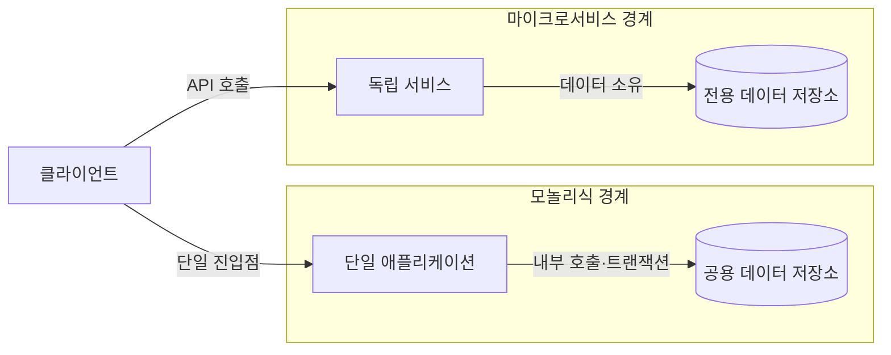
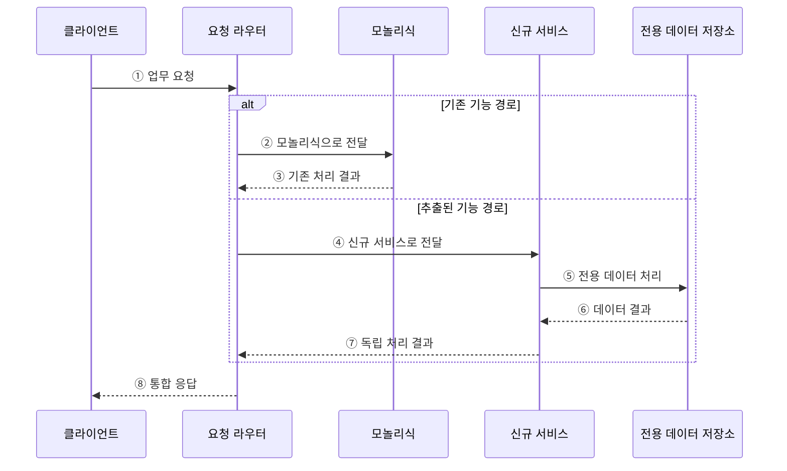

---
sidebar:
  order: 51
  label: "051. 모놀리식 vs 마이크로서비스 비교 (Monolith vs Microservice)"
  badge:
    text: "기출 · 70%"
    variant: note
title: "모놀리식 vs 마이크로서비스 비교 (Monolith vs Microservice)"
date: "2026-07-27T23:59:59+09:00"
tags:
  - "notes-software"
weight: 51
extra:
  question_no: "051"
  source_status: "기출"
  source_history: "135회"
  priority: 70
  priority_note: "135회 기출, 배포·결합도·운영 절충"
---

## 미리 알고가기

- **모놀리식·마이크로서비스(Monolith and Microservices)**: 모든 업무를 함께 배포하는 구조와 업무별로 독립 배포하는 구조를 비교하는 아키텍처 선택
- **모듈러 모놀리스(Modular Monolith)**: 하나의 배포 단위 안에서 업무 모듈의 책임과 의존 경계를 분리한 구조
- **바운디드 컨텍스트(Bounded Context)**: 하나의 업무 모델과 용어가 일관되게 적용되는 서비스 경계
- **데이터 소유권(Data Ownership)**: 각 서비스가 전용 저장소의 스키마와 변경 권한을 책임지는 원칙
- **분산 일관성(Distributed Consistency)**: 여러 서비스의 상태 변경을 메시지와 보상 처리로 맞추는 방식
- **스트랭글러 패턴(Strangler Fig Pattern)**: 기존 기능의 요청을 새 서비스로 조금씩 우회해 교체하는 전환 방식
- **응용 프로그래밍 인터페이스(Application Programming Interface, API)**: 서비스가 기능과 데이터를 주고받기 위한 호출 계약
- **트랜잭션(Transaction)**: 관련 데이터 변경을 모두 반영하거나 모두 취소하는 원자적 처리 단위로서 모놀리식은 한 저장소에서 경계를 공유하기 쉬움
- **스키마(Schema)**: 데이터베이스 테이블·열·관계·제약의 구조 정의로서 마이크로서비스는 각 서비스가 전용 저장소 스키마와 변경 권한을 소유함
- **클라이언트·요청 라우터(Client·Request Router)**: 클라이언트는 기능을 요청하고 라우터는 스트랭글러 전환 중 기존·신규 구현으로 보낼 요청 비율을 결정함
- **공용·전용 데이터 저장소(Shared·Dedicated Data Store)**: 공용 저장소는 여러 모듈이 같은 트랜잭션 경계를 공유하고 전용 저장소는 한 서비스만 변경 권한을 가짐
- **원격 호출·연쇄 장애(Remote Call·Cascading Failure)**: 원격 호출은 네트워크로 다른 서비스를 기다리고 연쇄 장애는 한 서비스의 지연·실패가 호출 관계를 따라 번지는 현상
- **트래픽 전환(Traffic Shift)**: 기존 기능으로 가던 요청 비율을 신규 서비스에 점진적으로 늘려 위험을 제한하는 스트랭글러 단계
- **런타임(Runtime)**: 서비스를 실행하는 프로세스·라이브러리·설정 환경으로서 상품 조회를 별도 서비스로 분리하면 독립 확장이 가능함
- **사내 업무 시스템(Internal Business System)**: 조직 내부 사용자가 쓰며 초기에는 변경·확장 주기가 비슷해 모듈러 모놀리스의 단순 운영이 적합할 수 있는 시스템
- **분산 추적(Distributed Tracing)**: 하나의 요청이 여러 서비스를 거치는 경로와 지연·오류를 연결해 관측하는 방법
- **보상 처리(Compensation)**: 여러 서비스 중 이미 완료된 변경을 업무상 반대 동작으로 되돌려 일관성을 회복하는 처리

## Ⅰ. 개요

- 정의/개념: 배포·데이터 경계로 **업무 변경·확장 독립성**을 조절하는 구조
- 기존 한계: 단일 구조 선택은 **배포 결합·분산 운영 비용**을 함께 최소화하기 곤란

### 쉽게 이해하기 (학습용)

- 한 건물에서 모두 일할지 업무마다 독립 건물을 둘지 정하는 문제다.

## Ⅱ. 특징

- 모놀리식은 **내부 호출·단일 트랜잭션**으로 운영 단순화
- 마이크로서비스는 **독립 배포·확장·장애 격리** 제공
- **원격 호출·분산 일관성**이 서비스 분리 비용 증가

### 쉽게 이해하기 (학습용)

- 한 건물은 함께 움직이기 쉽지만 여러 건물은 연락과 정산이 복잡해진다.

## Ⅲ. 아키텍처 및 구성요소

**도표안 A — 구조도**

**도표안 B — sequenceDiagram**

| 설계 요소 | 설명 |
|:---|:---|
| 단일 애플리케이션 | 모든 업무 모듈을 한 단위로 배포 |
| 공용 데이터 저장소 | 모듈이 트랜잭션 경계를 공유 |
| 독립 서비스 | 업무 경계별로 배포·확장 |
| 전용 데이터 저장소 | 서비스가 스키마와 변경 권한 소유 |
| 요청 라우터 | 전환 단계에 따라 기존·신규 경로 선택 |

**동작 원리**

- ① 클라이언트가 동일한 진입점으로 업무를 요청한다.
- ② 아직 추출하지 않은 기능은 모놀리식으로 전달한다.
- ③ 모놀리식이 내부 호출과 공용 저장소로 처리 결과를 반환한다.
- ④ 추출한 기능은 요청 라우터가 신규 서비스로 전달한다.
- ⑤ 신규 서비스가 자신이 소유한 전용 저장소를 처리한다.
- ⑥ 전용 저장소가 처리 결과를 신규 서비스에 반환한다.
- ⑦ 신규 서비스가 독립 처리 결과를 요청 라우터에 반환한다.
- ⑧ 요청 라우터가 경로와 무관한 응답 계약으로 클라이언트에 반환한다.

> 요약: 배포 단위와 데이터 소유권을 함께 분리하고 요청을 점진 전환한다.

### 쉽게 이해하기 (학습용)

- 독립할 업무를 새 건물로 옮긴 뒤 방문자를 조금씩 새 주소로 안내한다.

## Ⅳ. 종류 및 비교

| 서비스 배포 구조 | 모놀리식 | 마이크로서비스 |
|:---|:---|:---|
| 적용 기준 | 변경·확장 주기 **유사** | 업무별 변경·확장 주기 **상이** |
| 핵심 특징 | 단일 배포·**공용 데이터·내부 호출** | 독립 배포·**소유 데이터·원격 호출** |
| 한계 | 전체 배포·**확장 결합** | 분산 일관성·**연쇄 장애** |

> 요약: 독립성 이익이 분산 비용보다 클 때 분리

### 쉽게 이해하기 (학습용)

- 업무 변화와 사용량이 함께 움직이면 한 건물, 따로 움직이면 독립 건물을 선택한다.

## Ⅴ. 실무 고려사항 및 대책

| 고려사항 | 문제점 | 대책 |
|:---|:---|:---|
| 성급한 분리 | 작은 조직이 분산 배포·관측 비용을 감당하지 못함 | 모듈러 모놀리스로 경계를 검증한 뒤 분리 |
| 데이터 공유 | 서비스가 같은 스키마를 직접 변경해 독립성 상실 | 서비스별 데이터 소유권과 계약 기반 조회·이벤트 적용 |
| 동기 호출 연쇄 | 지연·실패가 서비스 호출망을 따라 전파 | 시간 제한·격리·회로 차단과 비동기 처리 조합 |
| 분산 변경 | 단일 트랜잭션 부재로 상태 불일치 | 업무 허용 지연 정의와 보상·대사 절차 운영 |
| 운영 가시성 | 장애 요청의 서비스 간 경로 추적 곤란 | 통합 로그·지표·분산 추적과 요청 식별자 적용 |

> 적용 사례: 초기 사내 시스템은 모듈러 모놀리스로 단일 배포해 운영 비용을 줄인다.

### 쉽게 이해하기 (학습용)

- 초기 업무는 한 프로그램 안에서 책임만 나눠 배포·관측 비용을 줄인다.

## Ⅵ. 결론

- 모놀리식은 운영 단순성을, 마이크로서비스는 업무별 변경·확장 독립성을 우선한다.
- 독립성의 이익이 분산 운영 비용보다 클 때만 점진적으로 분리한다.

### 쉽게 이해하기 (학습용)

- 규모만 보고 나누지 않고 따로 바꿔 얻는 이익이 클 때만 서비스를 분리한다.
