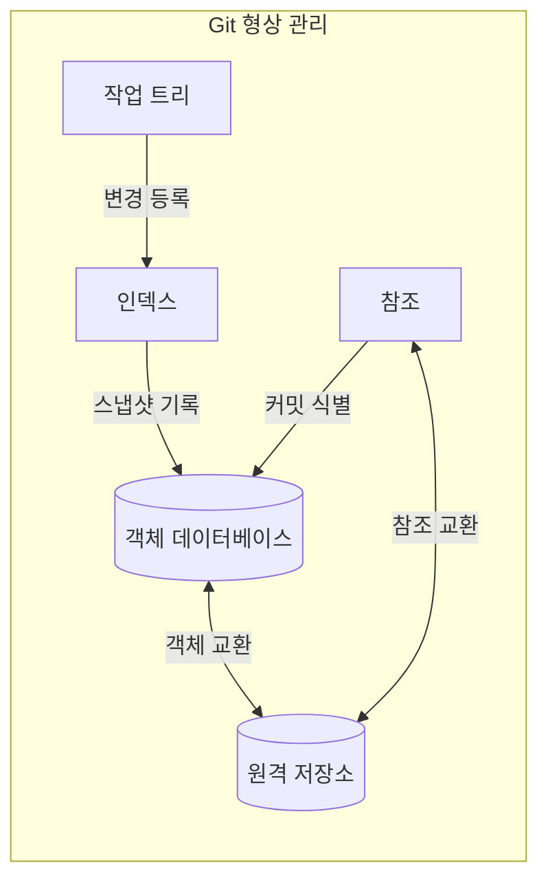
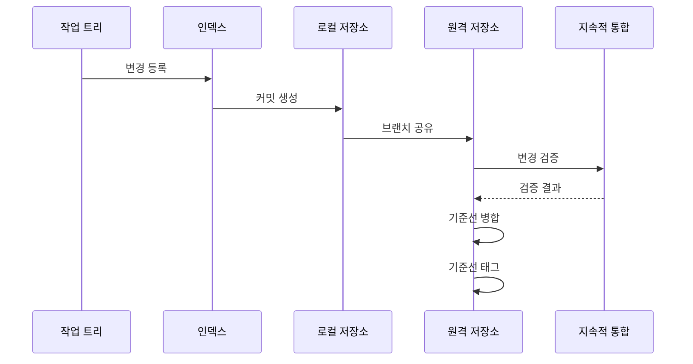

---
sidebar:
  order: 52
  label: "052. 형상 관리 — Git·브랜치 전략 (Configuration Management Git)"
  badge:
    text: "미출제 · 50%"
    variant: note
title: "형상 관리 — Git·브랜치 전략 (Configuration Management Git)"
date: "2026-07-25T00:35:00+09:00"
tags:
  - "notes-software"
weight: 52
extra:
  question_no: "052"
  source_status: "미출제"
  source_history: ""
  priority: 50
  priority_note: "형상·브랜치 전략은 변경 통제 기반"
---

## 미리 알고가기

- **형상 관리(Configuration Management)**: 소스·설정·문서의 기준 버전과 변경 이력을 통제해 승인 상태를 재현하는 활동
- **기준선(Baseline)**: 공식 승인 후 변경 통제 대상으로 삼는 형상 항목의 버전 집합
- **지속적 통합(Continuous Integration, CI)**: ‘시아이’로 읽고 Continuous Integration의 머리글자를 딴 표기이며 작은 변경을 자주 합쳐 자동 빌드·테스트로 통합 오류 탐지
- **깃(Git)**: ‘깃’으로 읽는 공식 프로젝트 이름으로 별도 영문 확장어를 만들지 않으며 각 개발자가 전체 이력을 보유하고 파일 상태를 커밋 스냅샷으로 기록하는 분산 버전 관리 시스템
- **커밋(Commit)**: 파일 스냅샷·작성 정보·부모 커밋을 묶어 저장한 변경 이력 단위
- **브랜치(Branch)**: 특정 커밋을 가리키며 새 커밋을 따라 이동하는 가변 참조
- **병합·리베이스(Merge and Rebase)**: 병합은 두 계보를 연결하고 리베이스는 커밋을 새 기준점 위에 재작성하는 이력 통합 방식
- **트렁크 기반 개발(Trunk-based Development)**: 짧은 작업 브랜치의 작은 변경을 기본 브랜치에 자주 통합하는 협업 방식
- **깃플로(GitFlow)**: ‘깃플로’로 읽는 브랜치 전략의 관례 이름으로 별도 영문 확장어를 만들지 않으며 개발·기능·릴리스·긴급 수정 브랜치를 나눠 정기 출시와 여러 지원 버전을 관리함
- **분산 버전 관리 시스템(Distributed Version Control System, DVCS)**: ‘디브이시에스’로 읽고 영문 머리글자를 딴 표기이며 각 개발자가 전체 이력과 브랜치를 로컬에 보유
- **작업 트리·인덱스(Working Tree·Index)**: 작업 트리는 체크아웃한 파일을 수정하는 공간이고 인덱스는 다음 커밋에 넣을 파일 상태를 선택해 기록하는 영역
- **객체 데이터베이스·참조(Object Database·Reference)**: 객체 데이터베이스는 파일·디렉터리·커밋 내용을 저장하고 참조는 브랜치·태그 이름으로 특정 커밋을 가리킴
- **체크아웃·태그(Checkout·Tag)**: 체크아웃은 선택한 커밋·브랜치 상태를 작업 트리에 펼치고 태그는 릴리스 커밋에 움직이지 않는 버전 이름을 붙임
- **로컬·원격 저장소(Local·Remote Repository)**: 로컬 저장소는 개발자 장비의 전체 이력이고 원격 저장소는 팀이 커밋 객체와 브랜치 참조를 공유하는 지점
- **기능·릴리스·긴급 수정 브랜치(Feature·Release·Hotfix Branch)**: 기능 브랜치는 개발 작업, 릴리스 브랜치는 출시 안정화, 긴급 수정 브랜치는 운영 버전의 긴급 패치를 분리함
- **패치(Patch)**: 특정 결함이나 변경을 반영하는 코드 차이로서 병행 지원 제품은 릴리스 브랜치별 패치를 태그로 고정함

## Ⅰ. 개요

- 정의/개념: 기준선과 Git 이력으로 변경을 식별·통제하는 활동
- **배경/필요성**: 병렬 변경이 충돌을 낳아 기준선·이력 통제 필요

### 쉽게 이해하기 (학습용)

- 문서 판본을 기록하고 어떤 검사를 거쳐 최종본에 합칠지 정하는 활동이다

## Ⅱ. 특징

- 분산 저장소는 로컬에서도 분기·이력 조회 가능하다.
- 커밋은 스냅샷과 부모 참조로 계보 구성한다.
- 브랜치는 커밋을 가리키는 가변 참조이다.
- 병합은 계보를 연결하고 리베이스는 커밋을 재작성한다.

### 쉽게 이해하기 (학습용)

- 판본마다 이전 판본을 연결하고 책갈피를 옮겨 여러 작업 흐름을 관리한다

## Ⅲ. 아키텍처 및 구성요소

| 설계 요소 | 설명 |
|:---|:---|
| 작업 트리 | 체크아웃한 파일을 수정하는 공간 |
| 인덱스 | 다음 커밋의 파일 상태를 기록 |
| 객체 데이터베이스 | 파일·디렉터리·커밋 객체를 저장 |
| 참조 | 브랜치·태그 이름으로 커밋 식별 |
| 원격 저장소 | 팀이 객체와 참조를 교환하는 지점 |

> 요약: 인덱스가 스냅샷을 만들고 참조가 커밋 식별

### 쉽게 이해하기 (학습용)

- 고친 원고에서 저장할 쪽을 선택해 판본으로 묶고 책갈피로 그 판본을 가리킨다

## Ⅳ. 원리 및 절차 흐름도

| 절차 | 설명 |
|:---|:---|
| 변경 등록 | 선택한 파일 상태를 인덱스에 기록 |
| 커밋 생성 | 스냅샷과 부모 참조를 객체로 저장 |
| 브랜치 공유 | 커밋과 참조를 원격 저장소로 전송 |
| 변경 검증 | 후보 커밋을 자동 빌드·테스트 |
| 검증 결과 | 성공·실패 결과를 원격 저장소에 반환 |
| 기준선 병합 | 승인된 커밋을 기본 브랜치에 연결 |
| 기준선 태그 | 릴리스 커밋에 버전 이름 부여 |

> 요약: 검증한 커밋을 기준선에 병합하고 태그 부여

### 쉽게 이해하기 (학습용)

- 고칠 쪽을 판본으로 묶어 공유한 뒤 검사를 통과하면 최종본에 합친다

## Ⅴ. 종류 및 비교

| 판단 기준 | 트렁크 기반 개발 | GitFlow |
|:---|:---|:---|
| 핵심 특징 | 짧은 브랜치·단일 주 배포선 | 목적별 장기 브랜치·다중 배포선 |
| 적용 기준 | 자동 검증과 잦은 배포가 가능할 때 | 병행 버전과 정기 출시가 필요할 때 |
| 주요 위험 | 미완성 변경 노출 | 병합 지연·브랜치 간 충돌 |

> 요약: 배포 주기와 지원 버전으로 브랜치 전략 선택

### 쉽게 이해하기 (학습용)

- 매일 합치는 원고는 짧은 가지를 쓰고 여러 판본은 목적별 가지로 나눈다

## Ⅵ. 실무 사례

1. 수시 배포형 서비스는 짧은 브랜치를 CI 통과 후 병합

### 쉽게 이해하기 (학습용)

- 자주 배포하는 서비스는 작은 변경을 검사할 때마다 최종본에 합친다

## Ⅶ. 결론

- 배포 주기·지원 버전 수로 브랜치 수명과 통합 방식 선택

### 쉽게 이해하기 (학습용)

- 자주 발행할수록 빨리 합치고 여러 판본을 고치면 가지를 오래 유지한다
