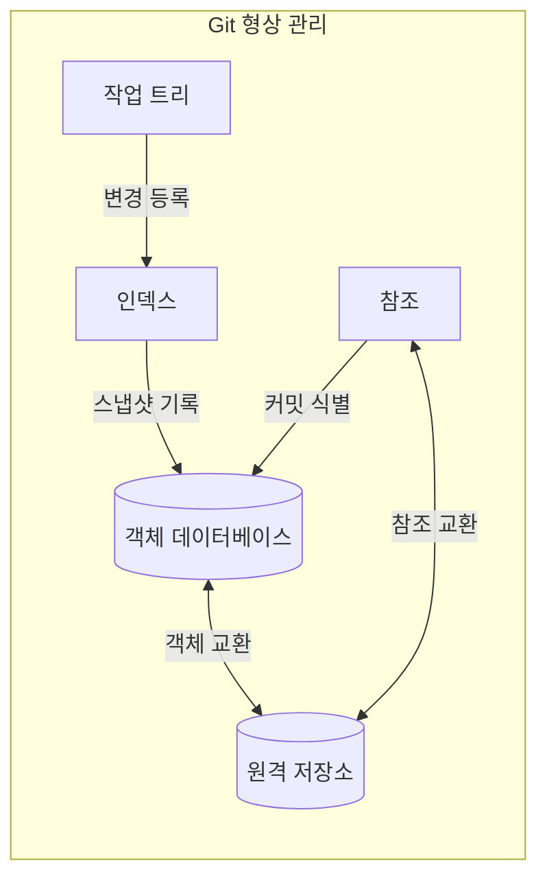
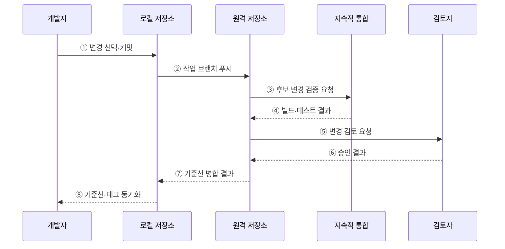

---
sidebar:
  order: 52
  label: "052. 형상 관리 — Git·브랜치 전략 (Configuration Management Git)"
  badge:
    text: "미출제 · 50%"
    variant: note
title: "형상 관리 — Git·브랜치 전략 (Configuration Management Git)"
date: "2026-07-25T00:35:00+09:00"
tags:
  - "notes-software"
weight: 52
extra:
  question_no: "052"
  source_status: "미출제"
  source_history: ""
  priority: 50
  priority_note: "형상·브랜치 전략은 변경 통제 기반"
---

## 미리 알고가기

- **형상 관리(Configuration Management)**: 소스·설정·문서의 기준 버전과 변경 이력을 통제해 승인 상태를 재현하는 활동
- **기준선(Baseline)**: 공식 승인 후 변경 통제 대상으로 삼는 형상 항목의 버전 집합
- **지속적 통합(Continuous Integration, CI)**: 작은 변경을 자주 병합하고 자동 빌드·테스트로 통합 오류를 탐지하는 활동
- **깃(Git)**: 각 개발자가 전체 이력을 보유하고 파일 상태를 커밋 스냅샷으로 기록하는 분산 버전 관리 시스템
- **커밋(Commit)**: 파일 스냅샷·작성 정보·부모 커밋을 묶어 저장한 변경 이력 단위
- **브랜치(Branch)**: 특정 커밋을 가리키며 새 커밋을 따라 이동하는 가변 참조
- **병합·리베이스(Merge and Rebase)**: 병합은 두 계보를 연결하고 리베이스는 커밋을 새 기준점 위에 재작성하는 이력 통합 방식
- **트렁크 기반 개발(Trunk-based Development)**: 짧은 작업 브랜치의 작은 변경을 기본 브랜치에 자주 통합하는 협업 방식
- **깃플로(GitFlow)**: 개발·기능·릴리스·긴급 수정 브랜치를 분리해 정기 출시와 여러 지원 버전을 관리하는 브랜치 전략
- **분산 버전 관리 시스템(Distributed Version Control System, DVCS)**: 각 개발자가 전체 이력과 브랜치를 로컬 저장소에 보유하는 버전 관리 방식
- **작업 트리·인덱스(Working Tree·Index)**: 작업 트리는 체크아웃한 파일을 수정하는 공간이고 인덱스는 다음 커밋에 넣을 파일 상태를 선택해 기록하는 영역
- **객체 데이터베이스·참조(Object Database·Reference)**: 객체 데이터베이스는 파일·디렉터리·커밋 내용을 저장하고 참조는 브랜치·태그 이름으로 특정 커밋을 가리킴
- **체크아웃·태그(Checkout·Tag)**: 체크아웃은 선택한 커밋·브랜치 상태를 작업 트리에 펼치고 태그는 릴리스 커밋에 움직이지 않는 버전 이름을 붙임
- **로컬·원격 저장소(Local·Remote Repository)**: 로컬 저장소는 개발자 장비의 전체 이력이고 원격 저장소는 팀이 커밋 객체와 브랜치 참조를 공유하는 지점
- **기능·릴리스·긴급 수정 브랜치(Feature·Release·Hotfix Branch)**: 기능 브랜치는 개발 작업, 릴리스 브랜치는 출시 안정화, 긴급 수정 브랜치는 운영 버전의 긴급 패치를 분리함
- **패치(Patch)**: 특정 결함이나 변경을 반영하는 코드 차이로서 병행 지원 제품은 릴리스 브랜치별 패치를 태그로 고정함
- **보호 브랜치(Protected Branch)**: 직접 푸시·강제 갱신을 제한하고 검토·검증을 통과한 변경만 병합하도록 설정한 브랜치
- **강제 푸시(Force Push)**: 원격 브랜치가 가리키는 이력을 로컬 이력으로 강제로 바꾸는 작업으로 공유 이력을 유실할 수 있음

## Ⅰ. 개요

- 정의/개념: 기준선과 Git 이력으로 변경을 식별·통제하는 활동
- **배경/필요성**: 병렬 변경이 충돌을 낳아 기준선·이력 통제 필요

### 쉽게 이해하기 (학습용)

- 문서 판본을 기록하고 어떤 검사를 거쳐 최종본에 합칠지 정하는 활동이다.

## Ⅱ. 특징

- 분산 저장소는 로컬에서도 분기·이력 조회 가능하다.
- 커밋은 스냅샷과 부모 참조로 계보 구성한다.
- 브랜치는 커밋을 가리키는 가변 참조이다.
- 병합은 계보를 연결하고 리베이스는 커밋을 재작성한다.

### 쉽게 이해하기 (학습용)

- 판본마다 이전 판본을 연결하고 책갈피를 옮겨 여러 작업 흐름을 관리한다.

## Ⅲ. 아키텍처 및 구성요소

**도표안 A — 구조도**

**도표안 B — sequenceDiagram**

| 설계 요소 | 설명 |
|:---|:---|
| 작업 트리 | 체크아웃한 파일을 수정하는 공간 |
| 인덱스 | 다음 커밋의 파일 상태를 기록 |
| 객체 데이터베이스 | 파일·디렉터리·커밋 객체를 저장 |
| 참조 | 브랜치·태그 이름으로 커밋 식별 |
| 원격 저장소 | 팀이 객체와 참조를 교환하는 지점 |

**동작 원리**

- ① 개발자가 변경 중 커밋할 파일만 선택해 로컬 스냅샷을 만든다.
- ② 로컬 커밋과 작업 브랜치 참조를 원격 저장소에 공유한다.
- ③ 원격 저장소가 후보 변경의 자동 검증을 요청한다.
- ④ 지속적 통합 시스템이 빌드·테스트 결과를 반환한다.
- ⑤ 검증을 통과한 변경을 검토자에게 요청한다.
- ⑥ 검토자가 변경 내용과 기준 충족 여부를 승인한다.
- ⑦ 원격 저장소가 승인된 변경을 기준선에 병합하고 결과를 배포한다.
- ⑧ 개발자가 새 기준선과 릴리스 태그를 로컬에 동기화한다.

> 요약: 선택한 변경을 커밋하고 자동 검증·검토를 거쳐 기준선으로 확정한다.

### 쉽게 이해하기 (학습용)

- 고칠 쪽을 판본으로 묶어 공유한 뒤 검사를 통과하면 최종본에 합친다.

## Ⅳ. 종류 및 비교

| 판단 기준 | 트렁크 기반 개발 | GitFlow |
|:---|:---|:---|
| 핵심 특징 | 짧은 브랜치·단일 주 배포선 | 목적별 장기 브랜치·다중 배포선 |
| 적용 기준 | 자동 검증과 잦은 배포가 가능할 때 | 병행 버전과 정기 출시가 필요할 때 |
| 주요 위험 | 미완성 변경 노출 | 병합 지연·브랜치 간 충돌 |

> 요약: 배포 주기와 지원 버전으로 브랜치 전략 선택

### 쉽게 이해하기 (학습용)

- 매일 합치는 원고는 짧은 가지를 쓰고 여러 판본은 목적별 가지로 나눈다.

## Ⅴ. 실무 고려사항 및 대책

| 고려사항 | 문제점 | 대책 |
|:---|:---|:---|
| 장기 브랜치 | 변경이 쌓여 병합 충돌과 통합 위험 증가 | 작은 변경과 짧은 브랜치로 자주 통합 |
| 공유 이력 재작성 | 강제 푸시로 다른 개발자의 커밋 유실 | 보호 브랜치와 강제 갱신 제한 적용 |
| 불명확한 커밋 | 여러 목적이 섞여 검토·복구 곤란 | 한 목적의 원자적 커밋과 의도 중심 메시지 작성 |
| 검증 없는 병합 | 기준선이 빌드 불가 상태로 변경 | 필수 CI·검토 승인 후 병합하도록 통제 |
| 비밀정보 커밋 | 삭제 후에도 저장소 이력에 자격 증명 잔존 | 사전 비밀 탐지와 즉시 자격 증명 폐기·이력 정화 |

> 적용 사례: 수시 배포형 서비스는 짧은 브랜치를 CI 통과 후 기준선에 병합한다.

### 쉽게 이해하기 (학습용)

- 자주 배포하는 서비스는 작은 변경을 검사할 때마다 최종본에 합친다.

## Ⅵ. 결론

- 형상 관리는 재현 가능한 기준선과 추적 가능한 변경 이력을 만든다.
- 배포 주기와 지원 버전 수에 맞춰 브랜치 수명과 통합 방식을 선택한다.

### 쉽게 이해하기 (학습용)

- 자주 발행할수록 빨리 합치고 여러 판본을 고치면 가지를 오래 유지한다.
