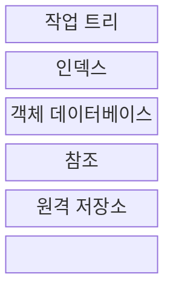
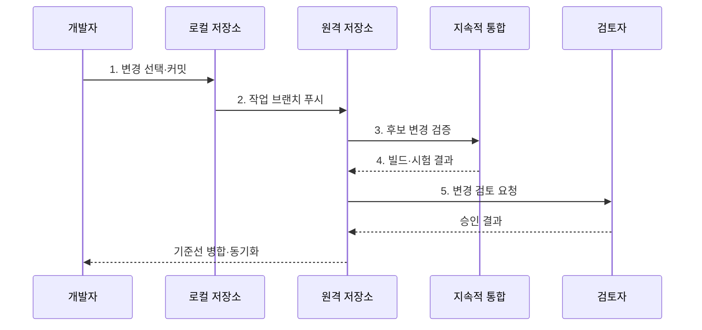

---
sidebar:
  order: 52
  label: "052. 형상 관리: Git·브랜치 전략 (Configuration Management Git)"
  badge:
    text: "미출제 · 50%"
    variant: note
title: "형상 관리: Git·브랜치 전략 (Configuration Management Git)"
date: "2026-07-30T18:00:00+09:00"
tags:
  - "notes-software"
weight: 52
extra:
  question_no: "052"
  source_status: "미출제"
  source_history: ""
  priority: 50
  priority_note: "형상·브랜치 전략은 변경 통제 기반"
---

## 미리 알고가기

- **형상 관리(Configuration Management)**: 소스·설정·문서의 기준 버전과 변경 이력을 통제해 승인 상태를 재현하는 활동
- **기준선(Baseline)**: 공식 승인 후 변경 통제 대상으로 삼는 형상 항목의 버전 집합
- **지속적 통합(Continuous Integration, CI)**: 작은 변경을 자주 병합하고 자동 빌드·테스트로 통합 오류를 탐지하는 활동
- **깃(Git)**: 각 개발자가 전체 이력을 보유하고 파일 상태를 커밋 스냅샷으로 기록하는 분산 버전 관리 시스템
- **커밋(Commit)**: 파일 스냅샷·작성 정보·부모 커밋을 묶어 저장한 변경 이력 단위
- **브랜치(Branch)**: 특정 커밋을 가리키며 새 커밋을 따라 이동하는 가변 참조
- **병합·리베이스(Merge and Rebase)**: 병합은 두 계보를 연결하고 리베이스는 커밋을 새 기준점 위에 재작성하는 이력 통합 방식
- **트렁크 기반 개발(Trunk-based Development)**: 짧은 작업 브랜치의 작은 변경을 기본 브랜치에 자주 통합하는 협업 방식
- **깃플로(GitFlow)**: 개발·기능·릴리스·긴급 수정 브랜치를 분리해 정기 출시와 여러 지원 버전을 관리하는 브랜치 전략
- **분산 버전 관리 시스템(Distributed Version Control System, DVCS)**: 각 개발자가 전체 이력과 브랜치를 로컬 저장소에 보유하는 버전 관리 방식
- **작업 트리·인덱스(Working Tree·Index)**: 작업 트리는 체크아웃한 파일을 수정하는 공간이고 인덱스는 다음 커밋에 넣을 파일 상태를 선택해 기록하는 영역
- **객체 데이터베이스·참조(Object Database·Reference)**: 객체 데이터베이스는 파일·디렉터리·커밋 내용을 저장하고 참조는 브랜치·태그 이름으로 특정 커밋을 가리킴
- **체크아웃·태그(Checkout·Tag)**: 체크아웃은 선택한 커밋·브랜치 상태를 작업 트리에 펼치고 태그는 릴리스 커밋에 움직이지 않는 버전 이름을 붙이다.
- **로컬·원격 저장소(Local·Remote Repository)**: 로컬 저장소는 개발자 장비의 전체 이력이고 원격 저장소는 팀이 커밋 객체와 브랜치 참조를 공유하는 지점
- **기능·릴리스·긴급 수정 브랜치(Feature·Release·Hotfix Branch)**: 기능 브랜치는 개발 작업, 릴리스 브랜치는 출시 안정화, 긴급 수정 브랜치는 운영 버전의 긴급 패치를 분리한다.
- **패치(Patch)**: 특정 결함이나 변경을 반영하는 코드 차이로서 병행 지원 제품은 릴리스 브랜치별 패치를 태그로 고정한다.
- **보호 브랜치(Protected Branch)**: 직접 푸시·강제 갱신을 제한하고 검토·검증을 통과한 변경만 병합하도록 설정한 브랜치
- **강제 푸시(Force Push)**: 원격 브랜치가 가리키는 이력을 로컬 이력으로 강제로 바꾸는 작업으로 공유 이력을 유실할 수 있음

## Ⅰ. 개요

- 정의/개념: 기준선과 Git 이력으로 변경을 식별·통제하는 활동
- 배경/필요성: 병렬 변경의 **충돌·누락·기준선 불일치** 통제

### 쉽게 이해하기 (학습용)

- 문서 판본을 기록하고 어떤 검사를 거쳐 최종본에 합칠지 정하는 활동이다.

## Ⅱ. 특징

- **분산 저장소**로 로컬 분기·이력 조회
- **커밋·참조**로 스냅샷 계보 구성
- **병합·리베이스**로 변경 계보 통합

### 쉽게 이해하기 (학습용)

- 판본마다 이전 판본을 연결하고 책갈피를 옮겨 여러 작업 흐름을 관리한다.

## Ⅲ. 구조 및 구성요소

| 구성요소 | 책임 |
|:---|:---|
| 작업 트리 | 체크아웃 파일 수정 |
| 인덱스 | 다음 커밋의 파일 상태 선택 |
| 객체 데이터베이스 | 파일·트리·커밋 객체 저장 |
| 참조 | 브랜치·태그로 커밋 식별 |
| 원격 저장소 | 팀의 객체·참조 공유 |

### 쉽게 이해하기 (학습용)

- 작업 원고, 발행 목록, 판본 창고, 책갈피, 공동 창고로 구성된다.

## Ⅳ. 흐름도

**동작 원리**

- **1. 변경 선택·커밋**: 필요한 파일만 스냅샷 생성
- **2. 작업 브랜치 푸시**: 커밋·참조를 원격 공유
- **3. 후보 변경 검증**: 자동 빌드·시험 요청
- **4. 빌드·시험 결과**: 통합 가능 여부 반환
- **5. 변경 검토 요청**: 내용·기준 충족 확인

> 요약: 선택한 변경을 커밋하고 자동 검증·검토를 거쳐 기준선으로 확결정

### 쉽게 이해하기 (학습용)

- 고칠 쪽을 판본으로 묶어 공유한 뒤 검사를 통과하면 최종본에 합친다.

## Ⅴ. 종류 및 비교

| 비교 항목 | 트렁크 기반 개발 | GitFlow |
|:---|:---|:---|
| 적용 기준 | 자동 검증과 잦은 배포가 가능할 때 | 병행 버전과 정기 출시가 필요할 때 |
| 핵심 특징 | 짧은 브랜치·단일 주 배포선 | 목적별 장기 브랜치·다중 배포선 |
| 한계 | 미완성 변경 노출 | 병합 지연·브랜치 간 충돌 |

> 요약: 배포 주기와 지원 버전으로 브랜치 전략 선택

### 쉽게 이해하기 (학습용)

- 매일 합치는 원고는 짧은 가지를 쓰고 여러 판본은 목적별 가지로 나눈다.

## Ⅵ. 실무 고려사항 및 대책

| 고려사항 | 대책 | 효과 |
|:---|:---|:---|
| 장기 브랜치 | 작은 변경·짧은 브랜치로 자주 통합 | 충돌·통합 위험 감소 |
| 공유 이력 재작성 | 보호 브랜치·강제 갱신 제한 | 커밋 유실 방지 |
| 불명확한 커밋 | 한 목적 커밋·의도 중심 메시지 | 검토·복구 단순화 |
| 검증 없는 병합 | 필수 CI·검토 승인 후 병합 | 기준선 안정성 |
| 비밀정보 커밋 | 비밀 탐지·자격 증명 폐기·이력 정화 | 노출 피해 제한 |

> 적용 사례: 수시 배포형 서비스는 짧은 브랜치를 CI 통과 후 기준선에 병합

### 쉽게 이해하기 (학습용)

- 자주 배포하는 서비스는 작은 변경을 검사할 때마다 최종본에 합친다.

## Ⅶ. 결론

- **배포 주기·지원 버전 수**로 브랜치 전략을 선택

### 쉽게 이해하기 (학습용)

- 자주 발행할수록 빨리 합치고 여러 판본을 고치면 가지를 오래 유지한다.
