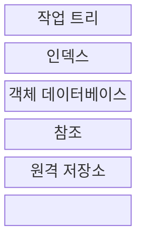
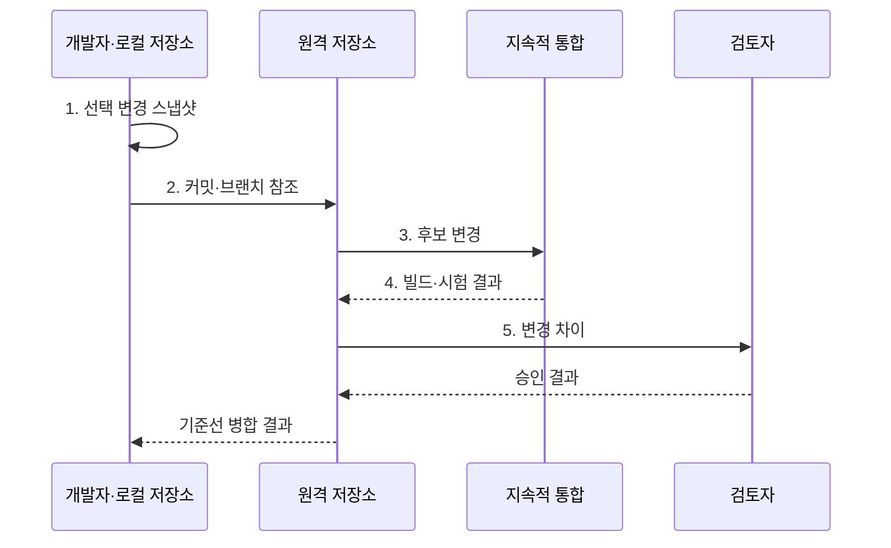

---
sidebar:
  order: 52
  label: "052. 형상 관리: Git·브랜치 전략 (Configuration Management Git)"
  badge:
    text: "미출 · 50%"
    variant: note
title: "형상 관리: Git·브랜치 전략 (Configuration Management Git)"
date: "2026-08-02T23:02:00+09:00"
tags:
  - "notes-software"
weight: 52
extra:
  question_no: "052"
  source_status: "미출"
  source_history: ""
  priority: 50
  priority_note: "형상·브랜치 전략은 변경 통제 기반"
---

## Ⅰ. 개요

핵심 용어

- **형상 관리(Configuration Management)**: 소스·설정·문서의 기준 버전과 변경 이력을 통제해 승인 상태를 재현하는 활동이다.
- **기준선(Baseline)**: 공식 승인 후 변경 통제 대상으로 삼는 형상 항목의 버전 집합이다.

- 정의/개념: 소스·설정·문서의 **기준선·Git 이력**으로 변경을 식별·통제하는 형상 관리 활동
- 배경/필요성: 공통 기준선 없이 병렬 변경하면 **변경 충돌·배포 버전 불일치**

#### 한줄 요약

- 문서 판본을 기록하고 어떤 검사를 거쳐 최종본에 합칠지 정하는 활동이다.

## Ⅱ. 특징

핵심 용어

- **분산 버전 관리 시스템(Distributed Version Control System, DVCS)**: 각 개발자가 전체 이력과 브랜치를 로컬 저장소에 보유하는 방식이다.
- **병합·리베이스(Merge and Rebase)**: 병합은 두 계보를 연결하고 리베이스는 커밋을 새 기준점 위에 재작성한다.
- **커밋·스냅샷 계보(Commit·Snapshot Lineage)**: 파일 상태를 보존한 커밋과 부모 연결을 따라 변경 이력이 이어지는 구조이다.

- **DVCS 분산 저장소**로 로컬 분기·전체 이력 조회
- **커밋·참조**로 스냅샷 계보 구성
- **병합·리베이스**로 변경 계보 통합

#### 한줄 요약

- 판본마다 이전 판본을 연결하고 책갈피를 옮겨 여러 작업 흐름을 관리한다.

## Ⅲ. 구조 및 구성요소

핵심 용어

- **작업 트리(Working Tree)**: 체크아웃한 파일을 실제로 수정하는 작업 공간이다.
- **인덱스(Index)**: 다음 커밋에 포함할 파일 상태를 선택해 기록하는 영역이다.
- **객체 데이터베이스(Object Database)**: 파일·디렉터리·커밋 내용을 내용 기반 객체로 저장하는 영역이다.
- **참조(Reference)**: 브랜치나 태그 이름으로 특정 커밋을 가리키는 포인터이다.
- **체크아웃(Checkout)**: 선택한 커밋·브랜치의 파일 상태를 작업 트리에 펼치고 현재 참조를 바꾸는 동작이다.
- **트리·커밋 객체(Tree·Commit Object)**: 트리 객체는 디렉터리와 파일 객체 관계를, 커밋 객체는 루트 트리·부모·작성 정보를 저장한다.

| 구성요소 | 책임 |
|:---|:---|
| 작업 트리 | **체크아웃 파일** 수정 |
| 인덱스 | 다음 **커밋 파일 상태** 선택 |
| 객체 데이터베이스 | 파일·트리와 **커밋 객체** 저장 |
| 참조 | **브랜치·태그**로 커밋 식별 |
| 원격 저장소 | 팀의 **객체·참조** 공유 |

#### 한줄 요약

- 작업 원고, 발행 목록, 판본 창고, 책갈피, 공동 창고로 구성된다.

## Ⅳ. 흐름도

핵심 용어

- **커밋(Commit)**: 파일 스냅샷·작성 정보·부모 커밋을 묶어 저장한 변경 이력 단위이다.
- **지속적 통합(Continuous Integration, CI)**: 작은 변경을 자주 병합하고 자동 빌드·테스트로 통합 오류를 탐지하는 활동이다.
- **보호 브랜치(Protected Branch)**: 검토와 검증을 통과한 변경만 병합하도록 직접 갱신을 제한한 브랜치이다.

**동작 원리**

1. **선택 변경 스냅샷**: 인덱스의 파일 상태로 커밋 생성
2. **커밋·브랜치 참조**: 로컬 객체와 이동 참조를 원격 공유
3. **후보 변경**: 지속적 통합에 자동 빌드·시험 요청
4. **빌드·시험 결과**: 기준선 통합 가능 여부 반환
5. **변경 차이**: 검토자가 내용과 승인 기준 판정

> 요약: 선택 변경을 **커밋**하고 자동 검증·검토 후 **기준선** 확정

#### 한줄 요약

- 고칠 쪽을 판본으로 묶어 공유한 뒤 검사를 통과하면 최종본에 합친다.

## Ⅴ. 종류 및 비교

핵심 용어

- **트렁크 기반 개발(Trunk-based Development)**: 짧은 작업 브랜치의 작은 변경을 기본 브랜치에 자주 통합하는 방식이다.
- **깃플로(GitFlow)**: 개발·기능·릴리스·긴급 수정 브랜치를 분리해 출시와 지원 버전을 관리하는 전략이다.

| 브랜치 전략 | 트렁크 기반 개발 | GitFlow |
|:---|:---|:---|
| 적용 기준 | **자동 검증·잦은 배포** 가능 | **병행 버전·정기 출시** 필요 |
| 핵심 특징 | **짧은 브랜치·단일 주 배포선** | **기능·릴리스 브랜치**와 긴급 수정 브랜치 |
| 한계 | **미완성 변경 노출** | **병합 지연·브랜치 충돌** |

> 요약: **배포 주기·지원 버전**으로 브랜치 전략 선택

#### 한줄 요약

- 매일 합치는 원고는 짧은 가지를 쓰고 여러 판본은 목적별 가지로 나눈다.

## Ⅵ. 실무 고려사항 및 대책

핵심 용어

- **장기 브랜치(Long-lived Branch)**: 기본 브랜치와 오래 분리되어 병합 충돌과 통합 위험이 커진 브랜치이다.
- **강제 푸시(Force Push)**: 원격 브랜치 참조를 로컬 이력으로 강제로 바꾸어 공유 이력을 유실할 수 있는 작업이다.
- **비밀정보(Secret)**: 저장소에 기록되면 이력 전체에서 회수와 폐기가 필요한 토큰·키·비밀번호이다.
- **의도 중심 메시지(Intent-focused Message)**: 변경 내용의 나열보다 무엇을 왜 바꿨는지를 설명하는 커밋 메시지이다.
- **필수 CI·검토 승인(Required CI·Review Approval)**: 정한 자동 검증과 사람의 검토가 성공해야 보호 브랜치 병합을 허용하는 규칙이다.
- **비밀값 탐지·키 폐기·이력 정화**: 커밋의 비밀을 검사하고 노출 자격 증명을 무효화한 뒤 저장소 이력에서 민감값을 제거하는 대응이다.

| 문제 | 대책 | 효과 |
|:---|:---|:---|
| 장기 브랜치로 변경 차이가 누적돼 충돌 증가 | **작은 변경·짧은 브랜치**로 자주 통합 | **충돌·통합 위험** 감소 |
| 공유 브랜치를 강제 갱신해 커밋 유실 | **보호 브랜치·강제 푸시 제한** | **커밋 유실** 방지 |
| 여러 목적을 한 커밋에 섞어 검토·복구 곤란 | **한 목적 커밋·의도 중심 메시지** | **검토·복구** 단순화 |
| 자동 검증과 승인 없이 기준선에 병합 | **필수 CI·검토 승인** 후 병합 | **기준선 안정성** 확보 |
| 비밀값을 커밋해 전체 이력에 노출 | **비밀값 탐지·노출 키 폐기**와 이력 정화 | **노출 피해** 제한 |

#### 한줄 요약

- 자주 배포하는 서비스는 작은 변경을 검사할 때마다 최종본에 합친다.

## Ⅶ. 결론

핵심 용어

- **브랜치 전략(Branching Strategy)**: 변경 규모와 출시 방식에 맞춰 브랜치 생성·통합·보호 규칙을 정한 협업 방식이다.
- **변경 추적성(Change Traceability)**: 요구, 변경, 검토, 검증, 기준선 사이의 관계를 이력으로 확인할 수 있는 성질이다.

- 단일 버전의 잦은 배포는 **트렁크 기반**, 병행 지원은 **GitFlow** 선택

#### 한줄 요약

- 자주 발행할수록 빨리 합치고 여러 판본을 고치면 가지를 오래 유지한다.
