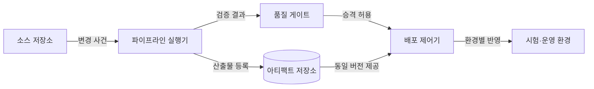
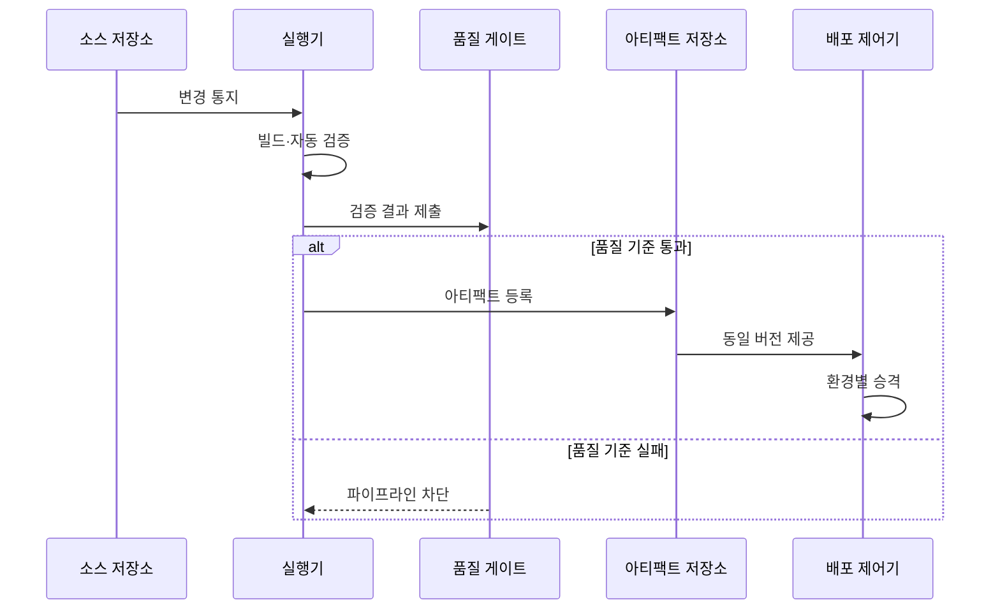

---
sidebar:
  order: 53
  label: "053. CI/CD 파이프라인 (CI/CD Pipeline)"
  badge:
    text: "기출 · 50%"
    variant: note
title: "CI/CD 파이프라인 (CI/CD Pipeline)"
date: "2026-07-27T23:59:59+09:00"
tags:
  - "notes-software"
weight: 53
extra:
  question_no: "053"
  source_status: "기출"
  source_history: "120회"
  priority: 50
  priority_note: "120회 기출, 빌드·시험·배포 자동화"
---

## 미리 알고가기

- **지속적 통합(Continuous Integration, CI)**: ‘시아이’로 읽고 영문 머리글자를 딴 약어이며, 작은 코드 변경을 자주 병합하고 자동 검증하는 활동
- **지속적 전달(Continuous Delivery, CD)**: ‘시디’로 읽고 영문 머리글자를 딴 약어이며, 검증한 변경을 언제든 배포 가능한 상태로 준비하는 활동
- **지속적 배포(Continuous Deployment, CD)**: Delivery와 같은 ‘시디’ 약어를 쓰며, 검증한 변경을 수동 승인 없이 운영에 반영하는 활동
- **CI/CD**: ‘시아이 슬래시 시디’로 읽고 통합과 전달·배포 영역을 빗금으로 잇는 표기이며, 변경 검증부터 배포까지의 자동화 범위를 나타냄
- **병합 요청(Pull Request, PR)**: ‘피알’로 읽고 영문 머리글자를 딴 약어이며, 코드 검토와 기본 브랜치 병합 승인을 요청함
- **빌드 아티팩트(Build Artifact)**: 소스 코드를 빌드해 만든 실행 파일·패키지·컨테이너 이미지
- **불변 아티팩트(Immutable Artifact)**: 한 번 생성한 뒤 수정하지 않고 같은 버전을 환경별로 승격하는 산출물
- **품질 게이트(Quality Gate)**: 테스트·보안·정책 결과로 다음 단계 진입 여부를 판정하는 통제 지점
- **파이프라인 코드화(Pipeline as Code)**: 빌드·검증·배포 절차를 선언 파일로 작성해 버전 관리하는 방식
- **복귀(Rollback)**: 배포 장애 시 트래픽이나 실행 버전을 검증된 이전 상태로 되돌리는 복구 동작

## Ⅰ. 개요

- 정의/개념: 코드 변경의 **통합·검증·배포를 자동화**하는 흐름
- 기존 한계: 수동 릴리스의 **검증 누락·환경 편차** 발생

### 쉽게 이해하기 (학습용)

- 코드가 바뀔 때마다 같은 검사대를 통과시켜 합격한 동일 제품만 다음 환경으로 보내는 자동 생산선과 같다.

## Ⅱ. 특징

- 작은 변경의 **조기 검증·빠른 피드백**
- 동일 아티팩트의 **환경별 승격·추적**
- 품질 게이트의 **실패 차단·승인 통제**

### 쉽게 이해하기 (학습용)

- 변경 단위를 작게 검사하고 합격한 산출물만 이동하므로 결함 원인과 배포 버전을 빠르게 찾을 수 있다.

## Ⅲ. 아키텍처 및 구성요소

| 구성요소 | 책임 |
|:---|:---|
| 소스 저장소 | **변경 이력·파이프라인 정의** 관리 |
| 파이프라인 실행기 | **빌드·테스트·분석** 자동 수행 |
| 품질 게이트 | 결과 기반 **승격 허용·차단** |
| 아티팩트 저장소 | **버전·무결성** 보존 |
| 배포 제어기 | 승인 버전의 **환경별 반영** |

> 요약: 품질 게이트와 불변 아티팩트가 환경별 승격을 통제

### 쉽게 이해하기 (학습용)

- 저장소가 작업 지시서를 보내면 실행기가 제품을 만들고 검사하며, 합격품 보관소의 같은 제품만 배포 제어기가 옮긴다.

## Ⅳ. 원리 및 절차 흐름

| 절차 | 설명 |
|:---|:---|
| 변경 통지 | 커밋·병합으로 **파이프라인 기동** |
| 빌드·자동 검증 | 코드의 **빌드·테스트·분석** |
| 결과 제출 | 게이트에 **품질 근거 전달** |
| 아티팩트 등록 | 통과 산출물의 **버전·해시 보존** |
| 환경별 승격 | 동일 버전을 **시험·운영 반영** |
| 파이프라인 차단 | 실패 변경의 **병합·배포 방지** |

> 요약: 변경 검증을 통과한 동일 아티팩트만 환경별 승격

### 쉽게 이해하기 (학습용)

- 검사에 실패하면 생산선이 멈추고, 통과하면 봉인된 같은 제품을 시험 창고와 운영 창고로 차례로 보낸다.

## Ⅴ. 종류 및 비교

| 자동화 범위 | 지속적 통합(CI) | 지속적 전달 | 지속적 배포 |
|:---|:---|:---|:---|
| 적용 기준 | 잦은 병합의 **조기 결함 탐지** | 승인 기반 **상시 배포 준비** | 저위험 변경의 **운영 자동화** |
| 핵심 특징 | 변경의 **빌드·자동 검증** | 운영 직전까지 **자동 승격** | 통과 변경의 **자동 운영 반영** |
| 한계 | 불안정 테스트의 **통합 지연** | 승인 대기의 **전달 지연** | 결함의 **운영 자동 확산** |

> 요약: 운영 반영의 자동 여부가 전달과 배포를 구분

### 쉽게 이해하기 (학습용)

- CI는 합칠 수 있는지 확인하고, Delivery는 출고 직전까지 준비하며, Deployment는 합격품을 운영에 자동 출고한다.

## Ⅵ. 실무 사례

1. 병합 요청은 **단위 테스트·정적 분석** 실패 시 병합 차단
2. 컨테이너 이미지는 **동일 해시**로 시험·운영 환경 승격

### 쉽게 이해하기 (학습용)

- 코드 검사를 통과하지 못하면 본선에 합칠 수 없고, 통과한 컨테이너는 내용 변경 없이 운영까지 이동한다.

## Ⅶ. 결론

- 규제·승인 변경은 **지속적 전달**, 자동 복구 가능 변경은 **지속적 배포**

### 쉽게 이해하기 (학습용)

- 사람의 최종 확인이 필요한 변경은 출고 대기시키고, 안전하게 되돌릴 수 있는 변경만 자동 출고한다.
