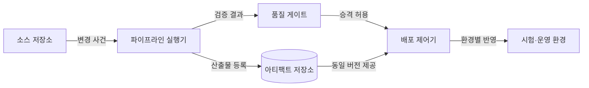
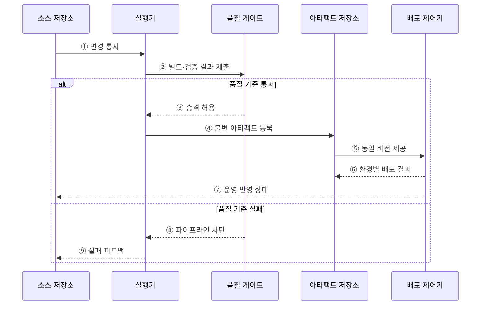

---
sidebar:
  order: 53
  label: "053. CI/CD 파이프라인 (CI/CD Pipeline)"
  badge:
    text: "기출 · 50%"
    variant: note
title: "CI/CD 파이프라인 (CI/CD Pipeline)"
date: "2026-07-27T23:59:59+09:00"
tags:
  - "notes-software"
weight: 53
extra:
  question_no: "053"
  source_status: "기출"
  source_history: "120회"
  priority: 50
  priority_note: "120회 기출, 빌드·시험·배포 자동화"
---

## 미리 알고가기

- **지속적 통합(Continuous Integration, CI)**: 작은 코드 변경을 자주 병합하고 자동 빌드·테스트로 검증하는 활동
- **지속적 전달(Continuous Delivery, CD)**: 검증한 변경을 언제든 운영에 배포할 수 있는 상태로 준비하는 활동
- **지속적 배포(Continuous Deployment, CD)**: Delivery와 같은 ‘시디’ 약어를 쓰며, 검증한 변경을 수동 승인 없이 운영에 반영하는 활동
- **CI/CD**: 코드 변경의 통합·검증부터 전달·배포까지를 자동화하는 개발 파이프라인
- **병합 요청(Pull Request, PR)**: 코드 검토와 기본 브랜치 병합 승인을 요청하는 협업 절차
- **빌드 아티팩트(Build Artifact)**: 소스 코드를 빌드해 만든 실행 파일·패키지·컨테이너 이미지
- **불변 아티팩트(Immutable Artifact)**: 한 번 생성한 뒤 수정하지 않고 같은 버전을 환경별로 승격하는 산출물
- **품질 게이트(Quality Gate)**: 테스트·보안·정책 결과로 다음 단계 진입 여부를 판정하는 통제 지점
- **파이프라인 코드화(Pipeline as Code)**: 빌드·검증·배포 절차를 선언 파일로 작성해 버전 관리하는 방식
- **복귀(Rollback)**: 배포 장애 시 트래픽이나 실행 버전을 검증된 이전 상태로 되돌리는 복구 동작
- **공급망 증명(Provenance)**: 산출물을 어떤 소스·빌드 절차·도구로 만들었는지 검증할 수 있게 기록한 생성 이력
- **불안정 테스트(Flaky Test)**: 코드 변경 없이도 실행할 때마다 성공과 실패가 달라지는 테스트

## Ⅰ. 개요

- 정의/개념: 코드 변경의 **통합·검증·배포를 자동화**하는 흐름
- 기존 한계: 수동 릴리스의 **검증 누락·환경 편차** 발생

### 쉽게 이해하기 (학습용)

- 코드가 바뀔 때마다 같은 검사대를 통과시켜 합격한 동일 제품만 다음 환경으로 보내는 자동 생산선과 같다.

## Ⅱ. 특징

- 작은 변경의 **조기 검증·빠른 피드백**
- 동일 아티팩트의 **환경별 승격·추적**
- 품질 게이트의 **실패 차단·승인 통제**

### 쉽게 이해하기 (학습용)

- 변경 단위를 작게 검사하고 합격한 산출물만 이동하므로 결함 원인과 배포 버전을 빠르게 찾을 수 있다.

## Ⅲ. 아키텍처 및 구성요소

**도표안 A — 구조도**

**도표안 B — sequenceDiagram**

| 구성요소 | 책임 |
|:---|:---|
| 소스 저장소 | 변경 이력·파이프라인 정의 관리 |
| 파이프라인 실행기 | 빌드·테스트·분석 자동 수행 |
| 품질 게이트 | 결과 기반 승격 허용·차단 |
| 아티팩트 저장소 | 산출물의 버전·무결성 보존 |
| 배포 제어기 | 승인 버전의 환경별 반영 |

**동작 원리**

- ① 커밋·병합 사건이 파이프라인 실행기를 기동한다.
- ② 실행기가 코드를 빌드·테스트·분석하고 결과를 품질 게이트에 제출한다.
- ③ 품질 기준을 통과하면 게이트가 다음 단계 승격을 허용한다.
- ④ 실행기가 통과한 산출물의 버전과 해시를 저장한다.
- ⑤ 배포 제어기가 저장된 동일 버전을 시험·운영 환경에 사용한다.
- ⑥ 배포 제어기가 환경별 반영 결과를 아티팩트 이력에 연결한다.
- ⑦ 운영 반영 상태를 소스 변경 이력에 피드백한다.
- ⑧ 품질 기준에 실패하면 게이트가 승격을 차단한다.
- ⑨ 실행기가 실패 원인과 결과를 변경 제출자에게 알린다.

> 요약: 검증을 통과한 불변 아티팩트만 환경별로 승격한다.

### 쉽게 이해하기 (학습용)

- 검사에 실패하면 생산선이 멈추고, 통과하면 봉인된 같은 제품을 시험 창고와 운영 창고로 차례로 보낸다.

## Ⅳ. 종류 및 비교

| 자동화 범위 | 지속적 통합(CI) | 지속적 전달 | 지속적 배포 |
|:---|:---|:---|:---|
| 적용 기준 | 잦은 병합의 **조기 결함 탐지** | 승인 기반 **상시 배포 준비** | 저위험 변경의 **운영 자동화** |
| 핵심 특징 | 변경의 **빌드·자동 검증** | 운영 직전까지 **자동 승격** | 통과 변경의 **자동 운영 반영** |
| 한계 | 불안정 테스트의 **통합 지연** | 승인 대기의 **전달 지연** | 결함의 **운영 자동 확산** |

> 요약: 운영 반영의 자동 여부가 전달과 배포를 구분

### 쉽게 이해하기 (학습용)

- CI는 합칠 수 있는지 확인하고, Delivery는 출고 직전까지 준비하며, Deployment는 합격품을 운영에 자동 출고한다.

## Ⅴ. 실무 고려사항 및 대책

| 고려사항 | 문제점 | 대책 |
|:---|:---|:---|
| 느린 피드백 | 긴 파이프라인이 작은 변경과 복구를 지연 | 빠른 검사를 앞에 배치하고 단계 병렬화·캐시 적용 |
| 불안정 테스트 | 무관한 실패로 신뢰 저하와 반복 실행 증가 | 실패 원인 추적·격리와 재현성 있는 테스트 환경 구축 |
| 환경별 재빌드 | 같은 버전의 내용이 환경마다 달라짐 | 한 번 빌드한 불변 아티팩트를 설정만 달리해 승격 |
| 자격 증명 노출 | 로그·정의 파일에 배포 권한 유출 | 비밀 저장소·단기 자격 증명·최소 권한 적용 |
| 자동 결함 확산 | 통과하지 못한 위험이 운영까지 전파 | 단계적 배포·상태 검증·자동 복귀 기준 운영 |
| 산출물 위변조 | 출처 불명의 패키지가 배포될 수 있음 | 서명·해시 검증과 공급망 증명 보존 |

> 적용 사례: 병합 요청은 단위 테스트와 정적 분석에 실패하면 기준선 병합을 차단한다.

### 쉽게 이해하기 (학습용)

- 코드 검사를 통과하지 못하면 본선에 합칠 수 없고, 통과한 컨테이너는 내용 변경 없이 운영까지 이동한다.

## Ⅵ. 결론

- CI/CD는 반복 가능한 검증과 불변 아티팩트 승격으로 변경 전달의 속도와 안전성을 높인다.
- 승인 필요성·복구 가능성·위험도에 따라 지속적 전달과 지속적 배포를 구분한다.

### 쉽게 이해하기 (학습용)

- 사람의 최종 확인이 필요한 변경은 출고 대기시키고, 안전하게 되돌릴 수 있는 변경만 자동 출고한다.
