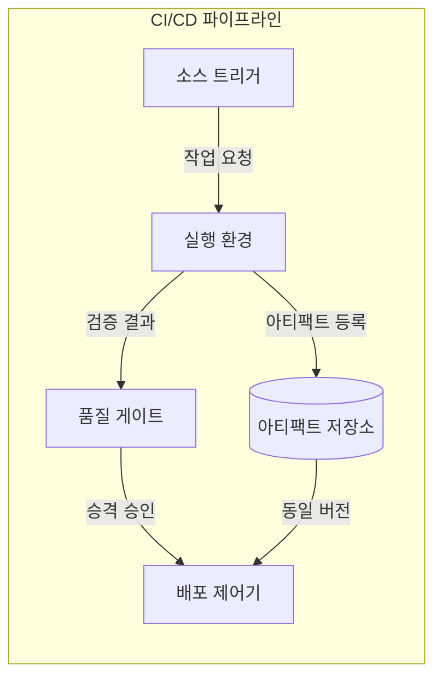
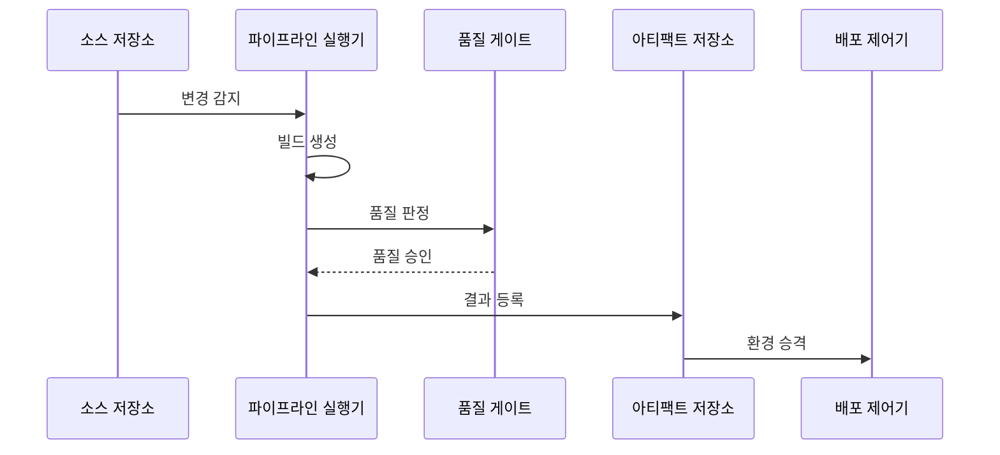

---
sidebar:
  order: 53
  label: "053. CI/CD 파이프라인 (CI/CD Pipeline)"
  badge:
    text: "기출 · 50%"
    variant: note
title: "CI/CD 파이프라인 (CI/CD Pipeline)"
date: "2026-07-25T00:35:00+09:00"
tags:
  - "notes-software"
weight: 53
extra:
  question_no: "053"
  source_status: "기출"
  source_history: "120회"
  priority: 50
  priority_note: "120회 기출, 빌드·시험·배포 자동화"
---

## 미리 알고가기

- **지속적 통합·전달/배포(Continuous Integration and Continuous Delivery/Deployment, CI/CD)**: ‘시아이 슬래시 시디’로 읽고 통합과 전달·배포 자동화 영역을 빗금(/)으로 잇는 관례 표기이며 코드 변경을 자동 빌드·검증하고 배포 가능한 산출물이나 운영 환경까지 전달함
- **지속적 통합(Continuous Integration, CI)**: ‘시아이’로 읽고 Continuous Integration의 머리글자를 딴 표기이며 작은 변경을 자주 합쳐 자동 검증
- **지속적 전달(Continuous Delivery)**: 검증한 변경을 운영 배포 가능한 상태까지 자동으로 준비하는 방식
- **지속적 배포(Continuous Deployment)**: 검증을 통과한 변경을 수동 승인 없이 운영에 자동 반영하는 방식
- **빌드 아티팩트(Build Artifact)**: 한 번 생성한 뒤 변경하지 않고 환경별로 승격하는 배포 산출물
- **품질 게이트(Quality Gate)**: 테스트·보안·정책 결과로 다음 단계 이동 여부를 판정하는 통제 지점
- **파이프라인 코드화(Pipeline as Code)**: 빌드·검증·배포 단계와 권한·변수를 선언 파일로 버전 관리하는 방식
- **병합 요청(Pull Request, PR)**: ‘피알’로 읽고 Pull Request의 머리글자를 딴 표기이며 코드 변경의 검토와 기본 브랜치 병합 승인을 요청
- **불변 아티팩트(Immutable Artifact)**: 한 번 빌드한 뒤 내용을 바꾸지 않고 같은 버전·무결성으로 시험과 운영 환경에 승격하는 배포 산출물
- **무결성 해시(Integrity Hash)**: 아티팩트 내용으로 계산한 고정 길이 값으로서 환경별 산출물이 같은 빌드인지 검증함
- **소스 트리거·파이프라인 실행기(Source Trigger·Pipeline Runner)**: 트리거는 커밋·태그 사건으로 작업을 시작하고 실행기는 코드화된 단계와 격리 도구 환경에서 빌드·검증을 수행함
- **정적 분석(Static Analysis)**: 프로그램을 실행하지 않고 소스·바이트코드의 결함·규칙 위반·취약 패턴을 검사하는 자동 검증
- **기본 브랜치(Default Branch)**: 승인된 변경을 통합해 다음 릴리스 기준이 되는 저장소의 주 브랜치
- **불안정 테스트(Flaky Test)**: 코드가 같아도 실행 시점·환경에 따라 성공과 실패가 바뀌어 품질 게이트 신뢰를 떨어뜨리는 테스트
- **복귀(Rollback)**: 배포 결함 발생 시 트래픽이나 실행 버전을 이전의 검증된 상태로 되돌리는 복구 동작
- **시험·운영 환경(Test·Production Environment)**: 시험 환경은 배포 전 동작을 검증하고 운영 환경은 실제 사용자 요청을 처리하며 같은 해시의 이미지를 승격해 환경 편차를 줄임

## Ⅰ. 개요

- **정의/개념**: 코드 변경을 빌드·검증·배포하는 자동화 흐름
- **배경/필요성**: 수동 릴리스가 검증을 누락해 자동 게이트 필요

### 쉽게 이해하기 (학습용)

- 원고를 넣으면 같은 절차로 검사·포장하고 승인 범위까지 보내는 생산선이다

## Ⅱ. 특징

- 작은 변경마다 검증해 결함 피드백 단축한다.
- 코드화된 격리 환경으로 빌드 재현한다.
- 동일 아티팩트를 환경별로 승격한다.
- 불안정한 검증은 품질 게이트 우회를 유발한다.

### 쉽게 이해하기 (학습용)

- 작은 원고마다 같은 검사를 해야 오류를 빨리 찾고 검사 오작동도 신뢰를 잃지 않게 고쳐야 한다

## Ⅲ. 아키텍처 및 구성요소

| 설계 요소 | 설명 |
|:---|:---|
| 소스 트리거 | 커밋·태그 이벤트로 실행 요청 |
| 실행 환경 | 고정 도구·의존성으로 빌드·검증 |
| 품질 게이트 | 테스트·보안·정책으로 승격 판정 |
| 아티팩트 저장소 | 버전과 무결성 정보를 함께 보관 |
| 배포 제어기 | 승인된 동일 버전을 환경별 승격 |

> 요약: 품질 게이트가 동일 아티팩트의 승격 통제

### 쉽게 이해하기 (학습용)

- 접수한 원고를 한 번 포장하고 검사에 합격한 같은 상자만 다음 창고로 보낸다

## Ⅳ. 원리 및 절차 흐름도

| 절차 | 설명 |
|:---|:---|
| 변경 감지 | 커밋·태그 이벤트로 파이프라인 시작 |
| 빌드 생성 | 고정 도구·의존성으로 아티팩트 생성 |
| 품질 판정 | 테스트·보안·정책 통과 여부 판정 |
| 품질 승인 | 통과한 아티팩트의 승격 허용 |
| 결과 등록 | 버전·무결성 해시와 산출물 등록 |
| 환경 승격 | 같은 아티팩트를 다음 환경으로 전달 |

> 요약: 검증한 동일 아티팩트만 다음 환경으로 승격

### 쉽게 이해하기 (학습용)

- 한 번 포장한 제품을 검사해 합격한 상자 그대로 다음 창고에 보낸다

## Ⅴ. 종류 및 비교

| 판단 기준 | 지속적 통합(CI) | 지속적 전달 | 지속적 배포 |
|:---|:---|:---|:---|
| 핵심 특징 | 병합 가능한 코드까지 자동 검증 | 배포 가능 상태까지 자동 준비 | 운영 환경까지 자동 반영 |
| 적용 기준 | 변경을 자주 통합할 때 | 승인·감사 판단이 필요할 때 | 자동 검증·복구가 신뢰될 때 |
| 주요 위험 | 불안정 테스트·병합 지연 | 승인 대기·환경 편차 | 결함 자동 확산 |

> 요약: 승인과 복구 능력으로 운영 자동화 경계 결정

### 쉽게 이해하기 (학습용)

- 검사까지만 자동화할지 출고까지 맡길지는 승인 필요성과 회수 능력으로 정한다

## Ⅵ. 실무 사례

1. PR은 테스트·정적 분석 실패 시 기본 브랜치 병합 차단
2. 배포 이미지는 같은 해시로 시험·운영 환경에 승격

### 쉽게 이해하기 (학습용)

- 코드 변경은 자동 검사에 합격해야 공용 판본에 합칠 수 있다
- 시험한 포장 상자의 번호를 그대로 운영 창고까지 보내 재포장을 피한다

## Ⅶ. 결론

- 검증 신뢰도·복구 능력으로 운영 자동 배포 범위 결정

### 쉽게 이해하기 (학습용)

- 검사가 믿을 만하고 문제 제품을 되돌릴 수 있을 때 출고까지 자동화한다
