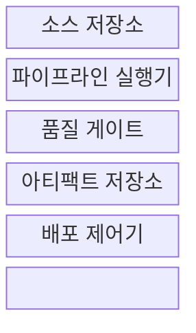
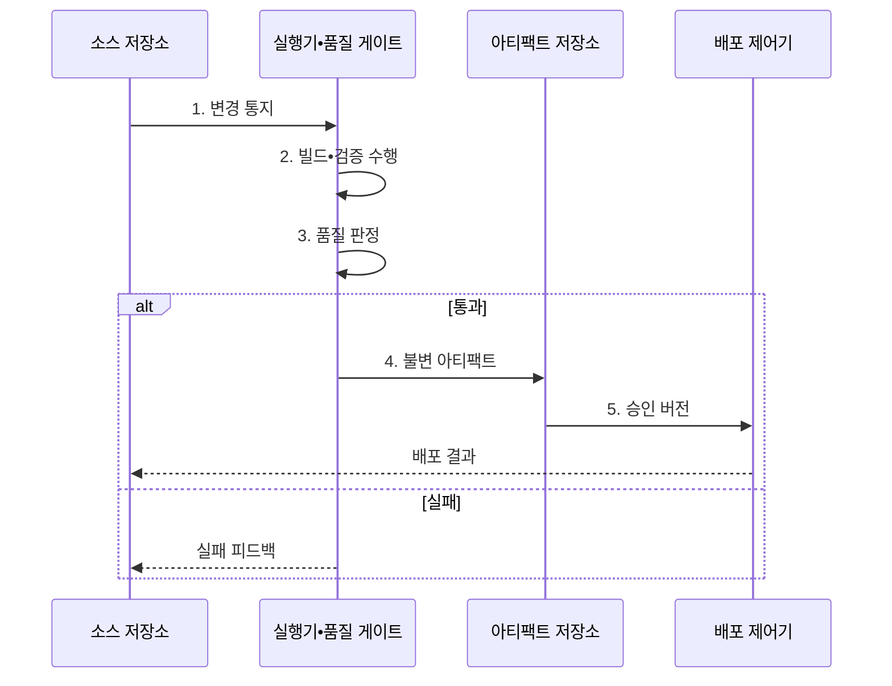

---
sidebar:
  order: 53
  label: "053. CI/CD 파이프라인 (CI/CD Pipeline)"
  badge:
    text: "기출 • 50%"
    variant: note
title: "CI/CD 파이프라인 (CI/CD Pipeline)"
date: "2026-08-04T11:13:00+09:00"
tags:
  - "notes-software"
weight: 53
extra:
  question_no: "053"
  source_status: "기출"
  source_history: "120회"
  priority: 50
  priority_note: "120회 기출, 빌드•시험•배포 자동화"
---

## Ⅰ. 개요

핵심 용어

- **지속적 통합(Continuous Integration, CI)**: 작은 코드 변경을 자주 병합하고 자동 빌드•테스트로 검증하는 활동이다.
- **지속적 전달(Continuous Delivery, CD)**: 검증한 변경을 언제든 운영에 배포할 수 있는 상태로 준비하는 활동이다.
- **지속적 배포(Continuous Deployment, CD)**: 검증한 변경을 수동 승인 없이 운영에 반영하는 활동이다.

- 정의/개념: 코드 변경을 통합•검증하고 검증 산출물을 승격•배포하는 **자동화 파이프라인**
- 배경/필요성: 담당자•단계별 수동 릴리스로 **검증 누락•환경 편차 발생**

#### 한줄 요약

- 코드가 바뀔 때마다 같은 검사대를 통과시켜 합격한 동일 제품만 다음 환경으로 보내는 자동 생산선과 같다.

## Ⅱ. 특징

핵심 용어

- **병합 요청(Pull Request, PR)**: 코드 검토와 기본 브랜치 병합 승인을 요청하는 협업 절차이다.
- **품질 게이트(Quality Gate)**: 테스트•보안•정책 결과로 다음 단계 진입 여부를 판정하는 통제 지점이다.
- **불변 아티팩트(Immutable Artifact)**: 한 번 생성한 뒤 수정하지 않고 같은 버전을 환경별로 승격하는 산출물이다.
- **조기 검증(Early Validation)**: 변경 직후 결함을 찾는 활동이다.
- **추적성(Traceability)**: 소스와 검증 및 산출물과 배포 환경의 연결 관계다.

- 작은 변경의 **조기 검증•빠른 피드백**
- 동일 아티팩트의 **환경별 승격•추적**
- 품질 게이트의 **실패 차단•승인 통제**

#### 한줄 요약

- 변경 단위를 작게 검사하고 합격한 산출물만 이동하므로 결함 원인과 배포 버전을 빠르게 찾을 수 있다.

## Ⅲ. 구조 및 구성요소

핵심 용어

- **빌드 아티팩트(Build Artifact)**: 소스 코드를 빌드해 만든 실행 파일•패키지•컨테이너 이미지이다.
- **아티팩트 저장소(Artifact Repository)**: 검증한 산출물의 버전과 무결성 정보를 보존하는 저장소이다.
- **배포 제어기(Deployment Controller)**: 승인된 산출물을 대상 환경에 반영하고 상태를 관리하는 구성요소이다.
- **소스 저장소(Source Repository)**: 변경 이력과 파이프라인 코드를 보관하는 저장소다.
- **파이프라인 실행기(Pipeline Runner)**: 선언된 빌드와 시험 및 분석 단계를 수행하는 구성요소다.

| 구성요소 | 책임 |
|:---|:---|
| 소스 저장소 | **변경 이력•파이프라인 코드** 관리 |
| 파이프라인 실행기 | **빌드•자동 시험** 과 분석 수행 |
| 품질 게이트 | **승격 허용•차단** 판정 |
| 아티팩트 저장소 | **산출물 버전•무결성** 보존 |
| 배포 제어기 | 승인 **버전의 환경별 반영** |

#### 한줄 요약

- 원본 창고, 생산선, 검사문, 완제품 창고, 출고 담당으로 구성된다.

## Ⅳ. 흐름도

핵심 용어

- **승격(Promotion)**: 같은 불변 아티팩트를 개발•시험•운영 환경으로 차례로 이동시키는 절차이다.
- **복귀(Rollback)**: 배포 장애 시 트래픽이나 실행 버전을 검증된 이전 상태로 되돌리는 복구 동작이다.
- **버전(Version)**: 배포 산출물의 변경 단계를 구분하는 식별값이다.
- **해시(Hash)**: 산출물 내용의 무결성을 확인하는 값이다.
- **생성 이력(Build Provenance)**: 산출물의 소스와 도구 및 생성 절차를 잇는 기록이다.

**동작 원리**

- **1. 변경 통지**: 커밋•병합으로 파이프라인 실행
- **2. 빌드•검증 수행**: 시험•분석 결과를 품질 기준과 비교
- **3. 품질 판정**: 다음 단계 승격 또는 파이프라인 차단
- **4. 불변 아티팩트**: 버전•해시와 생성 이력 보존
- **5. 승인 버전**: 같은 산출물을 환경별로 승격

> 요약: 검증을 통과한 불변 아티팩트만 환경별로 승격

#### 한줄 요약

- 검사에 실패하면 생산선이 멈추고, 통과하면 봉인된 같은 제품을 시험 창고와 운영 창고로 차례로 보낸다.

## Ⅴ. 종류 및 비교

핵심 용어

| 자동화 범위 | 지속적 통합(CI) | 지속적 전달 | 지속적 배포 |
|:---|:---|:---|:---|
| 적용 기준 | 잦은 병합의 **조기 결함 탐지** | 승인 기반 **상시 배포 준비** | 저위험 변경의 **운영 자동화** |
| 핵심 특징 | 변경의 **빌드•자동 검증** | 운영 직전까지 **자동 승격** | 통과 변경의 **자동 운영 반영** |
| 한계 | 불안정 테스트의 **통합 지연** | 승인 대기의 **전달 지연** | 결함의 **운영 자동 확산** |

> 요약: 운영 반영의 자동 여부가 전달과 배포를 구분

#### 한줄 요약

- CI는 합칠 수 있는지 확인하고, Delivery는 출고 직전까지 준비하며, Deployment는 합격품을 운영에 자동 출고한다.

## Ⅵ. 실무 고려사항 및 대책

핵심 용어

- **불안정 테스트(Flaky Test)**: 코드 변경 없이도 실행할 때마다 성공과 실패가 달라지는 테스트이다.
- **자격 증명(Credential)**: 시스템 접근 권한을 확인하는 비밀•토큰•인증서이다.
- **공급망 증명(Provenance)**: 산출물을 어떤 소스•도구•절차로 만들었는지 검증할 수 있게 기록한 생성 이력이다.
- **산출물 서명(Artifact Signature)**: 배포 산출물의 출처를 검증하는 값이다.
- **단계 병렬화(Stage Parallelism)**: 독립 검사를 동시에 수행하는 방식이다.
- **캐시(Cache)**: 재사용 가능한 빌드 결과를 보관하는 저장소다.
- **격리(Isolation)**: 불안정 시험을 본선 검증과 분리하는 통제다.
- **재현 환경(Reproducible Environment)**: 같은 의존성과 설정으로 실패를 반복하는 환경이다.
- **비밀 저장소(Secret Store)**: 배포 비밀을 코드 밖에서 보호하는 저장소다.
- **단기 자격 증명(Short-lived Credential)**: 작업 시점에만 짧게 유효한 권한이다.
- **단계 배포(Progressive Delivery)**: 일부 대상부터 배포 범위를 점진적으로 넓히는 방식이다.
- **상태 검증(Health Validation)**: 배포 대상의 지표와 상태를 확인하는 절차다.

| 문제 | 대책 | 효과 |
|:---|:---|:---|
| PR마다 전체 검사를 순차 실행해 피드백 지연 | **빠른 검사•단계 병렬화** 와 캐시 | **변경 피드백 시간** 단축 |
| 불안정 테스트가 반복돼 성공 여부 불신 | **원인 추적•격리** 와 재현 환경 구성 | **검증 신뢰도** 회복 |
| 환경마다 재빌드해 산출물 내용이 달라짐 | **불변 아티팩트** 를 설정만 바꿔 승격 | **환경 일관성** 확보 |
| 파이프라인에 장기 자격 증명이 노출됨 | **비밀 저장소•단기 자격 증명** 과 최소 권한 | **배포 권한** 보호 |
| 자동 배포 결함이 전체 사용자로 확산됨 | **단계 배포•상태 검증** 과 자동 복귀 | **운영 영향 범위** 제한 |
| 산출물 변조로 배포 출처를 신뢰하기 어려움 | **산출물 서명•해시** 와 공급망 증명 | **출처•무결성** 확인 |

#### 한줄 요약

- 코드 검사를 통과하지 못하면 본선에 합칠 수 없고, 통과한 컨테이너는 내용 변경 없이 운영까지 이동한다.

## Ⅶ. 결론

핵심 용어

- **파이프라인 코드화(Pipeline as Code)**: 빌드•검증•배포 절차를 선언 파일로 작성해 버전 관리하는 방식이다.
- **자동화된 전달(Automated Delivery)**: 변경 검증부터 산출물 승격과 배포까지 반복 절차를 기계가 수행하는 운영 방식이다.

- 사람 승인이 필요하면 **지속적 전달**, 자동 복귀 가능한 저위험 변경은 **지속적 배포** 선택

#### 한줄 요약

- 사람의 최종 확인이 필요한 변경은 출고 대기시키고, 안전하게 되돌릴 수 있는 변경만 자동 출고한다.
