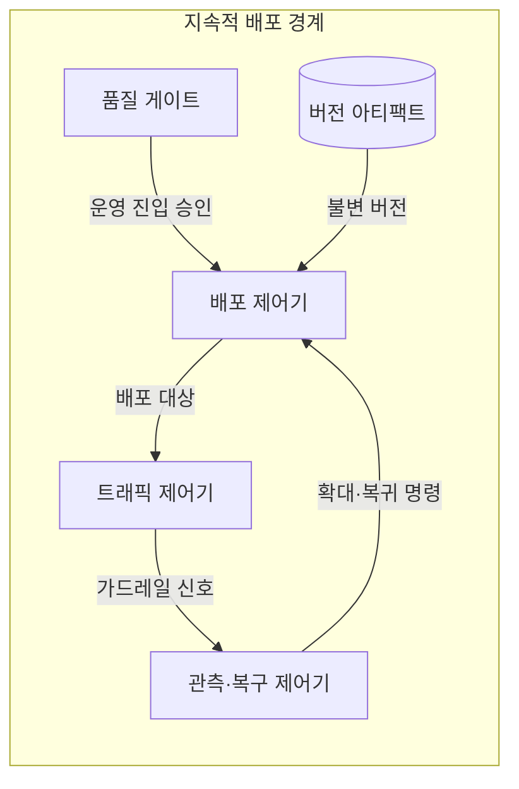
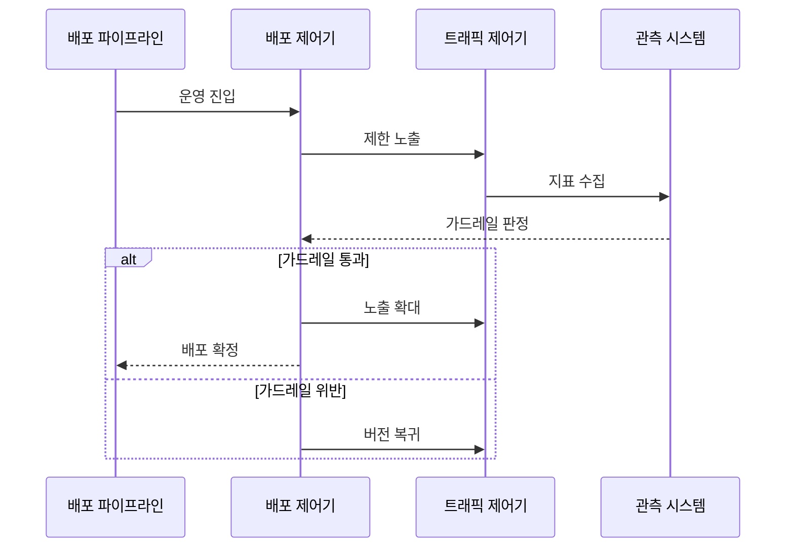

---
sidebar:
  order: 54
  label: "054. 지속적 배포 (Continuous Deployment)"
  badge:
    text: "기출 · 50%"
    variant: note
title: "지속적 배포 (Continuous Deployment)"
date: "2026-07-25T00:35:00+09:00"
tags:
  - "notes-software"
weight: 54
extra:
  question_no: "054"
  source_status: "기출"
  source_history: "138회"
  priority: 50
  priority_note: "138회 기출, 자동 배포·검증 흐름"
---

## 미리 알고가기

- **지속적 배포(Continuous Deployment)**: 자동 검증을 통과한 변경을 수동 승인 없이 운영에 반영하는 방식
- **지속적 전달(Continuous Delivery)**: 검증한 변경을 운영 배포 가능한 상태까지 자동 준비하고 최종 반영은 승인하는 방식
- **점진 노출(Progressive Exposure)**: 새 버전이나 기능을 일부 사용자부터 공개해 영향 범위를 단계적으로 늘리는 방식
- **카나리 배포(Canary Deployment)**: 소수 트래픽에 새 버전을 먼저 노출하고 운영 지표로 확대 여부를 정하는 방식
- **피처 플래그(Feature Flag)**: 실행 중인 코드의 설정으로 기능 공개와 코드 배포 시점을 분리하는 제어 장치
- **가드레일 지표(Guardrail Metric)**: 오류율·지연·업무 성공률로 배포 확대·중단·복귀를 판정하는 지표
- **확장-축소 변경(Expand-Contract Change)**: 신구 스키마가 함께 동작하도록 먼저 확장한 뒤 이전 구조를 제거하는 변경 방식
- **응용 프로그래밍 인터페이스(Application Programming Interface, API)**: ‘에이피아이’로 읽고 Application Programming Interface의 머리글자를 딴 표기이며 서비스 기능과 데이터를 정해진 형식으로 호출하는 계약
- **가역·비가역 변경(Reversible·Irreversible Change)**: 가역 변경은 자동으로 이전 동작으로 복귀할 수 있고 비가역 변경은 데이터 손실·외부 효과 때문에 사람 승인과 별도 복구가 필요한 변경
- **롤아웃·롤백(Rollout·Rollback)**: 롤아웃은 새 버전 노출 비율을 늘리고 롤백은 트래픽을 이전 버전으로 돌려 결함 영향 범위를 줄이는 배포 동작
- **버전 아티팩트·이미지(Versioned Artifact·Image)**: 실행 파일과 의존성을 불변 버전으로 묶고 무결성을 기록해 같은 산출물을 단계별로 배포하는 단위
- **운영 기준선(Production Baseline)**: 전체 노출이 확정되어 현재 운영의 기준으로 지정된 애플리케이션 버전
- **무상태 응용 프로그래밍 인터페이스(Stateless Application Programming Interface, Stateless API)**: ‘스테이트리스 에이피아이’로 읽고 API 앞에 무상태 성질을 붙인 표기이며 요청 사이 사용자 상태를 인스턴스에 남기지 않는 서비스 접점
- **데이터베이스 스키마·열(Database Schema·Column)**: 스키마는 데이터 구조 정의이고 열은 한 속성의 저장 위치로서 Expand-Contract 변경에서 신구 열을 함께 지원한 뒤 이전 열을 제거함

## Ⅰ. 개요

- **정의/개념**: 검증 통과 변경을 승인 없이 운영에 자동 반영
- **배경/필요성**: 승인 제거가 결함 노출을 키워 자동 복구 필요

### 쉽게 이해하기 (학습용)

- 검사를 통과한 제품을 소수 매장부터 자동 출고하고 결과에 따라 확대하는 방식이다

## Ⅱ. 특징

- 작은 변경은 결함 원인 탐색 범위를 축소한다.
- 품질 판단이 자동 검증·정책으로 이동한다.
- 점진 노출로 새 버전 영향 범위 제한한다.
- 데이터 변경은 버전 복귀만으로 되돌릴 수 없다.

### 쉽게 이해하기 (학습용)

- 제품을 자동 출고하려면 불량을 알아채는 검사와 즉시 회수하는 장치가 필요하다

## Ⅲ. 아키텍처 및 구성요소

| 설계 요소 | 설명 |
|:---|:---|
| 품질 게이트 | 검증·보안·정책으로 운영 진입 판정 |
| 버전 아티팩트 | 실행 파일·이미지와 무결성 보관 |
| 배포 제어기 | 환경별 배포·중단·복귀 정책 실행 |
| 트래픽 제어기 | 라우팅·피처 플래그로 노출 제한 |
| 관측·복구 제어기 | 가드레일 위반 시 확대 중단·복귀 |

> 요약: 가드레일 신호가 노출 확대·복귀를 통제

### 쉽게 이해하기 (학습용)

- 검사대가 출고를 허용하고 매장 반응을 본 제어 장치가 확대나 회수를 지시한다

## Ⅳ. 원리 및 절차 흐름도

| 절차 | 설명 |
|:---|:---|
| 운영 진입 | 검증·정책을 통과한 버전 준비 |
| 제한 노출 | 새 버전에 소수 트래픽 할당 |
| 지표 수집 | 오류율·지연·업무 성공률 측정 |
| 가드레일 판정 | 임계치 충족 여부로 확대·복귀 결정 |
| 노출 확대 | 통과 시 새 버전 트래픽 비율 증가 |
| 배포 확정 | 전체 노출 버전을 운영 기준선으로 지정 |
| 버전 복귀 | 위반 시 트래픽을 이전 버전으로 전환 |

> 요약: 가드레일 통과 시 확대하고 위반 시 복귀

### 쉽게 이해하기 (학습용)

- 소수 매장의 오류와 처리 시간을 보고 합격하면 확대하고 실패하면 이전 제품으로 돌아간다

## Ⅴ. 종류 및 비교

| 판단 기준 | 지속적 배포 | 지속적 전달 |
|:---|:---|:---|
| 핵심 특징 | 검증 후 자동 운영 반영 | 배포 가능 상태에서 승인 대기 |
| 적용 기준 | 가역 변경과 자동 복구를 신뢰할 때 | 규제·비가역 변경에 승인이 필요할 때 |
| 주요 위험 | 결함 자동 확산 | 승인 대기·배포 지연 |

> 요약: 가역성·복구 신뢰도로 자동 운영 반영 결정

### 쉽게 이해하기 (학습용)

- 자동 회수가 가능한 제품은 바로 내보내고 되돌리기 어려우면 사람이 승인한다

## Ⅵ. 실무 사례

1. 무상태 API는 오류율·지연 임계치 통과 시 트래픽 확대
2. 데이터베이스 스키마는 확장 후 이전 열을 지연 제거

### 쉽게 이해하기 (학습용)

- 상태를 저장하지 않는 호출 기능은 소수 요청에서 문제가 없을 때만 사용자를 늘린다
- 데이터 형식은 새 열과 이전 열을 함께 쓰다가 모두 옮긴 뒤 이전 열을 제거한다

## Ⅶ. 결론

- 자동 검증·복구 가능한 가역 변경만 지속적 배포

### 쉽게 이해하기 (학습용)

- 자동으로 검사하고 되돌릴 수 있는 변경만 사람 승인 없이 운영에 내보낸다
