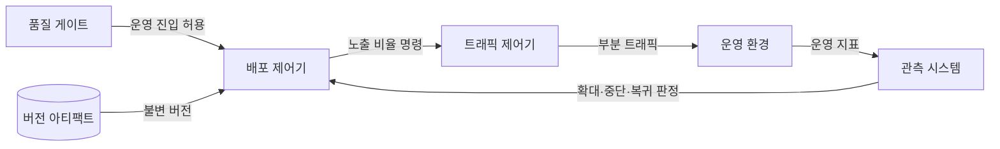
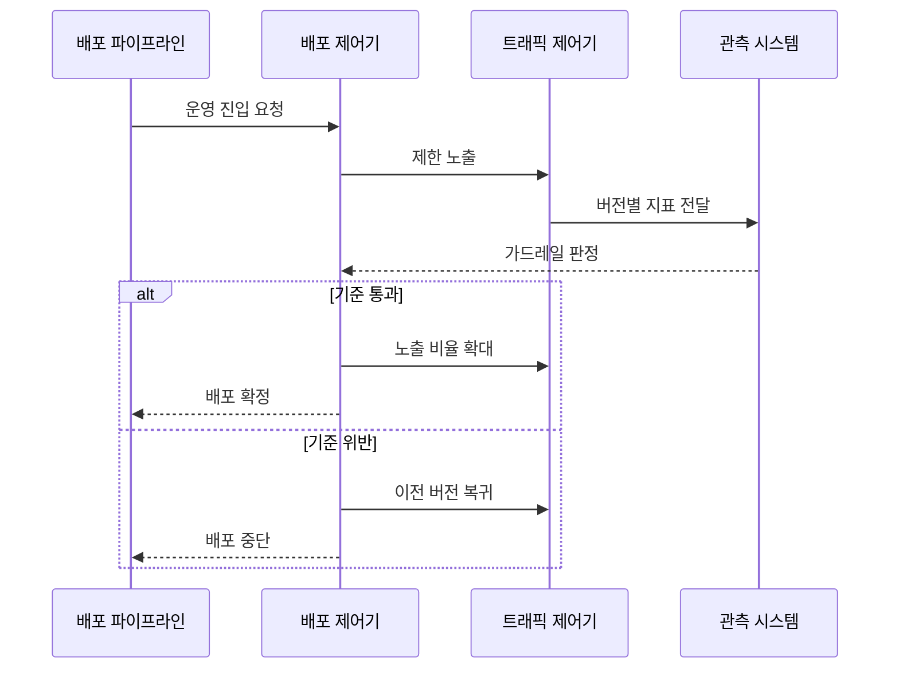

---
sidebar:
  order: 54
  label: "054. 지속적 배포 (Continuous Deployment)"
  badge:
    text: "기출 · 50%"
    variant: note
title: "지속적 배포 (Continuous Deployment)"
date: "2026-07-27T23:59:59+09:00"
tags:
  - "notes-software"
weight: 54
extra:
  question_no: "054"
  source_status: "기출"
  source_history: "138회"
  priority: 50
  priority_note: "138회 기출, 자동 배포·검증 흐름"
---

## 미리 알고가기

- **지속적 배포(Continuous Deployment)**: 자동 검증을 통과한 변경을 수동 승인 없이 운영에 반영하는 방식
- **지속적 전달(Continuous Delivery)**: 검증한 변경을 운영 배포 가능한 상태로 준비하고 최종 반영은 사람이 승인하는 방식
- **점진적 노출(Progressive Exposure)**: 새 버전의 사용자·트래픽 범위를 단계적으로 확대하는 위험 통제 방식
- **카나리 배포(Canary Deployment)**: 새 버전을 소수 트래픽에 먼저 노출하고 지표에 따라 확대하는 방식
- **기능 플래그(Feature Flag)**: 배포된 코드의 기능 공개 여부를 설정으로 제어해 코드 배포와 기능 출시를 분리하는 장치
- **가드레일 지표(Guardrail Metric)**: 오류율·지연·업무 실패율로 배포 확대·중단·복귀를 판정하는 안전 기준
- **확장-축소 변경(Expand-Contract Change)**: 새·구 구조를 함께 지원한 뒤 이전 구조를 제거하는 호환 변경 방식
- **응용 프로그래밍 인터페이스(Application Programming Interface, API)**: 서비스 기능과 데이터를 정해진 형식으로 호출하는 규약
- **롤아웃·롤백(Rollout·Rollback)**: 롤아웃은 새 버전 노출을 확대하고 롤백은 이전 버전으로 되돌리는 배포 동작
- **운영 기준선(Production Baseline)**: 전체 트래픽을 안정적으로 처리하는 현재 운영 버전

## Ⅰ. 개요

- 정의/개념: 검증된 변경의 **운영 반영을 자동화**하는 방식
- 기존 한계: 수동 승인 대기의 **배포 지연·대량 변경** 발생

### 쉽게 이해하기 (학습용)

- 작은 변경이 자동 검사에 합격하면 운영에 내보내되, 지표가 나빠지면 즉시 이전 버전으로 돌리는 방식이다.

## Ⅱ. 특징

- 품질 기준 통과 시 **무승인 운영 반영**
- 점진적 노출과 지표의 **위험 범위 통제**
- 버전·데이터 변경의 **자동 복귀 가능성**

### 쉽게 이해하기 (학습용)

- 사람의 출고 승인을 없애는 대신 작은 범위부터 관찰하고 되돌릴 수 있는 장치를 갖춰야 한다.

## Ⅲ. 아키텍처 및 구성요소

| 구성요소 | 책임 |
|:---|:---|
| 품질 게이트 | 자동 검증의 **운영 진입 판정** |
| 버전 아티팩트 | 실행 산출물의 **버전·무결성 보존** |
| 배포 제어기 | **배포·중단·복귀 정책** 실행 |
| 트래픽 제어기 | 새 버전의 **노출 비율 조정** |
| 관측 시스템 | 지표 수집과 **가드레일 판정** |

> 요약: 관측 지표가 자동 노출 확대와 복귀를 통제

### 쉽게 이해하기 (학습용)

- 배포 제어기가 새 제품을 일부 매장에 보내고 관측 시스템의 판매·불량 신호에 따라 확대하거나 회수한다.

## Ⅳ. 원리 및 절차 흐름

| 절차 | 설명 |
|:---|:---|
| 운영 진입 요청 | 검증 버전의 **자동 배포 시작** |
| 제한 노출 | 새 버전에 **소수 트래픽 할당** |
| 지표 전달 | 버전별 **오류·지연·업무 성과 측정** |
| 가드레일 판정 | 임계값으로 **확대·복귀 결정** |
| 노출 비율 확대 | 통과 시 **전체 트래픽 전환** |
| 이전 버전 복귀 | 위반 시 **신규 트래픽 차단** |

> 요약: 가드레일 통과 시 확대하고 위반 시 자동 복귀

### 쉽게 이해하기 (학습용)

- 소수 사용자에게 먼저 보여 준 뒤 상태가 좋으면 모두에게 넓히고 문제가 생기면 새 요청을 이전 버전으로 돌린다.

## Ⅴ. 종류 및 비교

| 운영 반영 방식 | 지속적 배포 | 지속적 전달 |
|:---|:---|:---|
| 적용 기준 | 가역적 변경·**자동 복구 가능** | 규제 변경·**사람 승인 필요** |
| 핵심 특징 | 검증 후 **운영 자동 반영** | 배포 직전 **승인 대기** |
| 한계 | 결함의 **운영 자동 확산** | 승인 병목의 **배포 지연** |

> 요약: 최종 운영 반영의 사람 승인 여부로 구분

### 쉽게 이해하기 (학습용)

- 자동으로 되돌릴 수 있으면 바로 내보내고, 규제나 손실 위험이 크면 사람의 최종 승인을 기다린다.

## Ⅵ. 실무 사례

1. 무상태 API는 **오류율 임계값** 통과 시 트래픽 확대

### 쉽게 이해하기 (학습용)

- 서버 기능은 지표를 보며 점진 확대하고, 데이터 구조는 신·구 코드가 함께 읽는 기간을 둔 뒤 이전 열을 제거한다.

## Ⅶ. 결론

- 사람의 반복 승인 없이도 안전하게 변경을 배포하기 위해 **변경 가역성·관측성·자동 복귀 가능성**을 검토하고, 세 조건을 확보한 서비스에 지속적 배포를 적용한다

### 쉽게 이해하기 (학습용)

- 문제가 보이고 안전하게 되돌릴 수 있는 변경만 사람 승인 없이 운영으로 보낸다.
