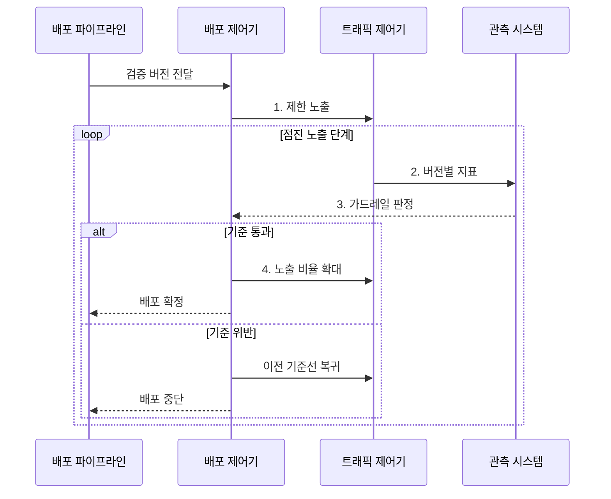

---
sidebar:
  order: 54
  label: "054. 지속적 배포 (Continuous Deployment)"
  badge:
    text: "기출 • 50%"
    variant: note
title: "지속적 배포 (Continuous Deployment)"
date: "2026-08-05T03:30:00+09:00"
tags:
  - "notes-software"
weight: 54
extra:
  question_no: "054"
  source_status: "기출"
  source_history: "138회"
  priority: 50
  priority_note: "138회 기출, 자동 배포•검증 흐름"
---

## Ⅰ. 개요

<details>
<summary>핵심 용어</summary>

- **지속적 배포(Continuous Deployment)**: 자동 검증을 통과한 변경을 수동 승인 없이 운영에 반영하는 방식이다.
- **지속적 전달(Continuous Delivery)**: 검증한 변경을 운영 배포 가능한 상태로 준비하고 최종 반영은 사람이 승인하는 방식이다.

</details>

- 정의/개념: 검증된 변경의 **운영 반영을 자동화**하는 방식
- 배경/필요성: 수동 승인 대기의 **배포 지연•대량 변경** 축소

#### 한줄 요약

- 작은 변경이 자동 검사에 합격하면 운영에 내보내되, 지표가 나빠지면 즉시 이전 버전으로 돌리는 방식이다.

## Ⅱ. 특징

<details>
<summary>핵심 용어</summary>

- **작은 변경(Small Change)**: 장애 원인과 영향 범위를 빠르게 격리하도록 한 번에 반영하는 범위를 줄인 변경이다.
- **가드레일 지표(Guardrail Metric)**: 오류율•지연•업무 실패율로 배포 확대•중단•복귀를 판정하는 안전 기준이다.
- **가역적 데이터 변경(Reversible Data Change)**: 새•구 버전이 함께 읽을 수 있고 실패하면 이전 코드로 돌아가도 데이터 해석이 깨지지 않는 변경이다.

</details>

- 품질 기준 통과 시 **무승인 운영 반영**
- 점진적 노출과 지표의 **위험 범위 통제**
- 버전•데이터 변경의 **자동 복귀 가능성**

#### 한줄 요약

- 사람의 출고 승인을 없애는 대신 작은 범위부터 관찰하고 되돌릴 수 있는 장치를 갖춰야 한다.

## Ⅲ. 구조 및 구성요소

<details>
<summary>핵심 용어</summary>

- **운영 기준선(Production Baseline)**: 전체 트래픽을 안정적으로 처리하는 현재 운영 버전이다.
- **배포 제어기(Deployment Controller)**: 배포 정책과 지표 판정에 따라 새 버전의 확대•중단•복귀를 실행한다.
- **트래픽 제어기(Traffic Controller)**: 요청 중 새 버전으로 보낼 비율을 조정하는 구성요소이다.
- **품질 게이트(Quality Gate)**: 운영 진입 조건을 자동 판정하는 통제다.
- **버전 아티팩트(Versioned Artifact)**: 실행 내용과 무결성을 고정해 보존한 산출물이다.
- **관측 시스템(Observability System)**: 버전별 기술•업무 지표를 수집해 가드레일 충족 여부를 판정하는 구성요소이다.

</details>

```text
[품질 게이트] -- [버전 아티팩트] -- [배포 제어기] -- [트래픽 제어기]
                                          |                 |
                                          +-------- [관측 시스템]
```

선의 의미: 배포 제어기는 품질 게이트를 통과한 버전 아티팩트를 참조하고, 트래픽 제어기와 관측 시스템을 함께 사용해 새 버전의 노출과 운영 상태를 통제한다.

| 구성요소 | 책임 |
|:---|:---|
| 품질 게이트 | **운영 진입** 자동 판정 |
| 버전 아티팩트 | **실행 버전•무결성** 보존 |
| 배포 제어기 | **롤아웃•롤백** 실행 |
| 트래픽 제어기 | 새 버전의 **노출 비율** 조정 |
| 관측 시스템 | **지표 수집•가드레일** 판정 |

#### 한줄 요약

- 검사문, 제품 버전, 출고 담당, 노출 조절기, 상태 계기판으로 구성된다.

## Ⅳ. 흐름도

<details>
<summary>핵심 용어</summary>

- **점진적 노출(Progressive Exposure)**: 새 버전의 사용자•트래픽 범위를 단계적으로 확대하는 위험 통제 방식이다.
- **롤아웃(Rollout)**: 새 버전의 노출 범위를 확대하는 동작이다.
- **롤백(Rollback)**: 검증된 이전 버전으로 되돌리는 동작이다.

</details>



**동작 원리**

- **1. 제한 노출**: 소수 트래픽만 새 버전에 할당
- **2. 버전별 지표**: 오류•지연과 업무 실패율 수집
- **3. 가드레일 판정**: 확대•복귀 임계값 확인
- **4. 노출 비율 확대**: 통과 시 단계적으로 증가

> 요약: 가드레일을 통과하면 확대하고 위반하면 이전 기준선으로 자동 복귀

#### 한줄 요약

- 소수 사용자에게 먼저 보여 준 뒤 상태가 좋으면 모두에게 넓히고 문제가 생기면 새 요청을 이전 버전으로 돌린다.

## Ⅴ. 종류 및 비교

<details>
<summary>핵심 용어</summary>

- **카나리 배포(Canary Deployment)**: 새 버전을 소수 트래픽에 먼저 노출하고 지표에 따라 확대하는 방식이다.
- **기능 플래그(Feature Flag)**: 배포된 코드의 기능 공개 여부를 설정으로 제어해 배포와 출시를 분리하는 장치이다.

</details>

| 운영 반영 방식 | 지속적 배포 | 지속적 전달 |
|:---|:---|:---|
| 적용 기준 | 가역적 변경•**자동 복구 가능** | 규제 변경•**사람 승인 필요** |
| 핵심 특징 | 검증 후 **운영 자동 반영** | 배포 직전 **승인 대기** |
| 한계 | 결함의 **운영 자동 확산** | 승인 병목의 **배포 지연** |

> 요약: 최종 운영 반영의 사람 승인 여부로 구분

#### 한줄 요약

- 자동으로 되돌릴 수 있으면 바로 내보내고, 규제나 손실 위험이 크면 사람의 최종 승인을 기다린다.

## Ⅵ. 실무 고려사항 및 대책

<details>
<summary>핵심 용어</summary>

- **버전별 관측(Per-version Observability)**: 기존 버전과 신규 버전의 오류•지연•업무 지표를 분리해 비교하는 방식이다.
- **확장-축소 변경(Expand-Contract Change)**: 새 구조와 구 구조를 함께 지원한 뒤 이전 구조를 제거하는 호환 변경 방식이다.
- **자동 복귀(Automatic Rollback)**: 가드레일 위반을 감지하면 제어기가 검증된 운영 기준선으로 되돌리는 절차이다.
- **카나리 단계(Canary Stage)**: 새 버전 노출 비율을 나눈 단계다.
- **관찰 시간(Observation Window)**: 각 단계에서 지표를 평가할 최소 시간이다.
- **하위 호환성(Backward Compatibility)**: 새 코드가 이전 데이터 구조를 안전하게 처리하는 성질이다.
- **상위 호환성(Forward Compatibility)**: 이전 코드가 새 데이터 구조를 안전하게 처리하는 성질이다.
- **기능 플래그 소유자(Feature-flag Owner)**: 플래그 정리를 책임지는 주체다.
- **만료일(Expiration Date)**: 임시 기능 분기를 제거해야 할 시점이다.
- **최소 표본(Minimum Sample)**: 자동 판정에 필요한 최소 요청 수다.
- **연속 위반(Consecutive Breach)**: 복귀 전에 임계치를 연속 초과해야 하는 횟수다.
- **복귀 진동(Rollback Oscillation)**: 작은 지표 변동으로 신규•이전 버전 전환이 반복되는 현상이다.

</details>

| 문제 | 대책 | 효과 |
|:---|:---|:---|
| 버전별 기술•업무 상태를 구분해 볼 수 없음 | **가드레일•버전 지표** 구축 | **결함 확대** 차단 |
| 새 버전을 전체 트래픽에 즉시 노출 | **카나리 단계•관찰 시간** 적용 | **사용자 영향** 제한 |
| 데이터 변경을 되돌리면 구버전이 읽지 못함 | **확장-축소 변경•신구 호환** 적용 | **코드 롤백** 보장 |
| 출시 뒤 기능 플래그가 계속 누적됨 | **소유자•만료일** 관리와 출시 후 제거 | **분기 복잡도** 감소 |
| 작은 표본 변동으로 자동 복귀가 반복됨 | **최소 표본•연속 위반** 기준 적용 | **복귀 진동** 방지 |

#### 한줄 요약

- 서버 기능은 지표를 보며 점진 확대하고, 데이터 구조는 신•구 코드가 함께 읽는 기간을 둔 뒤 이전 열을 제거한다.

## Ⅶ. 결론

<details>
<summary>핵심 용어</summary>

- **배포 위험(Deployment Risk)**: 새 버전이 운영 트래픽과 데이터에 미치는 실패 가능성과 영향의 조합이다.
- **점진적 전달(Progressive Delivery)**: 관측 지표를 근거로 새 변경의 노출 범위를 단계적으로 넓히는 전달 전략이다.

</details>

- **변경 가역성•관측성** 이 확보되면 자동 배포, 아니면 사람 승인 후 반영

#### 한줄 요약

- 문제가 보이고 안전하게 되돌릴 수 있는 변경만 사람 승인 없이 운영으로 보낸다.
