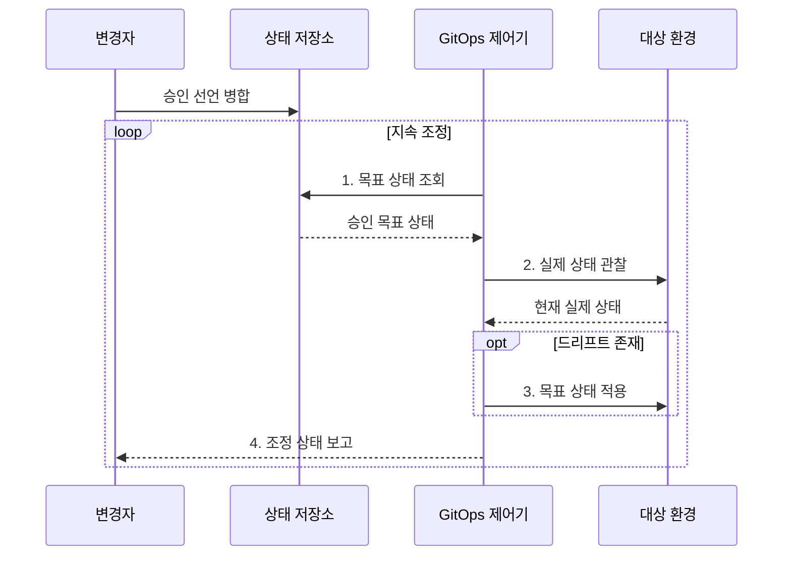

---
sidebar:
  order: 55
  label: "055. GitOps"
  badge:
    text: "미출 · 50%"
    variant: note
title: "GitOps"
date: "2026-08-02T23:05:00+09:00"
tags:
  - "notes-software"
weight: 55
extra:
  question_no: "055"
  source_status: "미출"
  source_history: ""
  priority: 50
  priority_note: "GitOps는 선언형 배포·조정 루프 현안"
---

## Ⅰ. 개요

핵심 용어

- **깃옵스(GitOps)**: Git 저장소에 선언한 목표 상태와 실제 운영 상태를 제어기가 지속적으로 일치시키는 운영 방식이다.
- **선언적 구성(Declarative Configuration)**: 수행 명령이 아니라 시스템이 최종적으로 도달해야 할 상태를 기술하는 방식이다.

- 정의/개념: Git의 선언 상태와 실제 운영 상태를 맞추는 **지속 조정 운영 방식**
- 배경/필요성: 수동 변경에 따른 **선언·실제 상태 불일치** 해소

#### 한줄 요약

- 승인 설계도를 보관하면 관리 장치가 현장을 계속 비교해 다른 부분을 설계대로 되돌린다.

## Ⅱ. 특징

핵심 용어

- **목표 상태·실제 상태(Desired and Actual State)**: Git에 승인한 운영 모습과 현재 환경에서 관찰한 모습을 뜻하는 상태 쌍이다.
- **조정 루프(Reconciliation Loop)**: 제어기가 두 상태의 차이를 반복 관찰하고 목표 상태를 다시 적용하는 동작이다.
- **드리프트(Drift)**: 수동 변경이나 실패로 실제 상태가 Git의 목표 상태와 달라진 상황이다.

- **Git 선언 기준선**으로 목표 상태 관리
- **풀 기반 제어기**로 선언을 운영에 적용
- **지속 조정·이력**으로 드리프트 복구·감사

#### 한줄 요약

- 현장을 손으로 고쳐도 승인 설계도가 그대로면 관리 장치가 다시 설계대로 되돌린다.

## Ⅲ. 구조 및 구성요소

핵심 용어

- **상태 저장소(State Repository)**: 승인된 선언과 버전 이력을 보관하는 Git 저장소이다.
- **깃옵스 제어기(GitOps Controller)**: 목표 상태와 실제 상태를 반복 비교하고 차이를 자동 적용하는 구성요소이다.
- **건강·동기화 상태(Health·Synchronization Status)**: 자원의 정상 동작 여부와 실제 구성이 Git 목표에 일치하는지를 나타낸다.

| 구성요소 | 책임 |
|:---|:---|
| 승인 정책 | **변경 권한·병합 기준** 통제 |
| 상태 저장소 | **승인 선언·버전 이력** 보관 |
| GitOps 제어기 | **목표·실제 상태** 차이 조정 |
| 대상 환경 | 운영 **리소스의 실제 상태** 제공 |
| 보고 채널 | **건강·동기화 상태**와 실패 알림 |

#### 한줄 요약

- 승인 규칙, 설계도 창고, 현장 관리자, 운영 현장, 알림판으로 구성된다.

## Ⅳ. 흐름도

핵심 용어

- **풀 기반 배포(Pull-based Deployment)**: 운영 환경의 제어기가 저장소에서 목표 상태를 가져와 적용하는 방식이다.
- **쿠버네티스(Kubernetes)**: 선언한 리소스의 목표 상태를 제어 루프로 유지하는 컨테이너 오케스트레이션 플랫폼이다.

**동작 원리**

- **1. 목표 상태 조회**: 제어기가 승인 선언을 저장소에서 수신
- **2. 실제 상태 관찰**: 운영 리소스의 구성·건강 정보 조회
- **3. 목표 상태 적용**: 드리프트가 있으면 승인 선언으로 재조정
- **4. 조정 상태 보고**: 건강·동기화 상태와 실패 원인 전달

> 요약: 제어기가 Git의 **목표·실제 상태 차이**를 반복 관찰·조정

#### 한줄 요약

- 관리 장치가 승인 설계도와 현장을 계속 비교하고 다를 때마다 설계대로 고친다.

## Ⅴ. 종류 및 비교

핵심 용어

- **푸시 배포(Push-based Deployment)**: 외부 파이프라인이 운영 자격 증명으로 대상 환경에 변경 명령을 직접 전송하는 방식이다.
- **명령형 작업(Imperative Operation)**: 최종 상태보다 수행할 명령 순서를 지정하는 일회성 운영 작업이다.
- **자격 증명(Credential)**: 대상 환경의 변경 권한을 증명하는 키·토큰이다.

| 비교 항목 | GitOps 풀 기반 조정 | 푸시 배포 |
|:---|:---|:---|
| 적용 기준 | **상태 선언·제어기** 설치가 가능할 때 | **명령형 작업·제어기 미지원** 환경 |
| 핵심 특징 | 내부 제어기의 **Git 선언 지속 조정** | 외부 파이프라인의 **변경 명령 전송** |
| 한계 | 잘못된 **선언의 반복 적용** | **자격 증명 노출·드리프트** |

> 요약: 선언 상태는 GitOps, 명령형 작업은 푸시 선택

#### 한줄 요약

- GitOps는 현장 관리자가 설계도를 가져와 계속 맞추고 푸시는 밖에서 작업 명령을 보낸다.

## Ⅵ. 실무 고려사항 및 대책

핵심 용어

- **승인 정책(Approval Policy)**: 운영 선언의 변경 권한·검토·병합 기준을 통제하는 규칙이다.
- **밀봉된 비밀(Sealed Secret)**: 저장소에는 암호문만 두고 대상 환경의 제어기만 복호화하도록 만든 비밀정보이다.
- **의존 순서(Dependency Order)**: 여러 리소스를 안전하게 생성·갱신하기 위해 지켜야 하는 적용 선후 관계이다.

| 문제 | 대책 | 효과 |
|:---|:---|:---|
| 잘못된 선언이 모든 환경에 반복 적용됨 | **정책·구문 검증**과 자동 중단 | **오류 반복 적용** 방지 |
| 긴급 수동 변경으로 Git 기준선과 달라짐 | 변경을 **Git 선언에 반영**하고 직접 변경 제한 | **기준선 일치** 회복 |
| 비밀정보를 평문 선언과 함께 저장함 | **외부 비밀 저장소·밀봉 비밀** 사용 | **자격 증명** 보호 |
| 제어기 침해 시 전체 환경 변경이 가능함 | **영역별 제어기·최소 권한** 적용 | **침해 범위** 제한 |
| 의존 리소스를 순서 없이 함께 적용함 | **동기화 단계·건강 조건**과 재시도 정의 | **의존 순서** 보장 |
| 쿠버네티스 클러스터의 리소스가 수동 변경됨 | **조정 루프·드리프트 탐지** 적용 | **선언 상태** 자동 복원 |

#### 한줄 요약

- 컨테이너 실행 상태가 승인 설계도와 달라지면 제어기가 다시 설계대로 맞춘다.

## Ⅶ. 결론

핵심 용어

- **운영 감사성(Operational Auditability)**: 누가 어떤 선언을 승인하고 환경에 반영했는지 변경 이력으로 확인할 수 있는 성질이다.
- **자동 복구(Self-healing)**: 실제 상태가 목표에서 벗어나면 제어기가 승인된 선언을 다시 적용해 차이를 해소하는 동작이다.

- 상태 선언·직접 변경 통제가 가능하면 **GitOps**, 일회성 명령 작업은 **푸시 배포** 선택

#### 한줄 요약

- 설계도로 표현할 수 있는 운영 상태만 자동 관리하고 현장 수정은 설계도에 다시 기록한다.
