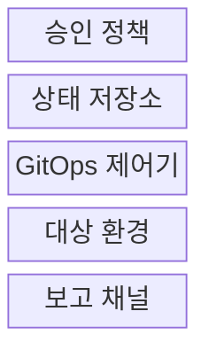
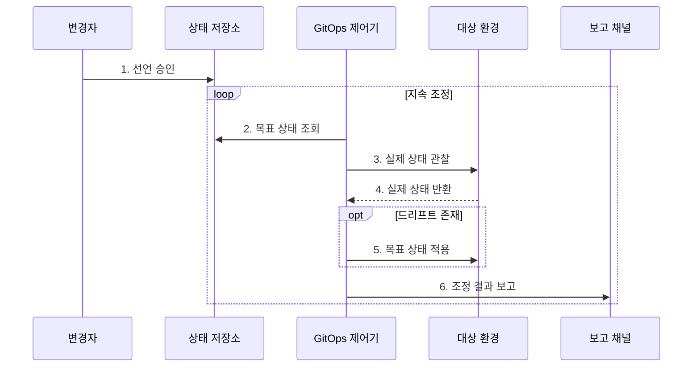

---
sidebar:
  order: 55
  label: "055. GitOps"
  badge:
    text: "미출제 · 50%"
    variant: note
title: "GitOps"
date: "2026-07-25T00:35:00+09:00"
tags:
  - "notes-software"
weight: 55
extra:
  question_no: "055"
  source_status: "미출제"
  source_history: ""
  priority: 50
  priority_note: "GitOps는 선언형 배포·조정 루프 현안"
---

## 미리 알고가기

- **깃옵스(GitOps)**: Git 저장소에 선언한 목표 상태와 실제 운영 상태를 제어기가 지속적으로 일치시키는 운영 방식
- **선언적 구성(Declarative Configuration)**: 수행 명령이 아니라 시스템이 최종적으로 도달해야 할 상태를 기술하는 방식
- **목표 상태·실제 상태(Desired and Actual State)**: Git에 승인한 운영 모습과 현재 환경에서 관찰한 모습을 뜻하는 상태 쌍
- **조정 루프(Reconciliation Loop)**: 제어기가 두 상태의 차이를 반복 관찰하고 목표 상태를 다시 적용하는 제어 동작
- **드리프트(Drift)**: 수동 변경이나 실패로 실제 상태가 Git의 목표 상태와 달라진 상황
- **풀 기반 배포(Pull-based Deployment)**: 운영 환경의 제어기가 저장소에서 목표 상태를 가져와 적용하는 방식
- **쿠버네티스(Kubernetes)**: 선언한 리소스의 목표 상태를 제어 루프로 유지하는 컨테이너 오케스트레이션 플랫폼
- **깃(Git)**: 승인된 운영 선언과 변경 이력을 저장소에서 버전 관리하는 도구
- **깃옵스 제어기(GitOps Controller)**: 저장소의 목표 상태와 대상 환경의 실제 상태를 반복 비교하고 차이를 자동 적용하는 내부 관리 구성요소
- **승인 정책·상태 저장소(Approval Policy·State Repository)**: 승인 정책은 변경 권한·검토·병합 기준을 통제하고 저장소는 승인된 선언과 버전 이력을 보관함
- **건강·동기화 상태(Health·Synchronization Status)**: 건강 상태는 운영 자원의 정상 동작 여부이고 동기화 상태는 실제 구성이 Git 목표와 일치하는지를 나타냄
- **푸시 배포(Push-based Deployment)**: 외부 파이프라인이 운영 자격 증명으로 대상 환경에 변경 명령을 직접 전송하는 방식
- **명령형 작업(Imperative Operation)**: 최종 상태보다 수행할 명령 순서를 지정하며 선언형 제어기가 지원하지 않는 일회성 운영 작업
- **자격 증명(Credential)**: 대상 환경의 변경 권한을 증명하는 키·토큰으로서 푸시 배포에서는 외부 파이프라인 노출 위험이 있음
- **클러스터·리소스(Cluster·Resource)**: 클러스터는 여러 컴퓨팅 노드를 묶은 운영 단위이고 리소스는 그 안의 애플리케이션·네트워크·설정 객체
- **밀봉된 비밀(Sealed Secret)**: 저장소에는 암호문만 두고 대상 환경의 제어기만 복호화하도록 만든 비밀정보 관리 방식

## Ⅰ. 개요

- 정의/개념: Git 선언과 실제 운영 상태를 지속 조정하는 방식
- **배경/필요성**: 수동 변경이 상태를 어긋나게 해 지속 조정 필요

### 쉽게 이해하기 (학습용)

- 승인 설계도를 보관하면 관리 장치가 현장을 계속 비교해 다른 부분을 설계대로 되돌린다.

## Ⅱ. 특징

- **Git 선언 기준선**으로 목표 상태 관리
- **풀 기반 제어기**로 선언을 운영에 적용
- **지속 조정·이력**으로 드리프트 복구·감사

### 쉽게 이해하기 (학습용)

- 현장을 손으로 고쳐도 승인 설계도가 그대로면 관리 장치가 다시 설계대로 되돌린다.

## Ⅲ. 구조 및 구성요소

| 구성요소 | 책임 |
|:---|:---|
| 승인 정책 | 변경 권한·검토·병합 통제 |
| 상태 저장소 | 승인 선언·버전 이력 보관 |
| GitOps 제어기 | 목표·실제 상태 차이 조정 |
| 대상 환경 | 운영 자원의 실제 상태 제공 |
| 보고 채널 | 건강·동기화·실패 알림 |

### 쉽게 이해하기 (학습용)

- 승인 규칙, 설계도 창고, 현장 관리자, 운영 현장, 알림판으로 구성된다.

## Ⅳ. 흐름도

| 설계 요소 | 설명 |
|:---|:---|
| 승인 정책 | 변경 권한·검토·병합 기준 통제 |
| 상태 저장소 | 승인된 선언과 버전 이력 보관 |
| GitOps 제어기 | 목표·실제 상태 차이를 지속 조정 |
| 대상 환경 | 제어기가 관찰·변경하는 운영 자원 |
| 보고 채널 | 건강 상태와 조정 실패 기록·알림 |

**동작 원리**

- **1. 선언 승인**: 검토한 목표 상태를 기준선에 병합
- **2. 목표 상태 조회**: 제어기가 승인 선언 수신
- **3. 실제 상태 관찰**: 운영 자원 조회
- **4. 실제 상태 반환**: 현재 구성·건강 정보 제공
- **5. 목표 상태 적용**: 드리프트가 있으면 재조정
- **6. 조정 결과 보고**: 동기화·실패 원인 알림

> 요약: 제어기가 Git의 목표 상태와 실제 상태 차이를 반복 관찰·조정한다.

### 쉽게 이해하기 (학습용)

- 관리 장치가 승인 설계도와 현장을 계속 비교하고 다를 때마다 설계대로 고친다.

## Ⅴ. 종류 및 비교

| 비교 항목 | GitOps 풀 기반 조정 | 푸시 배포 |
|:---|:---|:---|
| 적용 기준 | 상태 선언·제어기 설치가 가능할 때 | 명령형 작업·제어기 미지원 환경 |
| 핵심 특징 | 내부 제어기가 Git 선언을 지속 조정 | 외부 파이프라인이 변경 명령 전송 |
| 한계 | 잘못된 선언의 반복 적용 | 자격 증명 노출·드리프트 |

> 요약: 선언 상태는 GitOps, 명령형 작업은 푸시 선택

### 쉽게 이해하기 (학습용)

- GitOps는 현장 관리자가 설계도를 가져와 계속 맞추고 푸시는 밖에서 작업 명령을 보낸다.

## Ⅵ. 실무 고려사항 및 대책

| 고려사항 | 대책 | 효과 |
|:---|:---|:---|
| 잘못된 선언 | 정책·구문·시험 검증·자동 중단 | 오류 반복 적용 방지 |
| 수동 운영 변경 | 긴급 변경을 Git에 회수·직접 변경 제한 | 기준선 일치 |
| 비밀정보 저장 | 외부 비밀 저장소·밀봉 비밀 사용 | 자격 증명 보호 |
| 제어기 권한 | 영역별 제어기·최소 권한 적용 | 침해 범위 제한 |
| 조정 순서 | 동기화 단계·건강 조건·재시도 정의 | 의존 순서 보장 |

> 적용 사례: 쿠버네티스 클러스터는 Git 선언과 실제 자원을 지속 조정한다.

### 쉽게 이해하기 (학습용)

- 컨테이너 실행 상태가 승인 설계도와 달라지면 제어기가 다시 설계대로 맞춘다.

## Ⅶ. 결론

- **상태 선언 가능성·직접 변경 통제**를 보고 GitOps를 적용한다.

### 쉽게 이해하기 (학습용)

- 설계도로 표현할 수 있는 운영 상태만 자동 관리하고 현장 수정은 설계도에 다시 기록한다.
