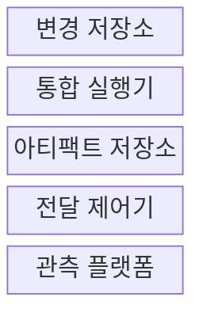
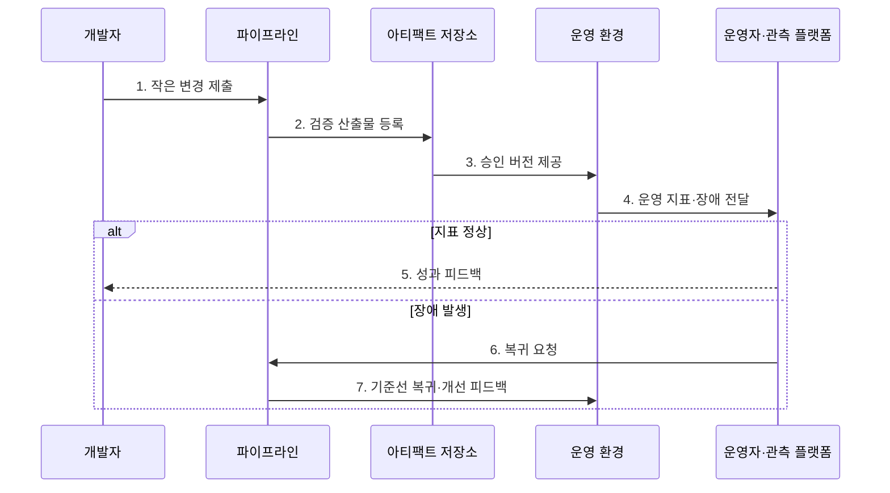

---
sidebar:
  order: 56
  label: "056. DevOps 파이프라인 (DevOps Pipeline)"
  badge:
    text: "기출 · 50%"
    variant: note
title: "DevOps 파이프라인 (DevOps Pipeline)"
date: "2026-07-27T23:59:59+09:00"
tags:
  - "notes-software"
weight: 56
extra:
  question_no: "056"
  source_status: "기출"
  source_history: "120회"
  priority: 50
  priority_note: "120회 기출, 개발·운영 협업 파이프라인"
---

## 미리 알고가기

- **개발·운영(Development and Operations, DevOps)**: 개발부터 운영 피드백까지 공동으로 책임지는 협업 문화와 방법론
- **지속적 통합(Continuous Integration, CI)**: 작은 코드 변경을 자주 병합하고 자동 빌드·테스트로 검증하는 활동
- **지속적 전달(Continuous Delivery, CD)**: 검증한 변경을 언제든 운영에 배포할 수 있는 상태로 준비하는 활동
- **피드백 루프(Feedback Loop)**: 운영 지표와 장애 원인을 다음 개발·운영 정책에 반영하는 순환
- **점진적 전달(Progressive Delivery)**: 새 버전이나 기능의 운영 노출 범위를 단계적으로 확대하는 방식
- **개발·운영 연구 및 평가(DevOps Research and Assessment, DORA)**: 배포 빈도·변경 리드 타임·변경 실패율·복구 시간을 측정해 소프트웨어 전달 성과를 평가하는 체계
- **평균 복구 시간(Mean Time to Recovery, MTTR)**: 장애 발생부터 서비스 정상 복구까지 걸린 평균 시간
- **관측 가능성(Observability)**: 외부 출력인 로그·메트릭·트레이스로 시스템 내부 상태를 추론하는 능력
- **인프라 코드화(Infrastructure as Code, IaC)**: 인프라 구성을 코드로 선언해 버전 관리하고 자동 적용하는 방식
- **가드레일(Guardrail)**: 운영 지표의 허용 한계로 배포 확대·중단·복귀를 자동 판정하는 안전 기준
- **심리적 안전(Psychological Safety)**: 구성원이 비난 우려 없이 장애·실수·위험을 공유하고 개선에 참여할 수 있는 팀 환경
- **허영 지표(Vanity Metric)**: 실제 성과 개선과 연결되지 않지만 좋아 보이는 수치

## Ⅰ. 개요

- 정의/개념: 개발·운영의 **변경 전달·피드백을 연결**한 자동화 흐름
- 배경/필요성: 조직 분리의 **인수 지연·운영 책임 단절** 해소

### 쉽게 이해하기 (학습용)

- 제품을 만드는 팀과 운영하는 팀이 같은 생산선과 계기판을 보며 빠르게 개선하는 방식이다.

## Ⅱ. 특징

- 개발·운영의 **공동 소유·공동 책임**
- 빌드부터 운영까지 **자동화·일관성**
- 운영 지표의 **개발 피드백 환류**

### 쉽게 이해하기 (학습용)

- 개발자가 코드를 넘기고 끝내는 대신 운영 결과까지 함께 보고 다음 변경에 반영한다.

## Ⅲ. 구조 및 구성요소

| 구성요소 | 책임 |
|:---|:---|
| 변경 저장소 | 코드·설정·이력 공동 관리 |
| 통합 실행기 | 빌드·시험·정책 검사 |
| 아티팩트 저장소 | 산출물 버전·무결성 보존 |
| 전달 제어기 | 승격·배포·복귀 실행 |
| 관측 플랫폼 | 운영 상태 측정·원인 추적 |

### 쉽게 이해하기 (학습용)

- 변경 창고, 검사선, 완제품 창고, 출고 담당, 운영 계기판으로 구성된다.

## Ⅳ. 흐름도

| 구성요소 | 책임 |
|:---|:---|
| 변경 저장소 | 코드·설정·이력 공동 관리 |
| 통합 실행기 | 빌드·시험·정책 검사 |
| 아티팩트 저장소 | 산출물의 버전·무결성 보존 |
| 전달 제어기 | 승격·배포·복귀 실행 |
| 관측 플랫폼 | 운영 상태의 측정·원인 추적 |

**동작 원리**

- **1. 작은 변경 제출**: 추적 가능한 단위로 전달
- **2. 검증 산출물 등록**: 빌드·시험·정책 통과 버전 보존
- **3. 승인 버전 제공**: 같은 산출물을 운영에 반영
- **4. 운영 지표·장애 전달**: 성능·오류·업무 결과 수집
- **5. 성과 피드백**: 정상 결과를 다음 개선에 반영
- **6. 복귀 요청**: 장애 지표로 이전 버전 선택
- **7. 기준선 복귀·개선 피드백**: 복구·재발 방지 수행

> 요약: 작은 변경을 자동 전달하고 운영 결과를 다음 변경에 환류한다.

### 쉽게 이해하기 (학습용)

- 작은 개선을 빠르게 내보내고 현장의 반응이 좋으면 유지하며, 문제가 생기면 되돌린 뒤 원인을 다음 작업에 넣는다.

## Ⅴ. 종류 및 비교

| 운영 모델 | DevOps 통합 운영 | 개발·운영 분리 |
|:---|:---|:---|
| 적용 기준 | 잦은 변경·**신속한 피드백** | 안정 우선·**엄격한 인수 절차** |
| 핵심 특징 | 제품팀의 **생성·운영 공동 책임** | 기능별 조직의 **단계별 인계** |
| 한계 | 역할 확대·**자동화 투자 부담** | 인계 대기·**책임 단절** |

> 요약: 변경 속도와 공동 책임 요구가 운영 모델을 결정

### 쉽게 이해하기 (학습용)

- 자주 고치는 서비스는 한 팀이 제작과 운영을 함께 맡고, 변경이 드문 조직은 정해진 인수 절차로 넘길 수 있다.

## Ⅵ. 실무 고려사항 및 대책

| 고려사항 | 대책 | 효과 |
|:---|:---|:---|
| 도구 중심 도입 | 공동 목표·소유권·피드백 절차 확립 | 책임 단절 해소 |
| 팀 간 인계 | 운영·보안 검증을 제품팀에 통합 | 리드타임 단축 |
| 지표 왜곡 | DORA와 업무 성과·신뢰성 함께 해석 | 균형 성과 관리 |
| 장애 비난 | 심리적 안전·비난 없는 사후 분석 | 학습·재발 방지 |
| 자동화 격차 | 반복 작업·예외 절차를 코드·이력화 | 재현성·감사 확보 |

> 적용 사례: 제품팀은 DORA 지표로 전달 속도와 안정성을 함께 측정한다.

### 쉽게 이해하기 (학습용)

- 팀은 얼마나 자주 안전하게 배포하고 빨리 복구하는지 측정하며, 장애 원인을 다음 자동화와 코드 개선에 반영한다.

## Ⅶ. 결론

- **변경 빈도·운영 피드백**이 크면 DevOps를 적용한다.

### 쉽게 이해하기 (학습용)

- 빨리 내보내는 생산선과 결과를 확인하는 계기판을 함께 갖춰야 지속적으로 개선할 수 있다.
