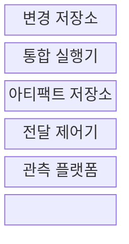
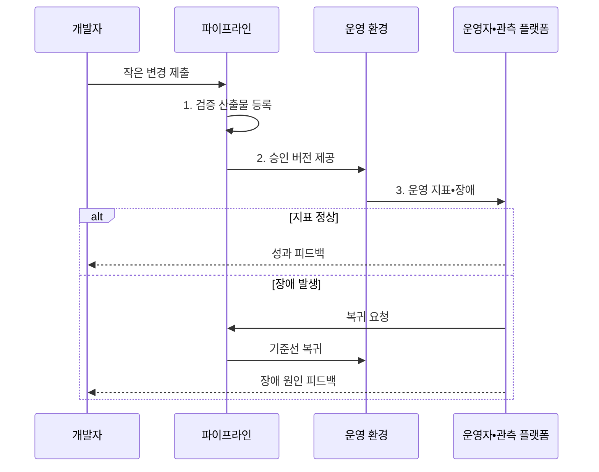

---
sidebar:
  order: 56
  label: "056. DevOps 파이프라인 (DevOps Pipeline)"
  badge:
    text: "기출 • 50%"
    variant: note
title: "DevOps 파이프라인 (DevOps Pipeline)"
date: "2026-08-03T08:48:47+09:00"
tags:
  - "notes-software"
weight: 56
extra:
  question_no: "056"
  source_status: "기출"
  source_history: "120회"
  priority: 50
  priority_note: "120회 기출, 개발•운영 협업 파이프라인"
---

## Ⅰ. 개요

핵심 용어

- **개발•운영(Development and Operations, DevOps)**: 개발부터 운영 피드백까지 공동으로 책임지는 협업 문화와 방법론이다.
- **피드백 루프(Feedback Loop)**: 운영 지표와 장애 원인을 다음 개발•운영 정책에 반영하는 순환이다.

- 정의/개념: 개발•운영의 **변경 전달•피드백을 연결**한 자동화 흐름
- 배경/필요성: 조직 분리의 **인수 지연•운영 책임 단절** 해소

#### 한줄 요약

- 제품을 만드는 팀과 운영하는 팀이 같은 생산선과 계기판을 보며 빠르게 개선하는 방식이다.

## Ⅱ. 특징

핵심 용어

- **공동 소유(Shared Ownership)**: 제품의 개발과 운영 결과를 한 팀이 함께 책임지는 원칙이다.
- **지속적 통합(Continuous Integration, CI)**: 작은 코드 변경을 자주 병합하고 자동 빌드•테스트로 검증하는 활동이다.

- 개발•운영의 **공동 소유•공동 책임**
- 빌드부터 운영까지 **자동화•일관성**
- 운영 지표의 **개발 피드백 환류**

#### 한줄 요약

- 개발자가 코드를 넘기고 끝내는 대신 운영 결과까지 함께 보고 다음 변경에 반영한다.

## Ⅲ. 구조 및 구성요소

핵심 용어

- **지속적 전달(Continuous Delivery, CD)**: 검증한 변경을 언제든 운영에 배포할 수 있는 상태로 준비하는 활동이다.
- **아티팩트 저장소(Artifact Repository)**: 검증한 산출물의 버전과 무결성을 보존하는 저장소이다.
- **관측 가능성(Observability)**: 로그•메트릭•트레이스로 시스템 내부 상태를 추론하는 능력이다.
- **변경 저장소•통합 실행기**: 변경 저장소는 코드•설정•이력을 공동 보관하고, 통합 실행기는 빌드•시험•정책 검증을 수행한다.
- **전달 제어기(Delivery Controller)**: 승인 산출물을 운영에 반영하고 장애 시 검증된 기준선으로 복귀시키는 구성요소이다.

| 구성요소 | 책임 |
|:---|:---|
| 변경 저장소 | **코드•설정•변경 이력** 공동 관리 |
| 통합 실행기 | **지속적 통합•자동 검증** 수행 |
| 아티팩트 저장소 | **산출물 버전•무결성** 보존 |
| 전달 제어기 | **지속적 전달•복귀** 실행 |
| 관측 플랫폼 | **운영 상태•장애 원인** 추적 |

#### 한줄 요약

- 변경 창고, 검사선, 완제품 창고, 출고 담당, 운영 계기판으로 구성된다.

## Ⅳ. 흐름도

핵심 용어

- **기준선(Baseline)**: 장애 때 복귀할 수 있도록 승인하고 검증한 안정 버전이다.
- **운영 피드백(Operational Feedback)**: 성능•오류•업무 결과를 다음 변경의 근거로 되돌리는 정보이다.

**동작 원리**

- **1. 검증 산출물 등록**: 빌드•시험•정책 통과 버전 보존
- **2. 승인 버전 제공**: 같은 산출물을 운영에 반영
- **3. 운영 지표•장애**: 성능•오류와 업무 결과 수집

> 요약: 작은 변경을 자동 전달하고 운영 결과를 다음 변경에 환류

#### 한줄 요약

- 작은 개선을 빠르게 내보내고 현장의 반응이 좋으면 유지하며, 문제가 생기면 되돌린 뒤 원인을 다음 작업에 넣는다.

## Ⅴ. 종류 및 비교

핵심 용어

- **DevOps 통합 운영(Integrated DevOps Operation)**: 제품팀이 개발과 운영을 함께 책임지는 운영 모델이다.
- **단계별 인계(Stage Handoff)**: 기능별 조직이 산출물을 승인 절차에 따라 다음 조직으로 넘기는 방식이다.

| 운영 모델 | DevOps 통합 운영 | 개발•운영 분리 |
|:---|:---|:---|
| 적용 기준 | 잦은 변경•**신속한 피드백** | 안정 우선•**엄격한 인수 절차** |
| 핵심 특징 | 제품팀의 **생성•운영 공동 책임** | 기능별 조직의 **단계별 인계** |
| 한계 | 역할 확대•**자동화 투자 부담** | 인계 대기•**책임 단절** |

> 요약: 변경 속도와 공동 책임 요구가 운영 모델을 결정

#### 한줄 요약

- 자주 고치는 서비스는 한 팀이 제작과 운영을 함께 맡고, 변경이 드문 조직은 정해진 인수 절차로 넘길 수 있다.

## Ⅵ. 실무 고려사항 및 대책

핵심 용어

- **개발•운영 연구 및 평가(DevOps Research and Assessment, DORA)**: 배포 빈도•변경 리드 타임•변경 실패율•복구 시간으로 전달 성과를 평가하는 체계이다.
- **평균 복구 시간(Mean Time to Recovery, MTTR)**: 장애 발생부터 서비스 정상 복구까지 걸린 평균 시간이다.
- **인프라 코드화(Infrastructure as Code, IaC)**: 인프라 구성을 코드로 선언해 버전 관리하고 자동 적용하는 방식이다.
- **심리적 안전(Psychological Safety)**: 비난 우려 없이 장애와 실수를 공유하고 개선에 참여할 수 있는 팀 환경이다.
- **허영 지표(Vanity Metric)**: 실제 성과 개선과 연결되지 않지만 좋아 보이는 수치이다.
- **공동 목표•소유권**: 제품의 전달 속도와 운영 안정성을 개발•운영이 같은 목표로 측정하고 결과를 함께 책임지는 원칙이다.
- **업무 성과(Business Outcome)**: 배포 활동이 사용자 가치•매출•업무 성공률에 만든 실제 결과이다.
- **재현성•감사성(Reproducibility•Auditability)**: 같은 선언으로 환경을 다시 만들 수 있고 누가 어떤 변경을 적용했는지 이력으로 확인할 수 있는 성질이다.
- **비난 없는 분석(Blameless Analysis)**: 개인 처벌보다 사건의 조건•통제 실패•개선 행동을 찾는 장애 검토 방식이다.
- **복구 절차(Recovery Procedure)**: 장애 감지부터 격리•복귀•검증까지 정상화를 위해 수행할 단계와 책임을 정한 절차이다.

| 문제 | 대책 | 효과 |
|:---|:---|:---|
| 협업 방식 없이 자동화 도구만 도입함 | **공동 목표•소유권** 과 피드백 절차 확립 | **책임 단절** 해소 |
| 개발•운영 간 인계마다 승인 대기 발생 | **CI•CD** 에 운영•보안 검증 통합 | **변경 리드 타임** 단축 |
| 배포 횟수 같은 허영 지표만 목표로 삼음 | **DORA•업무 성과** 를 함께 해석 | **속도•안정성** 균형 |
| 장애 내부 상태와 배포 위험을 판별하기 어려움 | **관측 가능성•가드레일** 구축 | **점진적 전달** 판정 지원 |
| 수동 인프라 변경으로 환경 편차가 발생함 | **인프라 코드화•변경 이력** 적용 | **재현성•감사성** 확보 |
| 장애 책임 추궁으로 실패 원인이 은폐됨 | **심리적 안전•비난 없는 분석** 보장 | **학습•재발 방지** 촉진 |
| 복구 소요 시간을 측정하지 않아 개선이 정체됨 | **평균 복구 시간•복구 절차** 관리 | **MTTR** 단축 |

#### 한줄 요약

- 팀은 얼마나 자주 안전하게 배포하고 빨리 복구하는지 측정하며, 장애 원인을 다음 자동화와 코드 개선에 반영한다.

## Ⅶ. 결론

핵심 용어

- **점진적 전달(Progressive Delivery)**: 새 버전이나 기능의 운영 노출 범위를 단계적으로 확대하는 방식이다.
- **가드레일(Guardrail)**: 운영 지표의 허용 한계로 배포 확대•중단•복귀를 판정하는 안전 기준이다.

- 변경이 잦고 운영 피드백이 중요하면 **DevOps 통합 운영**, 엄격한 인수는 **분리 운영** 선택

#### 한줄 요약

- 빨리 내보내는 생산선과 결과를 확인하는 계기판을 함께 갖춰야 지속적으로 개선할 수 있다.
