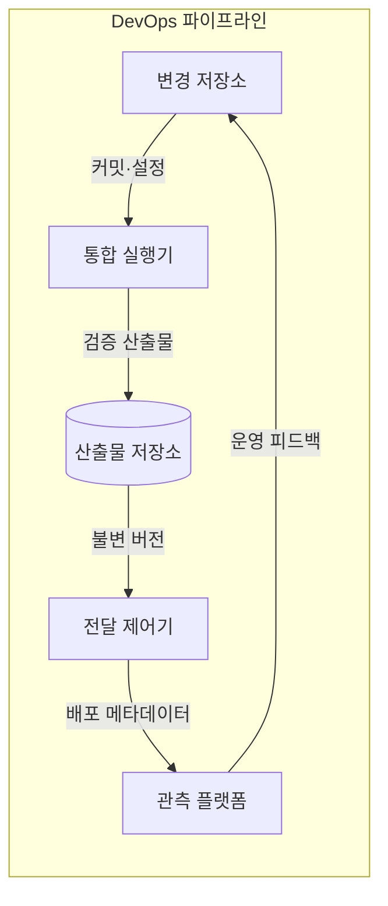
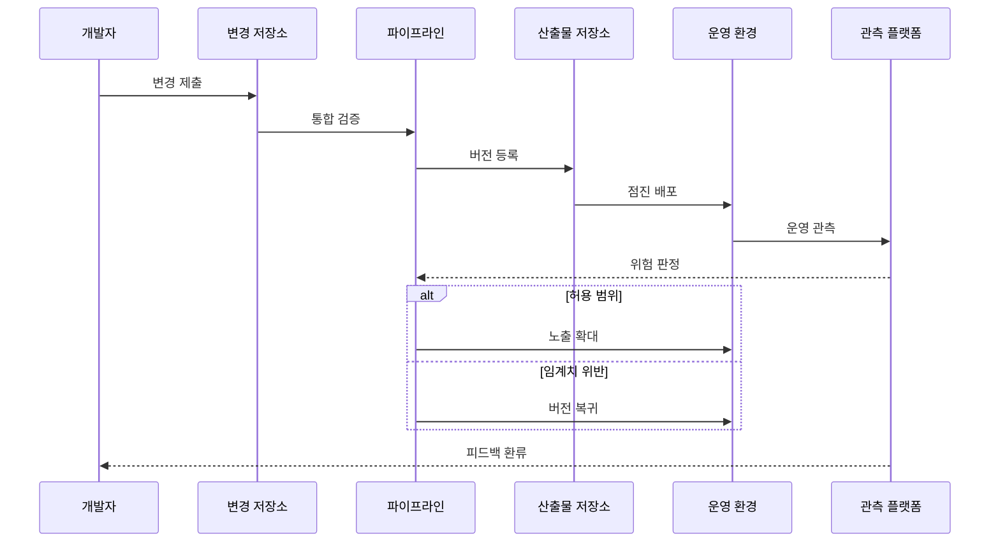

---
sidebar:
  order: 56
  label: "056. DevOps 파이프라인 (DevOps Pipeline)"
  badge:
    text: "기출 · 50%"
    variant: note
title: "DevOps 파이프라인 (DevOps Pipeline)"
date: "2026-07-25T00:35:00+09:00"
tags:
  - "notes-software"
weight: 56
extra:
  question_no: "056"
  source_status: "기출"
  source_history: "120회"
  priority: 50
  priority_note: "120회 기출, 개발·운영 협업 파이프라인"
---

## 미리 알고가기

- **개발·운영(Development and Operations, DevOps)**: ‘데브옵스’로 읽고 Development와 Operations를 결합한 표기이며 변경 전달부터 운영 피드백까지 공동 책임
- **지속적 통합(Continuous Integration, CI)**: ‘시아이’로 읽고 Continuous Integration의 머리글자를 딴 표기이며 작은 변경을 자주 합쳐 자동 검증
- **지속적 전달(Continuous Delivery, CD)**: ‘시디’로 읽고 Continuous Delivery의 머리글자를 딴 표기이며 검증한 변경을 운영 배포 가능 상태까지 자동 준비
- **산출물(Artifact)**: 한 번 생성한 뒤 환경별로 동일하게 배포하는 실행 결과물
- **품질 게이트(Quality Gate)**: 테스트·보안·정책 결과로 다음 단계 이동 여부를 판정하는 통제 지점
- **피드백 루프(Feedback Loop)**: 운영 지표와 장애 원인을 다음 변경·배포 정책에 반영하는 순환
- **점진 배포(Progressive Delivery)**: 새 버전을 일부 대상에 먼저 노출하고 지표에 따라 확대·중단·복귀하는 방식
- **데브옵스 연구 및 평가(DevOps Research and Assessment, DORA)**: ‘도라’로 읽고 영문 머리글자를 딴 표기이며 변경 전달 속도와 안정성을 배포·복구 지표로 함께 측정
- **변경 저장소·통합 실행기(Change Repository·Integration Runner)**: 저장소는 소스·설정·검토 이력을 보관하고 실행기는 빌드·테스트·정적 분석으로 변경을 검증함
- **산출물 무결성(Artifact Integrity)**: 저장한 실행 결과물의 버전과 해시가 빌드 이후 환경별 배포에서도 바뀌지 않았음을 보장하는 성질
- **전달 제어기(Delivery Controller)**: 승인 정책과 가드레일에 따라 같은 산출물 버전을 일부 운영 대상에 배포하고 확대·중단·복귀를 실행하는 구성요소
- **관측 플랫폼(Observability Platform)**: 오류율·지연·업무 성공률과 장애 원인을 수집해 배포 위험 판정과 다음 변경 피드백에 연결하는 운영 도구
- **가드레일(Guardrail)**: 운영 지표의 허용 임계치로서 점진 배포의 노출 확대나 이전 버전 복귀를 자동 결정하는 안전 기준
- **이미지 해시(Image Hash)**: 컨테이너 이미지 내용으로 계산한 고정 길이 값으로서 검증한 산출물과 운영 배포본의 동일성을 확인함
- **인스턴스(Instance)**: 같은 서비스 버전을 실행하는 개별 프로세스·가상머신·컨테이너 단위로서 일부에 먼저 배포해 위험 범위를 제한함
- **수동 인계(Manual Handoff)**: 팀별 문서와 작업 명령으로 다음 담당자에게 변경을 넘기는 방식으로서 대기와 환경 편차가 생길 수 있음

## Ⅰ. 개요

- **정의/개념**: 개발 변경과 운영 피드백을 한 전달 흐름으로 연결
- **배경/필요성**: 수동 인계가 대기·편차를 낳아 자동 흐름 필요

### 쉽게 이해하기 (학습용)

- 제작자와 배송 담당자가 한 생산선을 함께 운영하고 사용 결과도 다음 제품에 반영한다

## Ⅱ. 특징

- 작은 변경을 자주 통합해 실패 범위 축소한다.
- 동일 산출물을 환경별 설정과 분리해 전달한다.
- 자동 게이트와 승인으로 변경 위험 통제한다.
- 운영 신호를 다음 변경·배포 정책에 환류한다.
- DORA 지표로 전달 속도·안정성을 함께 측정한다.

### 쉽게 이해하기 (학습용)

- 작은 작업마다 검사하고 사용 결과까지 제작자에게 돌려줘 다음 변경을 고친다

## Ⅲ. 아키텍처 및 구성요소

| 설계 요소 | 설명 |
|:---|:---|
| 변경 저장소 | 소스·설정·검토 이력 보관 |
| 통합 실행기 | 빌드·테스트·정적 분석 수행 |
| 산출물 저장소 | 실행 산출물·버전·무결성 보관 |
| 전달 제어기 | 같은 버전을 환경 정책으로 배포 |
| 관측 플랫폼 | 운영 지표·장애 원인을 변경에 연결 |

> 요약: 동일 산출물 전달과 운영 피드백이 순환

### 쉽게 이해하기 (학습용)

- 같은 제품 번호가 제작·검사·배송을 잇고 사용 결과가 다시 제작 단계로 돌아온다

## Ⅳ. 원리 및 절차 흐름도

| 절차 | 설명 |
|:---|:---|
| 변경 제출 | 작은 코드·설정 변경을 저장소에 반영 |
| 통합 검증 | 빌드·테스트·정책 통과 여부 판정 |
| 버전 등록 | 검증 산출물에 버전·무결성 부여 |
| 점진 배포 | 같은 버전을 일부 운영 대상에 노출 |
| 운영 관측 | 오류율·지연·업무 성공률 수집 |
| 위험 판정 | 가드레일 임계치로 확대·복귀 결정 |
| 노출 확대 | 허용 범위면 새 버전 비율 증가 |
| 버전 복귀 | 임계치 위반이면 이전 버전으로 전환 |
| 피드백 환류 | 배포 결과를 다음 변경 정책에 반영 |

> 요약: 변경 위험과 운영 신호로 확대·복귀 결정

### 쉽게 이해하기 (학습용)

- 소수 사용자에게 먼저 제품을 보내고 반응이 좋으면 확대하며 문제면 이전 제품으로 돌아간다

## Ⅴ. 종류 및 비교

| 판단 기준 | DevOps 파이프라인 | 수동 인계 방식 |
|:---|:---|:---|
| 핵심 특징 | 동일 산출물·자동 게이트·피드백 | 팀별 문서·작업 명령·수동 이관 |
| 적용 기준 | 반복 가능한 빌드·검증·배포 | 자동화 불가능한 일회성 작업 |
| 주요 위험 | 자동화 오류·도구 의존 | 인계 대기·환경 편차 |

> 요약: 반복 전달은 DevOps, 일회성 작업은 수동 선택

### 쉽게 이해하기 (학습용)

- 반복 제품은 한 생산선에서 함께 책임지고 한 번뿐인 작업은 담당자가 직접 인계한다

## Ⅵ. 실무 사례

1. 웹 서비스는 커밋별 검증을 통과한 이미지 해시만 배포
2. 일부 인스턴스 배포는 오류율 임계치 초과 시 복귀

### 쉽게 이해하기 (학습용)

- 웹 서비스는 검사한 제품 번호와 운영에 보낸 제품 번호를 같게 유지한다
- 새 버전을 일부 서버에 먼저 보내고 오류가 많아지면 이전 버전으로 돌아간다

## Ⅶ. 결론

- 반복 전달은 자동화하고 변경 위험으로 승인·노출 범위 결정

### 쉽게 이해하기 (학습용)

- 반복 작업은 생산선에 맡기되 위험한 변경은 승인과 소수 노출로 범위를 줄인다
